# ElPiGraph.R
[Luca Albergante](mailto:luca.albergante@gmail.com)  
November 2017  


# Descrition

This package provides an R implementation of the ElPiGraph algorithm. A description of the algorithm can be found here: 

# Installation

To improve the performance of the algorithm, a number of functions have been implemented as C++ functions. To simplify the maintenance and updating of the package, these functions have been implemented in the package `distutils`, which needs to be installed separately. The following command will check the presence of the `devtools`, and install it if necessary, after that it will install the `distutils` package. A working internet connection is required.


```r
if(!require("devtools")){
  install.packages("devtools")
}
devtools::install_github("Albluca/distutils")  
```

Once `distutils` has been installed, `ElPiGraph.R` can be installed by typing 


```r
devtools::install_github("Albluca/ElPiGraph.R")
```

the package can then be loaded via the command


```r
library("ElPiGraph.R")
```

# Constructing a principal graph

The construction of a principal graph with a given topology is done via the specification of an appropriate initial conditions and of appropriate growth/shrink grammars. This can be done via the `computeElasticPrincipalGraph`.

Specific wrapping functions are also provided to build commonly encountered topologies (`computeElasticPrincipalCurve`, ``computeElasticPrincipalTree`, `computeElasticPrincipalCircle`), with minimal required inputs. In all of these function, it is necessary to specify a numeric matrix with the data points (`X`) and the number of nodes to of the principal graph (`NumNodes`). It is possible to control the behavior of the algorithm via a set of optional parameters. For example, it is possible to:

* modify the parameter controlling the elastic energy (`Mu` and `Lambda`)
* specify the number of processor to be used (`n.cores`)
* indicate if diagnostic plots should be produced (`drawAccuracyComplexity` and `drawEnergy`)
* indicate if the final graph should be used to plotted non the data (`drawPCAView`)
* specify if PCA should be performed on the data prior to principal graph fitting (`Do_PCA`) and if dimensionality  should be reduced (`ReduceDimension`)

# Examples of principal curves

The function `computeElasticPrincipalCurve` constructs a principal curve on the data. For example to construct a principal curve with 50 nodes on the example dataset `line_data`, it is sufficient to write


```r
CurveEPG <- computeElasticPrincipalCurve(X = curve_data, NumNodes = 50)
```

```
## [1] "Creating a chain in the 1st PC with 3 nodes"
## [1] "Constructing curve 1 of 1 / Subset 1 of 1"
## [1] "Performing PCA on the data"
## [1] "Using standard PCA"
## [1] "3 dimensions are being used"
## [1] "100% of the original variance has been retained"
## [1] "Computing EPG with 50 nodes on 500 points and 3 dimensions"
## [1] "Using a single core"
## Nodes = 3 4 5 6 7 8 9 10 11 12 13 14 15 16 17 18 19 20 21 22 23 24 25 26 27 28 29 30 31 32 33 34 35 36 37 38 39 40 41 42 43 44 45 46 47 48 49 
## BARCODE	ENERGY	NNODES	NEDGES	NRIBS	NSTARS	NRAYS	NRAYS2	MSE	MSEP	FVE	FVEP	UE	UR	URN	URN2	URSD
## 0||50	0.1163	50	49	48	0	0	0	0.05429	0.05149	0.9819	0.9828	0.05109	0.01088	0.5438	27.19	0
## 1.412 sec elapsed
```

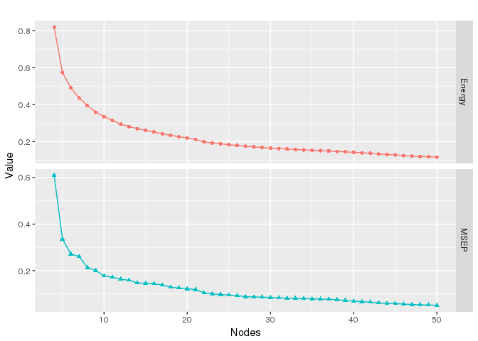<!-- -->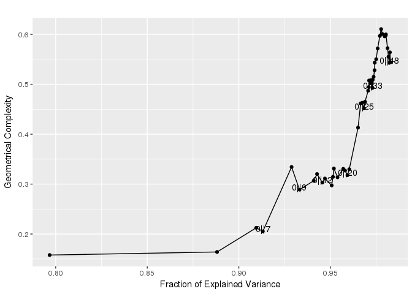<!-- -->

```
## [[1]]
```

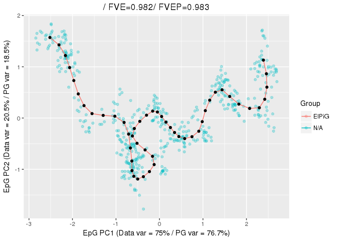<!-- -->

A principal tree can be constructed via the `computeElasticPrincipalTree` function. For example to construct a principal tree with 50 nodes on the example dataset `tree_data`, it is sufficient to write


```r
TreeEPG <- computeElasticPrincipalTree(X = tree_data, NumNodes = 50)
```

```
## [1] "Creating a chain in the 1st PC with 2 nodes"
## [1] "Constructing tree 1 of 1 / Subset 1 of 1"
## [1] "Performing PCA on the data"
## [1] "Using standard PCA"
## [1] "3 dimensions are being used"
## [1] "100% of the original variance has been retained"
## [1] "Computing EPG with 50 nodes on 492 points and 3 dimensions"
## [1] "Using a single core"
## Nodes = 2 3
```

```
## Warning in PrimitiveElasticGraphEmbedment(X, input$NodePositions, input
## $ElasticMatrix, : Maximum number of iterations (10) has been reached. diff
## = 0.0556045436349549
```

```
## 4
```

```
## Warning in PrimitiveElasticGraphEmbedment(X, input$NodePositions, input
## $ElasticMatrix, : Maximum number of iterations (10) has been reached. diff
## = 0.0301832931960279
```

```
## 5 6 7
```

```
## Warning in PrimitiveElasticGraphEmbedment(X, input$NodePositions, input
## $ElasticMatrix, : Maximum number of iterations (10) has been reached. diff
## = 0.0108997004478185
```

```
## 8
```

```
## Warning in PrimitiveElasticGraphEmbedment(X, input$NodePositions, input
## $ElasticMatrix, : Maximum number of iterations (10) has been reached. diff
## = 0.033883753887541
```

```
## 9
```

```
## Warning in PrimitiveElasticGraphEmbedment(X, input$NodePositions, input
## $ElasticMatrix, : Maximum number of iterations (10) has been reached. diff
## = 0.0186764499907289
```

```
## Warning in PrimitiveElasticGraphEmbedment(X, input$NodePositions, input
## $ElasticMatrix, : Maximum number of iterations (10) has been reached. diff
## = 0.054863847452364
```

```
## 10
```

```
## Warning in PrimitiveElasticGraphEmbedment(X, input$NodePositions, input
## $ElasticMatrix, : Maximum number of iterations (10) has been reached. diff
## = 0.0244949370624991
```

```
## Warning in PrimitiveElasticGraphEmbedment(X, input$NodePositions, input
## $ElasticMatrix, : Maximum number of iterations (10) has been reached. diff
## = 0.0117614602046905
```

```
## Warning in PrimitiveElasticGraphEmbedment(X, input$NodePositions, input
## $ElasticMatrix, : Maximum number of iterations (10) has been reached. diff
## = 0.0358113369806443
```

```
## Warning in PrimitiveElasticGraphEmbedment(X, input$NodePositions, input
## $ElasticMatrix, : Maximum number of iterations (10) has been reached. diff
## = 0.0139648044782379
```

```
## 11 12 13
```

```
## Warning in PrimitiveElasticGraphEmbedment(X, input$NodePositions, input
## $ElasticMatrix, : Maximum number of iterations (10) has been reached. diff
## = 0.0183632027691593
```

```
## 14 15 16 17 18 19 20 21 22 23 24 25 26 27 28 29 30 31 32 33 34 35 36 37 38 39 40 41 42 43 44 45 46 47 48 49 
## BARCODE	ENERGY	NNODES	NEDGES	NRIBS	NSTARS	NRAYS	NRAYS2	MSE	MSEP	FVE	FVEP	UE	UR	URN	URN2	URSD
## 1|2||50	0.01568	50	49	41	2	0	0	0.004137	0.003432	0.9923	0.9936	0.01114	0.0004032	0.02016	1.008	0
## 7.697 sec elapsed
```

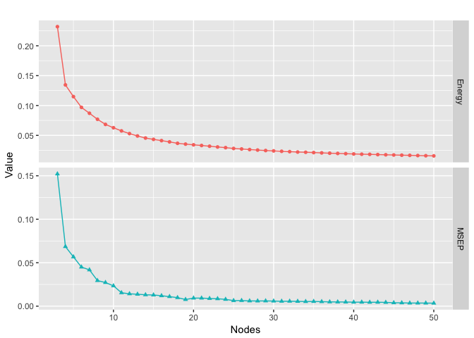<!-- -->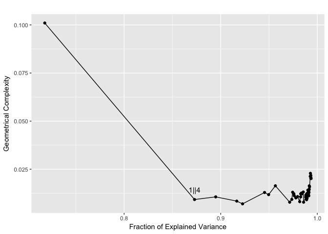<!-- -->

```
## [[1]]
```

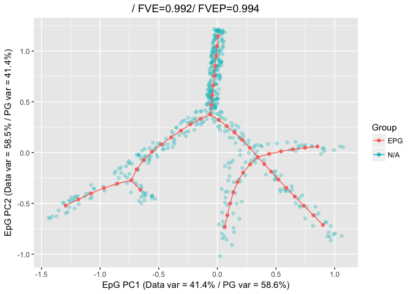<!-- -->


Finally, a principal circle can be constructed via the `computeElasticPrincipalCircle` function. For example to construct a principal circle with 50 nodes on the example dataset `circe_data`, it is sufficient to write


```r
CircleEPG <- computeElasticPrincipalCircle(X = circle_data, NumNodes = 50)
```

```
## [1] "Using a single core"
## [1] "Creating a circle in the plane induced buy the 1st and 2nd PCs with 3 nodes"
## [1] "Constructing curve 1 of 1 / Subset 1 of 1"
## [1] "Performing PCA on the data"
## [1] "Using standard PCA"
## [1] "3 dimensions are being used"
## [1] "100% of the original variance has been retained"
## [1] "Computing EPG with 50 nodes on 200 points and 3 dimensions"
## [1] "Using a single core"
## Nodes = 3 4 5 6 7 8 9 10 11 12 13 14 15 16 17 18 19 20 21 22 23 24 25 26 27 28 29 30 31 32 33 34 35 36 37 38 39 40 41 42 43 44 45 46 47 48 49 
## BARCODE	ENERGY	NNODES	NEDGES	NRIBS	NSTARS	NRAYS	NRAYS2	MSE	MSEP	FVE	FVEP	UE	UR	URN	URN2	URSD
## 0||50	0.0456	50	50	50	0	0	0	0.02624	0.02528	0.9754	0.9763	0.01754	0.001818	0.09089	4.545	0
## 1.795 sec elapsed
```

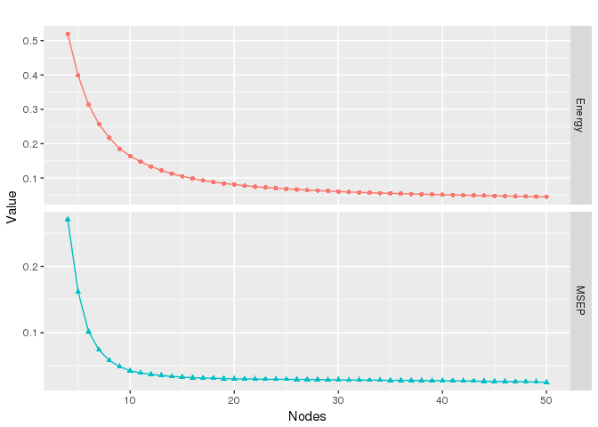<!-- -->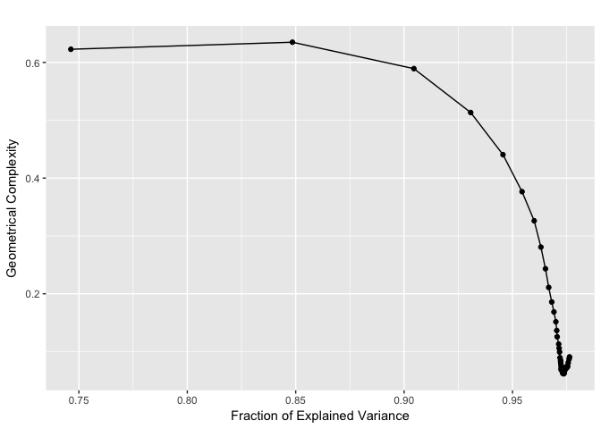<!-- -->

```
## [[1]]
```

<!-- -->


All of these functions will return a list of length 1, with all the information associated with the graph.

# Using bootstrapping

All of the functions provided to build principal graphs allow a bootstrapped construction. To enable that it is sufficient to modify the parameters `nReps` and `ProbPoint`. `nReps` indicates the number of repetitions and `ProbPoint` indicates the probability to include a point in each of the repetition. When `nReps` is larger than 1, a final consensus principal graph will be constructed using the nodes of the graph derived in each repetition.

As an example, let us perform bootstrapping on the circle data. We will also prevent the plotting, for now.


```r
CircleEPG.Boot <- computeElasticPrincipalCircle(X = circle_data, NumNodes = 50, nReps = 50, ProbPoint = .8, drawAccuracyComplexity = FALSE, drawEnergy = FALSE, drawPCAView = FALSE)
```

```
## [1] "Using a single core"
## [1] "Creating a circle in the plane induced buy the 1st and 2nd PCs with 3 nodes"
## [1] "Constructing curve 1 of 50 / Subset 1 of 1"
## [1] "Performing PCA on the data"
## [1] "Using standard PCA"
## [1] "3 dimensions are being used"
## [1] "100% of the original variance has been retained"
## [1] "Computing EPG with 50 nodes on 158 points and 3 dimensions"
## [1] "Using a single core"
## Nodes = 3 4 5 6 7 8 9 10 11 12 13 14 15 16 17 18 19 20 21 22 23 24 25 26 27 28 29 30 31 32 33 34 35 36 37 38 39 40 41 42 43 44 45 46 47 48 49 
## BARCODE	ENERGY	NNODES	NEDGES	NRIBS	NSTARS	NRAYS	NRAYS2	MSE	MSEP	FVE	FVEP	UE	UR	URN	URN2	URSD
## 0||50	0.04136	50	50	50	0	0	0	0.02336	0.0225	0.9783	0.9791	0.01688	0.001116	0.05579	2.789	0
## 1.934 sec elapsed
## [1] "Constructing curve 2 of 50 / Subset 1 of 1"
## [1] "Performing PCA on the data"
## [1] "Using standard PCA"
## [1] "3 dimensions are being used"
## [1] "100% of the original variance has been retained"
## [1] "Computing EPG with 50 nodes on 148 points and 3 dimensions"
## [1] "Using a single core"
## Nodes = 3 4 5 6 7 8 9 10 11 12 13 14 15 16 17 18 19 20 21 22 23 24 25 26 27 28 29 30 31 32 33 34 35 36 37 38 39 40 41 42 43 44 45 46 47 48 49 
## BARCODE	ENERGY	NNODES	NEDGES	NRIBS	NSTARS	NRAYS	NRAYS2	MSE	MSEP	FVE	FVEP	UE	UR	URN	URN2	URSD
## 0||50	0.04552	50	50	50	0	0	0	0.02594	0.02502	0.9761	0.9769	0.01766	0.001926	0.09628	4.814	0
## 1.318 sec elapsed
## [1] "Constructing curve 3 of 50 / Subset 1 of 1"
## [1] "Performing PCA on the data"
## [1] "Using standard PCA"
## [1] "3 dimensions are being used"
## [1] "100% of the original variance has been retained"
## [1] "Computing EPG with 50 nodes on 154 points and 3 dimensions"
## [1] "Using a single core"
## Nodes = 3 4 5 6 7 8 9 10 11 12 13 14 15 16 17 18 19 20 21 22 23 24 25 26 27 28 29 30 31 32 33 34 35 36 37 38 39 40 41 42 43 44 45 46 47 48 49 
## BARCODE	ENERGY	NNODES	NEDGES	NRIBS	NSTARS	NRAYS	NRAYS2	MSE	MSEP	FVE	FVEP	UE	UR	URN	URN2	URSD
## 0||50	0.04604	50	50	50	0	0	0	0.02654	0.0256	0.9751	0.976	0.01753	0.001968	0.09838	4.919	0
## 1.485 sec elapsed
## [1] "Graphical output will be suppressed for the remaining replicas"
## [1] "Constructing curve 4 of 50 / Subset 1 of 1"
## [1] "Performing PCA on the data"
## [1] "Using standard PCA"
## [1] "3 dimensions are being used"
## [1] "100% of the original variance has been retained"
## [1] "Computing EPG with 50 nodes on 161 points and 3 dimensions"
## [1] "Using a single core"
## Nodes = 3 4 5 6 7 8 9 10 11 12 13 14 15 16 17 18 19 20 21 22 23 24 25 26 27 28 29 30 31 32 33 34 35 36 37 38 39 40 41 42 43 44 45 46 47 48 49 
## BARCODE	ENERGY	NNODES	NEDGES	NRIBS	NSTARS	NRAYS	NRAYS2	MSE	MSEP	FVE	FVEP	UE	UR	URN	URN2	URSD
## 0||50	0.04607	50	50	50	0	0	0	0.02548	0.02455	0.9764	0.9772	0.01831	0.002286	0.1143	5.716	0
## 1.486 sec elapsed
## [1] "Constructing curve 5 of 50 / Subset 1 of 1"
## [1] "Performing PCA on the data"
## [1] "Using standard PCA"
## [1] "3 dimensions are being used"
## [1] "100% of the original variance has been retained"
## [1] "Computing EPG with 50 nodes on 160 points and 3 dimensions"
## [1] "Using a single core"
## Nodes = 3 4 5 6 7 8 9 10 11 12 13 14 15 16 17 18 19 20 21 22 23 24 25 26 27 28 29 30 31 32 33 34 35 36 37 38 39 40 41 42 43 44 45 46 47 48 49 
## BARCODE	ENERGY	NNODES	NEDGES	NRIBS	NSTARS	NRAYS	NRAYS2	MSE	MSEP	FVE	FVEP	UE	UR	URN	URN2	URSD
## 0||50	0.04783	50	50	50	0	0	0	0.02842	0.02757	0.9735	0.9743	0.01755	0.001861	0.09305	4.652	0
## 1.372 sec elapsed
## [1] "Constructing curve 6 of 50 / Subset 1 of 1"
## [1] "Performing PCA on the data"
## [1] "Using standard PCA"
## [1] "3 dimensions are being used"
## [1] "100% of the original variance has been retained"
## [1] "Computing EPG with 50 nodes on 165 points and 3 dimensions"
## [1] "Using a single core"
## Nodes = 3 4 5 6 7 8 9 10 11 12 13 14 15 16 17 18 19 20 21 22 23 24 25 26 27 28 29 30 31 32 33 34 35 36 37 38 39 40 41 42 43 44 45 46 47 48 49 
## BARCODE	ENERGY	NNODES	NEDGES	NRIBS	NSTARS	NRAYS	NRAYS2	MSE	MSEP	FVE	FVEP	UE	UR	URN	URN2	URSD
## 0||50	0.04456	50	50	50	0	0	0	0.02445	0.02355	0.977	0.9779	0.01787	0.002234	0.1117	5.585	0
## 1.626 sec elapsed
## [1] "Constructing curve 7 of 50 / Subset 1 of 1"
## [1] "Performing PCA on the data"
## [1] "Using standard PCA"
## [1] "3 dimensions are being used"
## [1] "100% of the original variance has been retained"
## [1] "Computing EPG with 50 nodes on 158 points and 3 dimensions"
## [1] "Using a single core"
## Nodes = 3 4 5 6 7 8 9 10 11 12 13 14 15 16 17 18 19 20 21 22 23 24 25 26 27 28 29 30 31 32 33 34 35 36 37 38 39 40 41 42 43 44 45 46 47 48 49 
## BARCODE	ENERGY	NNODES	NEDGES	NRIBS	NSTARS	NRAYS	NRAYS2	MSE	MSEP	FVE	FVEP	UE	UR	URN	URN2	URSD
## 0||50	0.04545	50	50	50	0	0	0	0.02673	0.02574	0.9747	0.9757	0.01732	0.001403	0.07015	3.508	0
## 1.231 sec elapsed
## [1] "Constructing curve 8 of 50 / Subset 1 of 1"
## [1] "Performing PCA on the data"
## [1] "Using standard PCA"
## [1] "3 dimensions are being used"
## [1] "100% of the original variance has been retained"
## [1] "Computing EPG with 50 nodes on 153 points and 3 dimensions"
## [1] "Using a single core"
## Nodes = 3 4 5 6 7 8 9 10 11 12 13 14 15 16 17 18 19 20 21 22 23 24 25 26 27 28 29 30 31 32 33 34 35 36 37 38 39 40 41 42 43 44 45 46 47 48 49 
## BARCODE	ENERGY	NNODES	NEDGES	NRIBS	NSTARS	NRAYS	NRAYS2	MSE	MSEP	FVE	FVEP	UE	UR	URN	URN2	URSD
## 0||50	0.04323	50	50	50	0	0	0	0.02449	0.02365	0.9774	0.9782	0.01758	0.001159	0.05796	2.898	0
## 1.444 sec elapsed
## [1] "Constructing curve 9 of 50 / Subset 1 of 1"
## [1] "Performing PCA on the data"
## [1] "Using standard PCA"
## [1] "3 dimensions are being used"
## [1] "100% of the original variance has been retained"
## [1] "Computing EPG with 50 nodes on 159 points and 3 dimensions"
## [1] "Using a single core"
## Nodes = 3 4 5 6 7 8 9 10 11 12 13 14 15 16 17 18 19 20 21 22 23 24 25 26 27 28 29 30 31 32 33 34 35 36 37 38 39 40 41 42 43 44 45 46 47 48 49 
## BARCODE	ENERGY	NNODES	NEDGES	NRIBS	NSTARS	NRAYS	NRAYS2	MSE	MSEP	FVE	FVEP	UE	UR	URN	URN2	URSD
## 0||50	0.04585	50	50	50	0	0	0	0.02658	0.02567	0.9754	0.9763	0.01746	0.001811	0.09054	4.527	0
## 1.55 sec elapsed
## [1] "Constructing curve 10 of 50 / Subset 1 of 1"
## [1] "Performing PCA on the data"
## [1] "Using standard PCA"
## [1] "3 dimensions are being used"
## [1] "100% of the original variance has been retained"
## [1] "Computing EPG with 50 nodes on 158 points and 3 dimensions"
## [1] "Using a single core"
## Nodes = 3 4 5 6 7 8 9 10 11 12 13 14 15 16 17 18 19 20 21 22 23 24 25 26 27 28 29 30 31 32 33 34 35 36 37 38 39 40 41 42 43 44 45 46 47 48 49 
## BARCODE	ENERGY	NNODES	NEDGES	NRIBS	NSTARS	NRAYS	NRAYS2	MSE	MSEP	FVE	FVEP	UE	UR	URN	URN2	URSD
## 0||50	0.04368	50	50	50	0	0	0	0.02406	0.02316	0.9776	0.9785	0.01772	0.001905	0.09527	4.764	0
## 1.649 sec elapsed
## [1] "Constructing curve 11 of 50 / Subset 1 of 1"
## [1] "Performing PCA on the data"
## [1] "Using standard PCA"
## [1] "3 dimensions are being used"
## [1] "100% of the original variance has been retained"
## [1] "Computing EPG with 50 nodes on 161 points and 3 dimensions"
## [1] "Using a single core"
## Nodes = 3 4 5 6 7 8 9 10 11 12 13 14 15 16 17 18 19 20 21 22 23 24 25 26 27 28 29 30 31 32 33 34 35 36 37 38 39 40 41 42 43 44 45 46 47 48 49 
## BARCODE	ENERGY	NNODES	NEDGES	NRIBS	NSTARS	NRAYS	NRAYS2	MSE	MSEP	FVE	FVEP	UE	UR	URN	URN2	URSD
## 0||50	0.04413	50	50	50	0	0	0	0.02538	0.02454	0.9763	0.9771	0.01729	0.001456	0.07282	3.641	0
## 1.418 sec elapsed
## [1] "Constructing curve 12 of 50 / Subset 1 of 1"
## [1] "Performing PCA on the data"
## [1] "Using standard PCA"
## [1] "3 dimensions are being used"
## [1] "100% of the original variance has been retained"
## [1] "Computing EPG with 50 nodes on 160 points and 3 dimensions"
## [1] "Using a single core"
## Nodes = 3 4 5 6 7 8 9 10 11 12 13 14 15 16 17 18 19 20 21 22 23 24 25 26 27 28 29 30 31 32 33 34 35 36 37 38 39 40 41 42 43 44 45 46 47 48 49 
## BARCODE	ENERGY	NNODES	NEDGES	NRIBS	NSTARS	NRAYS	NRAYS2	MSE	MSEP	FVE	FVEP	UE	UR	URN	URN2	URSD
## 0||50	0.04623	50	50	50	0	0	0	0.02692	0.02611	0.9748	0.9755	0.01745	0.001865	0.09323	4.661	0
## 1.582 sec elapsed
## [1] "Constructing curve 13 of 50 / Subset 1 of 1"
## [1] "Performing PCA on the data"
## [1] "Using standard PCA"
## [1] "3 dimensions are being used"
## [1] "100% of the original variance has been retained"
## [1] "Computing EPG with 50 nodes on 157 points and 3 dimensions"
## [1] "Using a single core"
## Nodes = 3 4 5 6 7 8 9 10 11 12 13 14 15 16 17 18 19 20 21 22 23 24 25 26 27 28 29 30 31 32 33 34 35 36 37 38 39 40 41 42 43 44 45 46 47 48 49 
## BARCODE	ENERGY	NNODES	NEDGES	NRIBS	NSTARS	NRAYS	NRAYS2	MSE	MSEP	FVE	FVEP	UE	UR	URN	URN2	URSD
## 0||50	0.04408	50	50	50	0	0	0	0.0249	0.02393	0.9766	0.9775	0.01746	0.001726	0.08628	4.314	0
## 1.538 sec elapsed
## [1] "Constructing curve 14 of 50 / Subset 1 of 1"
## [1] "Performing PCA on the data"
## [1] "Using standard PCA"
## [1] "3 dimensions are being used"
## [1] "100% of the original variance has been retained"
## [1] "Computing EPG with 50 nodes on 164 points and 3 dimensions"
## [1] "Using a single core"
## Nodes = 3 4 5 6 7 8 9 10 11 12 13 14 15 16 17 18 19 20 21 22 23 24 25 26 27 28 29 30 31 32 33 34 35 36 37 38 39 40 41 42 43 44 45 46 47 48 49 
## BARCODE	ENERGY	NNODES	NEDGES	NRIBS	NSTARS	NRAYS	NRAYS2	MSE	MSEP	FVE	FVEP	UE	UR	URN	URN2	URSD
## 0||50	0.0447	50	50	50	0	0	0	0.02504	0.02416	0.9766	0.9775	0.01781	0.001856	0.09278	4.639	0
## 1.559 sec elapsed
## [1] "Constructing curve 15 of 50 / Subset 1 of 1"
## [1] "Performing PCA on the data"
## [1] "Using standard PCA"
## [1] "3 dimensions are being used"
## [1] "100% of the original variance has been retained"
## [1] "Computing EPG with 50 nodes on 165 points and 3 dimensions"
## [1] "Using a single core"
## Nodes = 3 4 5 6 7 8 9 10 11 12 13 14 15 16 17 18 19 20 21 22 23 24 25 26 27 28 29 30 31 32 33 34 35 36 37 38 39 40 41 42 43 44 45 46 47 48 49 
## BARCODE	ENERGY	NNODES	NEDGES	NRIBS	NSTARS	NRAYS	NRAYS2	MSE	MSEP	FVE	FVEP	UE	UR	URN	URN2	URSD
## 0||50	0.04695	50	50	50	0	0	0	0.02684	0.02589	0.9747	0.9756	0.01811	0.002002	0.1001	5.004	0
## 1.447 sec elapsed
## [1] "Constructing curve 16 of 50 / Subset 1 of 1"
## [1] "Performing PCA on the data"
## [1] "Using standard PCA"
## [1] "3 dimensions are being used"
## [1] "100% of the original variance has been retained"
## [1] "Computing EPG with 50 nodes on 162 points and 3 dimensions"
## [1] "Using a single core"
## Nodes = 3 4 5 6 7 8 9 10 11 12 13 14 15 16 17 18 19 20 21 22 23 24 25 26 27 28 29 30 31 32 33 34 35 36 37 38 39 40 41 42 43 44 45 46 47 48 49 
## BARCODE	ENERGY	NNODES	NEDGES	NRIBS	NSTARS	NRAYS	NRAYS2	MSE	MSEP	FVE	FVEP	UE	UR	URN	URN2	URSD
## 0||50	0.04529	50	50	50	0	0	0	0.02606	0.02518	0.9757	0.9765	0.01761	0.001625	0.08125	4.062	0
## 1.341 sec elapsed
## [1] "Constructing curve 17 of 50 / Subset 1 of 1"
## [1] "Performing PCA on the data"
## [1] "Using standard PCA"
## [1] "3 dimensions are being used"
## [1] "100% of the original variance has been retained"
## [1] "Computing EPG with 50 nodes on 165 points and 3 dimensions"
## [1] "Using a single core"
## Nodes = 3 4 5 6 7 8 9 10 11 12 13 14 15 16 17 18 19 20 21 22 23 24 25 26 27 28 29 30 31 32 33 34 35 36 37 38 39 40 41 42 43 44 45 46 47 48 49 
## BARCODE	ENERGY	NNODES	NEDGES	NRIBS	NSTARS	NRAYS	NRAYS2	MSE	MSEP	FVE	FVEP	UE	UR	URN	URN2	URSD
## 0||50	0.04508	50	50	50	0	0	0	0.02652	0.02572	0.9754	0.9762	0.01721	0.001356	0.06782	3.391	0
## 1.362 sec elapsed
## [1] "Constructing curve 18 of 50 / Subset 1 of 1"
## [1] "Performing PCA on the data"
## [1] "Using standard PCA"
## [1] "3 dimensions are being used"
## [1] "100% of the original variance has been retained"
## [1] "Computing EPG with 50 nodes on 164 points and 3 dimensions"
## [1] "Using a single core"
## Nodes = 3 4 5 6 7 8 9 10 11 12 13 14 15 16 17 18 19 20 21 22 23 24 25 26 27 28 29 30 31 32 33 34 35 36 37 38 39 40 41 42 43 44 45 46 47 48 49 
## BARCODE	ENERGY	NNODES	NEDGES	NRIBS	NSTARS	NRAYS	NRAYS2	MSE	MSEP	FVE	FVEP	UE	UR	URN	URN2	URSD
## 0||50	0.04368	50	50	50	0	0	0	0.02444	0.02349	0.9777	0.9786	0.01776	0.001475	0.07377	3.688	0
## 1.411 sec elapsed
## [1] "Constructing curve 19 of 50 / Subset 1 of 1"
## [1] "Performing PCA on the data"
## [1] "Using standard PCA"
## [1] "3 dimensions are being used"
## [1] "100% of the original variance has been retained"
## [1] "Computing EPG with 50 nodes on 157 points and 3 dimensions"
## [1] "Using a single core"
## Nodes = 3 4 5 6 7 8 9 10 11 12 13 14 15 16 17 18 19 20 21 22 23 24 25 26 27 28 29 30 31 32 33 34 35 36 37 38 39 40 41 42 43 44 45 46 47 48 49 
## BARCODE	ENERGY	NNODES	NEDGES	NRIBS	NSTARS	NRAYS	NRAYS2	MSE	MSEP	FVE	FVEP	UE	UR	URN	URN2	URSD
## 0||50	0.0449	50	50	50	0	0	0	0.02545	0.02458	0.9765	0.9773	0.01775	0.001708	0.08542	4.271	0
## 1.328 sec elapsed
## [1] "Constructing curve 20 of 50 / Subset 1 of 1"
## [1] "Performing PCA on the data"
## [1] "Using standard PCA"
## [1] "3 dimensions are being used"
## [1] "100% of the original variance has been retained"
## [1] "Computing EPG with 50 nodes on 155 points and 3 dimensions"
## [1] "Using a single core"
## Nodes = 3 4 5 6 7 8 9 10 11 12 13 14 15 16 17 18 19 20 21 22 23 24 25 26 27 28 29 30 31 32 33 34 35 36 37 38 39 40 41 42 43 44 45 46 47 48 49 
## BARCODE	ENERGY	NNODES	NEDGES	NRIBS	NSTARS	NRAYS	NRAYS2	MSE	MSEP	FVE	FVEP	UE	UR	URN	URN2	URSD
## 0||50	0.04281	50	50	50	0	0	0	0.02437	0.02343	0.9767	0.9776	0.01686	0.00157	0.07851	3.926	0
## 1.539 sec elapsed
## [1] "Constructing curve 21 of 50 / Subset 1 of 1"
## [1] "Performing PCA on the data"
## [1] "Using standard PCA"
## [1] "3 dimensions are being used"
## [1] "100% of the original variance has been retained"
## [1] "Computing EPG with 50 nodes on 153 points and 3 dimensions"
## [1] "Using a single core"
## Nodes = 3 4 5 6 7 8 9 10 11 12 13 14 15 16 17 18 19 20 21 22 23 24 25 26 27 28 29 30 31 32 33 34 35 36 37 38 39 40 41 42 43 44 45 46 47 48 49 
## BARCODE	ENERGY	NNODES	NEDGES	NRIBS	NSTARS	NRAYS	NRAYS2	MSE	MSEP	FVE	FVEP	UE	UR	URN	URN2	URSD
## 0||50	0.04404	50	50	50	0	0	0	0.02439	0.02352	0.9769	0.9778	0.01747	0.002185	0.1092	5.462	0
## 1.521 sec elapsed
## [1] "Constructing curve 22 of 50 / Subset 1 of 1"
## [1] "Performing PCA on the data"
## [1] "Using standard PCA"
## [1] "3 dimensions are being used"
## [1] "100% of the original variance has been retained"
## [1] "Computing EPG with 50 nodes on 155 points and 3 dimensions"
## [1] "Using a single core"
## Nodes = 3 4 5 6 7 8 9 10 11 12 13 14 15 16 17 18 19 20 21 22 23 24 25 26 27 28 29 30 31 32 33 34 35 36 37 38 39 40 41 42 43 44 45 46 47 48 49 
## BARCODE	ENERGY	NNODES	NEDGES	NRIBS	NSTARS	NRAYS	NRAYS2	MSE	MSEP	FVE	FVEP	UE	UR	URN	URN2	URSD
## 0||50	0.04466	50	50	50	0	0	0	0.02572	0.02475	0.9758	0.9767	0.01747	0.001475	0.07374	3.687	0
## 1.248 sec elapsed
## [1] "Constructing curve 23 of 50 / Subset 1 of 1"
## [1] "Performing PCA on the data"
## [1] "Using standard PCA"
## [1] "3 dimensions are being used"
## [1] "100% of the original variance has been retained"
## [1] "Computing EPG with 50 nodes on 159 points and 3 dimensions"
## [1] "Using a single core"
## Nodes = 3 4 5 6 7 8 9 10 11 12 13 14 15 16 17 18 19 20 21 22 23 24 25 26 27 28 29 30 31 32 33 34 35 36 37 38 39 40 41 42 43 44 45 46 47 48 49 
## BARCODE	ENERGY	NNODES	NEDGES	NRIBS	NSTARS	NRAYS	NRAYS2	MSE	MSEP	FVE	FVEP	UE	UR	URN	URN2	URSD
## 0||50	0.04191	50	50	50	0	0	0	0.02229	0.02148	0.9789	0.9797	0.01768	0.001946	0.09728	4.864	0
## 1.48 sec elapsed
## [1] "Constructing curve 24 of 50 / Subset 1 of 1"
## [1] "Performing PCA on the data"
## [1] "Using standard PCA"
## [1] "3 dimensions are being used"
## [1] "100% of the original variance has been retained"
## [1] "Computing EPG with 50 nodes on 165 points and 3 dimensions"
## [1] "Using a single core"
## Nodes = 3 4 5 6 7 8 9 10 11 12 13 14 15 16 17 18 19 20 21 22 23 24 25 26 27 28 29 30 31 32 33 34 35 36 37 38 39 40 41 42 43 44 45 46 47 48 49 
## BARCODE	ENERGY	NNODES	NEDGES	NRIBS	NSTARS	NRAYS	NRAYS2	MSE	MSEP	FVE	FVEP	UE	UR	URN	URN2	URSD
## 0||50	0.04336	50	50	50	0	0	0	0.02459	0.02374	0.9769	0.9777	0.0174	0.001374	0.06872	3.436	0
## 1.456 sec elapsed
## [1] "Constructing curve 25 of 50 / Subset 1 of 1"
## [1] "Performing PCA on the data"
## [1] "Using standard PCA"
## [1] "3 dimensions are being used"
## [1] "100% of the original variance has been retained"
## [1] "Computing EPG with 50 nodes on 157 points and 3 dimensions"
## [1] "Using a single core"
## Nodes = 3 4 5 6 7 8 9 10 11 12 13 14 15 16 17 18 19 20 21 22 23 24 25 26 27 28 29 30 31 32 33 34 35 36 37 38 39 40 41 42 43 44 45 46 47 48 49 
## BARCODE	ENERGY	NNODES	NEDGES	NRIBS	NSTARS	NRAYS	NRAYS2	MSE	MSEP	FVE	FVEP	UE	UR	URN	URN2	URSD
## 0||50	0.04583	50	50	50	0	0	0	0.02528	0.02443	0.9762	0.977	0.01797	0.002573	0.1287	6.433	0
## 1.441 sec elapsed
## [1] "Constructing curve 26 of 50 / Subset 1 of 1"
## [1] "Performing PCA on the data"
## [1] "Using standard PCA"
## [1] "3 dimensions are being used"
## [1] "100% of the original variance has been retained"
## [1] "Computing EPG with 50 nodes on 167 points and 3 dimensions"
## [1] "Using a single core"
## Nodes = 3 4 5 6 7 8 9 10 11 12 13 14 15 16 17 18 19 20 21 22 23 24 25 26 27 28 29 30 31 32 33 34 35 36 37 38 39 40 41 42 43 44 45 46 47 48 49 
## BARCODE	ENERGY	NNODES	NEDGES	NRIBS	NSTARS	NRAYS	NRAYS2	MSE	MSEP	FVE	FVEP	UE	UR	URN	URN2	URSD
## 0||50	0.04417	50	50	50	0	0	0	0.02477	0.0239	0.9769	0.9778	0.01757	0.001822	0.09112	4.556	0
## 1.305 sec elapsed
## [1] "Constructing curve 27 of 50 / Subset 1 of 1"
## [1] "Performing PCA on the data"
## [1] "Using standard PCA"
## [1] "3 dimensions are being used"
## [1] "100% of the original variance has been retained"
## [1] "Computing EPG with 50 nodes on 163 points and 3 dimensions"
## [1] "Using a single core"
## Nodes = 3 4 5 6 7 8 9 10 11 12 13 14 15 16 17 18 19 20 21 22 23 24 25 26 27 28 29 30 31 32 33 34 35 36 37 38 39 40 41 42 43 44 45 46 47 48 49 
## BARCODE	ENERGY	NNODES	NEDGES	NRIBS	NSTARS	NRAYS	NRAYS2	MSE	MSEP	FVE	FVEP	UE	UR	URN	URN2	URSD
## 0||50	0.04583	50	50	50	0	0	0	0.02598	0.02517	0.9755	0.9763	0.01783	0.002026	0.1013	5.066	0
## 1.453 sec elapsed
## [1] "Constructing curve 28 of 50 / Subset 1 of 1"
## [1] "Performing PCA on the data"
## [1] "Using standard PCA"
## [1] "3 dimensions are being used"
## [1] "100% of the original variance has been retained"
## [1] "Computing EPG with 50 nodes on 154 points and 3 dimensions"
## [1] "Using a single core"
## Nodes = 3 4 5 6 7 8 9 10 11 12 13 14 15 16 17 18 19 20 21 22 23 24 25 26 27 28 29 30 31 32 33 34 35 36 37 38 39 40 41 42 43 44 45 46 47 48 49 
## BARCODE	ENERGY	NNODES	NEDGES	NRIBS	NSTARS	NRAYS	NRAYS2	MSE	MSEP	FVE	FVEP	UE	UR	URN	URN2	URSD
## 0||50	0.04385	50	50	50	0	0	0	0.02447	0.0237	0.977	0.9777	0.0176	0.001784	0.0892	4.46	0
## 1.4 sec elapsed
## [1] "Constructing curve 29 of 50 / Subset 1 of 1"
## [1] "Performing PCA on the data"
## [1] "Using standard PCA"
## [1] "3 dimensions are being used"
## [1] "100% of the original variance has been retained"
## [1] "Computing EPG with 50 nodes on 163 points and 3 dimensions"
## [1] "Using a single core"
## Nodes = 3 4 5 6 7 8 9 10 11 12 13 14 15 16 17 18 19 20 21 22 23 24 25 26 27 28 29 30 31 32 33 34 35 36 37 38 39 40 41 42 43 44 45 46 47 48 49 
## BARCODE	ENERGY	NNODES	NEDGES	NRIBS	NSTARS	NRAYS	NRAYS2	MSE	MSEP	FVE	FVEP	UE	UR	URN	URN2	URSD
## 0||50	0.04468	50	50	50	0	0	0	0.02513	0.02415	0.9762	0.9772	0.01764	0.001908	0.0954	4.77	0
## 1.32 sec elapsed
## [1] "Constructing curve 30 of 50 / Subset 1 of 1"
## [1] "Performing PCA on the data"
## [1] "Using standard PCA"
## [1] "3 dimensions are being used"
## [1] "100% of the original variance has been retained"
## [1] "Computing EPG with 50 nodes on 154 points and 3 dimensions"
## [1] "Using a single core"
## Nodes = 3 4 5 6 7 8 9 10 11 12 13 14 15 16 17 18 19 20 21 22 23 24 25 26 27 28 29 30 31 32 33 34 35 36 37 38 39 40 41 42 43 44 45 46 47 48 49 
## BARCODE	ENERGY	NNODES	NEDGES	NRIBS	NSTARS	NRAYS	NRAYS2	MSE	MSEP	FVE	FVEP	UE	UR	URN	URN2	URSD
## 0||50	0.04379	50	50	50	0	0	0	0.02478	0.02395	0.9762	0.977	0.0169	0.002108	0.1054	5.27	0
## 1.439 sec elapsed
## [1] "Constructing curve 31 of 50 / Subset 1 of 1"
## [1] "Performing PCA on the data"
## [1] "Using standard PCA"
## [1] "3 dimensions are being used"
## [1] "100% of the original variance has been retained"
## [1] "Computing EPG with 50 nodes on 148 points and 3 dimensions"
## [1] "Using a single core"
## Nodes = 3 4 5 6 7 8 9 10 11 12 13 14 15 16 17 18 19 20 21 22 23 24 25 26 27 28 29 30 31 32 33 34 35 36 37 38 39 40 41 42 43 44 45 46 47 48 49 
## BARCODE	ENERGY	NNODES	NEDGES	NRIBS	NSTARS	NRAYS	NRAYS2	MSE	MSEP	FVE	FVEP	UE	UR	URN	URN2	URSD
## 0||50	0.04417	50	50	50	0	0	0	0.02477	0.0239	0.9777	0.9785	0.01785	0.001559	0.07794	3.897	0
## 1.411 sec elapsed
## [1] "Constructing curve 32 of 50 / Subset 1 of 1"
## [1] "Performing PCA on the data"
## [1] "Using standard PCA"
## [1] "3 dimensions are being used"
## [1] "100% of the original variance has been retained"
## [1] "Computing EPG with 50 nodes on 161 points and 3 dimensions"
## [1] "Using a single core"
## Nodes = 3 4 5 6 7 8 9 10 11 12 13 14 15 16 17 18 19 20 21 22 23 24 25 26 27 28 29 30 31 32 33 34 35 36 37 38 39 40 41 42 43 44 45 46 47 48 49 
## BARCODE	ENERGY	NNODES	NEDGES	NRIBS	NSTARS	NRAYS	NRAYS2	MSE	MSEP	FVE	FVEP	UE	UR	URN	URN2	URSD
## 0||50	0.04396	50	50	50	0	0	0	0.02445	0.02354	0.9772	0.9781	0.01776	0.001741	0.08706	4.353	0
## 1.35 sec elapsed
## [1] "Constructing curve 33 of 50 / Subset 1 of 1"
## [1] "Performing PCA on the data"
## [1] "Using standard PCA"
## [1] "3 dimensions are being used"
## [1] "100% of the original variance has been retained"
## [1] "Computing EPG with 50 nodes on 173 points and 3 dimensions"
## [1] "Using a single core"
## Nodes = 3 4 5 6 7 8 9 10 11 12 13 14 15 16 17 18 19 20 21 22 23 24 25 26 27 28 29 30 31 32 33 34 35 36 37 38 39 40 41 42 43 44 45 46 47 48 49 
## BARCODE	ENERGY	NNODES	NEDGES	NRIBS	NSTARS	NRAYS	NRAYS2	MSE	MSEP	FVE	FVEP	UE	UR	URN	URN2	URSD
## 0||50	0.04583	50	50	50	0	0	0	0.02695	0.02596	0.975	0.9759	0.01735	0.001522	0.07611	3.805	0
## 1.408 sec elapsed
## [1] "Constructing curve 34 of 50 / Subset 1 of 1"
## [1] "Performing PCA on the data"
## [1] "Using standard PCA"
## [1] "3 dimensions are being used"
## [1] "100% of the original variance has been retained"
## [1] "Computing EPG with 50 nodes on 162 points and 3 dimensions"
## [1] "Using a single core"
## Nodes = 3 4 5 6 7 8 9 10 11 12 13 14 15 16 17 18 19 20 21 22 23 24 25 26 27 28 29 30 31 32 33 34 35 36 37 38 39 40 41 42 43 44 45 46 47 48 49 
## BARCODE	ENERGY	NNODES	NEDGES	NRIBS	NSTARS	NRAYS	NRAYS2	MSE	MSEP	FVE	FVEP	UE	UR	URN	URN2	URSD
## 0||50	0.046	50	50	50	0	0	0	0.02526	0.02434	0.9761	0.977	0.01813	0.002606	0.1303	6.514	0
## 1.412 sec elapsed
## [1] "Constructing curve 35 of 50 / Subset 1 of 1"
## [1] "Performing PCA on the data"
## [1] "Using standard PCA"
## [1] "3 dimensions are being used"
## [1] "100% of the original variance has been retained"
## [1] "Computing EPG with 50 nodes on 164 points and 3 dimensions"
## [1] "Using a single core"
## Nodes = 3 4 5 6 7 8 9 10 11 12 13 14 15 16 17 18 19 20 21 22 23 24 25 26 27 28 29 30 31 32 33 34 35 36 37 38 39 40 41 42 43 44 45 46 47 48 49 
## BARCODE	ENERGY	NNODES	NEDGES	NRIBS	NSTARS	NRAYS	NRAYS2	MSE	MSEP	FVE	FVEP	UE	UR	URN	URN2	URSD
## 0||50	0.04528	50	50	50	0	0	0	0.02582	0.02495	0.9752	0.9761	0.01747	0.001987	0.09933	4.966	0
## 1.427 sec elapsed
## [1] "Constructing curve 36 of 50 / Subset 1 of 1"
## [1] "Performing PCA on the data"
## [1] "Using standard PCA"
## [1] "3 dimensions are being used"
## [1] "100% of the original variance has been retained"
## [1] "Computing EPG with 50 nodes on 160 points and 3 dimensions"
## [1] "Using a single core"
## Nodes = 3 4 5 6 7 8 9 10 11 12 13 14 15 16 17 18 19 20 21 22 23 24 25 26 27 28 29 30 31 32 33 34 35 36 37 38 39 40 41 42 43 44 45 46 47 48 49 
## BARCODE	ENERGY	NNODES	NEDGES	NRIBS	NSTARS	NRAYS	NRAYS2	MSE	MSEP	FVE	FVEP	UE	UR	URN	URN2	URSD
## 0||50	0.04519	50	50	50	0	0	0	0.02491	0.0239	0.977	0.9779	0.01815	0.002134	0.1067	5.334	0
## 1.268 sec elapsed
## [1] "Constructing curve 37 of 50 / Subset 1 of 1"
## [1] "Performing PCA on the data"
## [1] "Using standard PCA"
## [1] "3 dimensions are being used"
## [1] "100% of the original variance has been retained"
## [1] "Computing EPG with 50 nodes on 147 points and 3 dimensions"
## [1] "Using a single core"
## Nodes = 3 4 5 6 7 8 9 10 11 12 13 14 15 16 17 18 19 20 21 22 23 24 25 26 27 28 29 30 31 32 33 34 35 36 37 38 39 40 41 42 43 44 45 46 47 48 49 
## BARCODE	ENERGY	NNODES	NEDGES	NRIBS	NSTARS	NRAYS	NRAYS2	MSE	MSEP	FVE	FVEP	UE	UR	URN	URN2	URSD
## 0||50	0.04202	50	50	50	0	0	0	0.02339	0.02253	0.9776	0.9784	0.01711	0.001511	0.07556	3.778	0
## 1.449 sec elapsed
## [1] "Constructing curve 38 of 50 / Subset 1 of 1"
## [1] "Performing PCA on the data"
## [1] "Using standard PCA"
## [1] "3 dimensions are being used"
## [1] "100% of the original variance has been retained"
## [1] "Computing EPG with 50 nodes on 153 points and 3 dimensions"
## [1] "Using a single core"
## Nodes = 3 4 5 6 7 8 9 10 11 12 13 14 15 16 17 18 19 20 21 22 23 24 25 26 27 28 29 30 31 32 33 34 35 36 37 38 39 40 41 42 43 44 45 46 47 48 49 
## BARCODE	ENERGY	NNODES	NEDGES	NRIBS	NSTARS	NRAYS	NRAYS2	MSE	MSEP	FVE	FVEP	UE	UR	URN	URN2	URSD
## 0||50	0.04264	50	50	50	0	0	0	0.02468	0.02373	0.9768	0.9777	0.01681	0.001149	0.05745	2.872	0
## 1.463 sec elapsed
## [1] "Constructing curve 39 of 50 / Subset 1 of 1"
## [1] "Performing PCA on the data"
## [1] "Using standard PCA"
## [1] "3 dimensions are being used"
## [1] "100% of the original variance has been retained"
## [1] "Computing EPG with 50 nodes on 155 points and 3 dimensions"
## [1] "Using a single core"
## Nodes = 3 4 5 6 7 8 9 10 11 12 13 14 15 16 17 18 19 20 21 22 23 24 25 26 27 28 29 30 31 32 33 34 35 36 37 38 39 40 41 42 43 44 45 46 47 48 49 
## BARCODE	ENERGY	NNODES	NEDGES	NRIBS	NSTARS	NRAYS	NRAYS2	MSE	MSEP	FVE	FVEP	UE	UR	URN	URN2	URSD
## 0||50	0.04461	50	50	50	0	0	0	0.02318	0.02221	0.9785	0.9794	0.01896	0.002464	0.1232	6.159	0
## 1.359 sec elapsed
## [1] "Constructing curve 40 of 50 / Subset 1 of 1"
## [1] "Performing PCA on the data"
## [1] "Using standard PCA"
## [1] "3 dimensions are being used"
## [1] "100% of the original variance has been retained"
## [1] "Computing EPG with 50 nodes on 159 points and 3 dimensions"
## [1] "Using a single core"
## Nodes = 3 4 5 6 7 8 9 10 11 12 13 14 15 16 17 18 19 20 21 22 23 24 25 26 27 28 29 30 31 32 33 34 35 36 37 38 39 40 41 42 43 44 45 46 47 48 49 
## BARCODE	ENERGY	NNODES	NEDGES	NRIBS	NSTARS	NRAYS	NRAYS2	MSE	MSEP	FVE	FVEP	UE	UR	URN	URN2	URSD
## 0||50	0.04336	50	50	50	0	0	0	0.02457	0.02368	0.9767	0.9775	0.01713	0.001655	0.08274	4.137	0
## 1.497 sec elapsed
## [1] "Constructing curve 41 of 50 / Subset 1 of 1"
## [1] "Performing PCA on the data"
## [1] "Using standard PCA"
## [1] "3 dimensions are being used"
## [1] "100% of the original variance has been retained"
## [1] "Computing EPG with 50 nodes on 163 points and 3 dimensions"
## [1] "Using a single core"
## Nodes = 3 4 5 6 7 8 9 10 11 12 13 14 15 16 17 18 19 20 21 22 23 24 25 26 27 28 29 30 31 32 33 34 35 36 37 38 39 40 41 42 43 44 45 46 47 48 49 
## BARCODE	ENERGY	NNODES	NEDGES	NRIBS	NSTARS	NRAYS	NRAYS2	MSE	MSEP	FVE	FVEP	UE	UR	URN	URN2	URSD
## 0||50	0.04416	50	50	50	0	0	0	0.02496	0.02413	0.9769	0.9777	0.01763	0.001561	0.07804	3.902	0
## 1.488 sec elapsed
## [1] "Constructing curve 42 of 50 / Subset 1 of 1"
## [1] "Performing PCA on the data"
## [1] "Using standard PCA"
## [1] "3 dimensions are being used"
## [1] "100% of the original variance has been retained"
## [1] "Computing EPG with 50 nodes on 157 points and 3 dimensions"
## [1] "Using a single core"
## Nodes = 3 4 5 6 7 8 9 10 11 12 13 14 15 16 17 18 19 20 21 22 23 24 25 26 27 28 29 30 31 32 33 34 35 36 37 38 39 40 41 42 43 44 45 46 47 48 49 
## BARCODE	ENERGY	NNODES	NEDGES	NRIBS	NSTARS	NRAYS	NRAYS2	MSE	MSEP	FVE	FVEP	UE	UR	URN	URN2	URSD
## 0||50	0.04376	50	50	50	0	0	0	0.02519	0.02436	0.9763	0.9771	0.01701	0.001562	0.07808	3.904	0
## 1.509 sec elapsed
## [1] "Constructing curve 43 of 50 / Subset 1 of 1"
## [1] "Performing PCA on the data"
## [1] "Using standard PCA"
## [1] "3 dimensions are being used"
## [1] "100% of the original variance has been retained"
## [1] "Computing EPG with 50 nodes on 163 points and 3 dimensions"
## [1] "Using a single core"
## Nodes = 3 4 5 6 7 8 9 10 11 12 13 14 15 16 17 18 19 20 21 22 23 24 25 26 27 28 29 30 31 32 33 34 35 36 37 38 39 40 41 42 43 44 45 46 47 48 49 
## BARCODE	ENERGY	NNODES	NEDGES	NRIBS	NSTARS	NRAYS	NRAYS2	MSE	MSEP	FVE	FVEP	UE	UR	URN	URN2	URSD
## 0||50	0.04454	50	50	50	0	0	0	0.02471	0.02384	0.9767	0.9776	0.01776	0.002071	0.1036	5.178	0
## 1.41 sec elapsed
## [1] "Constructing curve 44 of 50 / Subset 1 of 1"
## [1] "Performing PCA on the data"
## [1] "Using standard PCA"
## [1] "3 dimensions are being used"
## [1] "100% of the original variance has been retained"
## [1] "Computing EPG with 50 nodes on 170 points and 3 dimensions"
## [1] "Using a single core"
## Nodes = 3 4 5 6 7 8 9 10 11 12 13 14 15 16 17 18 19 20 21 22 23 24 25 26 27 28 29 30 31 32 33 34 35 36 37 38 39 40 41 42 43 44 45 46 47 48 49 
## BARCODE	ENERGY	NNODES	NEDGES	NRIBS	NSTARS	NRAYS	NRAYS2	MSE	MSEP	FVE	FVEP	UE	UR	URN	URN2	URSD
## 0||50	0.04365	50	50	50	0	0	0	0.02443	0.02344	0.977	0.9779	0.01757	0.001657	0.08286	4.143	0
## 1.499 sec elapsed
## [1] "Constructing curve 45 of 50 / Subset 1 of 1"
## [1] "Performing PCA on the data"
## [1] "Using standard PCA"
## [1] "3 dimensions are being used"
## [1] "100% of the original variance has been retained"
## [1] "Computing EPG with 50 nodes on 158 points and 3 dimensions"
## [1] "Using a single core"
## Nodes = 3 4 5 6 7 8 9 10 11 12 13 14 15 16 17 18 19 20 21 22 23 24 25 26 27 28 29 30 31 32 33 34 35 36 37 38 39 40 41 42 43 44 45 46 47 48 49 
## BARCODE	ENERGY	NNODES	NEDGES	NRIBS	NSTARS	NRAYS	NRAYS2	MSE	MSEP	FVE	FVEP	UE	UR	URN	URN2	URSD
## 0||50	0.04505	50	50	50	0	0	0	0.02664	0.02579	0.9747	0.9755	0.01688	0.001536	0.0768	3.84	0
## 1.417 sec elapsed
## [1] "Constructing curve 46 of 50 / Subset 1 of 1"
## [1] "Performing PCA on the data"
## [1] "Using standard PCA"
## [1] "3 dimensions are being used"
## [1] "100% of the original variance has been retained"
## [1] "Computing EPG with 50 nodes on 161 points and 3 dimensions"
## [1] "Using a single core"
## Nodes = 3 4 5 6 7 8 9 10 11 12 13 14 15 16 17 18 19 20 21 22 23 24 25 26 27 28 29 30 31 32 33 34 35 36 37 38 39 40 41 42 43 44 45 46 47 48 49 
## BARCODE	ENERGY	NNODES	NEDGES	NRIBS	NSTARS	NRAYS	NRAYS2	MSE	MSEP	FVE	FVEP	UE	UR	URN	URN2	URSD
## 0||50	0.04261	50	50	50	0	0	0	0.0237	0.02282	0.9777	0.9785	0.01732	0.001592	0.07958	3.979	0
## 1.372 sec elapsed
## [1] "Constructing curve 47 of 50 / Subset 1 of 1"
## [1] "Performing PCA on the data"
## [1] "Using standard PCA"
## [1] "3 dimensions are being used"
## [1] "100% of the original variance has been retained"
## [1] "Computing EPG with 50 nodes on 167 points and 3 dimensions"
## [1] "Using a single core"
## Nodes = 3 4 5 6 7 8 9 10 11 12 13 14 15 16 17 18 19 20 21 22 23 24 25 26 27 28 29 30 31 32 33 34 35 36 37 38 39 40 41 42 43 44 45 46 47 48 49 
## BARCODE	ENERGY	NNODES	NEDGES	NRIBS	NSTARS	NRAYS	NRAYS2	MSE	MSEP	FVE	FVEP	UE	UR	URN	URN2	URSD
## 0||50	0.04438	50	50	50	0	0	0	0.02661	0.02577	0.9742	0.975	0.01647	0.001308	0.06538	3.269	0
## 1.473 sec elapsed
## [1] "Constructing curve 48 of 50 / Subset 1 of 1"
## [1] "Performing PCA on the data"
## [1] "Using standard PCA"
## [1] "3 dimensions are being used"
## [1] "100% of the original variance has been retained"
## [1] "Computing EPG with 50 nodes on 162 points and 3 dimensions"
## [1] "Using a single core"
## Nodes = 3 4 5 6 7 8 9 10 11 12 13 14 15 16 17 18 19 20 21 22 23 24 25 26 27 28 29 30 31 32 33 34 35 36 37 38 39 40 41 42 43 44 45 46 47 48 49 
## BARCODE	ENERGY	NNODES	NEDGES	NRIBS	NSTARS	NRAYS	NRAYS2	MSE	MSEP	FVE	FVEP	UE	UR	URN	URN2	URSD
## 0||50	0.04521	50	50	50	0	0	0	0.02518	0.02439	0.9766	0.9774	0.01803	0.002002	0.1001	5.006	0
## 1.455 sec elapsed
## [1] "Constructing curve 49 of 50 / Subset 1 of 1"
## [1] "Performing PCA on the data"
## [1] "Using standard PCA"
## [1] "3 dimensions are being used"
## [1] "100% of the original variance has been retained"
## [1] "Computing EPG with 50 nodes on 156 points and 3 dimensions"
## [1] "Using a single core"
## Nodes = 3 4 5 6 7 8 9 10 11 12 13 14 15 16 17 18 19 20 21 22 23 24 25 26 27 28 29 30 31 32 33 34 35 36 37 38 39 40 41 42 43 44 45 46 47 48 49 
## BARCODE	ENERGY	NNODES	NEDGES	NRIBS	NSTARS	NRAYS	NRAYS2	MSE	MSEP	FVE	FVEP	UE	UR	URN	URN2	URSD
## 0||50	0.04619	50	50	50	0	0	0	0.02744	0.02649	0.9746	0.9755	0.0173	0.001441	0.07207	3.603	0
## 1.685 sec elapsed
## [1] "Constructing curve 50 of 50 / Subset 1 of 1"
## [1] "Performing PCA on the data"
## [1] "Using standard PCA"
## [1] "3 dimensions are being used"
## [1] "100% of the original variance has been retained"
## [1] "Computing EPG with 50 nodes on 168 points and 3 dimensions"
## [1] "Using a single core"
## Nodes = 3 4 5 6 7 8 9 10 11 12 13 14 15 16 17 18 19 20 21 22 23 24 25 26 27 28 29 30 31 32 33 34 35 36 37 38 39 40 41 42 43 44 45 46 47 48 49 
## BARCODE	ENERGY	NNODES	NEDGES	NRIBS	NSTARS	NRAYS	NRAYS2	MSE	MSEP	FVE	FVEP	UE	UR	URN	URN2	URSD
## 0||50	0.04323	50	50	50	0	0	0	0.02373	0.02269	0.9778	0.9788	0.01768	0.001823	0.09117	4.558	0
## 1.797 sec elapsed
## [1] "Constructing average tree"
## [1] "Performing PCA on the data"
## [1] "Using standard PCA"
## [1] "3 dimensions are being used"
## [1] "100% of the original variance has been retained"
## [1] "Computing EPG with 50 nodes on 2500 points and 3 dimensions"
## [1] "Using a single core"
## Nodes = 3 4 5 6 7 8 9 10 11 12 13 14 15 16 17 18 19 20 21 22 23 24 25 26 27 28 29 30 31 32 33 34 35 36 37 38 39 40 41 42 43 44 45 46 47 48 49 
## BARCODE	ENERGY	NNODES	NEDGES	NRIBS	NSTARS	NRAYS	NRAYS2	MSE	MSEP	FVE	FVEP	UE	UR	URN	URN2	URSD
## 0||50	0.01905	50	50	50	0	0	0	0.002404	0.001712	0.9976	0.9983	0.01611	0.0005379	0.02689	1.345	0
## 2.716 sec elapsed
```

`CircleEPG.Boot` will be a list with 51 elements: the 50 bootstrapped circles and the final consensus one.

# Plotting data with principal graphs

The `ElPiGraph.R` provides different functions to explore show how the principal graph approximate the data. The main function is `plotPG`. This function can be used to show how the principal graph fit the data in different ways.

To plot the principal tree previously constructed we can type


```r
PlotPG(X = tree_data, TargetPG = TreeEPG[[1]], Main = "A tree")
```

```
## [[1]]
```

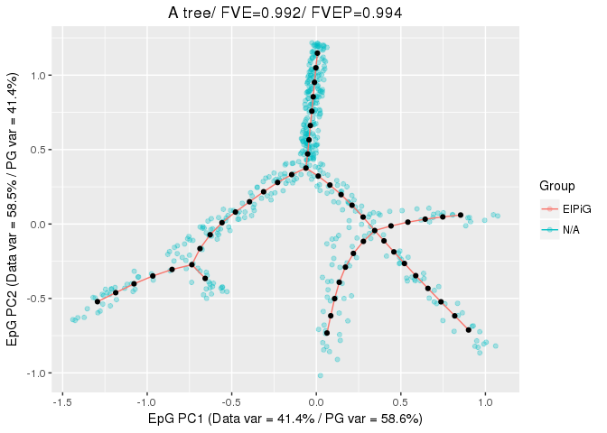<!-- -->

The main plot reports different features including the percentage of variance explained relative to the nodes of the principal graph (PG var), the percentage of variance explained relative to the data points (Data var), the fraction of variance of the data explained by the nodes of the principal graph (FVE) and the fraction of variance of the data explained by the projection of the points on the the principal graph (FVEP). In this example the nodes of the principal graph have been used to compute PCA and rotate the space (the Do_PCA parameter is TRUE be default), this can be seen by the "EpG PC" label of the axes.

To include additional dimension in the plot it is sufficient to specify them with the DimToPlot parameter, e.g.,


```r
PlotPG(X = tree_data, TargetPG = TreeEPG[[1]], Main = "A tree", DimToPlot = 1:3)
```

```
## [[1]]
```

<!-- -->

```
## 
## [[2]]
```

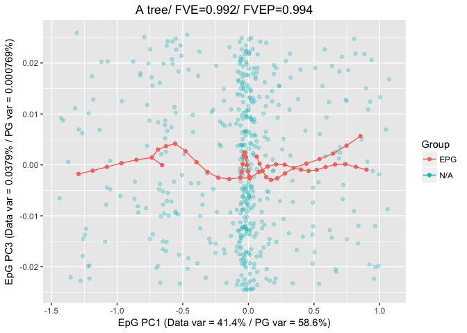<!-- -->

```
## 
## [[3]]
```

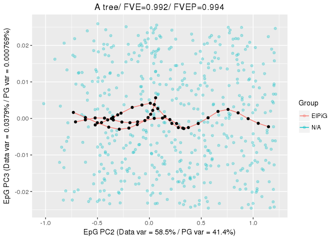<!-- -->

We can also visualize the results of the bootstrapped construction by using the `BootPG` parameter:


```r
PlotPG(X = circle_data, TargetPG = CircleEPG.Boot[[length(CircleEPG.Boot)]],
       BootPG = CircleEPG.Boot[1:(length(CircleEPG.Boot)-1)],
       Main = "A bootstrapped circle", DimToPlot = 1:2)
```

```
## [[1]]
```

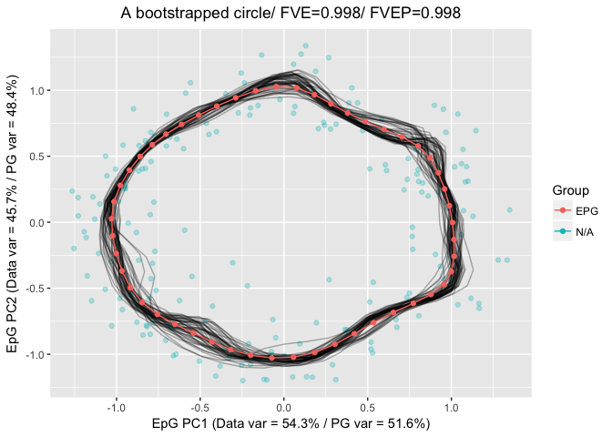<!-- -->


