-   [Descrition](#descrition)
-   [Installation](#installation)
-   [Constructing a principal graph](#constructing-a-principal-graph)
-   [Examples of principal curves](#examples-of-principal-curves)
-   [Using bootstrapping](#using-bootstrapping)
-   [Plotting data with principal
    graphs](#plotting-data-with-principal-graphs)
-   [More info](#more-info)

Descrition
==========

This package provides an R implementation of the ElPiGraph algorithm. A
self-contained description of the algorithm is available
[here](https://github.com/auranic/Elastic-principal-graphs/blob/master/ElPiGraph_Methods.pdf)

A native MATLAB implementation of the algorithm (coded by Andrei
Zinovyev) is also
[available](https://github.com/auranic/Elastic-principal-graphs)

Installation
============

To improve the performance of the algorithm, a number of functions have
been implemented as C++ functions. To simplify the maintenance and
updating of the package, these functions have been implemented in the
package `distutils`, which needs to be installed separately. The
following command will check the presence of the `devtools`, and install
it if necessary, after that it will install the `distutils` package. A
working internet connection is required.

    if(!require("devtools")){
      install.packages("devtools")
    }
    devtools::install_github("Albluca/distutils")  

Once `distutils` has been installed, `ElPiGraph.R` can be installed by
typing

    devtools::install_github("Albluca/ElPiGraph.R")

the package can then be loaded via the command

    library("ElPiGraph.R")

Constructing a principal graph
==============================

The construction of a principal graph with a given topology is done via
the specification of an appropriate initial conditions and of
appropriate growth/shrink grammars. This can be done via the
`computeElasticPrincipalGraph`.

Specific wrapping functions are also provided to build commonly
encountered topologies (`computeElasticPrincipalCurve`,
\``computeElasticPrincipalTree`, `computeElasticPrincipalCircle`), with
minimal required inputs. In all of these function, it is necessary to
specify a numeric matrix with the data points (`X`) and the number of
nodes to of the principal graph (`NumNodes`). It is possible to control
the behavior of the algorithm via a set of optional parameters. For
example, it is possible to:

-   modify the parameter controlling the elastic energy (`Mu` and
    `Lambda`)
-   specify the number of processor to be used (`n.cores`)
-   indicate if diagnostic plots should be produced
    (`drawAccuracyComplexity` and `drawEnergy`)
-   indicate if the final graph should be used to plotted non the data
    (`drawPCAView`)
-   specify if PCA should be performed on the data prior to principal
    graph fitting (`Do_PCA`) and if dimensionality should be reduced
    (`ReduceDimension`)

Examples of principal curves
============================

The function `computeElasticPrincipalCurve` constructs a principal curve
on the data. For example to construct a principal curve with 50 nodes on
the example dataset `line_data`, it is sufficient to write

    CurveEPG <- computeElasticPrincipalCurve(X = curve_data, NumNodes = 50)

    ## [1] "Creating a chain in the 1st PC with 3 nodes"
    ## [1] "Constructing curve 1 of 1 / Subset 1 of 1"
    ## [1] "Performing PCA on the data"
    ## [1] "Using standard PCA"
    ## [1] "3 dimensions are being used"
    ## [1] "100% of the original variance has been retained"
    ## [1] "Computing EPG with 50 nodes on 500 points and 3 dimensions"
    ## [1] "Using a single core"
    ## Nodes = 3 4 5 6 7 8 9 10 11 12 13 14 15 16 17 18 19 20 21 22 23 24 25 26 27 28 29 30 31 32 33 34 35 36 37 38 39 40 41 42 43 44 45 46 47 48 49 
    ## BARCODE  ENERGY  NNODES  NEDGES  NRIBS   NSTARS  NRAYS   NRAYS2  MSE MSEP    FVE FVEP    UE  UR  URN URN2    URSD
    ## 0||50    0.1163  50  49  48  0   0   0   0.05429 0.05149 0.9819  0.9828  0.05109 0.01088 0.5438  27.19   0
    ## 3.293 sec elapsed

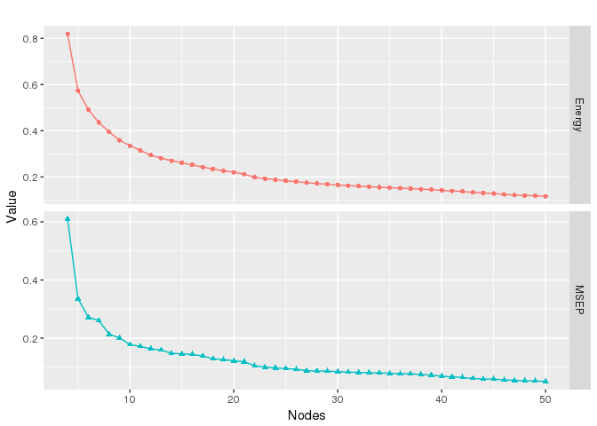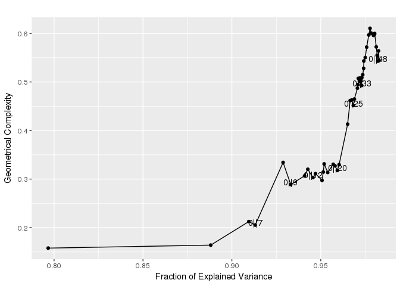

    ## [[1]]

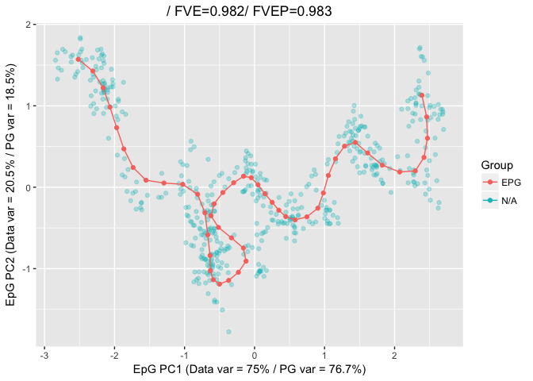

A principal tree can be constructed via the
`computeElasticPrincipalTree` function. For example to construct a
principal tree with 50 nodes on the example dataset `tree_data`, it is
sufficient to write

    TreeEPG <- computeElasticPrincipalTree(X = tree_data, NumNodes = 50)

    ## [1] "Creating a chain in the 1st PC with 2 nodes"
    ## [1] "Constructing tree 1 of 1 / Subset 1 of 1"
    ## [1] "Performing PCA on the data"
    ## [1] "Using standard PCA"
    ## [1] "3 dimensions are being used"
    ## [1] "100% of the original variance has been retained"
    ## [1] "Computing EPG with 50 nodes on 492 points and 3 dimensions"
    ## [1] "Using a single core"
    ## Nodes = 2 3

    ## Warning in PrimitiveElasticGraphEmbedment(X, input$NodePositions, input
    ## $ElasticMatrix, : Maximum number of iterations (10) has been reached. diff
    ## = 0.0556045436349542

    ## 4

    ## Warning in PrimitiveElasticGraphEmbedment(X, input$NodePositions, input
    ## $ElasticMatrix, : Maximum number of iterations (10) has been reached. diff
    ## = 0.0301832931960279

    ## 5 6 7

    ## Warning in PrimitiveElasticGraphEmbedment(X, input$NodePositions, input
    ## $ElasticMatrix, : Maximum number of iterations (10) has been reached. diff
    ## = 0.0108997004478186

    ## 8

    ## Warning in PrimitiveElasticGraphEmbedment(X, input$NodePositions, input
    ## $ElasticMatrix, : Maximum number of iterations (10) has been reached. diff
    ## = 0.0338837538875411

    ## 9

    ## Warning in PrimitiveElasticGraphEmbedment(X, input$NodePositions, input
    ## $ElasticMatrix, : Maximum number of iterations (10) has been reached. diff
    ## = 0.0186764499907295

    ## Warning in PrimitiveElasticGraphEmbedment(X, input$NodePositions, input
    ## $ElasticMatrix, : Maximum number of iterations (10) has been reached. diff
    ## = 0.054863847452363

    ## 10

    ## Warning in PrimitiveElasticGraphEmbedment(X, input$NodePositions, input
    ## $ElasticMatrix, : Maximum number of iterations (10) has been reached. diff
    ## = 0.0244949370624996

    ## Warning in PrimitiveElasticGraphEmbedment(X, input$NodePositions, input
    ## $ElasticMatrix, : Maximum number of iterations (10) has been reached. diff
    ## = 0.0117614602046908

    ## Warning in PrimitiveElasticGraphEmbedment(X, input$NodePositions, input
    ## $ElasticMatrix, : Maximum number of iterations (10) has been reached. diff
    ## = 0.0358113369806447

    ## Warning in PrimitiveElasticGraphEmbedment(X, input$NodePositions, input
    ## $ElasticMatrix, : Maximum number of iterations (10) has been reached. diff
    ## = 0.0139648044782385

    ## 11 12 13

    ## Warning in PrimitiveElasticGraphEmbedment(X, input$NodePositions, input
    ## $ElasticMatrix, : Maximum number of iterations (10) has been reached. diff
    ## = 0.0183632027691593

    ## 14 15 16 17 18 19 20 21 22 23 24 25 26 27 28 29 30 31 32 33 34 35 36 37 38 39 40 41 42 43 44 45 46 47 48 49 
    ## BARCODE  ENERGY  NNODES  NEDGES  NRIBS   NSTARS  NRAYS   NRAYS2  MSE MSEP    FVE FVEP    UE  UR  URN URN2    URSD
    ## 1|2||50  0.01568 50  49  41  2   0   0   0.004137    0.003432    0.9923  0.9936  0.01114 0.0004032   0.02016 1.008   0
    ## 13.701 sec elapsed

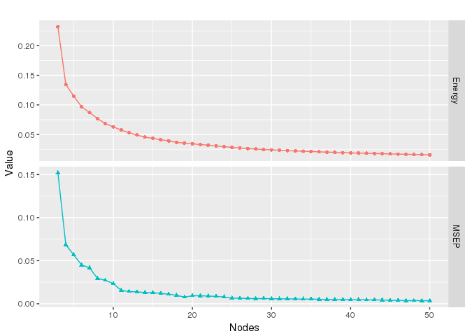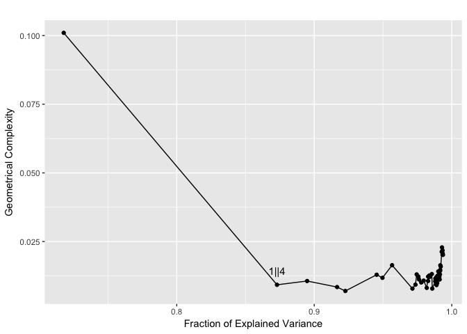

    ## [[1]]

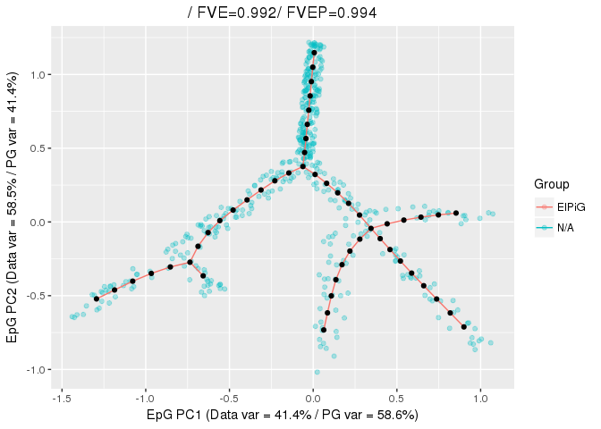

Finally, a principal circle can be constructed via the
`computeElasticPrincipalCircle` function. For example to construct a
principal circle with 50 nodes on the example dataset `circe_data`, it
is sufficient to write

    CircleEPG <- computeElasticPrincipalCircle(X = circle_data, NumNodes = 50)

    ## [1] "Using a single core"
    ## [1] "Creating a circle in the plane induced buy the 1st and 2nd PCs with 3 nodes"
    ## [1] "Constructing curve 1 of 1 / Subset 1 of 1"
    ## [1] "Performing PCA on the data"
    ## [1] "Using standard PCA"
    ## [1] "3 dimensions are being used"
    ## [1] "100% of the original variance has been retained"
    ## [1] "Computing EPG with 50 nodes on 200 points and 3 dimensions"
    ## [1] "Using a single core"
    ## Nodes = 3 4 5 6 7 8 9 10 11 12 13 14 15 16 17 18 19 20 21 22 23 24 25 26 27 28 29 30 31 32 33 34 35 36 37 38 39 40 41 42 43 44 45 46 47 48 49 
    ## BARCODE  ENERGY  NNODES  NEDGES  NRIBS   NSTARS  NRAYS   NRAYS2  MSE MSEP    FVE FVEP    UE  UR  URN URN2    URSD
    ## 0||50    0.0456  50  50  50  0   0   0   0.02624 0.02528 0.9754  0.9763  0.01754 0.001818    0.09089 4.545   0
    ## 2.738 sec elapsed

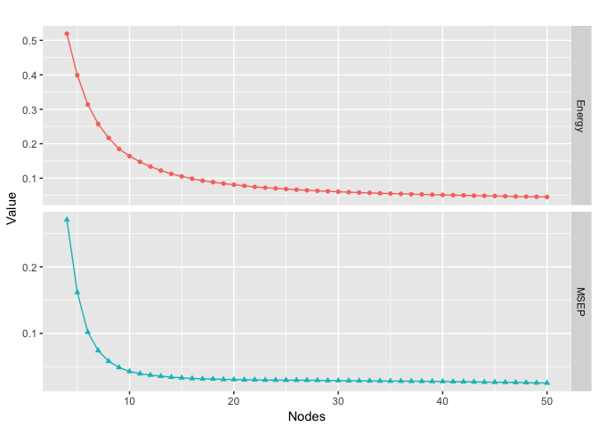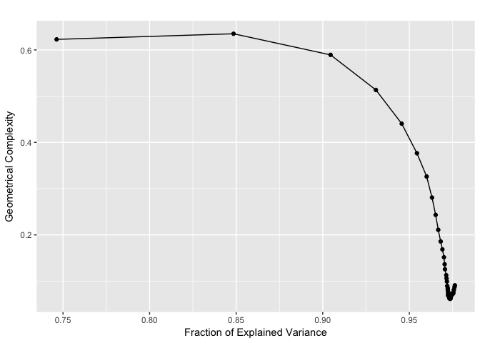

    ## [[1]]

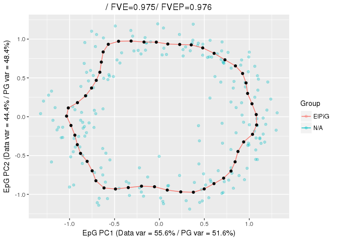

All of these functions will return a list of length 1, with all the
information associated with the graph.

Using bootstrapping
===================

All of the functions provided to build principal graphs allow a
bootstrapped construction. To enable that it is sufficient to modify the
parameters `nReps` and `ProbPoint`. `nReps` indicates the number of
repetitions and `ProbPoint` indicates the probability to include a point
in each of the repetition. When `nReps` is larger than 1, a final
consensus principal graph will be constructed using the nodes of the
graph derived in each repetition.

As an example, let us perform bootstrapping on the circle data. We will
also prevent the plotting, for now.

    CircleEPG.Boot <- computeElasticPrincipalCircle(X = circle_data, NumNodes = 50, nReps = 50, ProbPoint = .8, drawAccuracyComplexity = FALSE, drawEnergy = FALSE, drawPCAView = FALSE)

    ## [1] "Using a single core"
    ## [1] "Creating a circle in the plane induced buy the 1st and 2nd PCs with 3 nodes"
    ## [1] "Constructing curve 1 of 50 / Subset 1 of 1"
    ## [1] "Performing PCA on the data"
    ## [1] "Using standard PCA"
    ## [1] "3 dimensions are being used"
    ## [1] "100% of the original variance has been retained"
    ## [1] "Computing EPG with 50 nodes on 161 points and 3 dimensions"
    ## [1] "Using a single core"
    ## Nodes = 3 4 5 6 7 8 9 10 11 12 13 14 15 16 17 18 19 20 21 22 23 24 25 26 27 28 29 30 31 32 33 34 35 36 37 38 39 40 41 42 43 44 45 46 47 48 49 
    ## BARCODE  ENERGY  NNODES  NEDGES  NRIBS   NSTARS  NRAYS   NRAYS2  MSE MSEP    FVE FVEP    UE  UR  URN URN2    URSD
    ## 0||50    0.04703 50  50  50  0   0   0   0.02675 0.02582 0.9748  0.9757  0.01809 0.002186    0.1093  5.465   0
    ## 2.669 sec elapsed
    ## [1] "Constructing curve 2 of 50 / Subset 1 of 1"
    ## [1] "Performing PCA on the data"
    ## [1] "Using standard PCA"
    ## [1] "3 dimensions are being used"
    ## [1] "100% of the original variance has been retained"
    ## [1] "Computing EPG with 50 nodes on 167 points and 3 dimensions"
    ## [1] "Using a single core"
    ## Nodes = 3 4 5 6 7 8 9 10 11 12 13 14 15 16 17 18 19 20 21 22 23 24 25 26 27 28 29 30 31 32 33 34 35 36 37 38 39 40 41 42 43 44 45 46 47 48 49 
    ## BARCODE  ENERGY  NNODES  NEDGES  NRIBS   NSTARS  NRAYS   NRAYS2  MSE MSEP    FVE FVEP    UE  UR  URN URN2    URSD
    ## 0||50    0.04598 50  50  50  0   0   0   0.027   0.02604 0.9746  0.9755  0.01724 0.001738    0.08692 4.346   0
    ## 2.344 sec elapsed
    ## [1] "Constructing curve 3 of 50 / Subset 1 of 1"
    ## [1] "Performing PCA on the data"
    ## [1] "Using standard PCA"
    ## [1] "3 dimensions are being used"
    ## [1] "100% of the original variance has been retained"
    ## [1] "Computing EPG with 50 nodes on 161 points and 3 dimensions"
    ## [1] "Using a single core"
    ## Nodes = 3 4 5 6 7 8 9 10 11 12 13 14 15 16 17 18 19 20 21 22 23 24 25 26 27 28 29 30 31 32 33 34 35 36 37 38 39 40 41 42 43 44 45 46 47 48 49 
    ## BARCODE  ENERGY  NNODES  NEDGES  NRIBS   NSTARS  NRAYS   NRAYS2  MSE MSEP    FVE FVEP    UE  UR  URN URN2    URSD
    ## 0||50    0.04387 50  50  50  0   0   0   0.02438 0.02351 0.9773  0.9781  0.01771 0.001786    0.08928 4.464   0
    ## 2.595 sec elapsed
    ## [1] "Graphical output will be suppressed for the remaining replicas"
    ## [1] "Constructing curve 4 of 50 / Subset 1 of 1"
    ## [1] "Performing PCA on the data"
    ## [1] "Using standard PCA"
    ## [1] "3 dimensions are being used"
    ## [1] "100% of the original variance has been retained"
    ## [1] "Computing EPG with 50 nodes on 162 points and 3 dimensions"
    ## [1] "Using a single core"
    ## Nodes = 3 4 5 6 7 8 9 10 11 12 13 14 15 16 17 18 19 20 21 22 23 24 25 26 27 28 29 30 31 32 33 34 35 36 37 38 39 40 41 42 43 44 45 46 47 48 49 
    ## BARCODE  ENERGY  NNODES  NEDGES  NRIBS   NSTARS  NRAYS   NRAYS2  MSE MSEP    FVE FVEP    UE  UR  URN URN2    URSD
    ## 0||50    0.04379 50  50  50  0   0   0   0.02425 0.02329 0.9774  0.9783  0.01763 0.00191 0.0955  4.775   0
    ## 2.667 sec elapsed
    ## [1] "Constructing curve 5 of 50 / Subset 1 of 1"
    ## [1] "Performing PCA on the data"
    ## [1] "Using standard PCA"
    ## [1] "3 dimensions are being used"
    ## [1] "100% of the original variance has been retained"
    ## [1] "Computing EPG with 50 nodes on 155 points and 3 dimensions"
    ## [1] "Using a single core"
    ## Nodes = 3 4 5 6 7 8 9 10 11 12 13 14 15 16 17 18 19 20 21 22 23 24 25 26 27 28 29 30 31 32 33 34 35 36 37 38 39 40 41 42 43 44 45 46 47 48 49 
    ## BARCODE  ENERGY  NNODES  NEDGES  NRIBS   NSTARS  NRAYS   NRAYS2  MSE MSEP    FVE FVEP    UE  UR  URN URN2    URSD
    ## 0||50    0.04526 50  50  50  0   0   0   0.02407 0.02298 0.9775  0.9786  0.01846 0.002723    0.1362  6.808   0
    ## 2.326 sec elapsed
    ## [1] "Constructing curve 6 of 50 / Subset 1 of 1"
    ## [1] "Performing PCA on the data"
    ## [1] "Using standard PCA"
    ## [1] "3 dimensions are being used"
    ## [1] "100% of the original variance has been retained"
    ## [1] "Computing EPG with 50 nodes on 166 points and 3 dimensions"
    ## [1] "Using a single core"
    ## Nodes = 3 4 5 6 7 8 9 10 11 12 13 14 15 16 17 18 19 20 21 22 23 24 25 26 27 28 29 30 31 32 33 34 35 36 37 38 39 40 41 42 43 44 45 46 47 48 49 
    ## BARCODE  ENERGY  NNODES  NEDGES  NRIBS   NSTARS  NRAYS   NRAYS2  MSE MSEP    FVE FVEP    UE  UR  URN URN2    URSD
    ## 0||50    0.04708 50  50  50  0   0   0   0.02685 0.02588 0.9752  0.9761  0.01819 0.002049    0.1025  5.124   0
    ## 2.603 sec elapsed
    ## [1] "Constructing curve 7 of 50 / Subset 1 of 1"
    ## [1] "Performing PCA on the data"
    ## [1] "Using standard PCA"
    ## [1] "3 dimensions are being used"
    ## [1] "100% of the original variance has been retained"
    ## [1] "Computing EPG with 50 nodes on 152 points and 3 dimensions"
    ## [1] "Using a single core"
    ## Nodes = 3 4 5 6 7 8 9 10 11 12 13 14 15 16 17 18 19 20 21 22 23 24 25 26 27 28 29 30 31 32 33 34 35 36 37 38 39 40 41 42 43 44 45 46 47 48 49 
    ## BARCODE  ENERGY  NNODES  NEDGES  NRIBS   NSTARS  NRAYS   NRAYS2  MSE MSEP    FVE FVEP    UE  UR  URN URN2    URSD
    ## 0||50    0.04206 50  50  50  0   0   0   0.0232  0.02216 0.9782  0.9792  0.01715 0.001713    0.08565 4.282   0
    ## 2.398 sec elapsed
    ## [1] "Constructing curve 8 of 50 / Subset 1 of 1"
    ## [1] "Performing PCA on the data"
    ## [1] "Using standard PCA"
    ## [1] "3 dimensions are being used"
    ## [1] "100% of the original variance has been retained"
    ## [1] "Computing EPG with 50 nodes on 159 points and 3 dimensions"
    ## [1] "Using a single core"
    ## Nodes = 3 4 5 6 7 8 9 10 11 12 13 14 15 16 17 18 19 20 21 22 23 24 25 26 27 28 29 30 31 32 33 34 35 36 37 38 39 40 41 42 43 44 45 46 47 48 49 
    ## BARCODE  ENERGY  NNODES  NEDGES  NRIBS   NSTARS  NRAYS   NRAYS2  MSE MSEP    FVE FVEP    UE  UR  URN URN2    URSD
    ## 0||50    0.04345 50  50  50  0   0   0   0.02498 0.02418 0.9761  0.9769  0.01687 0.001603    0.08013 4.006   0
    ## 2.569 sec elapsed
    ## [1] "Constructing curve 9 of 50 / Subset 1 of 1"
    ## [1] "Performing PCA on the data"
    ## [1] "Using standard PCA"
    ## [1] "3 dimensions are being used"
    ## [1] "100% of the original variance has been retained"
    ## [1] "Computing EPG with 50 nodes on 160 points and 3 dimensions"
    ## [1] "Using a single core"
    ## Nodes = 3 4 5 6 7 8 9 10 11 12 13 14 15 16 17 18 19 20 21 22 23 24 25 26 27 28 29 30 31 32 33 34 35 36 37 38 39 40 41 42 43 44 45 46 47 48 49 
    ## BARCODE  ENERGY  NNODES  NEDGES  NRIBS   NSTARS  NRAYS   NRAYS2  MSE MSEP    FVE FVEP    UE  UR  URN URN2    URSD
    ## 0||50    0.04465 50  50  50  0   0   0   0.02455 0.02369 0.9774  0.9782  0.01804 0.002058    0.1029  5.145   0
    ## 2.633 sec elapsed
    ## [1] "Constructing curve 10 of 50 / Subset 1 of 1"
    ## [1] "Performing PCA on the data"
    ## [1] "Using standard PCA"
    ## [1] "3 dimensions are being used"
    ## [1] "100% of the original variance has been retained"
    ## [1] "Computing EPG with 50 nodes on 157 points and 3 dimensions"
    ## [1] "Using a single core"
    ## Nodes = 3 4 5 6 7 8 9 10 11 12 13 14 15 16 17 18 19 20 21 22 23 24 25 26 27 28 29 30 31 32 33 34 35 36 37 38 39 40 41 42 43 44 45 46 47 48 49 
    ## BARCODE  ENERGY  NNODES  NEDGES  NRIBS   NSTARS  NRAYS   NRAYS2  MSE MSEP    FVE FVEP    UE  UR  URN URN2    URSD
    ## 0||50    0.04388 50  50  50  0   0   0   0.02487 0.02402 0.9767  0.9775  0.01746 0.001551    0.07755 3.877   0
    ## 2.377 sec elapsed
    ## [1] "Constructing curve 11 of 50 / Subset 1 of 1"
    ## [1] "Performing PCA on the data"
    ## [1] "Using standard PCA"
    ## [1] "3 dimensions are being used"
    ## [1] "100% of the original variance has been retained"
    ## [1] "Computing EPG with 50 nodes on 163 points and 3 dimensions"
    ## [1] "Using a single core"
    ## Nodes = 3 4 5 6 7 8 9 10 11 12 13 14 15 16 17 18 19 20 21 22 23 24 25 26 27 28 29 30 31 32 33 34 35 36 37 38 39 40 41 42 43 44 45 46 47 48 49 
    ## BARCODE  ENERGY  NNODES  NEDGES  NRIBS   NSTARS  NRAYS   NRAYS2  MSE MSEP    FVE FVEP    UE  UR  URN URN2    URSD
    ## 0||50    0.04593 50  50  50  0   0   0   0.02538 0.02432 0.9763  0.9773  0.01819 0.002364    0.1182  5.911   0
    ## 2.594 sec elapsed
    ## [1] "Constructing curve 12 of 50 / Subset 1 of 1"
    ## [1] "Performing PCA on the data"
    ## [1] "Using standard PCA"
    ## [1] "3 dimensions are being used"
    ## [1] "100% of the original variance has been retained"
    ## [1] "Computing EPG with 50 nodes on 163 points and 3 dimensions"
    ## [1] "Using a single core"
    ## Nodes = 3 4 5 6 7 8 9 10 11 12 13 14 15 16 17 18 19 20 21 22 23 24 25 26 27 28 29 30 31 32 33 34 35 36 37 38 39 40 41 42 43 44 45 46 47 48 49 
    ## BARCODE  ENERGY  NNODES  NEDGES  NRIBS   NSTARS  NRAYS   NRAYS2  MSE MSEP    FVE FVEP    UE  UR  URN URN2    URSD
    ## 0||50    0.04435 50  50  50  0   0   0   0.02555 0.0247  0.9754  0.9762  0.01711 0.001683    0.08413 4.206   0
    ## 2.643 sec elapsed
    ## [1] "Constructing curve 13 of 50 / Subset 1 of 1"
    ## [1] "Performing PCA on the data"
    ## [1] "Using standard PCA"
    ## [1] "3 dimensions are being used"
    ## [1] "100% of the original variance has been retained"
    ## [1] "Computing EPG with 50 nodes on 154 points and 3 dimensions"
    ## [1] "Using a single core"
    ## Nodes = 3 4 5 6 7 8 9 10 11 12 13 14 15 16 17 18 19 20 21 22 23 24 25 26 27 28 29 30 31 32 33 34 35 36 37 38 39 40 41 42 43 44 45 46 47 48 49 
    ## BARCODE  ENERGY  NNODES  NEDGES  NRIBS   NSTARS  NRAYS   NRAYS2  MSE MSEP    FVE FVEP    UE  UR  URN URN2    URSD
    ## 0||50    0.04429 50  50  50  0   0   0   0.02573 0.02479 0.976   0.9769  0.01707 0.001497    0.07486 3.743   0
    ## 2.399 sec elapsed
    ## [1] "Constructing curve 14 of 50 / Subset 1 of 1"
    ## [1] "Performing PCA on the data"
    ## [1] "Using standard PCA"
    ## [1] "3 dimensions are being used"
    ## [1] "100% of the original variance has been retained"
    ## [1] "Computing EPG with 50 nodes on 160 points and 3 dimensions"
    ## [1] "Using a single core"
    ## Nodes = 3 4 5 6 7 8 9 10 11 12 13 14 15 16 17 18 19 20 21 22 23 24 25 26 27 28 29 30 31 32 33 34 35 36 37 38 39 40 41 42 43 44 45 46 47 48 49 
    ## BARCODE  ENERGY  NNODES  NEDGES  NRIBS   NSTARS  NRAYS   NRAYS2  MSE MSEP    FVE FVEP    UE  UR  URN URN2    URSD
    ## 0||50    0.04463 50  50  50  0   0   0   0.02489 0.02393 0.9767  0.9776  0.01779 0.001952    0.0976  4.88    0
    ## 2.596 sec elapsed
    ## [1] "Constructing curve 15 of 50 / Subset 1 of 1"
    ## [1] "Performing PCA on the data"
    ## [1] "Using standard PCA"
    ## [1] "3 dimensions are being used"
    ## [1] "100% of the original variance has been retained"
    ## [1] "Computing EPG with 50 nodes on 171 points and 3 dimensions"
    ## [1] "Using a single core"
    ## Nodes = 3 4 5 6 7 8 9 10 11 12 13 14 15 16 17 18 19 20 21 22 23 24 25 26 27 28 29 30 31 32 33 34 35 36 37 38 39 40 41 42 43 44 45 46 47 48 49 
    ## BARCODE  ENERGY  NNODES  NEDGES  NRIBS   NSTARS  NRAYS   NRAYS2  MSE MSEP    FVE FVEP    UE  UR  URN URN2    URSD
    ## 0||50    0.04626 50  50  50  0   0   0   0.02652 0.02568 0.9752  0.9759  0.01786 0.00188 0.094   4.7 0
    ## 2.704 sec elapsed
    ## [1] "Constructing curve 16 of 50 / Subset 1 of 1"
    ## [1] "Performing PCA on the data"
    ## [1] "Using standard PCA"
    ## [1] "3 dimensions are being used"
    ## [1] "100% of the original variance has been retained"
    ## [1] "Computing EPG with 50 nodes on 158 points and 3 dimensions"
    ## [1] "Using a single core"
    ## Nodes = 3 4 5 6 7 8 9 10 11 12 13 14 15 16 17 18 19 20 21 22 23 24 25 26 27 28 29 30 31 32 33 34 35 36 37 38 39 40 41 42 43 44 45 46 47 48 49 
    ## BARCODE  ENERGY  NNODES  NEDGES  NRIBS   NSTARS  NRAYS   NRAYS2  MSE MSEP    FVE FVEP    UE  UR  URN URN2    URSD
    ## 0||50    0.04602 50  50  50  0   0   0   0.02578 0.02483 0.9759  0.9768  0.01796 0.002286    0.1143  5.714   0
    ## 2.402 sec elapsed
    ## [1] "Constructing curve 17 of 50 / Subset 1 of 1"
    ## [1] "Performing PCA on the data"
    ## [1] "Using standard PCA"
    ## [1] "3 dimensions are being used"
    ## [1] "100% of the original variance has been retained"
    ## [1] "Computing EPG with 50 nodes on 160 points and 3 dimensions"
    ## [1] "Using a single core"
    ## Nodes = 3 4 5 6 7 8 9 10 11 12 13 14 15 16 17 18 19 20 21 22 23 24 25 26 27 28 29 30 31 32 33 34 35 36 37 38 39 40 41 42 43 44 45 46 47 48 49 
    ## BARCODE  ENERGY  NNODES  NEDGES  NRIBS   NSTARS  NRAYS   NRAYS2  MSE MSEP    FVE FVEP    UE  UR  URN URN2    URSD
    ## 0||50    0.04443 50  50  50  0   0   0   0.02465 0.02373 0.9768  0.9777  0.01765 0.002124    0.1062  5.309   0
    ## 2.603 sec elapsed
    ## [1] "Constructing curve 18 of 50 / Subset 1 of 1"
    ## [1] "Performing PCA on the data"
    ## [1] "Using standard PCA"
    ## [1] "3 dimensions are being used"
    ## [1] "100% of the original variance has been retained"
    ## [1] "Computing EPG with 50 nodes on 158 points and 3 dimensions"
    ## [1] "Using a single core"
    ## Nodes = 3 4 5 6 7 8 9 10 11 12 13 14 15 16 17 18 19 20 21 22 23 24 25 26 27 28 29 30 31 32 33 34 35 36 37 38 39 40 41 42 43 44 45 46 47 48 49 
    ## BARCODE  ENERGY  NNODES  NEDGES  NRIBS   NSTARS  NRAYS   NRAYS2  MSE MSEP    FVE FVEP    UE  UR  URN URN2    URSD
    ## 0||50    0.04643 50  50  50  0   0   0   0.02774 0.0269  0.9738  0.9746  0.01704 0.001644    0.0822  4.11    0
    ## 2.682 sec elapsed
    ## [1] "Constructing curve 19 of 50 / Subset 1 of 1"
    ## [1] "Performing PCA on the data"
    ## [1] "Using standard PCA"
    ## [1] "3 dimensions are being used"
    ## [1] "100% of the original variance has been retained"
    ## [1] "Computing EPG with 50 nodes on 171 points and 3 dimensions"
    ## [1] "Using a single core"
    ## Nodes = 3 4 5 6 7 8 9 10 11 12 13 14 15 16 17 18 19 20 21 22 23 24 25 26 27 28 29 30 31 32 33 34 35 36 37 38 39 40 41 42 43 44 45 46 47 48 49 
    ## BARCODE  ENERGY  NNODES  NEDGES  NRIBS   NSTARS  NRAYS   NRAYS2  MSE MSEP    FVE FVEP    UE  UR  URN URN2    URSD
    ## 0||50    0.0443  50  50  50  0   0   0   0.02531 0.02441 0.9764  0.9772  0.01733 0.00166 0.08298 4.149   0
    ## 2.44 sec elapsed
    ## [1] "Constructing curve 20 of 50 / Subset 1 of 1"
    ## [1] "Performing PCA on the data"
    ## [1] "Using standard PCA"
    ## [1] "3 dimensions are being used"
    ## [1] "100% of the original variance has been retained"
    ## [1] "Computing EPG with 50 nodes on 150 points and 3 dimensions"
    ## [1] "Using a single core"
    ## Nodes = 3 4 5 6 7 8 9 10 11 12 13 14 15 16 17 18 19 20 21 22 23 24 25 26 27 28 29 30 31 32 33 34 35 36 37 38 39 40 41 42 43 44 45 46 47 48 49 
    ## BARCODE  ENERGY  NNODES  NEDGES  NRIBS   NSTARS  NRAYS   NRAYS2  MSE MSEP    FVE FVEP    UE  UR  URN URN2    URSD
    ## 0||50    0.0473  50  50  50  0   0   0   0.02678 0.02591 0.9749  0.9758  0.01794 0.002576    0.1288  6.439   0
    ## 2.599 sec elapsed
    ## [1] "Constructing curve 21 of 50 / Subset 1 of 1"
    ## [1] "Performing PCA on the data"
    ## [1] "Using standard PCA"
    ## [1] "3 dimensions are being used"
    ## [1] "100% of the original variance has been retained"
    ## [1] "Computing EPG with 50 nodes on 170 points and 3 dimensions"
    ## [1] "Using a single core"
    ## Nodes = 3 4 5 6 7 8 9 10 11 12 13 14 15 16 17 18 19 20 21 22 23 24 25 26 27 28 29 30 31 32 33 34 35 36 37 38 39 40 41 42 43 44 45 46 47 48 49 
    ## BARCODE  ENERGY  NNODES  NEDGES  NRIBS   NSTARS  NRAYS   NRAYS2  MSE MSEP    FVE FVEP    UE  UR  URN URN2    URSD
    ## 0||50    0.04537 50  50  50  0   0   0   0.02524 0.02432 0.9766  0.9774  0.01807 0.002065    0.1033  5.163   0
    ## 2.674 sec elapsed
    ## [1] "Constructing curve 22 of 50 / Subset 1 of 1"
    ## [1] "Performing PCA on the data"
    ## [1] "Using standard PCA"
    ## [1] "3 dimensions are being used"
    ## [1] "100% of the original variance has been retained"
    ## [1] "Computing EPG with 50 nodes on 160 points and 3 dimensions"
    ## [1] "Using a single core"
    ## Nodes = 3 4 5 6 7 8 9 10 11 12 13 14 15 16 17 18 19 20 21 22 23 24 25 26 27 28 29 30 31 32 33 34 35 36 37 38 39 40 41 42 43 44 45 46 47 48 49 
    ## BARCODE  ENERGY  NNODES  NEDGES  NRIBS   NSTARS  NRAYS   NRAYS2  MSE MSEP    FVE FVEP    UE  UR  URN URN2    URSD
    ## 0||50    0.04538 50  50  50  0   0   0   0.02523 0.02434 0.9769  0.9777  0.01802 0.00213 0.1065  5.324   0
    ## 2.415 sec elapsed
    ## [1] "Constructing curve 23 of 50 / Subset 1 of 1"
    ## [1] "Performing PCA on the data"
    ## [1] "Using standard PCA"
    ## [1] "3 dimensions are being used"
    ## [1] "100% of the original variance has been retained"
    ## [1] "Computing EPG with 50 nodes on 162 points and 3 dimensions"
    ## [1] "Using a single core"
    ## Nodes = 3 4 5 6 7 8 9 10 11 12 13 14 15 16 17 18 19 20 21 22 23 24 25 26 27 28 29 30 31 32 33 34 35 36 37 38 39 40 41 42 43 44 45 46 47 48 49 
    ## BARCODE  ENERGY  NNODES  NEDGES  NRIBS   NSTARS  NRAYS   NRAYS2  MSE MSEP    FVE FVEP    UE  UR  URN URN2    URSD
    ## 0||50    0.04351 50  50  50  0   0   0   0.02501 0.0242  0.9765  0.9773  0.01703 0.001472    0.07359 3.68    0
    ## 2.61 sec elapsed
    ## [1] "Constructing curve 24 of 50 / Subset 1 of 1"
    ## [1] "Performing PCA on the data"
    ## [1] "Using standard PCA"
    ## [1] "3 dimensions are being used"
    ## [1] "100% of the original variance has been retained"
    ## [1] "Computing EPG with 50 nodes on 162 points and 3 dimensions"
    ## [1] "Using a single core"
    ## Nodes = 3 4 5 6 7 8 9 10 11 12 13 14 15 16 17 18 19 20 21 22 23 24 25 26 27 28 29 30 31 32 33 34 35 36 37 38 39 40 41 42 43 44 45 46 47 48 49 
    ## BARCODE  ENERGY  NNODES  NEDGES  NRIBS   NSTARS  NRAYS   NRAYS2  MSE MSEP    FVE FVEP    UE  UR  URN URN2    URSD
    ## 0||50    0.04594 50  50  50  0   0   0   0.02475 0.02389 0.9769  0.9777  0.01855 0.002642    0.1321  6.606   0
    ## 2.671 sec elapsed
    ## [1] "Constructing curve 25 of 50 / Subset 1 of 1"
    ## [1] "Performing PCA on the data"
    ## [1] "Using standard PCA"
    ## [1] "3 dimensions are being used"
    ## [1] "100% of the original variance has been retained"
    ## [1] "Computing EPG with 50 nodes on 151 points and 3 dimensions"
    ## [1] "Using a single core"
    ## Nodes = 3 4 5 6 7 8 9 10 11 12 13 14 15 16 17 18 19 20 21 22 23 24 25 26 27 28 29 30 31 32 33 34 35 36 37 38 39 40 41 42 43 44 45 46 47 48 49 
    ## BARCODE  ENERGY  NNODES  NEDGES  NRIBS   NSTARS  NRAYS   NRAYS2  MSE MSEP    FVE FVEP    UE  UR  URN URN2    URSD
    ## 0||50    0.04356 50  50  50  0   0   0   0.02475 0.02392 0.9767  0.9775  0.01722 0.001602    0.08009 4.005   0
    ## 2.704 sec elapsed
    ## [1] "Constructing curve 26 of 50 / Subset 1 of 1"
    ## [1] "Performing PCA on the data"
    ## [1] "Using standard PCA"
    ## [1] "3 dimensions are being used"
    ## [1] "100% of the original variance has been retained"
    ## [1] "Computing EPG with 50 nodes on 166 points and 3 dimensions"
    ## [1] "Using a single core"
    ## Nodes = 3 4 5 6 7 8 9 10 11 12 13 14 15 16 17 18 19 20 21 22 23 24 25 26 27 28 29 30 31 32 33 34 35 36 37 38 39 40 41 42 43 44 45 46 47 48 49 
    ## BARCODE  ENERGY  NNODES  NEDGES  NRIBS   NSTARS  NRAYS   NRAYS2  MSE MSEP    FVE FVEP    UE  UR  URN URN2    URSD
    ## 0||50    0.04636 50  50  50  0   0   0   0.02623 0.02548 0.9753  0.976   0.01772 0.002413    0.1206  6.032   0
    ## 2.405 sec elapsed
    ## [1] "Constructing curve 27 of 50 / Subset 1 of 1"
    ## [1] "Performing PCA on the data"
    ## [1] "Using standard PCA"
    ## [1] "3 dimensions are being used"
    ## [1] "100% of the original variance has been retained"
    ## [1] "Computing EPG with 50 nodes on 159 points and 3 dimensions"
    ## [1] "Using a single core"
    ## Nodes = 3 4 5 6 7 8 9 10 11 12 13 14 15 16 17 18 19 20 21 22 23 24 25 26 27 28 29 30 31 32 33 34 35 36 37 38 39 40 41 42 43 44 45 46 47 48 49 
    ## BARCODE  ENERGY  NNODES  NEDGES  NRIBS   NSTARS  NRAYS   NRAYS2  MSE MSEP    FVE FVEP    UE  UR  URN URN2    URSD
    ## 0||50    0.04653 50  50  50  0   0   0   0.0265  0.02561 0.9752  0.976   0.01774 0.002282    0.1141  5.705   0
    ## 2.664 sec elapsed
    ## [1] "Constructing curve 28 of 50 / Subset 1 of 1"
    ## [1] "Performing PCA on the data"
    ## [1] "Using standard PCA"
    ## [1] "3 dimensions are being used"
    ## [1] "100% of the original variance has been retained"
    ## [1] "Computing EPG with 50 nodes on 156 points and 3 dimensions"
    ## [1] "Using a single core"
    ## Nodes = 3 4 5 6 7 8 9 10 11 12 13 14 15 16 17 18 19 20 21 22 23 24 25 26 27 28 29 30 31 32 33 34 35 36 37 38 39 40 41 42 43 44 45 46 47 48 49 
    ## BARCODE  ENERGY  NNODES  NEDGES  NRIBS   NSTARS  NRAYS   NRAYS2  MSE MSEP    FVE FVEP    UE  UR  URN URN2    URSD
    ## 0||50    0.04502 50  50  50  0   0   0   0.02461 0.02375 0.9765  0.9773  0.01797 0.002441    0.122   6.102   0
    ## 2.682 sec elapsed
    ## [1] "Constructing curve 29 of 50 / Subset 1 of 1"
    ## [1] "Performing PCA on the data"
    ## [1] "Using standard PCA"
    ## [1] "3 dimensions are being used"
    ## [1] "100% of the original variance has been retained"
    ## [1] "Computing EPG with 50 nodes on 165 points and 3 dimensions"
    ## [1] "Using a single core"
    ## Nodes = 3 4 5 6 7 8 9 10 11 12 13 14 15 16 17 18 19 20 21 22 23 24 25 26 27 28 29 30 31 32 33 34 35 36 37 38 39 40 41 42 43 44 45 46 47 48 49 
    ## BARCODE  ENERGY  NNODES  NEDGES  NRIBS   NSTARS  NRAYS   NRAYS2  MSE MSEP    FVE FVEP    UE  UR  URN URN2    URSD
    ## 0||50    0.04554 50  50  50  0   0   0   0.02663 0.02567 0.975   0.9759  0.01726 0.001649    0.08245 4.122   0
    ## 2.425 sec elapsed
    ## [1] "Constructing curve 30 of 50 / Subset 1 of 1"
    ## [1] "Performing PCA on the data"
    ## [1] "Using standard PCA"
    ## [1] "3 dimensions are being used"
    ## [1] "100% of the original variance has been retained"
    ## [1] "Computing EPG with 50 nodes on 148 points and 3 dimensions"
    ## [1] "Using a single core"
    ## Nodes = 3 4 5 6 7 8 9 10 11 12 13 14 15 16 17 18 19 20 21 22 23 24 25 26 27 28 29 30 31 32 33 34 35 36 37 38 39 40 41 42 43 44 45 46 47 48 49 
    ## BARCODE  ENERGY  NNODES  NEDGES  NRIBS   NSTARS  NRAYS   NRAYS2  MSE MSEP    FVE FVEP    UE  UR  URN URN2    URSD
    ## 0||50    0.04679 50  50  50  0   0   0   0.02755 0.02678 0.9741  0.9748  0.01731 0.001933    0.09663 4.831   0
    ## 2.601 sec elapsed
    ## [1] "Constructing curve 31 of 50 / Subset 1 of 1"
    ## [1] "Performing PCA on the data"
    ## [1] "Using standard PCA"
    ## [1] "3 dimensions are being used"
    ## [1] "100% of the original variance has been retained"
    ## [1] "Computing EPG with 50 nodes on 154 points and 3 dimensions"
    ## [1] "Using a single core"
    ## Nodes = 3 4 5 6 7 8 9 10 11 12 13 14 15 16 17 18 19 20 21 22 23 24 25 26 27 28 29 30 31 32 33 34 35 36 37 38 39 40 41 42 43 44 45 46 47 48 49 
    ## BARCODE  ENERGY  NNODES  NEDGES  NRIBS   NSTARS  NRAYS   NRAYS2  MSE MSEP    FVE FVEP    UE  UR  URN URN2    URSD
    ## 0||50    0.04521 50  50  50  0   0   0   0.02485 0.02388 0.9768  0.9777  0.01807 0.002296    0.1148  5.739   0
    ## 2.667 sec elapsed
    ## [1] "Constructing curve 32 of 50 / Subset 1 of 1"
    ## [1] "Performing PCA on the data"
    ## [1] "Using standard PCA"
    ## [1] "3 dimensions are being used"
    ## [1] "100% of the original variance has been retained"
    ## [1] "Computing EPG with 50 nodes on 169 points and 3 dimensions"
    ## [1] "Using a single core"
    ## Nodes = 3 4 5 6 7 8 9 10 11 12 13 14 15 16 17 18 19 20 21 22 23 24 25 26 27 28 29 30 31 32 33 34 35 36 37 38 39 40 41 42 43 44 45 46 47 48 49 
    ## BARCODE  ENERGY  NNODES  NEDGES  NRIBS   NSTARS  NRAYS   NRAYS2  MSE MSEP    FVE FVEP    UE  UR  URN URN2    URSD
    ## 0||50    0.04815 50  50  50  0   0   0   0.0287  0.02775 0.9734  0.9742  0.01767 0.001778    0.08892 4.446   0
    ## 2.7 sec elapsed
    ## [1] "Constructing curve 33 of 50 / Subset 1 of 1"
    ## [1] "Performing PCA on the data"
    ## [1] "Using standard PCA"
    ## [1] "3 dimensions are being used"
    ## [1] "100% of the original variance has been retained"
    ## [1] "Computing EPG with 50 nodes on 159 points and 3 dimensions"
    ## [1] "Using a single core"
    ## Nodes = 3 4 5 6 7 8 9 10 11 12 13 14 15 16 17 18 19 20 21 22 23 24 25 26 27 28 29 30 31 32 33 34 35 36 37 38 39 40 41 42 43 44 45 46 47 48 49 
    ## BARCODE  ENERGY  NNODES  NEDGES  NRIBS   NSTARS  NRAYS   NRAYS2  MSE MSEP    FVE FVEP    UE  UR  URN URN2    URSD
    ## 0||50    0.04558 50  50  50  0   0   0   0.0254  0.02453 0.9762  0.977   0.01791 0.002269    0.1135  5.674   0
    ## 2.42 sec elapsed
    ## [1] "Constructing curve 34 of 50 / Subset 1 of 1"
    ## [1] "Performing PCA on the data"
    ## [1] "Using standard PCA"
    ## [1] "3 dimensions are being used"
    ## [1] "100% of the original variance has been retained"
    ## [1] "Computing EPG with 50 nodes on 169 points and 3 dimensions"
    ## [1] "Using a single core"
    ## Nodes = 3 4 5 6 7 8 9 10 11 12 13 14 15 16 17 18 19 20 21 22 23 24 25 26 27 28 29 30 31 32 33 34 35 36 37 38 39 40 41 42 43 44 45 46 47 48 49 
    ## BARCODE  ENERGY  NNODES  NEDGES  NRIBS   NSTARS  NRAYS   NRAYS2  MSE MSEP    FVE FVEP    UE  UR  URN URN2    URSD
    ## 0||50    0.04459 50  50  50  0   0   0   0.0255  0.0246  0.976   0.9768  0.01736 0.001741    0.08706 4.353   0
    ## 2.646 sec elapsed
    ## [1] "Constructing curve 35 of 50 / Subset 1 of 1"
    ## [1] "Performing PCA on the data"
    ## [1] "Using standard PCA"
    ## [1] "3 dimensions are being used"
    ## [1] "100% of the original variance has been retained"
    ## [1] "Computing EPG with 50 nodes on 153 points and 3 dimensions"
    ## [1] "Using a single core"
    ## Nodes = 3 4 5 6 7 8 9 10 11 12 13 14 15 16 17 18 19 20 21 22 23 24 25 26 27 28 29 30 31 32 33 34 35 36 37 38 39 40 41 42 43 44 45 46 47 48 49 
    ## BARCODE  ENERGY  NNODES  NEDGES  NRIBS   NSTARS  NRAYS   NRAYS2  MSE MSEP    FVE FVEP    UE  UR  URN URN2    URSD
    ## 0||50    0.0442  50  50  50  0   0   0   0.02421 0.02323 0.9776  0.9785  0.01805 0.001933    0.09665 4.832   0
    ## 2.673 sec elapsed
    ## [1] "Constructing curve 36 of 50 / Subset 1 of 1"
    ## [1] "Performing PCA on the data"
    ## [1] "Using standard PCA"
    ## [1] "3 dimensions are being used"
    ## [1] "100% of the original variance has been retained"
    ## [1] "Computing EPG with 50 nodes on 165 points and 3 dimensions"
    ## [1] "Using a single core"
    ## Nodes = 3 4 5 6 7 8 9 10 11 12 13 14 15 16 17 18 19 20 21 22 23 24 25 26 27 28 29 30 31 32 33 34 35 36 37 38 39 40 41 42 43 44 45 46 47 48 49 
    ## BARCODE  ENERGY  NNODES  NEDGES  NRIBS   NSTARS  NRAYS   NRAYS2  MSE MSEP    FVE FVEP    UE  UR  URN URN2    URSD
    ## 0||50    0.04422 50  50  50  0   0   0   0.0256  0.02466 0.9757  0.9766  0.01706 0.00155 0.07748 3.874   0
    ## 2.443 sec elapsed
    ## [1] "Constructing curve 37 of 50 / Subset 1 of 1"
    ## [1] "Performing PCA on the data"
    ## [1] "Using standard PCA"
    ## [1] "3 dimensions are being used"
    ## [1] "100% of the original variance has been retained"
    ## [1] "Computing EPG with 50 nodes on 164 points and 3 dimensions"
    ## [1] "Using a single core"
    ## Nodes = 3 4 5 6 7 8 9 10 11 12 13 14 15 16 17 18 19 20 21 22 23 24 25 26 27 28 29 30 31 32 33 34 35 36 37 38 39 40 41 42 43 44 45 46 47 48 49 
    ## BARCODE  ENERGY  NNODES  NEDGES  NRIBS   NSTARS  NRAYS   NRAYS2  MSE MSEP    FVE FVEP    UE  UR  URN URN2    URSD
    ## 0||50    0.04508 50  50  50  0   0   0   0.02581 0.02497 0.9756  0.9764  0.01735 0.001915    0.09573 4.787   0
    ## 2.641 sec elapsed
    ## [1] "Constructing curve 38 of 50 / Subset 1 of 1"
    ## [1] "Performing PCA on the data"
    ## [1] "Using standard PCA"
    ## [1] "3 dimensions are being used"
    ## [1] "100% of the original variance has been retained"
    ## [1] "Computing EPG with 50 nodes on 172 points and 3 dimensions"
    ## [1] "Using a single core"
    ## Nodes = 3 4 5 6 7 8 9 10 11 12 13 14 15 16 17 18 19 20 21 22 23 24 25 26 27 28 29 30 31 32 33 34 35 36 37 38 39 40 41 42 43 44 45 46 47 48 49 
    ## BARCODE  ENERGY  NNODES  NEDGES  NRIBS   NSTARS  NRAYS   NRAYS2  MSE MSEP    FVE FVEP    UE  UR  URN URN2    URSD
    ## 0||50    0.04773 50  50  50  0   0   0   0.0288  0.02793 0.9733  0.9741  0.01737 0.001562    0.07808 3.904   0
    ## 2.697 sec elapsed
    ## [1] "Constructing curve 39 of 50 / Subset 1 of 1"
    ## [1] "Performing PCA on the data"
    ## [1] "Using standard PCA"
    ## [1] "3 dimensions are being used"
    ## [1] "100% of the original variance has been retained"
    ## [1] "Computing EPG with 50 nodes on 159 points and 3 dimensions"
    ## [1] "Using a single core"
    ## Nodes = 3 4 5 6 7 8 9 10 11 12 13 14 15 16 17 18 19 20 21 22 23 24 25 26 27 28 29 30 31 32 33 34 35 36 37 38 39 40 41 42 43 44 45 46 47 48 49 
    ## BARCODE  ENERGY  NNODES  NEDGES  NRIBS   NSTARS  NRAYS   NRAYS2  MSE MSEP    FVE FVEP    UE  UR  URN URN2    URSD
    ## 0||50    0.0448  50  50  50  0   0   0   0.0248  0.02386 0.9769  0.9777  0.01787 0.002127    0.1063  5.317   0
    ## 2.717 sec elapsed
    ## [1] "Constructing curve 40 of 50 / Subset 1 of 1"
    ## [1] "Performing PCA on the data"
    ## [1] "Using standard PCA"
    ## [1] "3 dimensions are being used"
    ## [1] "100% of the original variance has been retained"
    ## [1] "Computing EPG with 50 nodes on 159 points and 3 dimensions"
    ## [1] "Using a single core"
    ## Nodes = 3 4 5 6 7 8 9 10 11 12 13 14 15 16 17 18 19 20 21 22 23 24 25 26 27 28 29 30 31 32 33 34 35 36 37 38 39 40 41 42 43 44 45 46 47 48 49 
    ## BARCODE  ENERGY  NNODES  NEDGES  NRIBS   NSTARS  NRAYS   NRAYS2  MSE MSEP    FVE FVEP    UE  UR  URN URN2    URSD
    ## 0||50    0.04421 50  50  50  0   0   0   0.02581 0.02487 0.9759  0.9768  0.01704 0.001361    0.06806 3.403   0
    ## 2.402 sec elapsed
    ## [1] "Constructing curve 41 of 50 / Subset 1 of 1"
    ## [1] "Performing PCA on the data"
    ## [1] "Using standard PCA"
    ## [1] "3 dimensions are being used"
    ## [1] "100% of the original variance has been retained"
    ## [1] "Computing EPG with 50 nodes on 153 points and 3 dimensions"
    ## [1] "Using a single core"
    ## Nodes = 3 4 5 6 7 8 9 10 11 12 13 14 15 16 17 18 19 20 21 22 23 24 25 26 27 28 29 30 31 32 33 34 35 36 37 38 39 40 41 42 43 44 45 46 47 48 49 
    ## BARCODE  ENERGY  NNODES  NEDGES  NRIBS   NSTARS  NRAYS   NRAYS2  MSE MSEP    FVE FVEP    UE  UR  URN URN2    URSD
    ## 0||50    0.04652 50  50  50  0   0   0   0.02702 0.02619 0.9748  0.9756  0.01783 0.00167 0.08349 4.175   0
    ## 2.632 sec elapsed
    ## [1] "Constructing curve 42 of 50 / Subset 1 of 1"
    ## [1] "Performing PCA on the data"
    ## [1] "Using standard PCA"
    ## [1] "3 dimensions are being used"
    ## [1] "100% of the original variance has been retained"
    ## [1] "Computing EPG with 50 nodes on 154 points and 3 dimensions"
    ## [1] "Using a single core"
    ## Nodes = 3 4 5 6 7 8 9 10 11 12 13 14 15 16 17 18 19 20 21 22 23 24 25 26 27 28 29 30 31 32 33 34 35 36 37 38 39 40 41 42 43 44 45 46 47 48 49 
    ## BARCODE  ENERGY  NNODES  NEDGES  NRIBS   NSTARS  NRAYS   NRAYS2  MSE MSEP    FVE FVEP    UE  UR  URN URN2    URSD
    ## 0||50    0.04428 50  50  50  0   0   0   0.02276 0.02182 0.9791  0.98    0.01866 0.002867    0.1434  7.168   0
    ## 2.678 sec elapsed
    ## [1] "Constructing curve 43 of 50 / Subset 1 of 1"
    ## [1] "Performing PCA on the data"
    ## [1] "Using standard PCA"
    ## [1] "3 dimensions are being used"
    ## [1] "100% of the original variance has been retained"
    ## [1] "Computing EPG with 50 nodes on 163 points and 3 dimensions"
    ## [1] "Using a single core"
    ## Nodes = 3 4 5 6 7 8 9 10 11 12 13 14 15 16 17 18 19 20 21 22 23 24 25 26 27 28 29 30 31 32 33 34 35 36 37 38 39 40 41 42 43 44 45 46 47 48 49 
    ## BARCODE  ENERGY  NNODES  NEDGES  NRIBS   NSTARS  NRAYS   NRAYS2  MSE MSEP    FVE FVEP    UE  UR  URN URN2    URSD
    ## 0||50    0.04606 50  50  50  0   0   0   0.02615 0.02527 0.9756  0.9765  0.01789 0.002023    0.1011  5.057   0
    ## 2.73 sec elapsed
    ## [1] "Constructing curve 44 of 50 / Subset 1 of 1"
    ## [1] "Performing PCA on the data"
    ## [1] "Using standard PCA"
    ## [1] "3 dimensions are being used"
    ## [1] "100% of the original variance has been retained"
    ## [1] "Computing EPG with 50 nodes on 167 points and 3 dimensions"
    ## [1] "Using a single core"
    ## Nodes = 3 4 5 6 7 8 9 10 11 12 13 14 15 16 17 18 19 20 21 22 23 24 25 26 27 28 29 30 31 32 33 34 35 36 37 38 39 40 41 42 43 44 45 46 47 48 49 
    ## BARCODE  ENERGY  NNODES  NEDGES  NRIBS   NSTARS  NRAYS   NRAYS2  MSE MSEP    FVE FVEP    UE  UR  URN URN2    URSD
    ## 0||50    0.04569 50  50  50  0   0   0   0.02571 0.02485 0.9759  0.9767  0.01781 0.002162    0.1081  5.406   0
    ## 2.676 sec elapsed
    ## [1] "Constructing curve 45 of 50 / Subset 1 of 1"
    ## [1] "Performing PCA on the data"
    ## [1] "Using standard PCA"
    ## [1] "3 dimensions are being used"
    ## [1] "100% of the original variance has been retained"
    ## [1] "Computing EPG with 50 nodes on 161 points and 3 dimensions"
    ## [1] "Using a single core"
    ## Nodes = 3 4 5 6 7 8 9 10 11 12 13 14 15 16 17 18 19 20 21 22 23 24 25 26 27 28 29 30 31 32 33 34 35 36 37 38 39 40 41 42 43 44 45 46 47 48 49 
    ## BARCODE  ENERGY  NNODES  NEDGES  NRIBS   NSTARS  NRAYS   NRAYS2  MSE MSEP    FVE FVEP    UE  UR  URN URN2    URSD
    ## 0||50    0.04629 50  50  50  0   0   0   0.0264  0.02556 0.9756  0.9764  0.01792 0.001969    0.09847 4.923   0
    ## 2.432 sec elapsed
    ## [1] "Constructing curve 46 of 50 / Subset 1 of 1"
    ## [1] "Performing PCA on the data"
    ## [1] "Using standard PCA"
    ## [1] "3 dimensions are being used"
    ## [1] "100% of the original variance has been retained"
    ## [1] "Computing EPG with 50 nodes on 160 points and 3 dimensions"
    ## [1] "Using a single core"
    ## Nodes = 3 4 5 6 7 8 9 10 11 12 13 14 15 16 17 18 19 20 21 22 23 24 25 26 27 28 29 30 31 32 33 34 35 36 37 38 39 40 41 42 43 44 45 46 47 48 49 
    ## BARCODE  ENERGY  NNODES  NEDGES  NRIBS   NSTARS  NRAYS   NRAYS2  MSE MSEP    FVE FVEP    UE  UR  URN URN2    URSD
    ## 0||50    0.04393 50  50  50  0   0   0   0.02387 0.02305 0.978   0.9787  0.01815 0.001912    0.0956  4.78    0
    ## 2.692 sec elapsed
    ## [1] "Constructing curve 47 of 50 / Subset 1 of 1"
    ## [1] "Performing PCA on the data"
    ## [1] "Using standard PCA"
    ## [1] "3 dimensions are being used"
    ## [1] "100% of the original variance has been retained"
    ## [1] "Computing EPG with 50 nodes on 161 points and 3 dimensions"
    ## [1] "Using a single core"
    ## Nodes = 3 4 5 6 7 8 9 10 11 12 13 14 15 16 17 18 19 20 21 22 23 24 25 26 27 28 29 30 31 32 33 34 35 36 37 38 39 40 41 42 43 44 45 46 47 48 49 
    ## BARCODE  ENERGY  NNODES  NEDGES  NRIBS   NSTARS  NRAYS   NRAYS2  MSE MSEP    FVE FVEP    UE  UR  URN URN2    URSD
    ## 0||50    0.04661 50  50  50  0   0   0   0.0263  0.02531 0.9755  0.9764  0.01813 0.002172    0.1086  5.431   0
    ## 2.76 sec elapsed
    ## [1] "Constructing curve 48 of 50 / Subset 1 of 1"
    ## [1] "Performing PCA on the data"
    ## [1] "Using standard PCA"
    ## [1] "3 dimensions are being used"
    ## [1] "100% of the original variance has been retained"
    ## [1] "Computing EPG with 50 nodes on 166 points and 3 dimensions"
    ## [1] "Using a single core"
    ## Nodes = 3 4 5 6 7 8 9 10 11 12 13 14 15 16 17 18 19 20 21 22 23 24 25 26 27 28 29 30 31 32 33 34 35 36 37 38 39 40 41 42 43 44 45 46 47 48 49 
    ## BARCODE  ENERGY  NNODES  NEDGES  NRIBS   NSTARS  NRAYS   NRAYS2  MSE MSEP    FVE FVEP    UE  UR  URN URN2    URSD
    ## 0||50    0.04574 50  50  50  0   0   0   0.02491 0.02416 0.977   0.9776  0.01841 0.002419    0.121   6.048   0
    ## 2.736 sec elapsed
    ## [1] "Constructing curve 49 of 50 / Subset 1 of 1"
    ## [1] "Performing PCA on the data"
    ## [1] "Using standard PCA"
    ## [1] "3 dimensions are being used"
    ## [1] "100% of the original variance has been retained"
    ## [1] "Computing EPG with 50 nodes on 168 points and 3 dimensions"
    ## [1] "Using a single core"
    ## Nodes = 3 4 5 6 7 8 9 10 11 12 13 14 15 16 17 18 19 20 21 22 23 24 25 26 27 28 29 30 31 32 33 34 35 36 37 38 39 40 41 42 43 44 45 46 47 48 49 
    ## BARCODE  ENERGY  NNODES  NEDGES  NRIBS   NSTARS  NRAYS   NRAYS2  MSE MSEP    FVE FVEP    UE  UR  URN URN2    URSD
    ## 0||50    0.0424  50  50  50  0   0   0   0.02388 0.02312 0.9775  0.9782  0.01706 0.001455    0.07274 3.637   0
    ## 2.539 sec elapsed
    ## [1] "Constructing curve 50 of 50 / Subset 1 of 1"
    ## [1] "Performing PCA on the data"
    ## [1] "Using standard PCA"
    ## [1] "3 dimensions are being used"
    ## [1] "100% of the original variance has been retained"
    ## [1] "Computing EPG with 50 nodes on 158 points and 3 dimensions"
    ## [1] "Using a single core"
    ## Nodes = 3 4 5 6 7 8 9 10 11 12 13 14 15 16 17 18 19 20 21 22 23 24 25 26 27 28 29 30 31 32 33 34 35 36 37 38 39 40 41 42 43 44 45 46 47 48 49 
    ## BARCODE  ENERGY  NNODES  NEDGES  NRIBS   NSTARS  NRAYS   NRAYS2  MSE MSEP    FVE FVEP    UE  UR  URN URN2    URSD
    ## 0||50    0.04592 50  50  50  0   0   0   0.02607 0.02513 0.9751  0.976   0.01754 0.002306    0.1153  5.765   0
    ## 2.743 sec elapsed
    ## [1] "Constructing average tree"
    ## [1] "Performing PCA on the data"
    ## [1] "Using standard PCA"
    ## [1] "3 dimensions are being used"
    ## [1] "100% of the original variance has been retained"
    ## [1] "Computing EPG with 50 nodes on 2500 points and 3 dimensions"
    ## [1] "Using a single core"
    ## Nodes = 3 4 5 6 7 8 9 10 11 12 13 14 15 16 17 18 19 20 21 22 23 24 25 26 27 28 29 30 31 32 33 34 35 36 37 38 39 40 41 42 43 44 45 46 47 48 49 
    ## BARCODE  ENERGY  NNODES  NEDGES  NRIBS   NSTARS  NRAYS   NRAYS2  MSE MSEP    FVE FVEP    UE  UR  URN URN2    URSD
    ## 0||50    0.01913 50  50  50  0   0   0   0.002468    0.001735    0.9976  0.9983  0.0161  0.0005585   0.02792 1.396   0
    ## 4.899 sec elapsed

`CircleEPG.Boot` will be a list with 51 elements: the 50 bootstrapped
circles and the final consensus one.

Plotting data with principal graphs
===================================

The `ElPiGraph.R` provides different functions to explore show how the
principal graph approximate the data. The main function is `plotPG`.
This function can be used to show how the principal graph fit the data
in different ways.

To plot the principal tree previously constructed we can type

    PlotPG(X = tree_data, TargetPG = TreeEPG[[1]], Main = "A tree")

    ## [[1]]

The main plot reports different features including the percentage of
variance explained relative to the nodes of the principal graph (PG
var), the percentage of variance explained relative to the data points
(Data var), the fraction of variance of the data explained by the nodes
of the principal graph (FVE) and the fraction of variance of the data
explained by the projection of the points on the the principal graph
(FVEP). In this example the nodes of the principal graph have been used
to compute PCA and rotate the space (the Do\_PCA parameter is TRUE be
default), this can be seen by the "EpG PC" label of the axes.

To include additional dimension in the plot it is sufficient to specify
them with the DimToPlot parameter, e.g.,

    PlotPG(X = tree_data, TargetPG = TreeEPG[[1]], Main = "A tree", DimToPlot = 1:3)

    ## [[1]]

    ## 
    ## [[2]]

    ## 
    ## [[3]]

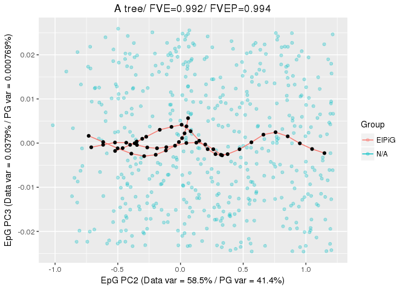

We can also visualize the results of the bootstrapped construction by
using the `BootPG` parameter:

    PlotPG(X = circle_data, TargetPG = CircleEPG.Boot[[length(CircleEPG.Boot)]],
           BootPG = CircleEPG.Boot[1:(length(CircleEPG.Boot)-1)],
           Main = "A bootstrapped circle", DimToPlot = 1:2)

    ## [[1]]

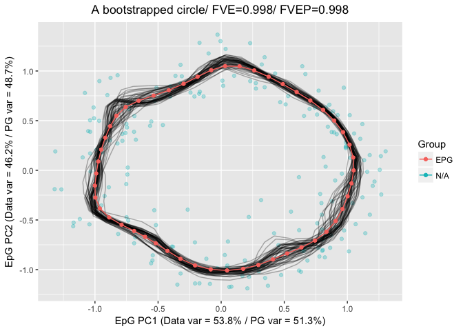

More info
=========

Additional details on the derivation of
[substructures](guides/struct.md) and on the use of
[pseudotime](guides/pseudo.md) derivation are also available
