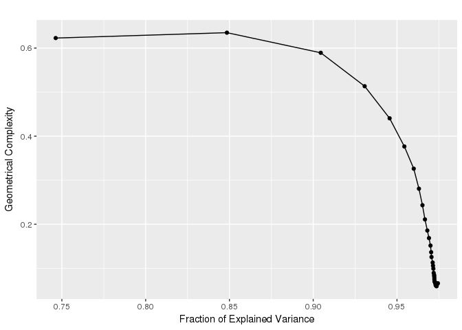

-   [Constructing a principal graph](#constructing-a-principal-graph)
-   [Examples of principal curves](#examples-of-principal-curves)
-   [Using bootstrapping](#using-bootstrapping)
-   [Plotting data with principal
    graphs](#plotting-data-with-principal-graphs)

Constructing a principal graph
==============================

The construction of a principal graph with a given topology is done via
the specification of an appropriate initial conditions and of
appropriate growth/shrink grammars. This can be done via the
`computeElasticPrincipalGraph`.

Specific wrapping functions are also provided to build commonly
encountered topologies (`computeElasticPrincipalCurve`,
\``computeElasticPrincipalTree`, `computeElasticPrincipalCircle`), with
minimal required inputs. In all of these function, it is necessary to
specify a numeric matrix with the data points (`X`) and the number of
nodes to of the principal graph (`NumNodes`). It is possible to control
the behavior of the algorithm via a set of optional parameters. For
example, it is possible to:

-   modify the parameter controlling the elastic energy (`Mu` and
    `Lambda`)
-   specify the number of processor to be used (`n.cores`)
-   indicate if diagnostic plots should be produced
    (`drawAccuracyComplexity` and `drawEnergy`)
-   indicate if the final graph should be used to plotted non the data
    (`drawPCAView`)
-   specify if PCA should be performed on the data prior to principal
    graph fitting (`Do_PCA`) and if dimensionality should be reduced
    (`ReduceDimension`)

Examples of principal curves
============================

The function `computeElasticPrincipalCurve` constructs a principal curve
on the data. For example to construct a principal curve with 50 nodes on
the example dataset `line_data`, it is sufficient to write

    library("ElPiGraph.R")

    CurveEPG <- computeElasticPrincipalCurve(X = curve_data, NumNodes = 60)

    ## [1] "Creating a chain in the 1st PC with 3 nodes"
    ## [1] "Constructing curve 1 of 1 / Subset 1 of 1"
    ## [1] "Performing PCA on the data"
    ## [1] "Using standard PCA"
    ## [1] "3 dimensions are being used"
    ## [1] "100% of the original variance has been retained"
    ## [1] "Computing EPG with 60 nodes on 500 points and 3 dimensions"
    ## [1] "Using a single core"
    ## Nodes = 3 4 5 6 7 8 9 10 11 12 13 14 15 16 17 18 19 20 21 22 23 24 25 26 27 28 29 30 31 32 33 34 35 36 37 38 39 40 41 42 43 44 45 46 47 48 49 50 51 52 53 54 55 56 57 58 59 
    ## BARCODE  ENERGY  NNODES  NEDGES  NRIBS   NSTARS  NRAYS   NRAYS2  MSE MSEP    FVE FVEP    UE  UR  URN URN2    URSD
    ## 0||60    0.07975 60  59  58  0   0   0   0.04766 0.04544 0.9841  0.9849  0.02364 0.008445    0.5067  30.4    0

    ## 9.369 sec elapsed
    ## [[1]]

A principal tree can be constructed via the
`computeElasticPrincipalTree` function. For example to construct a
principal tree with 50 nodes on the example dataset `tree_data`, it is
sufficient to write

    TreeEPG <- computeElasticPrincipalTree(X = tree_data, NumNodes = 60, Lambda = .03, Mu = .01)

    ## [1] "Creating a chain in the 1st PC with 2 nodes"
    ## [1] "Constructing tree 1 of 1 / Subset 1 of 1"
    ## [1] "Performing PCA on the data"
    ## [1] "Using standard PCA"
    ## [1] "3 dimensions are being used"
    ## [1] "100% of the original variance has been retained"
    ## [1] "Computing EPG with 60 nodes on 492 points and 3 dimensions"
    ## [1] "Using a single core"
    ## Nodes = 2 3 4 5 6 7 8 9 10 11 12 13 14 15 16 17 18 19 20 21 22 23 24 25 26 27 28 29 30 31 32 33 34 35 36 37 38 39 40 41 42 43 44 45 46 47 48 49 50 51 52 53 54 55 56 57 58 59 
    ## BARCODE  ENERGY  NNODES  NEDGES  NRIBS   NSTARS  NRAYS   NRAYS2  MSE MSEP    FVE FVEP    UE  UR  URN URN2    URSD
    ## 1|2||60  0.01848 60  59  51  2   0   0   0.00548 0.005053    0.9898  0.9906  0.01249 0.0005134   0.03081 1.848   0

    ## 31.001 sec elapsed
    ## [[1]]

Finally, a principal circle can be constructed via the
`computeElasticPrincipalCircle` function. For example to construct a
principal circle with 50 nodes on the example dataset `circe_data`, it
is sufficient to write

    CircleEPG <- computeElasticPrincipalCircle(X = circle_data, NumNodes = 40)

    ## [1] "Using a single core"
    ## [1] "Creating a circle in the plane induced buy the 1st and 2nd PCs with 3 nodes"
    ## [1] "Constructing curve 1 of 1 / Subset 1 of 1"
    ## [1] "Performing PCA on the data"
    ## [1] "Using standard PCA"
    ## [1] "3 dimensions are being used"
    ## [1] "100% of the original variance has been retained"
    ## [1] "Computing EPG with 40 nodes on 200 points and 3 dimensions"
    ## [1] "Using a single core"
    ## Nodes = 3 4 5 6 7 8 9 10 11 12 13 14 15 16 17 18 19 20 21 22 23 24 25 26 27 28 29 30 31 32 33 34 35 36 37 38 39 
    ## BARCODE  ENERGY  NNODES  NEDGES  NRIBS   NSTARS  NRAYS   NRAYS2  MSE MSEP    FVE FVEP    UE  UR  URN URN2    URSD
    ## 0||40    0.04107 40  40  40  0   0   0   0.02892 0.02738 0.9729  0.9744  0.0105  0.00165 0.066   2.64    0

    ## 1.807 sec elapsed
    ## [[1]]

All of these functions will return a list of length 1, with all the
information associated with the graph.

Using bootstrapping
===================

All of the functions provided to build principal graphs allow a
bootstrapped construction. To enable that it is sufficient to modify the
parameters `nReps` and `ProbPoint`. `nReps` indicates the number of
repetitions and `ProbPoint` indicates the probability to include a point
in each of the repetition. When `nReps` is larger than 1, a final
consensus principal graph will be constructed using the nodes of the
graph derived in each repetition.

As an example, let us perform bootstrapping on the circle data. We will
also prevent the plotting, for now.

    set.seed(42)
    CircleEPG.Boot <- computeElasticPrincipalCircle(X = circle_data, NumNodes = 40, nReps = 50, ProbPoint = .6,
                                                    drawAccuracyComplexity = FALSE, drawEnergy = FALSE, drawPCAView = FALSE)

    ## [1] "Using a single core"
    ## [1] "Creating a circle in the plane induced buy the 1st and 2nd PCs with 3 nodes"
    ## [1] "Constructing curve 1 of 50 / Subset 1 of 1"
    ## [1] "Performing PCA on the data"
    ## [1] "Using standard PCA"
    ## [1] "3 dimensions are being used"
    ## [1] "100% of the original variance has been retained"
    ## [1] "Computing EPG with 40 nodes on 108 points and 3 dimensions"
    ## [1] "Using a single core"
    ## Nodes = 3 4 5 6 7 8 9 10 11 12 13 14 15 16 17 18 19 20 21 22 23 24 25 26 27 28 29 30 31 32 33 34 35 36 37 38 39 
    ## BARCODE  ENERGY  NNODES  NEDGES  NRIBS   NSTARS  NRAYS   NRAYS2  MSE MSEP    FVE FVEP    UE  UR  URN URN2    URSD
    ## 0||40    0.03681 40  40  40  0   0   0   0.02347 0.02213 0.9784  0.9796  0.01091 0.00244 0.09759 3.904   0
    ## 1.393 sec elapsed
    ## [1] "Constructing curve 2 of 50 / Subset 1 of 1"
    ## [1] "Performing PCA on the data"
    ## [1] "Using standard PCA"
    ## [1] "3 dimensions are being used"
    ## [1] "100% of the original variance has been retained"
    ## [1] "Computing EPG with 40 nodes on 137 points and 3 dimensions"
    ## [1] "Using a single core"
    ## Nodes = 3 4 5 6 7 8 9 10 11 12 13 14 15 16 17 18 19 20 21 22 23 24 25 26 27 28 29 30 31 32 33 34 35 36 37 38 39 
    ## BARCODE  ENERGY  NNODES  NEDGES  NRIBS   NSTARS  NRAYS   NRAYS2  MSE MSEP    FVE FVEP    UE  UR  URN URN2    URSD
    ## 0||40    0.03783 40  40  40  0   0   0   0.02623 0.02488 0.975   0.9763  0.01009 0.001519    0.06075 2.43    0
    ## 1.675 sec elapsed
    ## [1] "Constructing curve 3 of 50 / Subset 1 of 1"
    ## [1] "Performing PCA on the data"
    ## [1] "Using standard PCA"
    ## [1] "3 dimensions are being used"
    ## [1] "100% of the original variance has been retained"
    ## [1] "Computing EPG with 40 nodes on 130 points and 3 dimensions"
    ## [1] "Using a single core"
    ## Nodes = 3 4 5 6 7 8 9 10 11 12 13 14 15 16 17 18 19 20 21 22 23 24 25 26 27 28 29 30 31 32 33 34 35 36 37 38 39 
    ## BARCODE  ENERGY  NNODES  NEDGES  NRIBS   NSTARS  NRAYS   NRAYS2  MSE MSEP    FVE FVEP    UE  UR  URN URN2    URSD
    ## 0||40    0.03796 40  40  40  0   0   0   0.02512 0.0235  0.9766  0.9781  0.0107  0.002141    0.08564 3.426   0
    ## 1.283 sec elapsed
    ## [1] "Graphical output will be suppressed for the remaining replicas"
    ## [1] "Constructing curve 4 of 50 / Subset 1 of 1"
    ## [1] "Performing PCA on the data"
    ## [1] "Using standard PCA"
    ## [1] "3 dimensions are being used"
    ## [1] "100% of the original variance has been retained"
    ## [1] "Computing EPG with 40 nodes on 122 points and 3 dimensions"
    ## [1] "Using a single core"
    ## Nodes = 3 4 5 6 7 8 9 10 11 12 13 14 15 16 17 18 19 20 21 22 23 24 25 26 27 28 29 30 31 32 33 34 35 36 37 38 39 
    ## BARCODE  ENERGY  NNODES  NEDGES  NRIBS   NSTARS  NRAYS   NRAYS2  MSE MSEP    FVE FVEP    UE  UR  URN URN2    URSD
    ## 0||40    0.03444 40  40  40  0   0   0   0.02167 0.02037 0.9791  0.9804  0.01067 0.002104    0.08415 3.366   0
    ## 1.306 sec elapsed
    ## [1] "Constructing curve 5 of 50 / Subset 1 of 1"
    ## [1] "Performing PCA on the data"
    ## [1] "Using standard PCA"
    ## [1] "3 dimensions are being used"
    ## [1] "100% of the original variance has been retained"
    ## [1] "Computing EPG with 40 nodes on 126 points and 3 dimensions"
    ## [1] "Using a single core"
    ## Nodes = 3 4 5 6 7 8 9 10 11 12 13 14 15 16 17 18 19 20 21 22 23 24 25 26 27 28 29 30 31 32 33 34 35 36 37 38 39 
    ## BARCODE  ENERGY  NNODES  NEDGES  NRIBS   NSTARS  NRAYS   NRAYS2  MSE MSEP    FVE FVEP    UE  UR  URN URN2    URSD
    ## 0||40    0.03827 40  40  40  0   0   0   0.02623 0.02498 0.976   0.9771  0.01062 0.001419    0.05676 2.27    0
    ## 1.333 sec elapsed
    ## [1] "Constructing curve 6 of 50 / Subset 1 of 1"
    ## [1] "Performing PCA on the data"
    ## [1] "Using standard PCA"
    ## [1] "3 dimensions are being used"
    ## [1] "100% of the original variance has been retained"
    ## [1] "Computing EPG with 40 nodes on 125 points and 3 dimensions"
    ## [1] "Using a single core"
    ## Nodes = 3 4 5 6 7 8 9 10 11 12 13 14 15 16 17 18 19 20 21 22 23 24 25 26 27 28 29 30 31 32 33 34 35 36 37 38 39 
    ## BARCODE  ENERGY  NNODES  NEDGES  NRIBS   NSTARS  NRAYS   NRAYS2  MSE MSEP    FVE FVEP    UE  UR  URN URN2    URSD
    ## 0||40    0.0383  40  40  40  0   0   0   0.02668 0.02533 0.9752  0.9764  0.01032 0.001298    0.05193 2.077   0
    ## 1.599 sec elapsed
    ## [1] "Constructing curve 7 of 50 / Subset 1 of 1"
    ## [1] "Performing PCA on the data"
    ## [1] "Using standard PCA"
    ## [1] "3 dimensions are being used"
    ## [1] "100% of the original variance has been retained"
    ## [1] "Computing EPG with 40 nodes on 122 points and 3 dimensions"
    ## [1] "Using a single core"
    ## Nodes = 3 4 5 6 7 8 9 10 11 12 13 14 15 16 17 18 19 20 21 22 23 24 25 26 27 28 29 30 31 32 33 34 35 36 37 38 39 
    ## BARCODE  ENERGY  NNODES  NEDGES  NRIBS   NSTARS  NRAYS   NRAYS2  MSE MSEP    FVE FVEP    UE  UR  URN URN2    URSD
    ## 0||40    0.04172 40  40  40  0   0   0   0.02962 0.02814 0.9714  0.9728  0.01011 0.001993    0.0797  3.188   0
    ## 1.271 sec elapsed
    ## [1] "Constructing curve 8 of 50 / Subset 1 of 1"
    ## [1] "Performing PCA on the data"
    ## [1] "Using standard PCA"
    ## [1] "3 dimensions are being used"
    ## [1] "100% of the original variance has been retained"
    ## [1] "Computing EPG with 40 nodes on 124 points and 3 dimensions"
    ## [1] "Using a single core"
    ## Nodes = 3 4 5 6 7 8 9 10 11 12 13 14 15 16 17 18 19 20 21 22 23 24 25 26 27 28 29 30 31 32 33 34 35 36 37 38 39 
    ## BARCODE  ENERGY  NNODES  NEDGES  NRIBS   NSTARS  NRAYS   NRAYS2  MSE MSEP    FVE FVEP    UE  UR  URN URN2    URSD
    ## 0||40    0.03527 40  40  40  0   0   0   0.02348 0.02223 0.9776  0.9788  0.01021 0.001579    0.06317 2.527   0
    ## 1.304 sec elapsed
    ## [1] "Constructing curve 9 of 50 / Subset 1 of 1"
    ## [1] "Performing PCA on the data"
    ## [1] "Using standard PCA"
    ## [1] "3 dimensions are being used"
    ## [1] "100% of the original variance has been retained"
    ## [1] "Computing EPG with 40 nodes on 125 points and 3 dimensions"
    ## [1] "Using a single core"
    ## Nodes = 3 4 5 6 7 8 9 10 11 12 13 14 15 16 17 18 19 20 21 22 23 24 25 26 27 28 29 30 31 32 33 34 35 36 37 38 39 
    ## BARCODE  ENERGY  NNODES  NEDGES  NRIBS   NSTARS  NRAYS   NRAYS2  MSE MSEP    FVE FVEP    UE  UR  URN URN2    URSD
    ## 0||40    0.03911 40  40  40  0   0   0   0.02477 0.02332 0.9775  0.9788  0.01142 0.002913    0.1165  4.661   0
    ## 1.343 sec elapsed
    ## [1] "Constructing curve 10 of 50 / Subset 1 of 1"
    ## [1] "Performing PCA on the data"
    ## [1] "Using standard PCA"
    ## [1] "3 dimensions are being used"
    ## [1] "100% of the original variance has been retained"
    ## [1] "Computing EPG with 40 nodes on 103 points and 3 dimensions"
    ## [1] "Using a single core"
    ## Nodes = 3 4 5 6 7 8 9 10 11 12 13 14 15 16 17 18 19 20 21 22 23 24 25 26 27 28 29 30 31 32 33 34 35 36 37 38 39 
    ## BARCODE  ENERGY  NNODES  NEDGES  NRIBS   NSTARS  NRAYS   NRAYS2  MSE MSEP    FVE FVEP    UE  UR  URN URN2    URSD
    ## 0||40    0.0391  40  40  40  0   0   0   0.02653 0.02537 0.9756  0.9767  0.01062 0.001941    0.07765 3.106   0
    ## 1.353 sec elapsed
    ## [1] "Constructing curve 11 of 50 / Subset 1 of 1"
    ## [1] "Performing PCA on the data"
    ## [1] "Using standard PCA"
    ## [1] "3 dimensions are being used"
    ## [1] "100% of the original variance has been retained"
    ## [1] "Computing EPG with 40 nodes on 116 points and 3 dimensions"
    ## [1] "Using a single core"
    ## Nodes = 3 4 5 6 7 8 9 10 11 12 13 14 15 16 17 18 19 20 21 22 23 24 25 26 27 28 29 30 31 32 33 34 35 36 37 38 39 
    ## BARCODE  ENERGY  NNODES  NEDGES  NRIBS   NSTARS  NRAYS   NRAYS2  MSE MSEP    FVE FVEP    UE  UR  URN URN2    URSD
    ## 0||40    0.0404  40  40  40  0   0   0   0.02854 0.02731 0.9729  0.9741  0.01023 0.001625    0.06502 2.601   0
    ## 1.582 sec elapsed
    ## [1] "Constructing curve 12 of 50 / Subset 1 of 1"
    ## [1] "Performing PCA on the data"
    ## [1] "Using standard PCA"
    ## [1] "3 dimensions are being used"
    ## [1] "100% of the original variance has been retained"
    ## [1] "Computing EPG with 40 nodes on 109 points and 3 dimensions"
    ## [1] "Using a single core"
    ## Nodes = 3 4 5 6 7 8 9 10 11 12 13 14 15 16 17 18 19 20 21 22 23 24 25 26 27 28 29 30 31 32 33 34 35 36 37 38 39 
    ## BARCODE  ENERGY  NNODES  NEDGES  NRIBS   NSTARS  NRAYS   NRAYS2  MSE MSEP    FVE FVEP    UE  UR  URN URN2    URSD
    ## 0||40    0.04414 40  40  40  0   0   0   0.0312  0.02985 0.971   0.9722  0.01062 0.002324    0.09295 3.718   0
    ## 1.277 sec elapsed
    ## [1] "Constructing curve 13 of 50 / Subset 1 of 1"
    ## [1] "Performing PCA on the data"
    ## [1] "Using standard PCA"
    ## [1] "3 dimensions are being used"
    ## [1] "100% of the original variance has been retained"
    ## [1] "Computing EPG with 40 nodes on 114 points and 3 dimensions"
    ## [1] "Using a single core"
    ## Nodes = 3 4 5 6 7 8 9 10 11 12 13 14 15 16 17 18 19 20 21 22 23 24 25 26 27 28 29 30 31 32 33 34 35 36 37 38 39 
    ## BARCODE  ENERGY  NNODES  NEDGES  NRIBS   NSTARS  NRAYS   NRAYS2  MSE MSEP    FVE FVEP    UE  UR  URN URN2    URSD
    ## 0||40    0.04476 40  40  40  0   0   0   0.03171 0.03021 0.9713  0.9727  0.01095 0.002093    0.08374 3.349   0
    ## 1.315 sec elapsed
    ## [1] "Constructing curve 14 of 50 / Subset 1 of 1"
    ## [1] "Performing PCA on the data"
    ## [1] "Using standard PCA"
    ## [1] "3 dimensions are being used"
    ## [1] "100% of the original variance has been retained"
    ## [1] "Computing EPG with 40 nodes on 124 points and 3 dimensions"
    ## [1] "Using a single core"
    ## Nodes = 3 4 5 6 7 8 9 10 11 12 13 14 15 16 17 18 19 20 21 22 23 24 25 26 27 28 29 30 31 32 33 34 35 36 37 38 39 
    ## BARCODE  ENERGY  NNODES  NEDGES  NRIBS   NSTARS  NRAYS   NRAYS2  MSE MSEP    FVE FVEP    UE  UR  URN URN2    URSD
    ## 0||40    0.03831 40  40  40  0   0   0   0.02639 0.02506 0.9749  0.9762  0.01036 0.001557    0.06229 2.492   0
    ## 1.338 sec elapsed
    ## [1] "Constructing curve 15 of 50 / Subset 1 of 1"
    ## [1] "Performing PCA on the data"
    ## [1] "Using standard PCA"
    ## [1] "3 dimensions are being used"
    ## [1] "100% of the original variance has been retained"
    ## [1] "Computing EPG with 40 nodes on 123 points and 3 dimensions"
    ## [1] "Using a single core"
    ## Nodes = 3 4 5 6 7 8 9 10 11 12 13 14 15 16 17 18 19 20 21 22 23 24 25 26 27 28 29 30 31 32 33 34 35 36 37 38 39 
    ## BARCODE  ENERGY  NNODES  NEDGES  NRIBS   NSTARS  NRAYS   NRAYS2  MSE MSEP    FVE FVEP    UE  UR  URN URN2    URSD
    ## 0||40    0.03557 40  40  40  0   0   0   0.02417 0.02301 0.9772  0.9783  0.0102  0.001202    0.04808 1.923   0
    ## 1.357 sec elapsed
    ## [1] "Constructing curve 16 of 50 / Subset 1 of 1"
    ## [1] "Performing PCA on the data"
    ## [1] "Using standard PCA"
    ## [1] "3 dimensions are being used"
    ## [1] "100% of the original variance has been retained"
    ## [1] "Computing EPG with 40 nodes on 117 points and 3 dimensions"
    ## [1] "Using a single core"
    ## Nodes = 3 4 5 6 7 8 9 10 11 12 13 14 15 16 17 18 19 20 21 22 23 24 25 26 27 28 29 30 31 32 33 34 35 36 37 38 39 
    ## BARCODE  ENERGY  NNODES  NEDGES  NRIBS   NSTARS  NRAYS   NRAYS2  MSE MSEP    FVE FVEP    UE  UR  URN URN2    URSD
    ## 0||40    0.04294 40  40  40  0   0   0   0.03028 0.02873 0.9721  0.9735  0.01053 0.00213 0.0852  3.408   0
    ## 1.577 sec elapsed
    ## [1] "Constructing curve 17 of 50 / Subset 1 of 1"
    ## [1] "Performing PCA on the data"
    ## [1] "Using standard PCA"
    ## [1] "3 dimensions are being used"
    ## [1] "100% of the original variance has been retained"
    ## [1] "Computing EPG with 40 nodes on 113 points and 3 dimensions"
    ## [1] "Using a single core"
    ## Nodes = 3 4 5 6 7 8 9 10 11 12 13 14 15 16 17 18 19 20 21 22 23 24 25 26 27 28 29 30 31 32 33 34 35 36 37 38 39 
    ## BARCODE  ENERGY  NNODES  NEDGES  NRIBS   NSTARS  NRAYS   NRAYS2  MSE MSEP    FVE FVEP    UE  UR  URN URN2    URSD
    ## 0||40    0.03371 40  40  40  0   0   0   0.02143 0.02015 0.9801  0.9813  0.01049 0.001794    0.07174 2.87    0
    ## 1.289 sec elapsed
    ## [1] "Constructing curve 18 of 50 / Subset 1 of 1"
    ## [1] "Performing PCA on the data"
    ## [1] "Using standard PCA"
    ## [1] "3 dimensions are being used"
    ## [1] "100% of the original variance has been retained"
    ## [1] "Computing EPG with 40 nodes on 115 points and 3 dimensions"
    ## [1] "Using a single core"
    ## Nodes = 3 4 5 6 7 8 9 10 11 12 13 14 15 16 17 18 19 20 21 22 23 24 25 26 27 28 29 30 31 32 33 34 35 36 37 38 39 
    ## BARCODE  ENERGY  NNODES  NEDGES  NRIBS   NSTARS  NRAYS   NRAYS2  MSE MSEP    FVE FVEP    UE  UR  URN URN2    URSD
    ## 0||40    0.03402 40  40  40  0   0   0   0.02173 0.02062 0.9794  0.9804  0.01038 0.001904    0.07617 3.047   0
    ## 1.324 sec elapsed
    ## [1] "Constructing curve 19 of 50 / Subset 1 of 1"
    ## [1] "Performing PCA on the data"
    ## [1] "Using standard PCA"
    ## [1] "3 dimensions are being used"
    ## [1] "100% of the original variance has been retained"
    ## [1] "Computing EPG with 40 nodes on 115 points and 3 dimensions"
    ## [1] "Using a single core"
    ## Nodes = 3 4 5 6 7 8 9 10 11 12 13 14 15 16 17 18 19 20 21 22 23 24 25 26 27 28 29 30 31 32 33 34 35 36 37 38 39 
    ## BARCODE  ENERGY  NNODES  NEDGES  NRIBS   NSTARS  NRAYS   NRAYS2  MSE MSEP    FVE FVEP    UE  UR  URN URN2    URSD
    ## 0||40    0.03697 40  40  40  0   0   0   0.02527 0.02415 0.975   0.9761  0.01007 0.001628    0.06514 2.605   0
    ## 1.344 sec elapsed
    ## [1] "Constructing curve 20 of 50 / Subset 1 of 1"
    ## [1] "Performing PCA on the data"
    ## [1] "Using standard PCA"
    ## [1] "3 dimensions are being used"
    ## [1] "100% of the original variance has been retained"
    ## [1] "Computing EPG with 40 nodes on 120 points and 3 dimensions"
    ## [1] "Using a single core"
    ## Nodes = 3 4 5 6 7 8 9 10 11 12 13 14 15 16 17 18 19 20 21 22 23 24 25 26 27 28 29 30 31 32 33 34 35 36 37 38 39 
    ## BARCODE  ENERGY  NNODES  NEDGES  NRIBS   NSTARS  NRAYS   NRAYS2  MSE MSEP    FVE FVEP    UE  UR  URN URN2    URSD
    ## 0||40    0.041   40  40  40  0   0   0   0.02834 0.02711 0.9728  0.9739  0.01027 0.002388    0.09551 3.82    0
    ## 1.368 sec elapsed
    ## [1] "Constructing curve 21 of 50 / Subset 1 of 1"
    ## [1] "Performing PCA on the data"
    ## [1] "Using standard PCA"
    ## [1] "3 dimensions are being used"
    ## [1] "100% of the original variance has been retained"
    ## [1] "Computing EPG with 40 nodes on 112 points and 3 dimensions"
    ## [1] "Using a single core"
    ## Nodes = 3 4 5 6 7 8 9 10 11 12 13 14 15 16 17 18 19 20 21 22 23 24 25 26 27 28 29 30 31 32 33 34 35 36 37 38 39 
    ## BARCODE  ENERGY  NNODES  NEDGES  NRIBS   NSTARS  NRAYS   NRAYS2  MSE MSEP    FVE FVEP    UE  UR  URN URN2    URSD
    ## 0||40    0.04118 40  40  40  0   0   0   0.02823 0.02703 0.9738  0.9749  0.01061 0.002333    0.09334 3.734   0
    ## 1.564 sec elapsed
    ## [1] "Constructing curve 22 of 50 / Subset 1 of 1"
    ## [1] "Performing PCA on the data"
    ## [1] "Using standard PCA"
    ## [1] "3 dimensions are being used"
    ## [1] "100% of the original variance has been retained"
    ## [1] "Computing EPG with 40 nodes on 122 points and 3 dimensions"
    ## [1] "Using a single core"
    ## Nodes = 3 4 5 6 7 8 9 10 11 12 13 14 15 16 17 18 19 20 21 22 23 24 25 26 27 28 29 30 31 32 33 34 35 36 37 38 39 
    ## BARCODE  ENERGY  NNODES  NEDGES  NRIBS   NSTARS  NRAYS   NRAYS2  MSE MSEP    FVE FVEP    UE  UR  URN URN2    URSD
    ## 0||40    0.03874 40  40  40  0   0   0   0.0261  0.02452 0.976   0.9775  0.01069 0.001943    0.0777  3.108   0
    ## 1.321 sec elapsed
    ## [1] "Constructing curve 23 of 50 / Subset 1 of 1"
    ## [1] "Performing PCA on the data"
    ## [1] "Using standard PCA"
    ## [1] "3 dimensions are being used"
    ## [1] "100% of the original variance has been retained"
    ## [1] "Computing EPG with 40 nodes on 115 points and 3 dimensions"
    ## [1] "Using a single core"
    ## Nodes = 3 4 5 6 7 8 9 10 11 12 13 14 15 16 17 18 19 20 21 22 23 24 25 26 27 28 29 30 31 32 33 34 35 36 37 38 39 
    ## BARCODE  ENERGY  NNODES  NEDGES  NRIBS   NSTARS  NRAYS   NRAYS2  MSE MSEP    FVE FVEP    UE  UR  URN URN2    URSD
    ## 0||40    0.03591 40  40  40  0   0   0   0.02385 0.02262 0.9777  0.9789  0.01034 0.001719    0.06878 2.751   0
    ## 1.316 sec elapsed
    ## [1] "Constructing curve 24 of 50 / Subset 1 of 1"
    ## [1] "Performing PCA on the data"
    ## [1] "Using standard PCA"
    ## [1] "3 dimensions are being used"
    ## [1] "100% of the original variance has been retained"
    ## [1] "Computing EPG with 40 nodes on 119 points and 3 dimensions"
    ## [1] "Using a single core"
    ## Nodes = 3 4 5 6 7 8 9 10 11 12 13 14 15 16 17 18 19 20 21 22 23 24 25 26 27 28 29 30 31 32 33 34 35 36 37 38 39 
    ## BARCODE  ENERGY  NNODES  NEDGES  NRIBS   NSTARS  NRAYS   NRAYS2  MSE MSEP    FVE FVEP    UE  UR  URN URN2    URSD
    ## 0||40    0.04239 40  40  40  0   0   0   0.02992 0.02864 0.9724  0.9736  0.01041 0.002058    0.08231 3.292   0
    ## 1.367 sec elapsed
    ## [1] "Constructing curve 25 of 50 / Subset 1 of 1"
    ## [1] "Performing PCA on the data"
    ## [1] "Using standard PCA"
    ## [1] "3 dimensions are being used"
    ## [1] "100% of the original variance has been retained"
    ## [1] "Computing EPG with 40 nodes on 115 points and 3 dimensions"
    ## [1] "Using a single core"
    ## Nodes = 3 4 5 6 7 8 9 10 11 12 13 14 15 16 17 18 19 20 21 22 23 24 25 26 27 28 29 30 31 32 33 34 35 36 37 38 39 
    ## BARCODE  ENERGY  NNODES  NEDGES  NRIBS   NSTARS  NRAYS   NRAYS2  MSE MSEP    FVE FVEP    UE  UR  URN URN2    URSD
    ## 0||40    0.04232 40  40  40  0   0   0   0.02937 0.02772 0.9737  0.9751  0.01087 0.002086    0.08345 3.338   0
    ## 1.376 sec elapsed
    ## [1] "Constructing curve 26 of 50 / Subset 1 of 1"
    ## [1] "Performing PCA on the data"
    ## [1] "Using standard PCA"
    ## [1] "3 dimensions are being used"
    ## [1] "100% of the original variance has been retained"
    ## [1] "Computing EPG with 40 nodes on 113 points and 3 dimensions"
    ## [1] "Using a single core"
    ## Nodes = 3 4 5 6 7 8 9 10 11 12 13 14 15 16 17 18 19 20 21 22 23 24 25 26 27 28 29 30 31 32 33 34 35 36 37 38 39 
    ## BARCODE  ENERGY  NNODES  NEDGES  NRIBS   NSTARS  NRAYS   NRAYS2  MSE MSEP    FVE FVEP    UE  UR  URN URN2    URSD
    ## 0||40    0.04073 40  40  40  0   0   0   0.02844 0.02722 0.9727  0.9739  0.0102  0.002084    0.08337 3.335   0
    ## 1.531 sec elapsed
    ## [1] "Constructing curve 27 of 50 / Subset 1 of 1"
    ## [1] "Performing PCA on the data"
    ## [1] "Using standard PCA"
    ## [1] "3 dimensions are being used"
    ## [1] "100% of the original variance has been retained"
    ## [1] "Computing EPG with 40 nodes on 116 points and 3 dimensions"
    ## [1] "Using a single core"
    ## Nodes = 3 4 5 6 7 8 9 10 11 12 13 14 15 16 17 18 19 20 21 22 23 24 25 26 27 28 29 30 31 32 33 34 35 36 37 38 39 
    ## BARCODE  ENERGY  NNODES  NEDGES  NRIBS   NSTARS  NRAYS   NRAYS2  MSE MSEP    FVE FVEP    UE  UR  URN URN2    URSD
    ## 0||40    0.0394  40  40  40  0   0   0   0.02529 0.02384 0.9768  0.9781  0.01141 0.002694    0.1078  4.31    0
    ## 1.304 sec elapsed
    ## [1] "Constructing curve 28 of 50 / Subset 1 of 1"
    ## [1] "Performing PCA on the data"
    ## [1] "Using standard PCA"
    ## [1] "3 dimensions are being used"
    ## [1] "100% of the original variance has been retained"
    ## [1] "Computing EPG with 40 nodes on 118 points and 3 dimensions"
    ## [1] "Using a single core"
    ## Nodes = 3 4 5 6 7 8 9 10 11 12 13 14 15 16 17 18 19 20 21 22 23 24 25 26 27 28 29 30 31 32 33 34 35 36 37 38 39 
    ## BARCODE  ENERGY  NNODES  NEDGES  NRIBS   NSTARS  NRAYS   NRAYS2  MSE MSEP    FVE FVEP    UE  UR  URN URN2    URSD
    ## 0||40    0.04148 40  40  40  0   0   0   0.02713 0.02596 0.9748  0.9759  0.01099 0.003361    0.1344  5.378   0
    ## 1.347 sec elapsed
    ## [1] "Constructing curve 29 of 50 / Subset 1 of 1"
    ## [1] "Performing PCA on the data"
    ## [1] "Using standard PCA"
    ## [1] "3 dimensions are being used"
    ## [1] "100% of the original variance has been retained"
    ## [1] "Computing EPG with 40 nodes on 122 points and 3 dimensions"
    ## [1] "Using a single core"
    ## Nodes = 3 4 5 6 7 8 9 10 11 12 13 14 15 16 17 18 19 20 21 22 23 24 25 26 27 28 29 30 31 32 33 34 35 36 37 38 39 
    ## BARCODE  ENERGY  NNODES  NEDGES  NRIBS   NSTARS  NRAYS   NRAYS2  MSE MSEP    FVE FVEP    UE  UR  URN URN2    URSD
    ## 0||40    0.04078 40  40  40  0   0   0   0.02767 0.02631 0.9749  0.9762  0.01094 0.00217 0.0868  3.472   0
    ## 1.364 sec elapsed
    ## [1] "Constructing curve 30 of 50 / Subset 1 of 1"
    ## [1] "Performing PCA on the data"
    ## [1] "Using standard PCA"
    ## [1] "3 dimensions are being used"
    ## [1] "100% of the original variance has been retained"
    ## [1] "Computing EPG with 40 nodes on 135 points and 3 dimensions"
    ## [1] "Using a single core"
    ## Nodes = 3 4 5 6 7 8 9 10 11 12 13 14 15 16 17 18 19 20 21 22 23 24 25 26 27 28 29 30 31 32 33 34 35 36 37 38 39 
    ## BARCODE  ENERGY  NNODES  NEDGES  NRIBS   NSTARS  NRAYS   NRAYS2  MSE MSEP    FVE FVEP    UE  UR  URN URN2    URSD
    ## 0||40    0.04046 40  40  40  0   0   0   0.02848 0.02692 0.9732  0.9747  0.01024 0.001734    0.06934 2.774   0
    ## 1.634 sec elapsed
    ## [1] "Constructing curve 31 of 50 / Subset 1 of 1"
    ## [1] "Performing PCA on the data"
    ## [1] "Using standard PCA"
    ## [1] "3 dimensions are being used"
    ## [1] "100% of the original variance has been retained"
    ## [1] "Computing EPG with 40 nodes on 127 points and 3 dimensions"
    ## [1] "Using a single core"
    ## Nodes = 3 4 5 6 7 8 9 10 11 12 13 14 15 16 17 18 19 20 21 22 23 24 25 26 27 28 29 30 31 32 33 34 35 36 37 38 39 
    ## BARCODE  ENERGY  NNODES  NEDGES  NRIBS   NSTARS  NRAYS   NRAYS2  MSE MSEP    FVE FVEP    UE  UR  URN URN2    URSD
    ## 0||40    0.04098 40  40  40  0   0   0   0.02817 0.02684 0.9745  0.9757  0.0109  0.001919    0.07676 3.07    0
    ## 1.293 sec elapsed
    ## [1] "Constructing curve 32 of 50 / Subset 1 of 1"
    ## [1] "Performing PCA on the data"
    ## [1] "Using standard PCA"
    ## [1] "3 dimensions are being used"
    ## [1] "100% of the original variance has been retained"
    ## [1] "Computing EPG with 40 nodes on 122 points and 3 dimensions"
    ## [1] "Using a single core"
    ## Nodes = 3 4 5 6 7 8 9 10 11 12 13 14 15 16 17 18 19 20 21 22 23 24 25 26 27 28 29 30 31 32 33 34 35 36 37 38 39 
    ## BARCODE  ENERGY  NNODES  NEDGES  NRIBS   NSTARS  NRAYS   NRAYS2  MSE MSEP    FVE FVEP    UE  UR  URN URN2    URSD
    ## 0||40    0.03917 40  40  40  0   0   0   0.02744 0.02613 0.9734  0.9747  0.0101  0.001632    0.06527 2.611   0
    ## 1.319 sec elapsed
    ## [1] "Constructing curve 33 of 50 / Subset 1 of 1"
    ## [1] "Performing PCA on the data"
    ## [1] "Using standard PCA"
    ## [1] "3 dimensions are being used"
    ## [1] "100% of the original variance has been retained"
    ## [1] "Computing EPG with 40 nodes on 124 points and 3 dimensions"
    ## [1] "Using a single core"
    ## Nodes = 3 4 5 6 7 8 9 10 11 12 13 14 15 16 17 18 19 20 21 22 23 24 25 26 27 28 29 30 31 32 33 34 35 36 37 38 39 
    ## BARCODE  ENERGY  NNODES  NEDGES  NRIBS   NSTARS  NRAYS   NRAYS2  MSE MSEP    FVE FVEP    UE  UR  URN URN2    URSD
    ## 0||40    0.03909 40  40  40  0   0   0   0.02651 0.02521 0.9748  0.9761  0.01046 0.002118    0.08473 3.389   0
    ## 1.35 sec elapsed
    ## [1] "Constructing curve 34 of 50 / Subset 1 of 1"
    ## [1] "Performing PCA on the data"
    ## [1] "Using standard PCA"
    ## [1] "3 dimensions are being used"
    ## [1] "100% of the original variance has been retained"
    ## [1] "Computing EPG with 40 nodes on 120 points and 3 dimensions"
    ## [1] "Using a single core"
    ## Nodes = 3 4 5 6 7 8 9 10 11 12 13 14 15 16 17 18 19 20 21 22 23 24 25 26 27 28 29 30 31 32 33 34 35 36 37 38 39 
    ## BARCODE  ENERGY  NNODES  NEDGES  NRIBS   NSTARS  NRAYS   NRAYS2  MSE MSEP    FVE FVEP    UE  UR  URN URN2    URSD
    ## 0||40    0.03803 40  40  40  0   0   0   0.02536 0.02401 0.9766  0.9778  0.01062 0.002048    0.08194 3.277   0
    ## 1.371 sec elapsed
    ## [1] "Constructing curve 35 of 50 / Subset 1 of 1"
    ## [1] "Performing PCA on the data"
    ## [1] "Using standard PCA"
    ## [1] "3 dimensions are being used"
    ## [1] "100% of the original variance has been retained"
    ## [1] "Computing EPG with 40 nodes on 112 points and 3 dimensions"
    ## [1] "Using a single core"
    ## Nodes = 3 4 5 6 7 8 9 10 11 12 13 14 15 16 17 18 19 20 21 22 23 24 25 26 27 28 29 30 31 32 33 34 35 36 37 38 39 
    ## BARCODE  ENERGY  NNODES  NEDGES  NRIBS   NSTARS  NRAYS   NRAYS2  MSE MSEP    FVE FVEP    UE  UR  URN URN2    URSD
    ## 0||40    0.03585 40  40  40  0   0   0   0.02297 0.02158 0.9789  0.9802  0.01085 0.002041    0.08166 3.266   0
    ## 1.589 sec elapsed
    ## [1] "Constructing curve 36 of 50 / Subset 1 of 1"
    ## [1] "Performing PCA on the data"
    ## [1] "Using standard PCA"
    ## [1] "3 dimensions are being used"
    ## [1] "100% of the original variance has been retained"
    ## [1] "Computing EPG with 40 nodes on 118 points and 3 dimensions"
    ## [1] "Using a single core"
    ## Nodes = 3 4 5 6 7 8 9 10 11 12 13 14 15 16 17 18 19 20 21 22 23 24 25 26 27 28 29 30 31 32 33 34 35 36 37 38 39 
    ## BARCODE  ENERGY  NNODES  NEDGES  NRIBS   NSTARS  NRAYS   NRAYS2  MSE MSEP    FVE FVEP    UE  UR  URN URN2    URSD
    ## 0||40    0.04089 40  40  40  0   0   0   0.02808 0.02665 0.9741  0.9754  0.0108  0.002001    0.08004 3.202   0
    ## 1.3 sec elapsed
    ## [1] "Constructing curve 37 of 50 / Subset 1 of 1"
    ## [1] "Performing PCA on the data"
    ## [1] "Using standard PCA"
    ## [1] "3 dimensions are being used"
    ## [1] "100% of the original variance has been retained"
    ## [1] "Computing EPG with 40 nodes on 123 points and 3 dimensions"
    ## [1] "Using a single core"
    ## Nodes = 3 4 5 6 7 8 9 10 11 12 13 14 15 16 17 18 19 20 21 22 23 24 25 26 27 28 29 30 31 32 33 34 35 36 37 38 39 
    ## BARCODE  ENERGY  NNODES  NEDGES  NRIBS   NSTARS  NRAYS   NRAYS2  MSE MSEP    FVE FVEP    UE  UR  URN URN2    URSD
    ## 0||40    0.04209 40  40  40  0   0   0   0.02984 0.02866 0.9716  0.9727  0.01039 0.001858    0.07434 2.974   0
    ## 1.333 sec elapsed
    ## [1] "Constructing curve 38 of 50 / Subset 1 of 1"
    ## [1] "Performing PCA on the data"
    ## [1] "Using standard PCA"
    ## [1] "3 dimensions are being used"
    ## [1] "100% of the original variance has been retained"
    ## [1] "Computing EPG with 40 nodes on 124 points and 3 dimensions"
    ## [1] "Using a single core"
    ## Nodes = 3 4 5 6 7 8 9 10 11 12 13 14 15 16 17 18 19 20 21 22 23 24 25 26 27 28 29 30 31 32 33 34 35 36 37 38 39 
    ## BARCODE  ENERGY  NNODES  NEDGES  NRIBS   NSTARS  NRAYS   NRAYS2  MSE MSEP    FVE FVEP    UE  UR  URN URN2    URSD
    ## 0||40    0.04054 40  40  40  0   0   0   0.02796 0.02668 0.9734  0.9746  0.01028 0.002297    0.0919  3.676   0
    ## 1.348 sec elapsed
    ## [1] "Constructing curve 39 of 50 / Subset 1 of 1"
    ## [1] "Performing PCA on the data"
    ## [1] "Using standard PCA"
    ## [1] "3 dimensions are being used"
    ## [1] "100% of the original variance has been retained"
    ## [1] "Computing EPG with 40 nodes on 127 points and 3 dimensions"
    ## [1] "Using a single core"
    ## Nodes = 3 4 5 6 7 8 9 10 11 12 13 14 15 16 17 18 19 20 21 22 23 24 25 26 27 28 29 30 31 32 33 34 35 36 37 38 39 
    ## BARCODE  ENERGY  NNODES  NEDGES  NRIBS   NSTARS  NRAYS   NRAYS2  MSE MSEP    FVE FVEP    UE  UR  URN URN2    URSD
    ## 0||40    0.04192 40  40  40  0   0   0   0.02814 0.02699 0.974   0.9751  0.011   0.002781    0.1112  4.45    0
    ## 1.387 sec elapsed
    ## [1] "Constructing curve 40 of 50 / Subset 1 of 1"
    ## [1] "Performing PCA on the data"
    ## [1] "Using standard PCA"
    ## [1] "3 dimensions are being used"
    ## [1] "100% of the original variance has been retained"
    ## [1] "Computing EPG with 40 nodes on 122 points and 3 dimensions"
    ## [1] "Using a single core"
    ## Nodes = 3 4 5 6 7 8 9 10 11 12 13 14 15 16 17 18 19 20 21 22 23 24 25 26 27 28 29 30 31 32 33 34 35 36 37 38 39 
    ## BARCODE  ENERGY  NNODES  NEDGES  NRIBS   NSTARS  NRAYS   NRAYS2  MSE MSEP    FVE FVEP    UE  UR  URN URN2    URSD
    ## 0||40    0.04539 40  40  40  0   0   0   0.03227 0.03092 0.9705  0.9717  0.01064 0.002481    0.09922 3.969   0
    ## 1.573 sec elapsed
    ## [1] "Constructing curve 41 of 50 / Subset 1 of 1"
    ## [1] "Performing PCA on the data"
    ## [1] "Using standard PCA"
    ## [1] "3 dimensions are being used"
    ## [1] "100% of the original variance has been retained"
    ## [1] "Computing EPG with 40 nodes on 121 points and 3 dimensions"
    ## [1] "Using a single core"
    ## Nodes = 3 4 5 6 7 8 9 10 11 12 13 14 15 16 17 18 19 20 21 22 23 24 25 26 27 28 29 30 31 32 33 34 35 36 37 38 39 
    ## BARCODE  ENERGY  NNODES  NEDGES  NRIBS   NSTARS  NRAYS   NRAYS2  MSE MSEP    FVE FVEP    UE  UR  URN URN2    URSD
    ## 0||40    0.03942 40  40  40  0   0   0   0.02747 0.02613 0.9749  0.9761  0.01052 0.001424    0.05694 2.278   0
    ## 1.305 sec elapsed
    ## [1] "Constructing curve 42 of 50 / Subset 1 of 1"
    ## [1] "Performing PCA on the data"
    ## [1] "Using standard PCA"
    ## [1] "3 dimensions are being used"
    ## [1] "100% of the original variance has been retained"
    ## [1] "Computing EPG with 40 nodes on 121 points and 3 dimensions"
    ## [1] "Using a single core"
    ## Nodes = 3 4 5 6 7 8 9 10 11 12 13 14 15 16 17 18 19 20 21 22 23 24 25 26 27 28 29 30 31 32 33 34 35 36 37 38 39 
    ## BARCODE  ENERGY  NNODES  NEDGES  NRIBS   NSTARS  NRAYS   NRAYS2  MSE MSEP    FVE FVEP    UE  UR  URN URN2    URSD
    ## 0||40    0.04049 40  40  40  0   0   0   0.0277  0.02636 0.974   0.9753  0.01045 0.002337    0.09349 3.74    0
    ## 1.334 sec elapsed
    ## [1] "Constructing curve 43 of 50 / Subset 1 of 1"
    ## [1] "Performing PCA on the data"
    ## [1] "Using standard PCA"
    ## [1] "3 dimensions are being used"
    ## [1] "100% of the original variance has been retained"
    ## [1] "Computing EPG with 40 nodes on 116 points and 3 dimensions"
    ## [1] "Using a single core"
    ## Nodes = 3 4 5 6 7 8 9 10 11 12 13 14 15 16 17 18 19 20 21 22 23 24 25 26 27 28 29 30 31 32 33 34 35 36 37 38 39 
    ## BARCODE  ENERGY  NNODES  NEDGES  NRIBS   NSTARS  NRAYS   NRAYS2  MSE MSEP    FVE FVEP    UE  UR  URN URN2    URSD
    ## 0||40    0.04184 40  40  40  0   0   0   0.02876 0.02747 0.9728  0.974   0.01057 0.00251 0.1004  4.017   0
    ## 1.363 sec elapsed
    ## [1] "Constructing curve 44 of 50 / Subset 1 of 1"
    ## [1] "Performing PCA on the data"
    ## [1] "Using standard PCA"
    ## [1] "3 dimensions are being used"
    ## [1] "100% of the original variance has been retained"
    ## [1] "Computing EPG with 40 nodes on 122 points and 3 dimensions"
    ## [1] "Using a single core"
    ## Nodes = 3 4 5 6 7 8 9 10 11 12 13 14 15 16 17 18 19 20 21 22 23 24 25 26 27 28 29 30 31 32 33 34 35 36 37 38 39 
    ## BARCODE  ENERGY  NNODES  NEDGES  NRIBS   NSTARS  NRAYS   NRAYS2  MSE MSEP    FVE FVEP    UE  UR  URN URN2    URSD
    ## 0||40    0.0398  40  40  40  0   0   0   0.02691 0.02565 0.9755  0.9767  0.01078 0.002101    0.08402 3.361   0
    ## 1.633 sec elapsed
    ## [1] "Constructing curve 45 of 50 / Subset 1 of 1"
    ## [1] "Performing PCA on the data"
    ## [1] "Using standard PCA"
    ## [1] "3 dimensions are being used"
    ## [1] "100% of the original variance has been retained"
    ## [1] "Computing EPG with 40 nodes on 122 points and 3 dimensions"
    ## [1] "Using a single core"
    ## Nodes = 3 4 5 6 7 8 9 10 11 12 13 14 15 16 17 18 19 20 21 22 23 24 25 26 27 28 29 30 31 32 33 34 35 36 37 38 39 
    ## BARCODE  ENERGY  NNODES  NEDGES  NRIBS   NSTARS  NRAYS   NRAYS2  MSE MSEP    FVE FVEP    UE  UR  URN URN2    URSD
    ## 0||40    0.04042 40  40  40  0   0   0   0.02774 0.02642 0.9745  0.9757  0.0107  0.001977    0.07909 3.164   0
    ## 1.29 sec elapsed
    ## [1] "Constructing curve 46 of 50 / Subset 1 of 1"
    ## [1] "Performing PCA on the data"
    ## [1] "Using standard PCA"
    ## [1] "3 dimensions are being used"
    ## [1] "100% of the original variance has been retained"
    ## [1] "Computing EPG with 40 nodes on 119 points and 3 dimensions"
    ## [1] "Using a single core"
    ## Nodes = 3 4 5 6 7 8 9 10 11 12 13 14 15 16 17 18 19 20 21 22 23 24 25 26 27 28 29 30 31 32 33 34 35 36 37 38 39 
    ## BARCODE  ENERGY  NNODES  NEDGES  NRIBS   NSTARS  NRAYS   NRAYS2  MSE MSEP    FVE FVEP    UE  UR  URN URN2    URSD
    ## 0||40    0.03712 40  40  40  0   0   0   0.02346 0.02199 0.9781  0.9795  0.01092 0.002744    0.1098  4.391   0
    ## 1.327 sec elapsed
    ## [1] "Constructing curve 47 of 50 / Subset 1 of 1"
    ## [1] "Performing PCA on the data"
    ## [1] "Using standard PCA"
    ## [1] "3 dimensions are being used"
    ## [1] "100% of the original variance has been retained"
    ## [1] "Computing EPG with 40 nodes on 113 points and 3 dimensions"
    ## [1] "Using a single core"
    ## Nodes = 3 4 5 6 7 8 9 10 11 12 13 14 15 16 17 18 19 20 21 22 23 24 25 26 27 28 29 30 31 32 33 34 35 36 37 38 39 
    ## BARCODE  ENERGY  NNODES  NEDGES  NRIBS   NSTARS  NRAYS   NRAYS2  MSE MSEP    FVE FVEP    UE  UR  URN URN2    URSD
    ## 0||40    0.03553 40  40  40  0   0   0   0.02395 0.02259 0.9774  0.9787  0.01032 0.001261    0.05043 2.017   0
    ## 1.363 sec elapsed
    ## [1] "Constructing curve 48 of 50 / Subset 1 of 1"
    ## [1] "Performing PCA on the data"
    ## [1] "Using standard PCA"
    ## [1] "3 dimensions are being used"
    ## [1] "100% of the original variance has been retained"
    ## [1] "Computing EPG with 40 nodes on 117 points and 3 dimensions"
    ## [1] "Using a single core"
    ## Nodes = 3 4 5 6 7 8 9 10 11 12 13 14 15 16 17 18 19 20 21 22 23 24 25 26 27 28 29 30 31 32 33 34 35 36 37 38 39 
    ## BARCODE  ENERGY  NNODES  NEDGES  NRIBS   NSTARS  NRAYS   NRAYS2  MSE MSEP    FVE FVEP    UE  UR  URN URN2    URSD
    ## 0||40    0.03905 40  40  40  0   0   0   0.02643 0.02517 0.9754  0.9765  0.01047 0.002156    0.08625 3.45    0
    ## 1.378 sec elapsed
    ## [1] "Constructing curve 49 of 50 / Subset 1 of 1"
    ## [1] "Performing PCA on the data"
    ## [1] "Using standard PCA"
    ## [1] "3 dimensions are being used"
    ## [1] "100% of the original variance has been retained"
    ## [1] "Computing EPG with 40 nodes on 124 points and 3 dimensions"
    ## [1] "Using a single core"
    ## Nodes = 3 4 5 6 7 8 9 10 11 12 13 14 15 16 17 18 19 20 21 22 23 24 25 26 27 28 29 30 31 32 33 34 35 36 37 38 39 
    ## BARCODE  ENERGY  NNODES  NEDGES  NRIBS   NSTARS  NRAYS   NRAYS2  MSE MSEP    FVE FVEP    UE  UR  URN URN2    URSD
    ## 0||40    0.03775 40  40  40  0   0   0   0.02614 0.02482 0.9749  0.9762  0.009958    0.001651    0.06604 2.642   0
    ## 1.594 sec elapsed
    ## [1] "Constructing curve 50 of 50 / Subset 1 of 1"
    ## [1] "Performing PCA on the data"
    ## [1] "Using standard PCA"
    ## [1] "3 dimensions are being used"
    ## [1] "100% of the original variance has been retained"
    ## [1] "Computing EPG with 40 nodes on 108 points and 3 dimensions"
    ## [1] "Using a single core"
    ## Nodes = 3 4 5 6 7 8 9 10 11 12 13 14 15 16 17 18 19 20 21 22 23 24 25 26 27 28 29 30 31 32 33 34 35 36 37 38 39 
    ## BARCODE  ENERGY  NNODES  NEDGES  NRIBS   NSTARS  NRAYS   NRAYS2  MSE MSEP    FVE FVEP    UE  UR  URN URN2    URSD
    ## 0||40    0.03721 40  40  40  0   0   0   0.02558 0.02431 0.9762  0.9774  0.01022 0.001418    0.05673 2.269   0
    ## 1.302 sec elapsed
    ## [1] "Constructing average tree"
    ## [1] "Performing PCA on the data"
    ## [1] "Using standard PCA"
    ## [1] "3 dimensions are being used"
    ## [1] "100% of the original variance has been retained"
    ## [1] "Computing EPG with 40 nodes on 2000 points and 3 dimensions"
    ## [1] "Using a single core"
    ## Nodes = 3 4 5 6 7 8 9 10 11 12 13 14 15 16 17 18 19 20 21 22 23 24 25 26 27 28 29 30 31 32 33 34 35 36 37 38 39 
    ## BARCODE  ENERGY  NNODES  NEDGES  NRIBS   NSTARS  NRAYS   NRAYS2  MSE MSEP    FVE FVEP    UE  UR  URN URN2    URSD
    ## 0||40    0.01414 40  40  40  0   0   0   0.003575    0.002329    0.9965  0.9977  0.009816    0.000747    0.02988 1.195   0
    ## 2.349 sec elapsed

`CircleEPG.Boot` will be a list with 51 elements: the 50 bootstrapped
circles and the final consensus one.

Plotting data with principal graphs
===================================

The `ElPiGraph.R` provides different functions to explore show how the
principal graph approximate the data. The main function is `plotPG`.
This function can be used to show how the principal graph fit the data
in different ways.

To plot the principal tree previously constructed we can type

    PlotPG(X = tree_data, TargetPG = TreeEPG[[1]], Main = "A tree")

    ## [[1]]

The main plot reports different features including the percentage of
variance explained relative to the nodes of the principal graph (PG
var), the percentage of variance explained relative to the data points
(Data var), the fraction of variance of the data explained by the nodes
of the principal graph (FVE) and the fraction of variance of the data
explained by the projection of the points on the the principal graph
(FVEP). In this example the nodes of the principal graph have been used
to compute PCA and rotate the space (the Do\_PCA parameter is TRUE be
default), this can be seen by the "EpG PC" label of the axes.

To include additional dimension in the plot it is sufficient to specify
them with the DimToPlot parameter, e.g.,

    PlotPG(X = tree_data, TargetPG = TreeEPG[[1]], Main = "A tree", DimToPlot = 1:3)

    ## [[1]]

    ## 
    ## [[2]]

    ## 
    ## [[3]]

We can also visualize the results of the bootstrapped construction by
using the `BootPG` parameter:

    PlotPG(X = circle_data, TargetPG = CircleEPG.Boot[[length(CircleEPG.Boot)]],
           BootPG = CircleEPG.Boot[1:(length(CircleEPG.Boot)-1)],
           Main = "A bootstrapped circle", DimToPlot = 1:2)

    ## [[1]]

