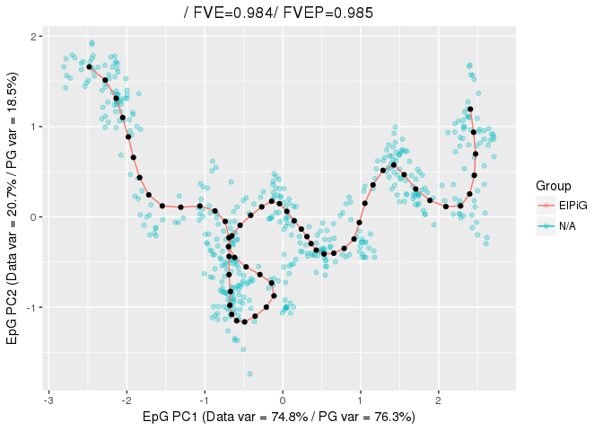
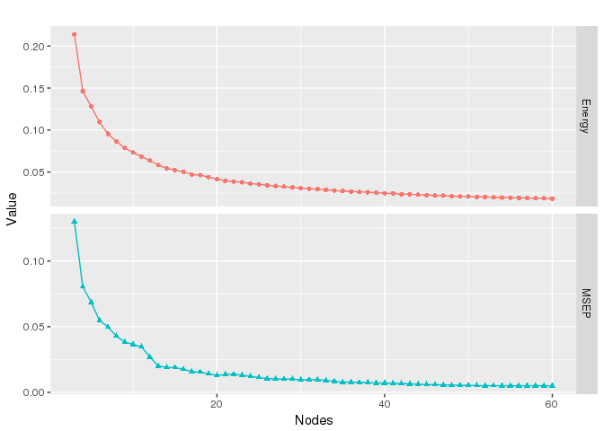
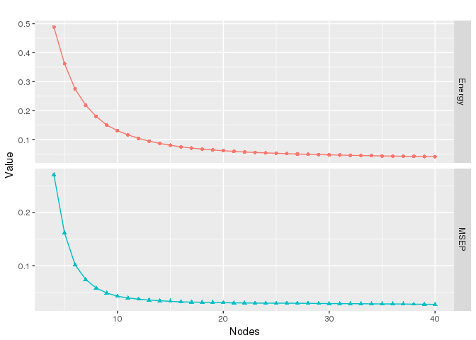
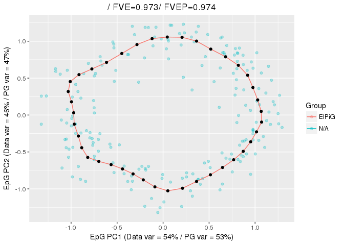
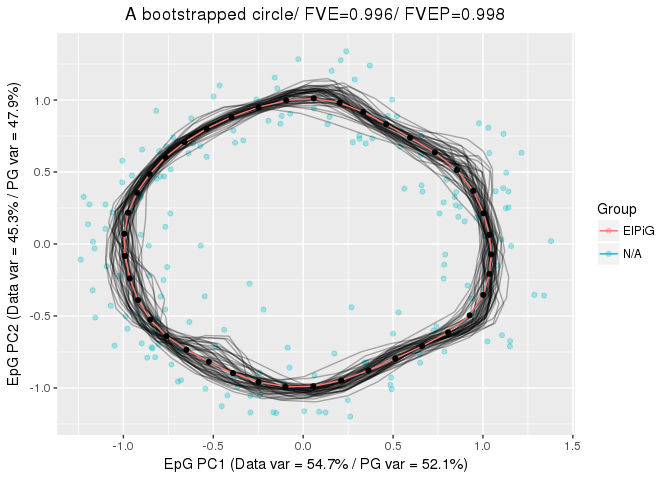

-   [Constructing a principal graph](#constructing-a-principal-graph)
-   [Examples of principal curves](#examples-of-principal-curves)
-   [Using bootstrapping](#using-bootstrapping)
-   [Plotting data with principal
    graphs](#plotting-data-with-principal-graphs)

Constructing a principal graph
==============================

The construction of a principal graph with a given topology is done via
the specification of an appropriate initial conditions and of
appropriate growth/shrink grammars. This can be done via the
`computeElasticPrincipalGraph`.

Specific wrapping functions are also provided to build commonly
encountered topologies (`computeElasticPrincipalCurve`,
\``computeElasticPrincipalTree`, `computeElasticPrincipalCircle`), with
minimal required inputs. In all of these function, it is necessary to
specify a numeric matrix with the data points (`X`) and the number of
nodes to of the principal graph (`NumNodes`). It is possible to control
the behavior of the algorithm via a set of optional parameters. For
example, it is possible to:

-   modify the parameter controlling the elastic energy (`Mu` and
    `Lambda`)
-   specify the number of processor to be used (`n.cores`)
-   indicate if diagnostic plots should be produced
    (`drawAccuracyComplexity` and `drawEnergy`)
-   indicate if the final graph should be used to plotted non the data
    (`drawPCAView`)
-   specify if PCA should be performed on the data prior to principal
    graph fitting (`Do_PCA`) and if dimensionality should be reduced
    (`ReduceDimension`)

Examples of principal curves
============================

The function `computeElasticPrincipalCurve` constructs a principal curve
on the data. For example to construct a principal curve with 50 nodes on
the example dataset `line_data`, it is sufficient to write

    library("ElPiGraph.R")

    CurveEPG <- computeElasticPrincipalCurve(X = curve_data, NumNodes = 50)

    ## [1] "Creating a chain in the 1st PC with 3 nodes"
    ## [1] "Constructing curve 1 of 1 / Subset 1 of 1"
    ## [1] "Performing PCA on the data"
    ## [1] "Using standard PCA"
    ## [1] "3 dimensions are being used"
    ## [1] "100% of the original variance has been retained"
    ## [1] "Computing EPG with 50 nodes on 500 points and 3 dimensions"
    ## [1] "Using a single core"
    ## Nodes = 3 4 5 6 7 8 9 10 11 12 13 14 15 16 17 18 19 20 21 22 23 24 25 26 27 28 29 30 31 32 33 34 35 36 37 38 39 40 41 42 43 44 45 46 47 48 49 
    ## BARCODE  ENERGY  NNODES  NEDGES  NRIBS   NSTARS  NRAYS   NRAYS2  MSE MSEP    FVE FVEP    UE  UR  URN URN2    URSD
    ## 0||50    0.1163  50  49  48  0   0   0   0.05429 0.05149 0.9819  0.9828  0.05109 0.01088 0.5438  27.19   0

    ## 3.839 sec elapsed
    ## [[1]]

A principal tree can be constructed via the
`computeElasticPrincipalTree` function. For example to construct a
principal tree with 50 nodes on the example dataset `tree_data`, it is
sufficient to write

    TreeEPG <- computeElasticPrincipalTree(X = tree_data, NumNodes = 50)

    ## [1] "Creating a chain in the 1st PC with 2 nodes"
    ## [1] "Constructing tree 1 of 1 / Subset 1 of 1"
    ## [1] "Performing PCA on the data"
    ## [1] "Using standard PCA"
    ## [1] "3 dimensions are being used"
    ## [1] "100% of the original variance has been retained"
    ## [1] "Computing EPG with 50 nodes on 492 points and 3 dimensions"
    ## [1] "Using a single core"
    ## Nodes = 2 3 4 5 6 7 8 9 10 11 12 13 14 15 16 17 18 19 20 21 22 23 24 25 26 27 28 29 30 31 32 33 34 35 36 37 38 39 40 41 42 43 44 45 46 47 48 49 
    ## BARCODE  ENERGY  NNODES  NEDGES  NRIBS   NSTARS  NRAYS   NRAYS2  MSE MSEP    FVE FVEP    UE  UR  URN URN2    URSD
    ## 1|2||50  0.01581 50  49  41  2   0   0   0.004475    0.003797    0.9917  0.993   0.01093 0.0004121   0.02061 1.03    0

    ## 12.877 sec elapsed
    ## [[1]]

Finally, a principal circle can be constructed via the
`computeElasticPrincipalCircle` function. For example to construct a
principal circle with 50 nodes on the example dataset `circe_data`, it
is sufficient to write

    CircleEPG <- computeElasticPrincipalCircle(X = circle_data, NumNodes = 50)

    ## [1] "Using a single core"
    ## [1] "Creating a circle in the plane induced buy the 1st and 2nd PCs with 3 nodes"
    ## [1] "Constructing curve 1 of 1 / Subset 1 of 1"
    ## [1] "Performing PCA on the data"
    ## [1] "Using standard PCA"
    ## [1] "3 dimensions are being used"
    ## [1] "100% of the original variance has been retained"
    ## [1] "Computing EPG with 50 nodes on 200 points and 3 dimensions"
    ## [1] "Using a single core"
    ## Nodes = 3 4 5 6 7 8 9 10 11 12 13 14 15 16 17 18 19 20 21 22 23 24 25 26 27 28 29 30 31 32 33 34 35 36 37 38 39 40 41 42 43 44 45 46 47 48 49 
    ## BARCODE  ENERGY  NNODES  NEDGES  NRIBS   NSTARS  NRAYS   NRAYS2  MSE MSEP    FVE FVEP    UE  UR  URN URN2    URSD
    ## 0||50    0.0456  50  50  50  0   0   0   0.02624 0.02528 0.9754  0.9763  0.01754 0.001818    0.09089 4.545   0

    ## 2.417 sec elapsed
    ## [[1]]

All of these functions will return a list of length 1, with all the
information associated with the graph.

Using bootstrapping
===================

All of the functions provided to build principal graphs allow a
bootstrapped construction. To enable that it is sufficient to modify the
parameters `nReps` and `ProbPoint`. `nReps` indicates the number of
repetitions and `ProbPoint` indicates the probability to include a point
in each of the repetition. When `nReps` is larger than 1, a final
consensus principal graph will be constructed using the nodes of the
graph derived in each repetition.

As an example, let us perform bootstrapping on the circle data. We will
also prevent the plotting, for now.

    CircleEPG.Boot <- computeElasticPrincipalCircle(X = circle_data, NumNodes = 50, nReps = 50, ProbPoint = .8, drawAccuracyComplexity = FALSE, drawEnergy = FALSE, drawPCAView = FALSE)

    ## [1] "Using a single core"
    ## [1] "Creating a circle in the plane induced buy the 1st and 2nd PCs with 3 nodes"
    ## [1] "Constructing curve 1 of 50 / Subset 1 of 1"
    ## [1] "Performing PCA on the data"
    ## [1] "Using standard PCA"
    ## [1] "3 dimensions are being used"
    ## [1] "100% of the original variance has been retained"
    ## [1] "Computing EPG with 50 nodes on 164 points and 3 dimensions"
    ## [1] "Using a single core"
    ## Nodes = 3 4 5 6 7 8 9 10 11 12 13 14 15 16 17 18 19 20 21 22 23 24 25 26 27 28 29 30 31 32 33 34 35 36 37 38 39 40 41 42 43 44 45 46 47 48 49 
    ## BARCODE  ENERGY  NNODES  NEDGES  NRIBS   NSTARS  NRAYS   NRAYS2  MSE MSEP    FVE FVEP    UE  UR  URN URN2    URSD
    ## 0||50    0.04505 50  50  50  0   0   0   0.02588 0.02493 0.9763  0.9772  0.01746 0.001709    0.08547 4.273   0
    ## 2.004 sec elapsed
    ## [1] "Constructing curve 2 of 50 / Subset 1 of 1"
    ## [1] "Performing PCA on the data"
    ## [1] "Using standard PCA"
    ## [1] "3 dimensions are being used"
    ## [1] "100% of the original variance has been retained"
    ## [1] "Computing EPG with 50 nodes on 164 points and 3 dimensions"
    ## [1] "Using a single core"
    ## Nodes = 3 4 5 6 7 8 9 10 11 12 13 14 15 16 17 18 19 20 21 22 23 24 25 26 27 28 29 30 31 32 33 34 35 36 37 38 39 40 41 42 43 44 45 46 47 48 49 
    ## BARCODE  ENERGY  NNODES  NEDGES  NRIBS   NSTARS  NRAYS   NRAYS2  MSE MSEP    FVE FVEP    UE  UR  URN URN2    URSD
    ## 0||50    0.04834 50  50  50  0   0   0   0.0293  0.02837 0.9727  0.9736  0.01735 0.001694    0.08469 4.234   0
    ## 1.941 sec elapsed
    ## [1] "Constructing curve 3 of 50 / Subset 1 of 1"
    ## [1] "Performing PCA on the data"
    ## [1] "Using standard PCA"
    ## [1] "3 dimensions are being used"
    ## [1] "100% of the original variance has been retained"
    ## [1] "Computing EPG with 50 nodes on 162 points and 3 dimensions"
    ## [1] "Using a single core"
    ## Nodes = 3 4 5 6 7 8 9 10 11 12 13 14 15 16 17 18 19 20 21 22 23 24 25 26 27 28 29 30 31 32 33 34 35 36 37 38 39 40 41 42 43 44 45 46 47 48 49 
    ## BARCODE  ENERGY  NNODES  NEDGES  NRIBS   NSTARS  NRAYS   NRAYS2  MSE MSEP    FVE FVEP    UE  UR  URN URN2    URSD
    ## 0||50    0.04578 50  50  50  0   0   0   0.02572 0.02483 0.9758  0.9767  0.01795 0.002109    0.1055  5.273   0
    ## 1.918 sec elapsed
    ## [1] "Graphical output will be suppressed for the remaining replicas"
    ## [1] "Constructing curve 4 of 50 / Subset 1 of 1"
    ## [1] "Performing PCA on the data"
    ## [1] "Using standard PCA"
    ## [1] "3 dimensions are being used"
    ## [1] "100% of the original variance has been retained"
    ## [1] "Computing EPG with 50 nodes on 159 points and 3 dimensions"
    ## [1] "Using a single core"
    ## Nodes = 3 4 5 6 7 8 9 10 11 12 13 14 15 16 17 18 19 20 21 22 23 24 25 26 27 28 29 30 31 32 33 34 35 36 37 38 39 40 41 42 43 44 45 46 47 48 49 
    ## BARCODE  ENERGY  NNODES  NEDGES  NRIBS   NSTARS  NRAYS   NRAYS2  MSE MSEP    FVE FVEP    UE  UR  URN URN2    URSD
    ## 0||50    0.0461  50  50  50  0   0   0   0.02547 0.02449 0.9761  0.977   0.01828 0.002346    0.1173  5.864   0
    ## 1.982 sec elapsed
    ## [1] "Constructing curve 5 of 50 / Subset 1 of 1"
    ## [1] "Performing PCA on the data"
    ## [1] "Using standard PCA"
    ## [1] "3 dimensions are being used"
    ## [1] "100% of the original variance has been retained"
    ## [1] "Computing EPG with 50 nodes on 165 points and 3 dimensions"
    ## [1] "Using a single core"
    ## Nodes = 3 4 5 6 7 8 9 10 11 12 13 14 15 16 17 18 19 20 21 22 23 24 25 26 27 28 29 30 31 32 33 34 35 36 37 38 39 40 41 42 43 44 45 46 47 48 49 
    ## BARCODE  ENERGY  NNODES  NEDGES  NRIBS   NSTARS  NRAYS   NRAYS2  MSE MSEP    FVE FVEP    UE  UR  URN URN2    URSD
    ## 0||50    0.0454  50  50  50  0   0   0   0.0241  0.02313 0.9774  0.9783  0.01866 0.002637    0.1319  6.593   0
    ## 1.975 sec elapsed
    ## [1] "Constructing curve 6 of 50 / Subset 1 of 1"
    ## [1] "Performing PCA on the data"
    ## [1] "Using standard PCA"
    ## [1] "3 dimensions are being used"
    ## [1] "100% of the original variance has been retained"
    ## [1] "Computing EPG with 50 nodes on 162 points and 3 dimensions"
    ## [1] "Using a single core"
    ## Nodes = 3 4 5 6 7 8 9 10 11 12 13 14 15 16 17 18 19 20 21 22 23 24 25 26 27 28 29 30 31 32 33 34 35 36 37 38 39 40 41 42 43 44 45 46 47 48 49 
    ## BARCODE  ENERGY  NNODES  NEDGES  NRIBS   NSTARS  NRAYS   NRAYS2  MSE MSEP    FVE FVEP    UE  UR  URN URN2    URSD
    ## 0||50    0.04451 50  50  50  0   0   0   0.02488 0.02395 0.9768  0.9777  0.01768 0.001944    0.0972  4.86    0
    ## 1.927 sec elapsed
    ## [1] "Constructing curve 7 of 50 / Subset 1 of 1"
    ## [1] "Performing PCA on the data"
    ## [1] "Using standard PCA"
    ## [1] "3 dimensions are being used"
    ## [1] "100% of the original variance has been retained"
    ## [1] "Computing EPG with 50 nodes on 165 points and 3 dimensions"
    ## [1] "Using a single core"
    ## Nodes = 3 4 5 6 7 8 9 10 11 12 13 14 15 16 17 18 19 20 21 22 23 24 25 26 27 28 29 30 31 32 33 34 35 36 37 38 39 40 41 42 43 44 45 46 47 48 49 
    ## BARCODE  ENERGY  NNODES  NEDGES  NRIBS   NSTARS  NRAYS   NRAYS2  MSE MSEP    FVE FVEP    UE  UR  URN URN2    URSD
    ## 0||50    0.0465  50  50  50  0   0   0   0.02651 0.02554 0.9753  0.9762  0.01782 0.002165    0.1082  5.412   0
    ## 1.929 sec elapsed
    ## [1] "Constructing curve 8 of 50 / Subset 1 of 1"
    ## [1] "Performing PCA on the data"
    ## [1] "Using standard PCA"
    ## [1] "3 dimensions are being used"
    ## [1] "100% of the original variance has been retained"
    ## [1] "Computing EPG with 50 nodes on 152 points and 3 dimensions"
    ## [1] "Using a single core"
    ## Nodes = 3 4 5 6 7 8 9 10 11 12 13 14 15 16 17 18 19 20 21 22 23 24 25 26 27 28 29 30 31 32 33 34 35 36 37 38 39 40 41 42 43 44 45 46 47 48 49 
    ## BARCODE  ENERGY  NNODES  NEDGES  NRIBS   NSTARS  NRAYS   NRAYS2  MSE MSEP    FVE FVEP    UE  UR  URN URN2    URSD
    ## 0||50    0.04416 50  50  50  0   0   0   0.02474 0.02397 0.9767  0.9774  0.01747 0.001948    0.0974  4.87    0
    ## 1.931 sec elapsed
    ## [1] "Constructing curve 9 of 50 / Subset 1 of 1"
    ## [1] "Performing PCA on the data"
    ## [1] "Using standard PCA"
    ## [1] "3 dimensions are being used"
    ## [1] "100% of the original variance has been retained"
    ## [1] "Computing EPG with 50 nodes on 158 points and 3 dimensions"
    ## [1] "Using a single core"
    ## Nodes = 3 4 5 6 7 8 9 10 11 12 13 14 15 16 17 18 19 20 21 22 23 24 25 26 27 28 29 30 31 32 33 34 35 36 37 38 39 40 41 42 43 44 45 46 47 48 49 
    ## BARCODE  ENERGY  NNODES  NEDGES  NRIBS   NSTARS  NRAYS   NRAYS2  MSE MSEP    FVE FVEP    UE  UR  URN URN2    URSD
    ## 0||50    0.04325 50  50  50  0   0   0   0.0244  0.02357 0.977   0.9777  0.01715 0.001693    0.08465 4.233   0
    ## 1.987 sec elapsed
    ## [1] "Constructing curve 10 of 50 / Subset 1 of 1"
    ## [1] "Performing PCA on the data"
    ## [1] "Using standard PCA"
    ## [1] "3 dimensions are being used"
    ## [1] "100% of the original variance has been retained"
    ## [1] "Computing EPG with 50 nodes on 158 points and 3 dimensions"
    ## [1] "Using a single core"
    ## Nodes = 3 4 5 6 7 8 9 10 11 12 13 14 15 16 17 18 19 20 21 22 23 24 25 26 27 28 29 30 31 32 33 34 35 36 37 38 39 40 41 42 43 44 45 46 47 48 49 
    ## BARCODE  ENERGY  NNODES  NEDGES  NRIBS   NSTARS  NRAYS   NRAYS2  MSE MSEP    FVE FVEP    UE  UR  URN URN2    URSD
    ## 0||50    0.04571 50  50  50  0   0   0   0.02644 0.02571 0.9749  0.9755  0.01736 0.001916    0.0958  4.79    0
    ## 1.884 sec elapsed
    ## [1] "Constructing curve 11 of 50 / Subset 1 of 1"
    ## [1] "Performing PCA on the data"
    ## [1] "Using standard PCA"
    ## [1] "3 dimensions are being used"
    ## [1] "100% of the original variance has been retained"
    ## [1] "Computing EPG with 50 nodes on 166 points and 3 dimensions"
    ## [1] "Using a single core"
    ## Nodes = 3 4 5 6 7 8 9 10 11 12 13 14 15 16 17 18 19 20 21 22 23 24 25 26 27 28 29 30 31 32 33 34 35 36 37 38 39 40 41 42 43 44 45 46 47 48 49 
    ## BARCODE  ENERGY  NNODES  NEDGES  NRIBS   NSTARS  NRAYS   NRAYS2  MSE MSEP    FVE FVEP    UE  UR  URN URN2    URSD
    ## 0||50    0.0418  50  50  50  0   0   0   0.02306 0.02212 0.9785  0.9793  0.01722 0.001518    0.07588 3.794   0
    ## 1.785 sec elapsed
    ## [1] "Constructing curve 12 of 50 / Subset 1 of 1"
    ## [1] "Performing PCA on the data"
    ## [1] "Using standard PCA"
    ## [1] "3 dimensions are being used"
    ## [1] "100% of the original variance has been retained"
    ## [1] "Computing EPG with 50 nodes on 155 points and 3 dimensions"
    ## [1] "Using a single core"
    ## Nodes = 3 4 5 6 7 8 9 10 11 12 13 14 15 16 17 18 19 20 21 22 23 24 25 26 27 28 29 30 31 32 33 34 35 36 37 38 39 40 41 42 43 44 45 46 47 48 49 
    ## BARCODE  ENERGY  NNODES  NEDGES  NRIBS   NSTARS  NRAYS   NRAYS2  MSE MSEP    FVE FVEP    UE  UR  URN URN2    URSD
    ## 0||50    0.04706 50  50  50  0   0   0   0.02762 0.02675 0.9742  0.975   0.01752 0.001914    0.09572 4.786   0
    ## 1.899 sec elapsed
    ## [1] "Constructing curve 13 of 50 / Subset 1 of 1"
    ## [1] "Performing PCA on the data"
    ## [1] "Using standard PCA"
    ## [1] "3 dimensions are being used"
    ## [1] "100% of the original variance has been retained"
    ## [1] "Computing EPG with 50 nodes on 172 points and 3 dimensions"
    ## [1] "Using a single core"
    ## Nodes = 3 4 5 6 7 8 9 10 11 12 13 14 15 16 17 18 19 20 21 22 23 24 25 26 27 28 29 30 31 32 33 34 35 36 37 38 39 40 41 42 43 44 45 46 47 48 49 
    ## BARCODE  ENERGY  NNODES  NEDGES  NRIBS   NSTARS  NRAYS   NRAYS2  MSE MSEP    FVE FVEP    UE  UR  URN URN2    URSD
    ## 0||50    0.04724 50  50  50  0   0   0   0.02829 0.02732 0.9734  0.9743  0.01728 0.001678    0.08389 4.194   0
    ## 1.841 sec elapsed
    ## [1] "Constructing curve 14 of 50 / Subset 1 of 1"
    ## [1] "Performing PCA on the data"
    ## [1] "Using standard PCA"
    ## [1] "3 dimensions are being used"
    ## [1] "100% of the original variance has been retained"
    ## [1] "Computing EPG with 50 nodes on 160 points and 3 dimensions"
    ## [1] "Using a single core"
    ## Nodes = 3 4 5 6 7 8 9 10 11 12 13 14 15 16 17 18 19 20 21 22 23 24 25 26 27 28 29 30 31 32 33 34 35 36 37 38 39 40 41 42 43 44 45 46 47 48 49 
    ## BARCODE  ENERGY  NNODES  NEDGES  NRIBS   NSTARS  NRAYS   NRAYS2  MSE MSEP    FVE FVEP    UE  UR  URN URN2    URSD
    ## 0||50    0.04663 50  50  50  0   0   0   0.02566 0.02467 0.9759  0.9768  0.01829 0.002677    0.1339  6.693   0
    ## 1.68 sec elapsed
    ## [1] "Constructing curve 15 of 50 / Subset 1 of 1"
    ## [1] "Performing PCA on the data"
    ## [1] "Using standard PCA"
    ## [1] "3 dimensions are being used"
    ## [1] "100% of the original variance has been retained"
    ## [1] "Computing EPG with 50 nodes on 159 points and 3 dimensions"
    ## [1] "Using a single core"
    ## Nodes = 3 4 5 6 7 8 9 10 11 12 13 14 15 16 17 18 19 20 21 22 23 24 25 26 27 28 29 30 31 32 33 34 35 36 37 38 39 40 41 42 43 44 45 46 47 48 49 
    ## BARCODE  ENERGY  NNODES  NEDGES  NRIBS   NSTARS  NRAYS   NRAYS2  MSE MSEP    FVE FVEP    UE  UR  URN URN2    URSD
    ## 0||50    0.04564 50  50  50  0   0   0   0.02646 0.02553 0.975   0.9759  0.0173  0.001884    0.09421 4.71    0
    ## 1.764 sec elapsed
    ## [1] "Constructing curve 16 of 50 / Subset 1 of 1"
    ## [1] "Performing PCA on the data"
    ## [1] "Using standard PCA"
    ## [1] "3 dimensions are being used"
    ## [1] "100% of the original variance has been retained"
    ## [1] "Computing EPG with 50 nodes on 155 points and 3 dimensions"
    ## [1] "Using a single core"
    ## Nodes = 3 4 5 6 7 8 9 10 11 12 13 14 15 16 17 18 19 20 21 22 23 24 25 26 27 28 29 30 31 32 33 34 35 36 37 38 39 40 41 42 43 44 45 46 47 48 49 
    ## BARCODE  ENERGY  NNODES  NEDGES  NRIBS   NSTARS  NRAYS   NRAYS2  MSE MSEP    FVE FVEP    UE  UR  URN URN2    URSD
    ## 0||50    0.04103 50  50  50  0   0   0   0.02277 0.02183 0.9781  0.979   0.01673 0.001524    0.07621 3.81    0
    ## 1.966 sec elapsed
    ## [1] "Constructing curve 17 of 50 / Subset 1 of 1"
    ## [1] "Performing PCA on the data"
    ## [1] "Using standard PCA"
    ## [1] "3 dimensions are being used"
    ## [1] "100% of the original variance has been retained"
    ## [1] "Computing EPG with 50 nodes on 164 points and 3 dimensions"
    ## [1] "Using a single core"
    ## Nodes = 3 4 5 6 7 8 9 10 11 12 13 14 15 16 17 18 19 20 21 22 23 24 25 26 27 28 29 30 31 32 33 34 35 36 37 38 39 40 41 42 43 44 45 46 47 48 49 
    ## BARCODE  ENERGY  NNODES  NEDGES  NRIBS   NSTARS  NRAYS   NRAYS2  MSE MSEP    FVE FVEP    UE  UR  URN URN2    URSD
    ## 0||50    0.04687 50  50  50  0   0   0   0.02717 0.02634 0.9745  0.9753  0.01767 0.00203 0.1015  5.075   0
    ## 2.085 sec elapsed
    ## [1] "Constructing curve 18 of 50 / Subset 1 of 1"
    ## [1] "Performing PCA on the data"
    ## [1] "Using standard PCA"
    ## [1] "3 dimensions are being used"
    ## [1] "100% of the original variance has been retained"
    ## [1] "Computing EPG with 50 nodes on 167 points and 3 dimensions"
    ## [1] "Using a single core"
    ## Nodes = 3 4 5 6 7 8 9 10 11 12 13 14 15 16 17 18 19 20 21 22 23 24 25 26 27 28 29 30 31 32 33 34 35 36 37 38 39 40 41 42 43 44 45 46 47 48 49 
    ## BARCODE  ENERGY  NNODES  NEDGES  NRIBS   NSTARS  NRAYS   NRAYS2  MSE MSEP    FVE FVEP    UE  UR  URN URN2    URSD
    ## 0||50    0.04422 50  50  50  0   0   0   0.02439 0.02355 0.9767  0.9775  0.01771 0.00212 0.106   5.3 0
    ## 1.896 sec elapsed
    ## [1] "Constructing curve 19 of 50 / Subset 1 of 1"
    ## [1] "Performing PCA on the data"
    ## [1] "Using standard PCA"
    ## [1] "3 dimensions are being used"
    ## [1] "100% of the original variance has been retained"
    ## [1] "Computing EPG with 50 nodes on 162 points and 3 dimensions"
    ## [1] "Using a single core"
    ## Nodes = 3 4 5 6 7 8 9 10 11 12 13 14 15 16 17 18 19 20 21 22 23 24 25 26 27 28 29 30 31 32 33 34 35 36 37 38 39 40 41 42 43 44 45 46 47 48 49 
    ## BARCODE  ENERGY  NNODES  NEDGES  NRIBS   NSTARS  NRAYS   NRAYS2  MSE MSEP    FVE FVEP    UE  UR  URN URN2    URSD
    ## 0||50    0.04415 50  50  50  0   0   0   0.02299 0.02207 0.9784  0.9792  0.01864 0.002521    0.1261  6.303   0
    ## 1.933 sec elapsed
    ## [1] "Constructing curve 20 of 50 / Subset 1 of 1"
    ## [1] "Performing PCA on the data"
    ## [1] "Using standard PCA"
    ## [1] "3 dimensions are being used"
    ## [1] "100% of the original variance has been retained"
    ## [1] "Computing EPG with 50 nodes on 151 points and 3 dimensions"
    ## [1] "Using a single core"
    ## Nodes = 3 4 5 6 7 8 9 10 11 12 13 14 15 16 17 18 19 20 21 22 23 24 25 26 27 28 29 30 31 32 33 34 35 36 37 38 39 40 41 42 43 44 45 46 47 48 49 
    ## BARCODE  ENERGY  NNODES  NEDGES  NRIBS   NSTARS  NRAYS   NRAYS2  MSE MSEP    FVE FVEP    UE  UR  URN URN2    URSD
    ## 0||50    0.04453 50  50  50  0   0   0   0.02521 0.02428 0.9761  0.9769  0.01755 0.001772    0.08862 4.431   0
    ## 1.709 sec elapsed
    ## [1] "Constructing curve 21 of 50 / Subset 1 of 1"
    ## [1] "Performing PCA on the data"
    ## [1] "Using standard PCA"
    ## [1] "3 dimensions are being used"
    ## [1] "100% of the original variance has been retained"
    ## [1] "Computing EPG with 50 nodes on 164 points and 3 dimensions"
    ## [1] "Using a single core"
    ## Nodes = 3 4 5 6 7 8 9 10 11 12 13 14 15 16 17 18 19 20 21 22 23 24 25 26 27 28 29 30 31 32 33 34 35 36 37 38 39 40 41 42 43 44 45 46 47 48 49 
    ## BARCODE  ENERGY  NNODES  NEDGES  NRIBS   NSTARS  NRAYS   NRAYS2  MSE MSEP    FVE FVEP    UE  UR  URN URN2    URSD
    ## 0||50    0.04346 50  50  50  0   0   0   0.02359 0.02272 0.9781  0.9789  0.01778 0.002086    0.1043  5.214   0
    ## 1.998 sec elapsed
    ## [1] "Constructing curve 22 of 50 / Subset 1 of 1"
    ## [1] "Performing PCA on the data"
    ## [1] "Using standard PCA"
    ## [1] "3 dimensions are being used"
    ## [1] "100% of the original variance has been retained"
    ## [1] "Computing EPG with 50 nodes on 161 points and 3 dimensions"
    ## [1] "Using a single core"
    ## Nodes = 3 4 5 6 7 8 9 10 11 12 13 14 15 16 17 18 19 20 21 22 23 24 25 26 27 28 29 30 31 32 33 34 35 36 37 38 39 40 41 42 43 44 45 46 47 48 49 
    ## BARCODE  ENERGY  NNODES  NEDGES  NRIBS   NSTARS  NRAYS   NRAYS2  MSE MSEP    FVE FVEP    UE  UR  URN URN2    URSD
    ## 0||50    0.04477 50  50  50  0   0   0   0.02523 0.0243  0.9768  0.9776  0.01774 0.001791    0.08955 4.478   0
    ## 1.785 sec elapsed
    ## [1] "Constructing curve 23 of 50 / Subset 1 of 1"
    ## [1] "Performing PCA on the data"
    ## [1] "Using standard PCA"
    ## [1] "3 dimensions are being used"
    ## [1] "100% of the original variance has been retained"
    ## [1] "Computing EPG with 50 nodes on 161 points and 3 dimensions"
    ## [1] "Using a single core"
    ## Nodes = 3 4 5 6 7 8 9 10 11 12 13 14 15 16 17 18 19 20 21 22 23 24 25 26 27 28 29 30 31 32 33 34 35 36 37 38 39 40 41 42 43 44 45 46 47 48 49 
    ## BARCODE  ENERGY  NNODES  NEDGES  NRIBS   NSTARS  NRAYS   NRAYS2  MSE MSEP    FVE FVEP    UE  UR  URN URN2    URSD
    ## 0||50    0.04162 50  50  50  0   0   0   0.02183 0.02081 0.9802  0.9811  0.0182  0.001591    0.07957 3.978   0
    ## 1.994 sec elapsed
    ## [1] "Constructing curve 24 of 50 / Subset 1 of 1"
    ## [1] "Performing PCA on the data"
    ## [1] "Using standard PCA"
    ## [1] "3 dimensions are being used"
    ## [1] "100% of the original variance has been retained"
    ## [1] "Computing EPG with 50 nodes on 161 points and 3 dimensions"
    ## [1] "Using a single core"
    ## Nodes = 3 4 5 6 7 8 9 10 11 12 13 14 15 16 17 18 19 20 21 22 23 24 25 26 27 28 29 30 31 32 33 34 35 36 37 38 39 40 41 42 43 44 45 46 47 48 49 
    ## BARCODE  ENERGY  NNODES  NEDGES  NRIBS   NSTARS  NRAYS   NRAYS2  MSE MSEP    FVE FVEP    UE  UR  URN URN2    URSD
    ## 0||50    0.04664 50  50  50  0   0   0   0.02706 0.02605 0.9745  0.9755  0.01766 0.001925    0.09626 4.813   0
    ## 2.114 sec elapsed
    ## [1] "Constructing curve 25 of 50 / Subset 1 of 1"
    ## [1] "Performing PCA on the data"
    ## [1] "Using standard PCA"
    ## [1] "3 dimensions are being used"
    ## [1] "100% of the original variance has been retained"
    ## [1] "Computing EPG with 50 nodes on 148 points and 3 dimensions"
    ## [1] "Using a single core"
    ## Nodes = 3 4 5 6 7 8 9 10 11 12 13 14 15 16 17 18 19 20 21 22 23 24 25 26 27 28 29 30 31 32 33 34 35 36 37 38 39 40 41 42 43 44 45 46 47 48 49 
    ## BARCODE  ENERGY  NNODES  NEDGES  NRIBS   NSTARS  NRAYS   NRAYS2  MSE MSEP    FVE FVEP    UE  UR  URN URN2    URSD
    ## 0||50    0.04492 50  50  50  0   0   0   0.02565 0.02475 0.9755  0.9763  0.01739 0.001887    0.09433 4.717   0
    ## 1.92 sec elapsed
    ## [1] "Constructing curve 26 of 50 / Subset 1 of 1"
    ## [1] "Performing PCA on the data"
    ## [1] "Using standard PCA"
    ## [1] "3 dimensions are being used"
    ## [1] "100% of the original variance has been retained"
    ## [1] "Computing EPG with 50 nodes on 155 points and 3 dimensions"
    ## [1] "Using a single core"
    ## Nodes = 3 4 5 6 7 8 9 10 11 12 13 14 15 16 17 18 19 20 21 22 23 24 25 26 27 28 29 30 31 32 33 34 35 36 37 38 39 40 41 42 43 44 45 46 47 48 49 
    ## BARCODE  ENERGY  NNODES  NEDGES  NRIBS   NSTARS  NRAYS   NRAYS2  MSE MSEP    FVE FVEP    UE  UR  URN URN2    URSD
    ## 0||50    0.043   50  50  50  0   0   0   0.02324 0.02228 0.9783  0.9792  0.01779 0.001964    0.09819 4.91    0
    ## 1.913 sec elapsed
    ## [1] "Constructing curve 27 of 50 / Subset 1 of 1"
    ## [1] "Performing PCA on the data"
    ## [1] "Using standard PCA"
    ## [1] "3 dimensions are being used"
    ## [1] "100% of the original variance has been retained"
    ## [1] "Computing EPG with 50 nodes on 163 points and 3 dimensions"
    ## [1] "Using a single core"
    ## Nodes = 3 4 5 6 7 8 9 10 11 12 13 14 15 16 17 18 19 20 21 22 23 24 25 26 27 28 29 30 31 32 33 34 35 36 37 38 39 40 41 42 43 44 45 46 47 48 49 
    ## BARCODE  ENERGY  NNODES  NEDGES  NRIBS   NSTARS  NRAYS   NRAYS2  MSE MSEP    FVE FVEP    UE  UR  URN URN2    URSD
    ## 0||50    0.04651 50  50  50  0   0   0   0.02722 0.02625 0.9743  0.9752  0.01758 0.001719    0.08594 4.297   0
    ## 1.786 sec elapsed
    ## [1] "Constructing curve 28 of 50 / Subset 1 of 1"
    ## [1] "Performing PCA on the data"
    ## [1] "Using standard PCA"
    ## [1] "3 dimensions are being used"
    ## [1] "100% of the original variance has been retained"
    ## [1] "Computing EPG with 50 nodes on 159 points and 3 dimensions"
    ## [1] "Using a single core"
    ## Nodes = 3 4 5 6 7 8 9 10 11 12 13 14 15 16 17 18 19 20 21 22 23 24 25 26 27 28 29 30 31 32 33 34 35 36 37 38 39 40 41 42 43 44 45 46 47 48 49 
    ## BARCODE  ENERGY  NNODES  NEDGES  NRIBS   NSTARS  NRAYS   NRAYS2  MSE MSEP    FVE FVEP    UE  UR  URN URN2    URSD
    ## 0||50    0.04524 50  50  50  0   0   0   0.02456 0.02366 0.977   0.9778  0.01816 0.002521    0.126   6.302   0
    ## 1.833 sec elapsed
    ## [1] "Constructing curve 29 of 50 / Subset 1 of 1"
    ## [1] "Performing PCA on the data"
    ## [1] "Using standard PCA"
    ## [1] "3 dimensions are being used"
    ## [1] "100% of the original variance has been retained"
    ## [1] "Computing EPG with 50 nodes on 164 points and 3 dimensions"
    ## [1] "Using a single core"
    ## Nodes = 3 4 5 6 7 8 9 10 11 12 13 14 15 16 17 18 19 20 21 22 23 24 25 26 27 28 29 30 31 32 33 34 35 36 37 38 39 40 41 42 43 44 45 46 47 48 49 
    ## BARCODE  ENERGY  NNODES  NEDGES  NRIBS   NSTARS  NRAYS   NRAYS2  MSE MSEP    FVE FVEP    UE  UR  URN URN2    URSD
    ## 0||50    0.04417 50  50  50  0   0   0   0.02417 0.02331 0.9772  0.978   0.01778 0.002234    0.1117  5.586   0
    ## 1.866 sec elapsed
    ## [1] "Constructing curve 30 of 50 / Subset 1 of 1"
    ## [1] "Performing PCA on the data"
    ## [1] "Using standard PCA"
    ## [1] "3 dimensions are being used"
    ## [1] "100% of the original variance has been retained"
    ## [1] "Computing EPG with 50 nodes on 160 points and 3 dimensions"
    ## [1] "Using a single core"
    ## Nodes = 3 4 5 6 7 8 9 10 11 12 13 14 15 16 17 18 19 20 21 22 23 24 25 26 27 28 29 30 31 32 33 34 35 36 37 38 39 40 41 42 43 44 45 46 47 48 49 
    ## BARCODE  ENERGY  NNODES  NEDGES  NRIBS   NSTARS  NRAYS   NRAYS2  MSE MSEP    FVE FVEP    UE  UR  URN URN2    URSD
    ## 0||50    0.04746 50  50  50  0   0   0   0.02763 0.02678 0.9745  0.9753  0.01793 0.001893    0.09466 4.733   0
    ## 1.881 sec elapsed
    ## [1] "Constructing curve 31 of 50 / Subset 1 of 1"
    ## [1] "Performing PCA on the data"
    ## [1] "Using standard PCA"
    ## [1] "3 dimensions are being used"
    ## [1] "100% of the original variance has been retained"
    ## [1] "Computing EPG with 50 nodes on 169 points and 3 dimensions"
    ## [1] "Using a single core"
    ## Nodes = 3 4 5 6 7 8 9 10 11 12 13 14 15 16 17 18 19 20 21 22 23 24 25 26 27 28 29 30 31 32 33 34 35 36 37 38 39 40 41 42 43 44 45 46 47 48 49 
    ## BARCODE  ENERGY  NNODES  NEDGES  NRIBS   NSTARS  NRAYS   NRAYS2  MSE MSEP    FVE FVEP    UE  UR  URN URN2    URSD
    ## 0||50    0.0452  50  50  50  0   0   0   0.02577 0.02484 0.9761  0.9769  0.01757 0.001869    0.09345 4.672   0
    ## 1.891 sec elapsed
    ## [1] "Constructing curve 32 of 50 / Subset 1 of 1"
    ## [1] "Performing PCA on the data"
    ## [1] "Using standard PCA"
    ## [1] "3 dimensions are being used"
    ## [1] "100% of the original variance has been retained"
    ## [1] "Computing EPG with 50 nodes on 158 points and 3 dimensions"
    ## [1] "Using a single core"
    ## Nodes = 3 4 5 6 7 8 9 10 11 12 13 14 15 16 17 18 19 20 21 22 23 24 25 26 27 28 29 30 31 32 33 34 35 36 37 38 39 40 41 42 43 44 45 46 47 48 49 
    ## BARCODE  ENERGY  NNODES  NEDGES  NRIBS   NSTARS  NRAYS   NRAYS2  MSE MSEP    FVE FVEP    UE  UR  URN URN2    URSD
    ## 0||50    0.04486 50  50  50  0   0   0   0.02517 0.02422 0.9765  0.9773  0.01775 0.001937    0.09686 4.843   0
    ## 1.812 sec elapsed
    ## [1] "Constructing curve 33 of 50 / Subset 1 of 1"
    ## [1] "Performing PCA on the data"
    ## [1] "Using standard PCA"
    ## [1] "3 dimensions are being used"
    ## [1] "100% of the original variance has been retained"
    ## [1] "Computing EPG with 50 nodes on 165 points and 3 dimensions"
    ## [1] "Using a single core"
    ## Nodes = 3 4 5 6 7 8 9 10 11 12 13 14 15 16 17 18 19 20 21 22 23 24 25 26 27 28 29 30 31 32 33 34 35 36 37 38 39 40 41 42 43 44 45 46 47 48 49 
    ## BARCODE  ENERGY  NNODES  NEDGES  NRIBS   NSTARS  NRAYS   NRAYS2  MSE MSEP    FVE FVEP    UE  UR  URN URN2    URSD
    ## 0||50    0.04317 50  50  50  0   0   0   0.02413 0.02328 0.9774  0.9782  0.01732 0.001715    0.08577 4.289   0
    ## 1.858 sec elapsed
    ## [1] "Constructing curve 34 of 50 / Subset 1 of 1"
    ## [1] "Performing PCA on the data"
    ## [1] "Using standard PCA"
    ## [1] "3 dimensions are being used"
    ## [1] "100% of the original variance has been retained"
    ## [1] "Computing EPG with 50 nodes on 156 points and 3 dimensions"
    ## [1] "Using a single core"
    ## Nodes = 3 4 5 6 7 8 9 10 11 12 13 14 15 16 17 18 19 20 21 22 23 24 25 26 27 28 29 30 31 32 33 34 35 36 37 38 39 40 41 42 43 44 45 46 47 48 49 
    ## BARCODE  ENERGY  NNODES  NEDGES  NRIBS   NSTARS  NRAYS   NRAYS2  MSE MSEP    FVE FVEP    UE  UR  URN URN2    URSD
    ## 0||50    0.04547 50  50  50  0   0   0   0.02619 0.0253  0.9757  0.9765  0.01763 0.001656    0.08279 4.14    0
    ## 1.737 sec elapsed
    ## [1] "Constructing curve 35 of 50 / Subset 1 of 1"
    ## [1] "Performing PCA on the data"
    ## [1] "Using standard PCA"
    ## [1] "3 dimensions are being used"
    ## [1] "100% of the original variance has been retained"
    ## [1] "Computing EPG with 50 nodes on 170 points and 3 dimensions"
    ## [1] "Using a single core"
    ## Nodes = 3 4 5 6 7 8 9 10 11 12 13 14 15 16 17 18 19 20 21 22 23 24 25 26 27 28 29 30 31 32 33 34 35 36 37 38 39 40 41 42 43 44 45 46 47 48 49 
    ## BARCODE  ENERGY  NNODES  NEDGES  NRIBS   NSTARS  NRAYS   NRAYS2  MSE MSEP    FVE FVEP    UE  UR  URN URN2    URSD
    ## 0||50    0.04505 50  50  50  0   0   0   0.02583 0.0249  0.9761  0.9769  0.01734 0.001878    0.09389 4.694   0
    ## 1.839 sec elapsed
    ## [1] "Constructing curve 36 of 50 / Subset 1 of 1"
    ## [1] "Performing PCA on the data"
    ## [1] "Using standard PCA"
    ## [1] "3 dimensions are being used"
    ## [1] "100% of the original variance has been retained"
    ## [1] "Computing EPG with 50 nodes on 154 points and 3 dimensions"
    ## [1] "Using a single core"
    ## Nodes = 3 4 5 6 7 8 9 10 11 12 13 14 15 16 17 18 19 20 21 22 23 24 25 26 27 28 29 30 31 32 33 34 35 36 37 38 39 40 41 42 43 44 45 46 47 48 49 
    ## BARCODE  ENERGY  NNODES  NEDGES  NRIBS   NSTARS  NRAYS   NRAYS2  MSE MSEP    FVE FVEP    UE  UR  URN URN2    URSD
    ## 0||50    0.04524 50  50  50  0   0   0   0.02627 0.02531 0.9753  0.9762  0.01717 0.00181 0.09048 4.524   0
    ## 1.792 sec elapsed
    ## [1] "Constructing curve 37 of 50 / Subset 1 of 1"
    ## [1] "Performing PCA on the data"
    ## [1] "Using standard PCA"
    ## [1] "3 dimensions are being used"
    ## [1] "100% of the original variance has been retained"
    ## [1] "Computing EPG with 50 nodes on 171 points and 3 dimensions"
    ## [1] "Using a single core"
    ## Nodes = 3 4 5 6 7 8 9 10 11 12 13 14 15 16 17 18 19 20 21 22 23 24 25 26 27 28 29 30 31 32 33 34 35 36 37 38 39 40 41 42 43 44 45 46 47 48 49 
    ## BARCODE  ENERGY  NNODES  NEDGES  NRIBS   NSTARS  NRAYS   NRAYS2  MSE MSEP    FVE FVEP    UE  UR  URN URN2    URSD
    ## 0||50    0.04589 50  50  50  0   0   0   0.02608 0.02521 0.9755  0.9764  0.01773 0.002075    0.1037  5.187   0
    ## 1.974 sec elapsed
    ## [1] "Constructing curve 38 of 50 / Subset 1 of 1"
    ## [1] "Performing PCA on the data"
    ## [1] "Using standard PCA"
    ## [1] "3 dimensions are being used"
    ## [1] "100% of the original variance has been retained"
    ## [1] "Computing EPG with 50 nodes on 153 points and 3 dimensions"
    ## [1] "Using a single core"
    ## Nodes = 3 4 5 6 7 8 9 10 11 12 13 14 15 16 17 18 19 20 21 22 23 24 25 26 27 28 29 30 31 32 33 34 35 36 37 38 39 40 41 42 43 44 45 46 47 48 49 
    ## BARCODE  ENERGY  NNODES  NEDGES  NRIBS   NSTARS  NRAYS   NRAYS2  MSE MSEP    FVE FVEP    UE  UR  URN URN2    URSD
    ## 0||50    0.04501 50  50  50  0   0   0   0.02352 0.02266 0.9785  0.9793  0.01884 0.002651    0.1326  6.628   0
    ## 2.052 sec elapsed
    ## [1] "Constructing curve 39 of 50 / Subset 1 of 1"
    ## [1] "Performing PCA on the data"
    ## [1] "Using standard PCA"
    ## [1] "3 dimensions are being used"
    ## [1] "100% of the original variance has been retained"
    ## [1] "Computing EPG with 50 nodes on 147 points and 3 dimensions"
    ## [1] "Using a single core"
    ## Nodes = 3 4 5 6 7 8 9 10 11 12 13 14 15 16 17 18 19 20 21 22 23 24 25 26 27 28 29 30 31 32 33 34 35 36 37 38 39 40 41 42 43 44 45 46 47 48 49 
    ## BARCODE  ENERGY  NNODES  NEDGES  NRIBS   NSTARS  NRAYS   NRAYS2  MSE MSEP    FVE FVEP    UE  UR  URN URN2    URSD
    ## 0||50    0.04599 50  50  50  0   0   0   0.02597 0.02514 0.9755  0.9763  0.01765 0.002373    0.1187  5.933   0
    ## 1.939 sec elapsed
    ## [1] "Constructing curve 40 of 50 / Subset 1 of 1"
    ## [1] "Performing PCA on the data"
    ## [1] "Using standard PCA"
    ## [1] "3 dimensions are being used"
    ## [1] "100% of the original variance has been retained"
    ## [1] "Computing EPG with 50 nodes on 161 points and 3 dimensions"
    ## [1] "Using a single core"
    ## Nodes = 3 4 5 6 7 8 9 10 11 12 13 14 15 16 17 18 19 20 21 22 23 24 25 26 27 28 29 30 31 32 33 34 35 36 37 38 39 40 41 42 43 44 45 46 47 48 49 
    ## BARCODE  ENERGY  NNODES  NEDGES  NRIBS   NSTARS  NRAYS   NRAYS2  MSE MSEP    FVE FVEP    UE  UR  URN URN2    URSD
    ## 0||50    0.04502 50  50  50  0   0   0   0.02496 0.02402 0.9766  0.9775  0.01797 0.002096    0.1048  5.24    0
    ## 2.094 sec elapsed
    ## [1] "Constructing curve 41 of 50 / Subset 1 of 1"
    ## [1] "Performing PCA on the data"
    ## [1] "Using standard PCA"
    ## [1] "3 dimensions are being used"
    ## [1] "100% of the original variance has been retained"
    ## [1] "Computing EPG with 50 nodes on 150 points and 3 dimensions"
    ## [1] "Using a single core"
    ## Nodes = 3 4 5 6 7 8 9 10 11 12 13 14 15 16 17 18 19 20 21 22 23 24 25 26 27 28 29 30 31 32 33 34 35 36 37 38 39 40 41 42 43 44 45 46 47 48 49 
    ## BARCODE  ENERGY  NNODES  NEDGES  NRIBS   NSTARS  NRAYS   NRAYS2  MSE MSEP    FVE FVEP    UE  UR  URN URN2    URSD
    ## 0||50    0.04336 50  50  50  0   0   0   0.023   0.02218 0.979   0.9797  0.0183  0.002063    0.1032  5.158   0
    ## 1.867 sec elapsed
    ## [1] "Constructing curve 42 of 50 / Subset 1 of 1"
    ## [1] "Performing PCA on the data"
    ## [1] "Using standard PCA"
    ## [1] "3 dimensions are being used"
    ## [1] "100% of the original variance has been retained"
    ## [1] "Computing EPG with 50 nodes on 157 points and 3 dimensions"
    ## [1] "Using a single core"
    ## Nodes = 3 4 5 6 7 8 9 10 11 12 13 14 15 16 17 18 19 20 21 22 23 24 25 26 27 28 29 30 31 32 33 34 35 36 37 38 39 40 41 42 43 44 45 46 47 48 49 
    ## BARCODE  ENERGY  NNODES  NEDGES  NRIBS   NSTARS  NRAYS   NRAYS2  MSE MSEP    FVE FVEP    UE  UR  URN URN2    URSD
    ## 0||50    0.04605 50  50  50  0   0   0   0.02651 0.02558 0.9748  0.9757  0.01751 0.002023    0.1011  5.057   0
    ## 2.076 sec elapsed
    ## [1] "Constructing curve 43 of 50 / Subset 1 of 1"
    ## [1] "Performing PCA on the data"
    ## [1] "Using standard PCA"
    ## [1] "3 dimensions are being used"
    ## [1] "100% of the original variance has been retained"
    ## [1] "Computing EPG with 50 nodes on 155 points and 3 dimensions"
    ## [1] "Using a single core"
    ## Nodes = 3 4 5 6 7 8 9 10 11 12 13 14 15 16 17 18 19 20 21 22 23 24 25 26 27 28 29 30 31 32 33 34 35 36 37 38 39 40 41 42 43 44 45 46 47 48 49 
    ## BARCODE  ENERGY  NNODES  NEDGES  NRIBS   NSTARS  NRAYS   NRAYS2  MSE MSEP    FVE FVEP    UE  UR  URN URN2    URSD
    ## 0||50    0.04582 50  50  50  0   0   0   0.02619 0.0253  0.9751  0.976   0.0175  0.002132    0.1066  5.33    0
    ## 2.071 sec elapsed
    ## [1] "Constructing curve 44 of 50 / Subset 1 of 1"
    ## [1] "Performing PCA on the data"
    ## [1] "Using standard PCA"
    ## [1] "3 dimensions are being used"
    ## [1] "100% of the original variance has been retained"
    ## [1] "Computing EPG with 50 nodes on 164 points and 3 dimensions"
    ## [1] "Using a single core"
    ## Nodes = 3 4 5 6 7 8 9 10 11 12 13 14 15 16 17 18 19 20 21 22 23 24 25 26 27 28 29 30 31 32 33 34 35 36 37 38 39 40 41 42 43 44 45 46 47 48 49 
    ## BARCODE  ENERGY  NNODES  NEDGES  NRIBS   NSTARS  NRAYS   NRAYS2  MSE MSEP    FVE FVEP    UE  UR  URN URN2    URSD
    ## 0||50    0.04579 50  50  50  0   0   0   0.02566 0.02475 0.9762  0.977   0.01793 0.002196    0.1098  5.491   0
    ## 2.005 sec elapsed
    ## [1] "Constructing curve 45 of 50 / Subset 1 of 1"
    ## [1] "Performing PCA on the data"
    ## [1] "Using standard PCA"
    ## [1] "3 dimensions are being used"
    ## [1] "100% of the original variance has been retained"
    ## [1] "Computing EPG with 50 nodes on 153 points and 3 dimensions"
    ## [1] "Using a single core"
    ## Nodes = 3 4 5 6 7 8 9 10 11 12 13 14 15 16 17 18 19 20 21 22 23 24 25 26 27 28 29 30 31 32 33 34 35 36 37 38 39 40 41 42 43 44 45 46 47 48 49 
    ## BARCODE  ENERGY  NNODES  NEDGES  NRIBS   NSTARS  NRAYS   NRAYS2  MSE MSEP    FVE FVEP    UE  UR  URN URN2    URSD
    ## 0||50    0.0452  50  50  50  0   0   0   0.02437 0.02339 0.9766  0.9776  0.01816 0.002671    0.1336  6.678   0
    ## 1.968 sec elapsed
    ## [1] "Constructing curve 46 of 50 / Subset 1 of 1"
    ## [1] "Performing PCA on the data"
    ## [1] "Using standard PCA"
    ## [1] "3 dimensions are being used"
    ## [1] "100% of the original variance has been retained"
    ## [1] "Computing EPG with 50 nodes on 161 points and 3 dimensions"
    ## [1] "Using a single core"
    ## Nodes = 3 4 5 6 7 8 9 10 11 12 13 14 15 16 17 18 19 20 21 22 23 24 25 26 27 28 29 30 31 32 33 34 35 36 37 38 39 40 41 42 43 44 45 46 47 48 49 
    ## BARCODE  ENERGY  NNODES  NEDGES  NRIBS   NSTARS  NRAYS   NRAYS2  MSE MSEP    FVE FVEP    UE  UR  URN URN2    URSD
    ## 0||50    0.04642 50  50  50  0   0   0   0.02698 0.02619 0.9747  0.9754  0.01747 0.001975    0.09873 4.936   0
    ## 1.886 sec elapsed
    ## [1] "Constructing curve 47 of 50 / Subset 1 of 1"
    ## [1] "Performing PCA on the data"
    ## [1] "Using standard PCA"
    ## [1] "3 dimensions are being used"
    ## [1] "100% of the original variance has been retained"
    ## [1] "Computing EPG with 50 nodes on 159 points and 3 dimensions"
    ## [1] "Using a single core"
    ## Nodes = 3 4 5 6 7 8 9 10 11 12 13 14 15 16 17 18 19 20 21 22 23 24 25 26 27 28 29 30 31 32 33 34 35 36 37 38 39 40 41 42 43 44 45 46 47 48 49 
    ## BARCODE  ENERGY  NNODES  NEDGES  NRIBS   NSTARS  NRAYS   NRAYS2  MSE MSEP    FVE FVEP    UE  UR  URN URN2    URSD
    ## 0||50    0.04646 50  50  50  0   0   0   0.02674 0.02586 0.9746  0.9755  0.01754 0.002185    0.1093  5.463   0
    ## 2.122 sec elapsed
    ## [1] "Constructing curve 48 of 50 / Subset 1 of 1"
    ## [1] "Performing PCA on the data"
    ## [1] "Using standard PCA"
    ## [1] "3 dimensions are being used"
    ## [1] "100% of the original variance has been retained"
    ## [1] "Computing EPG with 50 nodes on 165 points and 3 dimensions"
    ## [1] "Using a single core"
    ## Nodes = 3 4 5 6 7 8 9 10 11 12 13 14 15 16 17 18 19 20 21 22 23 24 25 26 27 28 29 30 31 32 33 34 35 36 37 38 39 40 41 42 43 44 45 46 47 48 49 
    ## BARCODE  ENERGY  NNODES  NEDGES  NRIBS   NSTARS  NRAYS   NRAYS2  MSE MSEP    FVE FVEP    UE  UR  URN URN2    URSD
    ## 0||50    0.04361 50  50  50  0   0   0   0.02386 0.02292 0.9782  0.979   0.01786 0.00189 0.09449 4.725   0
    ## 1.97 sec elapsed
    ## [1] "Constructing curve 49 of 50 / Subset 1 of 1"
    ## [1] "Performing PCA on the data"
    ## [1] "Using standard PCA"
    ## [1] "3 dimensions are being used"
    ## [1] "100% of the original variance has been retained"
    ## [1] "Computing EPG with 50 nodes on 172 points and 3 dimensions"
    ## [1] "Using a single core"
    ## Nodes = 3 4 5 6 7 8 9 10 11 12 13 14 15 16 17 18 19 20 21 22 23 24 25 26 27 28 29 30 31 32 33 34 35 36 37 38 39 40 41 42 43 44 45 46 47 48 49 
    ## BARCODE  ENERGY  NNODES  NEDGES  NRIBS   NSTARS  NRAYS   NRAYS2  MSE MSEP    FVE FVEP    UE  UR  URN URN2    URSD
    ## 0||50    0.0471  50  50  50  0   0   0   0.02738 0.02642 0.9745  0.9754  0.01771 0.002022    0.1011  5.054   0
    ## 1.703 sec elapsed
    ## [1] "Constructing curve 50 of 50 / Subset 1 of 1"
    ## [1] "Performing PCA on the data"
    ## [1] "Using standard PCA"
    ## [1] "3 dimensions are being used"
    ## [1] "100% of the original variance has been retained"
    ## [1] "Computing EPG with 50 nodes on 157 points and 3 dimensions"
    ## [1] "Using a single core"
    ## Nodes = 3 4 5 6 7 8 9 10 11 12 13 14 15 16 17 18 19 20 21 22 23 24 25 26 27 28 29 30 31 32 33 34 35 36 37 38 39 40 41 42 43 44 45 46 47 48 49 
    ## BARCODE  ENERGY  NNODES  NEDGES  NRIBS   NSTARS  NRAYS   NRAYS2  MSE MSEP    FVE FVEP    UE  UR  URN URN2    URSD
    ## 0||50    0.0429  50  50  50  0   0   0   0.02341 0.02248 0.9783  0.9791  0.01783 0.001668    0.08341 4.171   0
    ## 1.774 sec elapsed
    ## [1] "Constructing average tree"
    ## [1] "Performing PCA on the data"
    ## [1] "Using standard PCA"
    ## [1] "3 dimensions are being used"
    ## [1] "100% of the original variance has been retained"
    ## [1] "Computing EPG with 50 nodes on 2500 points and 3 dimensions"
    ## [1] "Using a single core"
    ## Nodes = 3 4 5 6 7 8 9 10 11 12 13 14 15 16 17 18 19 20 21 22 23 24 25 26 27 28 29 30 31 32 33 34 35 36 37 38 39 40 41 42 43 44 45 46 47 48 49 
    ## BARCODE  ENERGY  NNODES  NEDGES  NRIBS   NSTARS  NRAYS   NRAYS2  MSE MSEP    FVE FVEP    UE  UR  URN URN2    URSD
    ## 0||50    0.01907 50  50  50  0   0   0   0.00235 0.001661    0.9977  0.9984  0.01615 0.0005679   0.0284  1.42    0
    ## 3.733 sec elapsed

`CircleEPG.Boot` will be a list with 51 elements: the 50 bootstrapped
circles and the final consensus one.

Plotting data with principal graphs
===================================

The `ElPiGraph.R` provides different functions to explore show how the
principal graph approximate the data. The main function is `plotPG`.
This function can be used to show how the principal graph fit the data
in different ways.

To plot the principal tree previously constructed we can type

    PlotPG(X = tree_data, TargetPG = TreeEPG[[1]], Main = "A tree")

    ## [[1]]

The main plot reports different features including the percentage of
variance explained relative to the nodes of the principal graph (PG
var), the percentage of variance explained relative to the data points
(Data var), the fraction of variance of the data explained by the nodes
of the principal graph (FVE) and the fraction of variance of the data
explained by the projection of the points on the the principal graph
(FVEP). In this example the nodes of the principal graph have been used
to compute PCA and rotate the space (the Do\_PCA parameter is TRUE be
default), this can be seen by the "EpG PC" label of the axes.

To include additional dimension in the plot it is sufficient to specify
them with the DimToPlot parameter, e.g.,

    PlotPG(X = tree_data, TargetPG = TreeEPG[[1]], Main = "A tree", DimToPlot = 1:3)

    ## [[1]]

    ## 
    ## [[2]]

    ## 
    ## [[3]]

We can also visualize the results of the bootstrapped construction by
using the `BootPG` parameter:

    PlotPG(X = circle_data, TargetPG = CircleEPG.Boot[[length(CircleEPG.Boot)]],
           BootPG = CircleEPG.Boot[1:(length(CircleEPG.Boot)-1)],
           Main = "A bootstrapped circle", DimToPlot = 1:2)

    ## [[1]]

