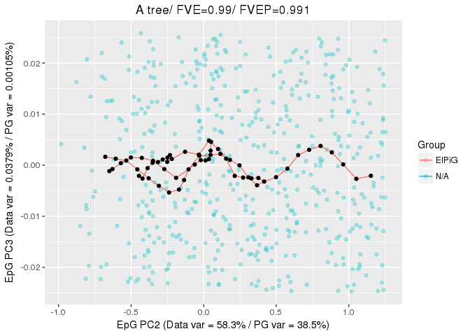

-   [Constructing a principal graph](#constructing-a-principal-graph)
-   [Examples of principal curves](#examples-of-principal-curves)
-   [Using bootstrapping](#using-bootstrapping)
-   [Plotting data with principal
    graphs](#plotting-data-with-principal-graphs)

Constructing a principal graph
==============================

The construction of a principal graph with a given topology is done via
the specification of an appropriate initial conditions and of
appropriate growth/shrink grammars. This can be done via the
`computeElasticPrincipalGraph`.

Specific wrapping functions are also provided to build commonly
encountered topologies (`computeElasticPrincipalCurve`,
\``computeElasticPrincipalTree`, `computeElasticPrincipalCircle`), with
minimal required inputs. In all of these function, it is necessary to
specify a numeric matrix with the data points (`X`) and the number of
nodes to of the principal graph (`NumNodes`). It is possible to control
the behavior of the algorithm via a set of optional parameters. For
example, it is possible to:

-   modify the parameter controlling the elastic energy (`Mu` and
    `Lambda`)
-   specify the number of processor to be used (`n.cores`)
-   indicate if diagnostic plots should be produced
    (`drawAccuracyComplexity` and `drawEnergy`)
-   indicate if the final graph should be used to plotted non the data
    (`drawPCAView`)
-   specify if PCA should be performed on the data prior to principal
    graph fitting (`Do_PCA`) and if dimensionality should be reduced
    (`ReduceDimension`)

Examples of principal curves
============================

The function `computeElasticPrincipalCurve` constructs a principal curve
on the data. For example to construct a principal curve with 50 nodes on
the example dataset `line_data`, it is sufficient to write

    library("ElPiGraph.R")

    CurveEPG <- computeElasticPrincipalCurve(X = curve_data, NumNodes = 50)

    ## [1] "Creating a chain in the 1st PC with 3 nodes"
    ## [1] "Constructing curve 1 of 1 / Subset 1 of 1"
    ## [1] "Performing PCA on the data"
    ## [1] "Using standard PCA"
    ## [1] "3 dimensions are being used"
    ## [1] "100% of the original variance has been retained"
    ## [1] "Computing EPG with 50 nodes on 500 points and 3 dimensions"
    ## [1] "Using a single core"
    ## Nodes = 3 4 5 6 7 8 9 10 11 12 13 14 15 16 17 18 19 20 21 22 23 24 25 26 27 28 29 30 31 32 33 34 35 36 37 38 39 40 41 42 43 44 45 46 47 48 49 
    ## BARCODE  ENERGY  NNODES  NEDGES  NRIBS   NSTARS  NRAYS   NRAYS2  MSE MSEP    FVE FVEP    UE  UR  URN URN2    URSD
    ## 0||50    0.0917  50  49  48  0   0   0   0.05567 0.0526  0.9814  0.9825  0.02573 0.0103  0.5152  25.76   0

    ## 6.662 sec elapsed
    ## [[1]]

A principal tree can be constructed via the
`computeElasticPrincipalTree` function. For example to construct a
principal tree with 50 nodes on the example dataset `tree_data`, it is
sufficient to write

    TreeEPG <- computeElasticPrincipalTree(X = tree_data, NumNodes = 50, Lambda = .021, Mu = .1)

    ## [1] "Creating a chain in the 1st PC with 2 nodes"
    ## [1] "Constructing tree 1 of 1 / Subset 1 of 1"
    ## [1] "Performing PCA on the data"
    ## [1] "Using standard PCA"
    ## [1] "3 dimensions are being used"
    ## [1] "100% of the original variance has been retained"
    ## [1] "Computing EPG with 50 nodes on 492 points and 3 dimensions"
    ## [1] "Using a single core"
    ## Nodes = 2 3 4 5 6 7 8 9 10 11 12 13 14 15 16 17 18 19 20 21 22 23 24 25 26 27 28 29 30 31 32 33 34 35 36 37 38 39 40 41 42 43 44 45 46 47 48 49 
    ## BARCODE  ENERGY  NNODES  NEDGES  NRIBS   NSTARS  NRAYS   NRAYS2  MSE MSEP    FVE FVEP    UE  UR  URN URN2    URSD
    ## 1|3||50  0.01641 50  49  39  3   0   0   0.005655    0.005062    0.9895  0.9906  0.01063 0.0001307   0.006534    0.3267  0

    ## 16 sec elapsed
    ## [[1]]

Finally, a principal circle can be constructed via the
`computeElasticPrincipalCircle` function. For example to construct a
principal circle with 50 nodes on the example dataset `circe_data`, it
is sufficient to write

    CircleEPG <- computeElasticPrincipalCircle(X = circle_data, NumNodes = 50)

    ## [1] "Using a single core"
    ## [1] "Creating a circle in the plane induced buy the 1st and 2nd PCs with 3 nodes"
    ## [1] "Constructing curve 1 of 1 / Subset 1 of 1"
    ## [1] "Performing PCA on the data"
    ## [1] "Using standard PCA"
    ## [1] "3 dimensions are being used"
    ## [1] "100% of the original variance has been retained"
    ## [1] "Computing EPG with 50 nodes on 200 points and 3 dimensions"
    ## [1] "Using a single core"
    ## Nodes = 3 4 5 6 7 8 9 10 11 12 13 14 15 16 17 18 19 20 21 22 23 24 25 26 27 28 29 30 31 32 33 34 35 36 37 38 39 40 41 42 43 44 45 46 47 48 49 
    ## BARCODE  ENERGY  NNODES  NEDGES  NRIBS   NSTARS  NRAYS   NRAYS2  MSE MSEP    FVE FVEP    UE  UR  URN URN2    URSD
    ## 0||50    0.03677 50  50  50  0   0   0   0.0261  0.02517 0.9755  0.9764  0.008876    0.001792    0.08961 4.481   0

    ## 3.301 sec elapsed
    ## [[1]]

All of these functions will return a list of length 1, with all the
information associated with the graph.

Using bootstrapping
===================

All of the functions provided to build principal graphs allow a
bootstrapped construction. To enable that it is sufficient to modify the
parameters `nReps` and `ProbPoint`. `nReps` indicates the number of
repetitions and `ProbPoint` indicates the probability to include a point
in each of the repetition. When `nReps` is larger than 1, a final
consensus principal graph will be constructed using the nodes of the
graph derived in each repetition.

As an example, let us perform bootstrapping on the circle data. We will
also prevent the plotting, for now.

    set.seed(42)
    CircleEPG.Boot <- computeElasticPrincipalCircle(X = circle_data, NumNodes = 50, nReps = 50, ProbPoint = .8,
                                                    drawAccuracyComplexity = FALSE, drawEnergy = FALSE, drawPCAView = FALSE)

    ## [1] "Using a single core"
    ## [1] "Creating a circle in the plane induced buy the 1st and 2nd PCs with 3 nodes"
    ## [1] "Constructing curve 1 of 50 / Subset 1 of 1"
    ## [1] "Performing PCA on the data"
    ## [1] "Using standard PCA"
    ## [1] "3 dimensions are being used"
    ## [1] "100% of the original variance has been retained"
    ## [1] "Computing EPG with 50 nodes on 160 points and 3 dimensions"
    ## [1] "Using a single core"
    ## Nodes = 3 4 5 6 7 8 9 10 11 12 13 14 15 16 17 18 19 20 21 22 23 24 25 26 27 28 29 30 31 32 33 34 35 36 37 38 39 40 41 42 43 44 45 46 47 48 49 
    ## BARCODE  ENERGY  NNODES  NEDGES  NRIBS   NSTARS  NRAYS   NRAYS2  MSE MSEP    FVE FVEP    UE  UR  URN URN2    URSD
    ## 0||50    0.03658 50  50  50  0   0   0   0.02591 0.02501 0.9759  0.9767  0.00883 0.001847    0.09233 4.617   0
    ## 2.9 sec elapsed
    ## [1] "Constructing curve 2 of 50 / Subset 1 of 1"
    ## [1] "Performing PCA on the data"
    ## [1] "Using standard PCA"
    ## [1] "3 dimensions are being used"
    ## [1] "100% of the original variance has been retained"
    ## [1] "Computing EPG with 50 nodes on 159 points and 3 dimensions"
    ## [1] "Using a single core"
    ## Nodes = 3 4 5 6 7 8 9 10 11 12 13 14 15 16 17 18 19 20 21 22 23 24 25 26 27 28 29 30 31 32 33 34 35 36 37 38 39 40 41 42 43 44 45 46 47 48 49 
    ## BARCODE  ENERGY  NNODES  NEDGES  NRIBS   NSTARS  NRAYS   NRAYS2  MSE MSEP    FVE FVEP    UE  UR  URN URN2    URSD
    ## 0||50    0.0349  50  50  50  0   0   0   0.02484 0.024   0.9764  0.9772  0.008575    0.001485    0.07425 3.712   0
    ## 2.639 sec elapsed
    ## [1] "Constructing curve 3 of 50 / Subset 1 of 1"
    ## [1] "Performing PCA on the data"
    ## [1] "Using standard PCA"
    ## [1] "3 dimensions are being used"
    ## [1] "100% of the original variance has been retained"
    ## [1] "Computing EPG with 50 nodes on 161 points and 3 dimensions"
    ## [1] "Using a single core"
    ## Nodes = 3 4 5 6 7 8 9 10 11 12 13 14 15 16 17 18 19 20 21 22 23 24 25 26 27 28 29 30 31 32 33 34 35 36 37 38 39 40 41 42 43 44 45 46 47 48 49 
    ## BARCODE  ENERGY  NNODES  NEDGES  NRIBS   NSTARS  NRAYS   NRAYS2  MSE MSEP    FVE FVEP    UE  UR  URN URN2    URSD
    ## 0||50    0.03569 50  50  50  0   0   0   0.02443 0.0236  0.9771  0.9779  0.009067    0.00219 0.1095  5.474   0
    ## 2.832 sec elapsed
    ## [1] "Graphical output will be suppressed for the remaining replicas"
    ## [1] "Constructing curve 4 of 50 / Subset 1 of 1"
    ## [1] "Performing PCA on the data"
    ## [1] "Using standard PCA"
    ## [1] "3 dimensions are being used"
    ## [1] "100% of the original variance has been retained"
    ## [1] "Computing EPG with 50 nodes on 162 points and 3 dimensions"
    ## [1] "Using a single core"
    ## Nodes = 3 4 5 6 7 8 9 10 11 12 13 14 15 16 17 18 19 20 21 22 23 24 25 26 27 28 29 30 31 32 33 34 35 36 37 38 39 40 41 42 43 44 45 46 47 48 49 
    ## BARCODE  ENERGY  NNODES  NEDGES  NRIBS   NSTARS  NRAYS   NRAYS2  MSE MSEP    FVE FVEP    UE  UR  URN URN2    URSD
    ## 0||50    0.03676 50  50  50  0   0   0   0.02698 0.02603 0.9748  0.9757  0.008515    0.00126 0.06301 3.15    0
    ## 2.907 sec elapsed
    ## [1] "Constructing curve 5 of 50 / Subset 1 of 1"
    ## [1] "Performing PCA on the data"
    ## [1] "Using standard PCA"
    ## [1] "3 dimensions are being used"
    ## [1] "100% of the original variance has been retained"
    ## [1] "Computing EPG with 50 nodes on 162 points and 3 dimensions"
    ## [1] "Using a single core"
    ## Nodes = 3 4 5 6 7 8 9 10 11 12 13 14 15 16 17 18 19 20 21 22 23 24 25 26 27 28 29 30 31 32 33 34 35 36 37 38 39 40 41 42 43 44 45 46 47 48 49 
    ## BARCODE  ENERGY  NNODES  NEDGES  NRIBS   NSTARS  NRAYS   NRAYS2  MSE MSEP    FVE FVEP    UE  UR  URN URN2    URSD
    ## 0||50    0.03668 50  50  50  0   0   0   0.02609 0.02511 0.9759  0.9768  0.008765    0.001825    0.09127 4.564   0
    ## 2.643 sec elapsed
    ## [1] "Constructing curve 6 of 50 / Subset 1 of 1"
    ## [1] "Performing PCA on the data"
    ## [1] "Using standard PCA"
    ## [1] "3 dimensions are being used"
    ## [1] "100% of the original variance has been retained"
    ## [1] "Computing EPG with 50 nodes on 158 points and 3 dimensions"
    ## [1] "Using a single core"
    ## Nodes = 3 4 5 6 7 8 9 10 11 12 13 14 15 16 17 18 19 20 21 22 23 24 25 26 27 28 29 30 31 32 33 34 35 36 37 38 39 40 41 42 43 44 45 46 47 48 49 
    ## BARCODE  ENERGY  NNODES  NEDGES  NRIBS   NSTARS  NRAYS   NRAYS2  MSE MSEP    FVE FVEP    UE  UR  URN URN2    URSD
    ## 0||50    0.03678 50  50  50  0   0   0   0.02612 0.02526 0.9757  0.9765  0.008902    0.00176 0.088   4.4 0
    ## 2.845 sec elapsed
    ## [1] "Constructing curve 7 of 50 / Subset 1 of 1"
    ## [1] "Performing PCA on the data"
    ## [1] "Using standard PCA"
    ## [1] "3 dimensions are being used"
    ## [1] "100% of the original variance has been retained"
    ## [1] "Computing EPG with 50 nodes on 166 points and 3 dimensions"
    ## [1] "Using a single core"
    ## Nodes = 3 4 5 6 7 8 9 10 11 12 13 14 15 16 17 18 19 20 21 22 23 24 25 26 27 28 29 30 31 32 33 34 35 36 37 38 39 40 41 42 43 44 45 46 47 48 49 
    ## BARCODE  ENERGY  NNODES  NEDGES  NRIBS   NSTARS  NRAYS   NRAYS2  MSE MSEP    FVE FVEP    UE  UR  URN URN2    URSD
    ## 0||50    0.03666 50  50  50  0   0   0   0.02589 0.02502 0.9754  0.9762  0.008636    0.002133    0.1066  5.332   0
    ## 2.922 sec elapsed
    ## [1] "Constructing curve 8 of 50 / Subset 1 of 1"
    ## [1] "Performing PCA on the data"
    ## [1] "Using standard PCA"
    ## [1] "3 dimensions are being used"
    ## [1] "100% of the original variance has been retained"
    ## [1] "Computing EPG with 50 nodes on 166 points and 3 dimensions"
    ## [1] "Using a single core"
    ## Nodes = 3 4 5 6 7 8 9 10 11 12 13 14 15 16 17 18 19 20 21 22 23 24 25 26 27 28 29 30 31 32 33 34 35 36 37 38 39 40 41 42 43 44 45 46 47 48 49 
    ## BARCODE  ENERGY  NNODES  NEDGES  NRIBS   NSTARS  NRAYS   NRAYS2  MSE MSEP    FVE FVEP    UE  UR  URN URN2    URSD
    ## 0||50    0.03398 50  50  50  0   0   0   0.02396 0.02295 0.9776  0.9786  0.008586    0.001435    0.07173 3.586   0
    ## 2.615 sec elapsed
    ## [1] "Constructing curve 9 of 50 / Subset 1 of 1"
    ## [1] "Performing PCA on the data"
    ## [1] "Using standard PCA"
    ## [1] "3 dimensions are being used"
    ## [1] "100% of the original variance has been retained"
    ## [1] "Computing EPG with 50 nodes on 160 points and 3 dimensions"
    ## [1] "Using a single core"
    ## Nodes = 3 4 5 6 7 8 9 10 11 12 13 14 15 16 17 18 19 20 21 22 23 24 25 26 27 28 29 30 31 32 33 34 35 36 37 38 39 40 41 42 43 44 45 46 47 48 49 
    ## BARCODE  ENERGY  NNODES  NEDGES  NRIBS   NSTARS  NRAYS   NRAYS2  MSE MSEP    FVE FVEP    UE  UR  URN URN2    URSD
    ## 0||50    0.035   50  50  50  0   0   0   0.02362 0.02276 0.9786  0.9794  0.009283    0.002095    0.1047  5.236   0
    ## 2.889 sec elapsed
    ## [1] "Constructing curve 10 of 50 / Subset 1 of 1"
    ## [1] "Performing PCA on the data"
    ## [1] "Using standard PCA"
    ## [1] "3 dimensions are being used"
    ## [1] "100% of the original variance has been retained"
    ## [1] "Computing EPG with 50 nodes on 145 points and 3 dimensions"
    ## [1] "Using a single core"
    ## Nodes = 3 4 5 6 7 8 9 10 11 12 13 14 15 16 17 18 19 20 21 22 23 24 25 26 27 28 29 30 31 32 33 34 35 36 37 38 39 40 41 42 43 44 45 46 47 48 49 
    ## BARCODE  ENERGY  NNODES  NEDGES  NRIBS   NSTARS  NRAYS   NRAYS2  MSE MSEP    FVE FVEP    UE  UR  URN URN2    URSD
    ## 0||50    0.03714 50  50  50  0   0   0   0.027   0.02611 0.9749  0.9757  0.008663    0.001482    0.0741  3.705   0
    ## 2.646 sec elapsed
    ## [1] "Constructing curve 11 of 50 / Subset 1 of 1"
    ## [1] "Performing PCA on the data"
    ## [1] "Using standard PCA"
    ## [1] "3 dimensions are being used"
    ## [1] "100% of the original variance has been retained"
    ## [1] "Computing EPG with 50 nodes on 162 points and 3 dimensions"
    ## [1] "Using a single core"
    ## Nodes = 3 4 5 6 7 8 9 10 11 12 13 14 15 16 17 18 19 20 21 22 23 24 25 26 27 28 29 30 31 32 33 34 35 36 37 38 39 40 41 42 43 44 45 46 47 48 49 
    ## BARCODE  ENERGY  NNODES  NEDGES  NRIBS   NSTARS  NRAYS   NRAYS2  MSE MSEP    FVE FVEP    UE  UR  URN URN2    URSD
    ## 0||50    0.03774 50  50  50  0   0   0   0.02671 0.02585 0.9749  0.9757  0.009086    0.00195 0.0975  4.875   0
    ## 2.849 sec elapsed
    ## [1] "Constructing curve 12 of 50 / Subset 1 of 1"
    ## [1] "Performing PCA on the data"
    ## [1] "Using standard PCA"
    ## [1] "3 dimensions are being used"
    ## [1] "100% of the original variance has been retained"
    ## [1] "Computing EPG with 50 nodes on 155 points and 3 dimensions"
    ## [1] "Using a single core"
    ## Nodes = 3 4 5 6 7 8 9 10 11 12 13 14 15 16 17 18 19 20 21 22 23 24 25 26 27 28 29 30 31 32 33 34 35 36 37 38 39 40 41 42 43 44 45 46 47 48 49 
    ## BARCODE  ENERGY  NNODES  NEDGES  NRIBS   NSTARS  NRAYS   NRAYS2  MSE MSEP    FVE FVEP    UE  UR  URN URN2    URSD
    ## 0||50    0.03993 50  50  50  0   0   0   0.02909 0.02821 0.973   0.9738  0.008873    0.001962    0.09811 4.906   0
    ## 2.915 sec elapsed
    ## [1] "Constructing curve 13 of 50 / Subset 1 of 1"
    ## [1] "Performing PCA on the data"
    ## [1] "Using standard PCA"
    ## [1] "3 dimensions are being used"
    ## [1] "100% of the original variance has been retained"
    ## [1] "Computing EPG with 50 nodes on 158 points and 3 dimensions"
    ## [1] "Using a single core"
    ## Nodes = 3 4 5 6 7 8 9 10 11 12 13 14 15 16 17 18 19 20 21 22 23 24 25 26 27 28 29 30 31 32 33 34 35 36 37 38 39 40 41 42 43 44 45 46 47 48 49 
    ## BARCODE  ENERGY  NNODES  NEDGES  NRIBS   NSTARS  NRAYS   NRAYS2  MSE MSEP    FVE FVEP    UE  UR  URN URN2    URSD
    ## 0||50    0.03651 50  50  50  0   0   0   0.02553 0.02463 0.9766  0.9774  0.009058    0.001925    0.09624 4.812   0
    ## 2.665 sec elapsed
    ## [1] "Constructing curve 14 of 50 / Subset 1 of 1"
    ## [1] "Performing PCA on the data"
    ## [1] "Using standard PCA"
    ## [1] "3 dimensions are being used"
    ## [1] "100% of the original variance has been retained"
    ## [1] "Computing EPG with 50 nodes on 164 points and 3 dimensions"
    ## [1] "Using a single core"
    ## Nodes = 3 4 5 6 7 8 9 10 11 12 13 14 15 16 17 18 19 20 21 22 23 24 25 26 27 28 29 30 31 32 33 34 35 36 37 38 39 40 41 42 43 44 45 46 47 48 49 
    ## BARCODE  ENERGY  NNODES  NEDGES  NRIBS   NSTARS  NRAYS   NRAYS2  MSE MSEP    FVE FVEP    UE  UR  URN URN2    URSD
    ## 0||50    0.0336  50  50  50  0   0   0   0.02273 0.02184 0.9786  0.9794  0.008967    0.001904    0.09519 4.76    0
    ## 2.871 sec elapsed
    ## [1] "Constructing curve 15 of 50 / Subset 1 of 1"
    ## [1] "Performing PCA on the data"
    ## [1] "Using standard PCA"
    ## [1] "3 dimensions are being used"
    ## [1] "100% of the original variance has been retained"
    ## [1] "Computing EPG with 50 nodes on 155 points and 3 dimensions"
    ## [1] "Using a single core"
    ## Nodes = 3 4 5 6 7 8 9 10 11 12 13 14 15 16 17 18 19 20 21 22 23 24 25 26 27 28 29 30 31 32 33 34 35 36 37 38 39 40 41 42 43 44 45 46 47 48 49 
    ## BARCODE  ENERGY  NNODES  NEDGES  NRIBS   NSTARS  NRAYS   NRAYS2  MSE MSEP    FVE FVEP    UE  UR  URN URN2    URSD
    ## 0||50    0.03733 50  50  50  0   0   0   0.02729 0.02647 0.974   0.9748  0.008589    0.001448    0.07238 3.619   0
    ## 2.916 sec elapsed
    ## [1] "Constructing curve 16 of 50 / Subset 1 of 1"
    ## [1] "Performing PCA on the data"
    ## [1] "Using standard PCA"
    ## [1] "3 dimensions are being used"
    ## [1] "100% of the original variance has been retained"
    ## [1] "Computing EPG with 50 nodes on 163 points and 3 dimensions"
    ## [1] "Using a single core"
    ## Nodes = 3 4 5 6 7 8 9 10 11 12 13 14 15 16 17 18 19 20 21 22 23 24 25 26 27 28 29 30 31 32 33 34 35 36 37 38 39 40 41 42 43 44 45 46 47 48 49 
    ## BARCODE  ENERGY  NNODES  NEDGES  NRIBS   NSTARS  NRAYS   NRAYS2  MSE MSEP    FVE FVEP    UE  UR  URN URN2    URSD
    ## 0||50    0.03604 50  50  50  0   0   0   0.02494 0.02385 0.9769  0.9779  0.009134    0.001971    0.09856 4.928   0
    ## 2.662 sec elapsed
    ## [1] "Constructing curve 17 of 50 / Subset 1 of 1"
    ## [1] "Performing PCA on the data"
    ## [1] "Using standard PCA"
    ## [1] "3 dimensions are being used"
    ## [1] "100% of the original variance has been retained"
    ## [1] "Computing EPG with 50 nodes on 154 points and 3 dimensions"
    ## [1] "Using a single core"
    ## Nodes = 3 4 5 6 7 8 9 10 11 12 13 14 15 16 17 18 19 20 21 22 23 24 25 26 27 28 29 30 31 32 33 34 35 36 37 38 39 40 41 42 43 44 45 46 47 48 49 
    ## BARCODE  ENERGY  NNODES  NEDGES  NRIBS   NSTARS  NRAYS   NRAYS2  MSE MSEP    FVE FVEP    UE  UR  URN URN2    URSD
    ## 0||50    0.03382 50  50  50  0   0   0   0.02299 0.02198 0.9786  0.9795  0.008861    0.001974    0.09868 4.934   0
    ## 2.889 sec elapsed
    ## [1] "Constructing curve 18 of 50 / Subset 1 of 1"
    ## [1] "Performing PCA on the data"
    ## [1] "Using standard PCA"
    ## [1] "3 dimensions are being used"
    ## [1] "100% of the original variance has been retained"
    ## [1] "Computing EPG with 50 nodes on 147 points and 3 dimensions"
    ## [1] "Using a single core"
    ## Nodes = 3 4 5 6 7 8 9 10 11 12 13 14 15 16 17 18 19 20 21 22 23 24 25 26 27 28 29 30 31 32 33 34 35 36 37 38 39 40 41 42 43 44 45 46 47 48 49 
    ## BARCODE  ENERGY  NNODES  NEDGES  NRIBS   NSTARS  NRAYS   NRAYS2  MSE MSEP    FVE FVEP    UE  UR  URN URN2    URSD
    ## 0||50    0.0342  50  50  50  0   0   0   0.02396 0.02311 0.9777  0.9785  0.008698    0.001539    0.07697 3.849   0
    ## 2.952 sec elapsed
    ## [1] "Constructing curve 19 of 50 / Subset 1 of 1"
    ## [1] "Performing PCA on the data"
    ## [1] "Using standard PCA"
    ## [1] "3 dimensions are being used"
    ## [1] "100% of the original variance has been retained"
    ## [1] "Computing EPG with 50 nodes on 149 points and 3 dimensions"
    ## [1] "Using a single core"
    ## Nodes = 3 4 5 6 7 8 9 10 11 12 13 14 15 16 17 18 19 20 21 22 23 24 25 26 27 28 29 30 31 32 33 34 35 36 37 38 39 40 41 42 43 44 45 46 47 48 49 
    ## BARCODE  ENERGY  NNODES  NEDGES  NRIBS   NSTARS  NRAYS   NRAYS2  MSE MSEP    FVE FVEP    UE  UR  URN URN2    URSD
    ## 0||50    0.03577 50  50  50  0   0   0   0.02534 0.02446 0.9757  0.9765  0.008637    0.001798    0.08992 4.496   0
    ## 2.644 sec elapsed
    ## [1] "Constructing curve 20 of 50 / Subset 1 of 1"
    ## [1] "Performing PCA on the data"
    ## [1] "Using standard PCA"
    ## [1] "3 dimensions are being used"
    ## [1] "100% of the original variance has been retained"
    ## [1] "Computing EPG with 50 nodes on 165 points and 3 dimensions"
    ## [1] "Using a single core"
    ## Nodes = 3 4 5 6 7 8 9 10 11 12 13 14 15 16 17 18 19 20 21 22 23 24 25 26 27 28 29 30 31 32 33 34 35 36 37 38 39 40 41 42 43 44 45 46 47 48 49 
    ## BARCODE  ENERGY  NNODES  NEDGES  NRIBS   NSTARS  NRAYS   NRAYS2  MSE MSEP    FVE FVEP    UE  UR  URN URN2    URSD
    ## 0||50    0.03588 50  50  50  0   0   0   0.02512 0.02423 0.9763  0.9772  0.008913    0.001848    0.0924  4.62    0
    ## 2.914 sec elapsed
    ## [1] "Constructing curve 21 of 50 / Subset 1 of 1"
    ## [1] "Performing PCA on the data"
    ## [1] "Using standard PCA"
    ## [1] "3 dimensions are being used"
    ## [1] "100% of the original variance has been retained"
    ## [1] "Computing EPG with 50 nodes on 158 points and 3 dimensions"
    ## [1] "Using a single core"
    ## Nodes = 3 4 5 6 7 8 9 10 11 12 13 14 15 16 17 18 19 20 21 22 23 24 25 26 27 28 29 30 31 32 33 34 35 36 37 38 39 40 41 42 43 44 45 46 47 48 49 
    ## BARCODE  ENERGY  NNODES  NEDGES  NRIBS   NSTARS  NRAYS   NRAYS2  MSE MSEP    FVE FVEP    UE  UR  URN URN2    URSD
    ## 0||50    0.03608 50  50  50  0   0   0   0.02491 0.02399 0.9769  0.9777  0.009053    0.002118    0.1059  5.295   0
    ## 2.937 sec elapsed
    ## [1] "Constructing curve 22 of 50 / Subset 1 of 1"
    ## [1] "Performing PCA on the data"
    ## [1] "Using standard PCA"
    ## [1] "3 dimensions are being used"
    ## [1] "100% of the original variance has been retained"
    ## [1] "Computing EPG with 50 nodes on 158 points and 3 dimensions"
    ## [1] "Using a single core"
    ## Nodes = 3 4 5 6 7 8 9 10 11 12 13 14 15 16 17 18 19 20 21 22 23 24 25 26 27 28 29 30 31 32 33 34 35 36 37 38 39 40 41 42 43 44 45 46 47 48 49 
    ## BARCODE  ENERGY  NNODES  NEDGES  NRIBS   NSTARS  NRAYS   NRAYS2  MSE MSEP    FVE FVEP    UE  UR  URN URN2    URSD
    ## 0||50    0.03393 50  50  50  0   0   0   0.0231  0.0222  0.9786  0.9795  0.008926    0.001904    0.09521 4.761   0
    ## 2.645 sec elapsed
    ## [1] "Constructing curve 23 of 50 / Subset 1 of 1"
    ## [1] "Performing PCA on the data"
    ## [1] "Using standard PCA"
    ## [1] "3 dimensions are being used"
    ## [1] "100% of the original variance has been retained"
    ## [1] "Computing EPG with 50 nodes on 160 points and 3 dimensions"
    ## [1] "Using a single core"
    ## Nodes = 3 4 5 6 7 8 9 10 11 12 13 14 15 16 17 18 19 20 21 22 23 24 25 26 27 28 29 30 31 32 33 34 35 36 37 38 39 40 41 42 43 44 45 46 47 48 49 
    ## BARCODE  ENERGY  NNODES  NEDGES  NRIBS   NSTARS  NRAYS   NRAYS2  MSE MSEP    FVE FVEP    UE  UR  URN URN2    URSD
    ## 0||50    0.03378 50  50  50  0   0   0   0.0234  0.02247 0.9784  0.9792  0.008712    0.00167 0.08349 4.174   0
    ## 2.916 sec elapsed
    ## [1] "Constructing curve 24 of 50 / Subset 1 of 1"
    ## [1] "Performing PCA on the data"
    ## [1] "Using standard PCA"
    ## [1] "3 dimensions are being used"
    ## [1] "100% of the original variance has been retained"
    ## [1] "Computing EPG with 50 nodes on 160 points and 3 dimensions"
    ## [1] "Using a single core"
    ## Nodes = 3 4 5 6 7 8 9 10 11 12 13 14 15 16 17 18 19 20 21 22 23 24 25 26 27 28 29 30 31 32 33 34 35 36 37 38 39 40 41 42 43 44 45 46 47 48 49 
    ## BARCODE  ENERGY  NNODES  NEDGES  NRIBS   NSTARS  NRAYS   NRAYS2  MSE MSEP    FVE FVEP    UE  UR  URN URN2    URSD
    ## 0||50    0.0352  50  50  50  0   0   0   0.02453 0.0237  0.9771  0.9779  0.008986    0.001685    0.08425 4.213   0
    ## 2.695 sec elapsed
    ## [1] "Constructing curve 25 of 50 / Subset 1 of 1"
    ## [1] "Performing PCA on the data"
    ## [1] "Using standard PCA"
    ## [1] "3 dimensions are being used"
    ## [1] "100% of the original variance has been retained"
    ## [1] "Computing EPG with 50 nodes on 163 points and 3 dimensions"
    ## [1] "Using a single core"
    ## Nodes = 3 4 5 6 7 8 9 10 11 12 13 14 15 16 17 18 19 20 21 22 23 24 25 26 27 28 29 30 31 32 33 34 35 36 37 38 39 40 41 42 43 44 45 46 47 48 49 
    ## BARCODE  ENERGY  NNODES  NEDGES  NRIBS   NSTARS  NRAYS   NRAYS2  MSE MSEP    FVE FVEP    UE  UR  URN URN2    URSD
    ## 0||50    0.03691 50  50  50  0   0   0   0.02606 0.02509 0.9761  0.977   0.008932    0.001922    0.09612 4.806   0
    ## 2.859 sec elapsed
    ## [1] "Constructing curve 26 of 50 / Subset 1 of 1"
    ## [1] "Performing PCA on the data"
    ## [1] "Using standard PCA"
    ## [1] "3 dimensions are being used"
    ## [1] "100% of the original variance has been retained"
    ## [1] "Computing EPG with 50 nodes on 161 points and 3 dimensions"
    ## [1] "Using a single core"
    ## Nodes = 3 4 5 6 7 8 9 10 11 12 13 14 15 16 17 18 19 20 21 22 23 24 25 26 27 28 29 30 31 32 33 34 35 36 37 38 39 40 41 42 43 44 45 46 47 48 49 
    ## BARCODE  ENERGY  NNODES  NEDGES  NRIBS   NSTARS  NRAYS   NRAYS2  MSE MSEP    FVE FVEP    UE  UR  URN URN2    URSD
    ## 0||50    0.03575 50  50  50  0   0   0   0.02564 0.02484 0.976   0.9768  0.008677    0.001426    0.0713  3.565   0
    ## 2.939 sec elapsed
    ## [1] "Constructing curve 27 of 50 / Subset 1 of 1"
    ## [1] "Performing PCA on the data"
    ## [1] "Using standard PCA"
    ## [1] "3 dimensions are being used"
    ## [1] "100% of the original variance has been retained"
    ## [1] "Computing EPG with 50 nodes on 155 points and 3 dimensions"
    ## [1] "Using a single core"
    ## Nodes = 3 4 5 6 7 8 9 10 11 12 13 14 15 16 17 18 19 20 21 22 23 24 25 26 27 28 29 30 31 32 33 34 35 36 37 38 39 40 41 42 43 44 45 46 47 48 49 
    ## BARCODE  ENERGY  NNODES  NEDGES  NRIBS   NSTARS  NRAYS   NRAYS2  MSE MSEP    FVE FVEP    UE  UR  URN URN2    URSD
    ## 0||50    0.03695 50  50  50  0   0   0   0.02623 0.02528 0.9756  0.9765  0.009047    0.001673    0.08365 4.183   0
    ## 2.707 sec elapsed
    ## [1] "Constructing curve 28 of 50 / Subset 1 of 1"
    ## [1] "Performing PCA on the data"
    ## [1] "Using standard PCA"
    ## [1] "3 dimensions are being used"
    ## [1] "100% of the original variance has been retained"
    ## [1] "Computing EPG with 50 nodes on 159 points and 3 dimensions"
    ## [1] "Using a single core"
    ## Nodes = 3 4 5 6 7 8 9 10 11 12 13 14 15 16 17 18 19 20 21 22 23 24 25 26 27 28 29 30 31 32 33 34 35 36 37 38 39 40 41 42 43 44 45 46 47 48 49 
    ## BARCODE  ENERGY  NNODES  NEDGES  NRIBS   NSTARS  NRAYS   NRAYS2  MSE MSEP    FVE FVEP    UE  UR  URN URN2    URSD
    ## 0||50    0.03848 50  50  50  0   0   0   0.02787 0.02702 0.9737  0.9745  0.008737    0.001877    0.09384 4.692   0
    ## 2.893 sec elapsed
    ## [1] "Constructing curve 29 of 50 / Subset 1 of 1"
    ## [1] "Performing PCA on the data"
    ## [1] "Using standard PCA"
    ## [1] "3 dimensions are being used"
    ## [1] "100% of the original variance has been retained"
    ## [1] "Computing EPG with 50 nodes on 161 points and 3 dimensions"
    ## [1] "Using a single core"
    ## Nodes = 3 4 5 6 7 8 9 10 11 12 13 14 15 16 17 18 19 20 21 22 23 24 25 26 27 28 29 30 31 32 33 34 35 36 37 38 39 40 41 42 43 44 45 46 47 48 49 
    ## BARCODE  ENERGY  NNODES  NEDGES  NRIBS   NSTARS  NRAYS   NRAYS2  MSE MSEP    FVE FVEP    UE  UR  URN URN2    URSD
    ## 0||50    0.03787 50  50  50  0   0   0   0.0275  0.02661 0.9742  0.9751  0.008698    0.00167 0.08351 4.176   0
    ## 2.956 sec elapsed
    ## [1] "Constructing curve 30 of 50 / Subset 1 of 1"
    ## [1] "Performing PCA on the data"
    ## [1] "Using standard PCA"
    ## [1] "3 dimensions are being used"
    ## [1] "100% of the original variance has been retained"
    ## [1] "Computing EPG with 50 nodes on 164 points and 3 dimensions"
    ## [1] "Using a single core"
    ## Nodes = 3 4 5 6 7 8 9 10 11 12 13 14 15 16 17 18 19 20 21 22 23 24 25 26 27 28 29 30 31 32 33 34 35 36 37 38 39 40 41 42 43 44 45 46 47 48 49 
    ## BARCODE  ENERGY  NNODES  NEDGES  NRIBS   NSTARS  NRAYS   NRAYS2  MSE MSEP    FVE FVEP    UE  UR  URN URN2    URSD
    ## 0||50    0.03551 50  50  50  0   0   0   0.02416 0.02324 0.9773  0.9781  0.00902 0.002332    0.1166  5.831   0
    ## 2.714 sec elapsed
    ## [1] "Constructing curve 31 of 50 / Subset 1 of 1"
    ## [1] "Performing PCA on the data"
    ## [1] "Using standard PCA"
    ## [1] "3 dimensions are being used"
    ## [1] "100% of the original variance has been retained"
    ## [1] "Computing EPG with 50 nodes on 166 points and 3 dimensions"
    ## [1] "Using a single core"
    ## Nodes = 3 4 5 6 7 8 9 10 11 12 13 14 15 16 17 18 19 20 21 22 23 24 25 26 27 28 29 30 31 32 33 34 35 36 37 38 39 40 41 42 43 44 45 46 47 48 49 
    ## BARCODE  ENERGY  NNODES  NEDGES  NRIBS   NSTARS  NRAYS   NRAYS2  MSE MSEP    FVE FVEP    UE  UR  URN URN2    URSD
    ## 0||50    0.03697 50  50  50  0   0   0   0.02632 0.02544 0.9758  0.9766  0.008884    0.001768    0.08842 4.421   0
    ## 2.905 sec elapsed
    ## [1] "Constructing curve 32 of 50 / Subset 1 of 1"
    ## [1] "Performing PCA on the data"
    ## [1] "Using standard PCA"
    ## [1] "3 dimensions are being used"
    ## [1] "100% of the original variance has been retained"
    ## [1] "Computing EPG with 50 nodes on 160 points and 3 dimensions"
    ## [1] "Using a single core"
    ## Nodes = 3 4 5 6 7 8 9 10 11 12 13 14 15 16 17 18 19 20 21 22 23 24 25 26 27 28 29 30 31 32 33 34 35 36 37 38 39 40 41 42 43 44 45 46 47 48 49 
    ## BARCODE  ENERGY  NNODES  NEDGES  NRIBS   NSTARS  NRAYS   NRAYS2  MSE MSEP    FVE FVEP    UE  UR  URN URN2    URSD
    ## 0||50    0.03772 50  50  50  0   0   0   0.02652 0.0255  0.975   0.976   0.008975    0.002223    0.1112  5.558   0
    ## 2.961 sec elapsed
    ## [1] "Constructing curve 33 of 50 / Subset 1 of 1"
    ## [1] "Performing PCA on the data"
    ## [1] "Using standard PCA"
    ## [1] "3 dimensions are being used"
    ## [1] "100% of the original variance has been retained"
    ## [1] "Computing EPG with 50 nodes on 157 points and 3 dimensions"
    ## [1] "Using a single core"
    ## Nodes = 3 4 5 6 7 8 9 10 11 12 13 14 15 16 17 18 19 20 21 22 23 24 25 26 27 28 29 30 31 32 33 34 35 36 37 38 39 40 41 42 43 44 45 46 47 48 49 
    ## BARCODE  ENERGY  NNODES  NEDGES  NRIBS   NSTARS  NRAYS   NRAYS2  MSE MSEP    FVE FVEP    UE  UR  URN URN2    URSD
    ## 0||50    0.03533 50  50  50  0   0   0   0.02488 0.024   0.9766  0.9775  0.008706    0.001738    0.0869  4.345   0
    ## 2.729 sec elapsed
    ## [1] "Constructing curve 34 of 50 / Subset 1 of 1"
    ## [1] "Performing PCA on the data"
    ## [1] "Using standard PCA"
    ## [1] "3 dimensions are being used"
    ## [1] "100% of the original variance has been retained"
    ## [1] "Computing EPG with 50 nodes on 151 points and 3 dimensions"
    ## [1] "Using a single core"
    ## Nodes = 3 4 5 6 7 8 9 10 11 12 13 14 15 16 17 18 19 20 21 22 23 24 25 26 27 28 29 30 31 32 33 34 35 36 37 38 39 40 41 42 43 44 45 46 47 48 49 
    ## BARCODE  ENERGY  NNODES  NEDGES  NRIBS   NSTARS  NRAYS   NRAYS2  MSE MSEP    FVE FVEP    UE  UR  URN URN2    URSD
    ## 0||50    0.03491 50  50  50  0   0   0   0.02379 0.02293 0.9778  0.9786  0.0091  0.00202 0.101   5.051   0
    ## 2.88 sec elapsed
    ## [1] "Constructing curve 35 of 50 / Subset 1 of 1"
    ## [1] "Performing PCA on the data"
    ## [1] "Using standard PCA"
    ## [1] "3 dimensions are being used"
    ## [1] "100% of the original variance has been retained"
    ## [1] "Computing EPG with 50 nodes on 168 points and 3 dimensions"
    ## [1] "Using a single core"
    ## Nodes = 3 4 5 6 7 8 9 10 11 12 13 14 15 16 17 18 19 20 21 22 23 24 25 26 27 28 29 30 31 32 33 34 35 36 37 38 39 40 41 42 43 44 45 46 47 48 49 
    ## BARCODE  ENERGY  NNODES  NEDGES  NRIBS   NSTARS  NRAYS   NRAYS2  MSE MSEP    FVE FVEP    UE  UR  URN URN2    URSD
    ## 0||50    0.03445 50  50  50  0   0   0   0.02392 0.02313 0.9778  0.9785  0.008784    0.001742    0.08708 4.354   0
    ## 2.967 sec elapsed
    ## [1] "Constructing curve 36 of 50 / Subset 1 of 1"
    ## [1] "Performing PCA on the data"
    ## [1] "Using standard PCA"
    ## [1] "3 dimensions are being used"
    ## [1] "100% of the original variance has been retained"
    ## [1] "Computing EPG with 50 nodes on 164 points and 3 dimensions"
    ## [1] "Using a single core"
    ## Nodes = 3 4 5 6 7 8 9 10 11 12 13 14 15 16 17 18 19 20 21 22 23 24 25 26 27 28 29 30 31 32 33 34 35 36 37 38 39 40 41 42 43 44 45 46 47 48 49 
    ## BARCODE  ENERGY  NNODES  NEDGES  NRIBS   NSTARS  NRAYS   NRAYS2  MSE MSEP    FVE FVEP    UE  UR  URN URN2    URSD
    ## 0||50    0.03741 50  50  50  0   0   0   0.02668 0.02584 0.9751  0.9759  0.008899    0.001832    0.09159 4.58    0
    ## 2.737 sec elapsed
    ## [1] "Constructing curve 37 of 50 / Subset 1 of 1"
    ## [1] "Performing PCA on the data"
    ## [1] "Using standard PCA"
    ## [1] "3 dimensions are being used"
    ## [1] "100% of the original variance has been retained"
    ## [1] "Computing EPG with 50 nodes on 162 points and 3 dimensions"
    ## [1] "Using a single core"
    ## Nodes = 3 4 5 6 7 8 9 10 11 12 13 14 15 16 17 18 19 20 21 22 23 24 25 26 27 28 29 30 31 32 33 34 35 36 37 38 39 40 41 42 43 44 45 46 47 48 49 
    ## BARCODE  ENERGY  NNODES  NEDGES  NRIBS   NSTARS  NRAYS   NRAYS2  MSE MSEP    FVE FVEP    UE  UR  URN URN2    URSD
    ## 0||50    0.03713 50  50  50  0   0   0   0.02682 0.02589 0.9747  0.9755  0.008624    0.001682    0.08409 4.204   0
    ## 2.902 sec elapsed
    ## [1] "Constructing curve 38 of 50 / Subset 1 of 1"
    ## [1] "Performing PCA on the data"
    ## [1] "Using standard PCA"
    ## [1] "3 dimensions are being used"
    ## [1] "100% of the original variance has been retained"
    ## [1] "Computing EPG with 50 nodes on 165 points and 3 dimensions"
    ## [1] "Using a single core"
    ## Nodes = 3 4 5 6 7 8 9 10 11 12 13 14 15 16 17 18 19 20 21 22 23 24 25 26 27 28 29 30 31 32 33 34 35 36 37 38 39 40 41 42 43 44 45 46 47 48 49 
    ## BARCODE  ENERGY  NNODES  NEDGES  NRIBS   NSTARS  NRAYS   NRAYS2  MSE MSEP    FVE FVEP    UE  UR  URN URN2    URSD
    ## 0||50    0.0372  50  50  50  0   0   0   0.02616 0.02526 0.9755  0.9764  0.008922    0.002116    0.1058  5.29    0
    ## 2.962 sec elapsed
    ## [1] "Constructing curve 39 of 50 / Subset 1 of 1"
    ## [1] "Performing PCA on the data"
    ## [1] "Using standard PCA"
    ## [1] "3 dimensions are being used"
    ## [1] "100% of the original variance has been retained"
    ## [1] "Computing EPG with 50 nodes on 171 points and 3 dimensions"
    ## [1] "Using a single core"
    ## Nodes = 3 4 5 6 7 8 9 10 11 12 13 14 15 16 17 18 19 20 21 22 23 24 25 26 27 28 29 30 31 32 33 34 35 36 37 38 39 40 41 42 43 44 45 46 47 48 49 
    ## BARCODE  ENERGY  NNODES  NEDGES  NRIBS   NSTARS  NRAYS   NRAYS2  MSE MSEP    FVE FVEP    UE  UR  URN URN2    URSD
    ## 0||50    0.03687 50  50  50  0   0   0   0.0255  0.02459 0.9762  0.9771  0.009143    0.002224    0.1112  5.559   0
    ## 2.75 sec elapsed
    ## [1] "Constructing curve 40 of 50 / Subset 1 of 1"
    ## [1] "Performing PCA on the data"
    ## [1] "Using standard PCA"
    ## [1] "3 dimensions are being used"
    ## [1] "100% of the original variance has been retained"
    ## [1] "Computing EPG with 50 nodes on 160 points and 3 dimensions"
    ## [1] "Using a single core"
    ## Nodes = 3 4 5 6 7 8 9 10 11 12 13 14 15 16 17 18 19 20 21 22 23 24 25 26 27 28 29 30 31 32 33 34 35 36 37 38 39 40 41 42 43 44 45 46 47 48 49 
    ## BARCODE  ENERGY  NNODES  NEDGES  NRIBS   NSTARS  NRAYS   NRAYS2  MSE MSEP    FVE FVEP    UE  UR  URN URN2    URSD
    ## 0||50    0.03842 50  50  50  0   0   0   0.02772 0.02678 0.9738  0.9747  0.008755    0.001954    0.09768 4.884   0
    ## 2.94 sec elapsed
    ## [1] "Constructing curve 41 of 50 / Subset 1 of 1"
    ## [1] "Performing PCA on the data"
    ## [1] "Using standard PCA"
    ## [1] "3 dimensions are being used"
    ## [1] "100% of the original variance has been retained"
    ## [1] "Computing EPG with 50 nodes on 162 points and 3 dimensions"
    ## [1] "Using a single core"
    ## Nodes = 3 4 5 6 7 8 9 10 11 12 13 14 15 16 17 18 19 20 21 22 23 24 25 26 27 28 29 30 31 32 33 34 35 36 37 38 39 40 41 42 43 44 45 46 47 48 49 
    ## BARCODE  ENERGY  NNODES  NEDGES  NRIBS   NSTARS  NRAYS   NRAYS2  MSE MSEP    FVE FVEP    UE  UR  URN URN2    URSD
    ## 0||50    0.03626 50  50  50  0   0   0   0.02581 0.02497 0.976   0.9768  0.008823    0.001628    0.08138 4.069   0
    ## 2.967 sec elapsed
    ## [1] "Constructing curve 42 of 50 / Subset 1 of 1"
    ## [1] "Performing PCA on the data"
    ## [1] "Using standard PCA"
    ## [1] "3 dimensions are being used"
    ## [1] "100% of the original variance has been retained"
    ## [1] "Computing EPG with 50 nodes on 166 points and 3 dimensions"
    ## [1] "Using a single core"
    ## Nodes = 3 4 5 6 7 8 9 10 11 12 13 14 15 16 17 18 19 20 21 22 23 24 25 26 27 28 29 30 31 32 33 34 35 36 37 38 39 40 41 42 43 44 45 46 47 48 49 
    ## BARCODE  ENERGY  NNODES  NEDGES  NRIBS   NSTARS  NRAYS   NRAYS2  MSE MSEP    FVE FVEP    UE  UR  URN URN2    URSD
    ## 0||50    0.03501 50  50  50  0   0   0   0.02356 0.02276 0.9782  0.9789  0.009211    0.00224 0.112   5.599   0
    ## 2.741 sec elapsed
    ## [1] "Constructing curve 43 of 50 / Subset 1 of 1"
    ## [1] "Performing PCA on the data"
    ## [1] "Using standard PCA"
    ## [1] "3 dimensions are being used"
    ## [1] "100% of the original variance has been retained"
    ## [1] "Computing EPG with 50 nodes on 165 points and 3 dimensions"
    ## [1] "Using a single core"
    ## Nodes = 3 4 5 6 7 8 9 10 11 12 13 14 15 16 17 18 19 20 21 22 23 24 25 26 27 28 29 30 31 32 33 34 35 36 37 38 39 40 41 42 43 44 45 46 47 48 49 
    ## BARCODE  ENERGY  NNODES  NEDGES  NRIBS   NSTARS  NRAYS   NRAYS2  MSE MSEP    FVE FVEP    UE  UR  URN URN2    URSD
    ## 0||50    0.03669 50  50  50  0   0   0   0.02543 0.02454 0.9759  0.9767  0.00902 0.002236    0.1118  5.589   0
    ## 2.927 sec elapsed
    ## [1] "Constructing curve 44 of 50 / Subset 1 of 1"
    ## [1] "Performing PCA on the data"
    ## [1] "Using standard PCA"
    ## [1] "3 dimensions are being used"
    ## [1] "100% of the original variance has been retained"
    ## [1] "Computing EPG with 50 nodes on 156 points and 3 dimensions"
    ## [1] "Using a single core"
    ## Nodes = 3 4 5 6 7 8 9 10 11 12 13 14 15 16 17 18 19 20 21 22 23 24 25 26 27 28 29 30 31 32 33 34 35 36 37 38 39 40 41 42 43 44 45 46 47 48 49 
    ## BARCODE  ENERGY  NNODES  NEDGES  NRIBS   NSTARS  NRAYS   NRAYS2  MSE MSEP    FVE FVEP    UE  UR  URN URN2    URSD
    ## 0||50    0.03692 50  50  50  0   0   0   0.02602 0.02517 0.9757  0.9765  0.009039    0.001862    0.0931  4.655   0
    ## 2.961 sec elapsed
    ## [1] "Constructing curve 45 of 50 / Subset 1 of 1"
    ## [1] "Performing PCA on the data"
    ## [1] "Using standard PCA"
    ## [1] "3 dimensions are being used"
    ## [1] "100% of the original variance has been retained"
    ## [1] "Computing EPG with 50 nodes on 161 points and 3 dimensions"
    ## [1] "Using a single core"
    ## Nodes = 3 4 5 6 7 8 9 10 11 12 13 14 15 16 17 18 19 20 21 22 23 24 25 26 27 28 29 30 31 32 33 34 35 36 37 38 39 40 41 42 43 44 45 46 47 48 49 
    ## BARCODE  ENERGY  NNODES  NEDGES  NRIBS   NSTARS  NRAYS   NRAYS2  MSE MSEP    FVE FVEP    UE  UR  URN URN2    URSD
    ## 0||50    0.03634 50  50  50  0   0   0   0.02534 0.0245  0.9763  0.9771  0.009039    0.001958    0.09792 4.896   0
    ## 2.725 sec elapsed
    ## [1] "Constructing curve 46 of 50 / Subset 1 of 1"
    ## [1] "Performing PCA on the data"
    ## [1] "Using standard PCA"
    ## [1] "3 dimensions are being used"
    ## [1] "100% of the original variance has been retained"
    ## [1] "Computing EPG with 50 nodes on 160 points and 3 dimensions"
    ## [1] "Using a single core"
    ## Nodes = 3 4 5 6 7 8 9 10 11 12 13 14 15 16 17 18 19 20 21 22 23 24 25 26 27 28 29 30 31 32 33 34 35 36 37 38 39 40 41 42 43 44 45 46 47 48 49 
    ## BARCODE  ENERGY  NNODES  NEDGES  NRIBS   NSTARS  NRAYS   NRAYS2  MSE MSEP    FVE FVEP    UE  UR  URN URN2    URSD
    ## 0||50    0.03447 50  50  50  0   0   0   0.02325 0.02233 0.9781  0.9789  0.008993    0.002226    0.1113  5.566   0
    ## 2.917 sec elapsed
    ## [1] "Constructing curve 47 of 50 / Subset 1 of 1"
    ## [1] "Performing PCA on the data"
    ## [1] "Using standard PCA"
    ## [1] "3 dimensions are being used"
    ## [1] "100% of the original variance has been retained"
    ## [1] "Computing EPG with 50 nodes on 169 points and 3 dimensions"
    ## [1] "Using a single core"
    ## Nodes = 3 4 5 6 7 8 9 10 11 12 13 14 15 16 17 18 19 20 21 22 23 24 25 26 27 28 29 30 31 32 33 34 35 36 37 38 39 40 41 42 43 44 45 46 47 48 49 
    ## BARCODE  ENERGY  NNODES  NEDGES  NRIBS   NSTARS  NRAYS   NRAYS2  MSE MSEP    FVE FVEP    UE  UR  URN URN2    URSD
    ## 0||50    0.03659 50  50  50  0   0   0   0.02585 0.02487 0.976   0.9769  0.008883    0.001853    0.09265 4.632   0
    ## 2.982 sec elapsed
    ## [1] "Constructing curve 48 of 50 / Subset 1 of 1"
    ## [1] "Performing PCA on the data"
    ## [1] "Using standard PCA"
    ## [1] "3 dimensions are being used"
    ## [1] "100% of the original variance has been retained"
    ## [1] "Computing EPG with 50 nodes on 159 points and 3 dimensions"
    ## [1] "Using a single core"
    ## Nodes = 3 4 5 6 7 8 9 10 11 12 13 14 15 16 17 18 19 20 21 22 23 24 25 26 27 28 29 30 31 32 33 34 35 36 37 38 39 40 41 42 43 44 45 46 47 48 49 
    ## BARCODE  ENERGY  NNODES  NEDGES  NRIBS   NSTARS  NRAYS   NRAYS2  MSE MSEP    FVE FVEP    UE  UR  URN URN2    URSD
    ## 0||50    0.03696 50  50  50  0   0   0   0.02697 0.02615 0.9744  0.9752  0.008539    0.001452    0.0726  3.63    0
    ## 2.735 sec elapsed
    ## [1] "Constructing curve 49 of 50 / Subset 1 of 1"
    ## [1] "Performing PCA on the data"
    ## [1] "Using standard PCA"
    ## [1] "3 dimensions are being used"
    ## [1] "100% of the original variance has been retained"
    ## [1] "Computing EPG with 50 nodes on 160 points and 3 dimensions"
    ## [1] "Using a single core"
    ## Nodes = 3 4 5 6 7 8 9 10 11 12 13 14 15 16 17 18 19 20 21 22 23 24 25 26 27 28 29 30 31 32 33 34 35 36 37 38 39 40 41 42 43 44 45 46 47 48 49 
    ## BARCODE  ENERGY  NNODES  NEDGES  NRIBS   NSTARS  NRAYS   NRAYS2  MSE MSEP    FVE FVEP    UE  UR  URN URN2    URSD
    ## 0||50    0.0365  50  50  50  0   0   0   0.02547 0.02447 0.9762  0.9772  0.008868    0.002158    0.1079  5.395   0
    ## 2.917 sec elapsed
    ## [1] "Constructing curve 50 of 50 / Subset 1 of 1"
    ## [1] "Performing PCA on the data"
    ## [1] "Using standard PCA"
    ## [1] "3 dimensions are being used"
    ## [1] "100% of the original variance has been retained"
    ## [1] "Computing EPG with 50 nodes on 150 points and 3 dimensions"
    ## [1] "Using a single core"
    ## Nodes = 3 4 5 6 7 8 9 10 11 12 13 14 15 16 17 18 19 20 21 22 23 24 25 26 27 28 29 30 31 32 33 34 35 36 37 38 39 40 41 42 43 44 45 46 47 48 49 
    ## BARCODE  ENERGY  NNODES  NEDGES  NRIBS   NSTARS  NRAYS   NRAYS2  MSE MSEP    FVE FVEP    UE  UR  URN URN2    URSD
    ## 0||50    0.03508 50  50  50  0   0   0   0.02423 0.02347 0.9774  0.9781  0.008877    0.001976    0.09879 4.94    0
    ## 2.959 sec elapsed
    ## [1] "Constructing average tree"
    ## [1] "Performing PCA on the data"
    ## [1] "Using standard PCA"
    ## [1] "3 dimensions are being used"
    ## [1] "100% of the original variance has been retained"
    ## [1] "Computing EPG with 50 nodes on 2500 points and 3 dimensions"
    ## [1] "Using a single core"
    ## Nodes = 3 4 5 6 7 8 9 10 11 12 13 14 15 16 17 18 19 20 21 22 23 24 25 26 27 28 29 30 31 32 33 34 35 36 37 38 39 40 41 42 43 44 45 46 47 48 49 
    ## BARCODE  ENERGY  NNODES  NEDGES  NRIBS   NSTARS  NRAYS   NRAYS2  MSE MSEP    FVE FVEP    UE  UR  URN URN2    URSD
    ## 0||50    0.01099 50  50  50  0   0   0   0.002326    0.001639    0.9977  0.9984  0.008112    0.0005557   0.02778 1.389   0
    ## 5.054 sec elapsed

`CircleEPG.Boot` will be a list with 51 elements: the 50 bootstrapped
circles and the final consensus one.

Plotting data with principal graphs
===================================

The `ElPiGraph.R` provides different functions to explore show how the
principal graph approximate the data. The main function is `plotPG`.
This function can be used to show how the principal graph fit the data
in different ways.

To plot the principal tree previously constructed we can type

    PlotPG(X = tree_data, TargetPG = TreeEPG[[1]], Main = "A tree")

    ## [[1]]

The main plot reports different features including the percentage of
variance explained relative to the nodes of the principal graph (PG
var), the percentage of variance explained relative to the data points
(Data var), the fraction of variance of the data explained by the nodes
of the principal graph (FVE) and the fraction of variance of the data
explained by the projection of the points on the the principal graph
(FVEP). In this example the nodes of the principal graph have been used
to compute PCA and rotate the space (the Do\_PCA parameter is TRUE be
default), this can be seen by the "EpG PC" label of the axes.

To include additional dimension in the plot it is sufficient to specify
them with the DimToPlot parameter, e.g.,

    PlotPG(X = tree_data, TargetPG = TreeEPG[[1]], Main = "A tree", DimToPlot = 1:3)

    ## [[1]]

    ## 
    ## [[2]]

    ## 
    ## [[3]]

We can also visualize the results of the bootstrapped construction by
using the `BootPG` parameter:

    PlotPG(X = circle_data, TargetPG = CircleEPG.Boot[[length(CircleEPG.Boot)]],
           BootPG = CircleEPG.Boot[1:(length(CircleEPG.Boot)-1)],
           Main = "A bootstrapped circle", DimToPlot = 1:2)

    ## [[1]]

