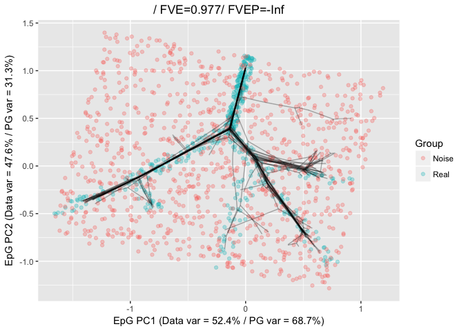

-   [Setup](#setup)
-   [Effect of noisy points](#effect-of-noisy-points)
-   [Density dependent inizialisation and trimming
    radius](#density-dependent-inizialisation-and-trimming-radius)
-   [Density dependent inizialisation and trimming radius and
    bootstrapping](#density-dependent-inizialisation-and-trimming-radius-and-bootstrapping)
-   [Visualizing the effect of the trimming
    radius](#visualizing-the-effect-of-the-trimming-radius)

In real word examples, the data distributions to be approximated can be
*contaminated* by the presence of outliers or points belonging to a
different distribution. To address this aspect, the ElPiGraph.R package
implement two functionalities that can be used to minimize the impact of
these points: density-dependent initialization and trimming radius.

Setup
=====

To show the effect of these features, we will start by generating noisy
datasets from the tree example present in the package, with an increased
intensity of noise. Similar ideas and concepts apply to the construction
of curves as well.

    library(ElPiGraph.R)
    library(igraph)

    ## 
    ## Attaching package: 'igraph'

    ## The following objects are masked from 'package:stats':
    ## 
    ##     decompose, spectrum

    ## The following object is masked from 'package:base':
    ## 
    ##     union

    nPoints <- round(nrow(tree_data)*.5)

    NewPoints <- apply(apply(tree_data, 2, range), 2, function(x){
      runif(n = nPoints, x[1], x[2])
    })

    TD_LowNoise <- rbind(tree_data, NewPoints)
    TD_LowNoise_Cat <- c(rep("Real", nrow(tree_data)), rep("Noise", nrow(NewPoints)))

    nPoints <- nrow(tree_data)*2

    NewPoints <- apply(apply(tree_data, 2, range), 2, function(x){
      runif(n = nPoints, x[1], x[2])
    })

    TD_MedNoise <- rbind(tree_data, NewPoints)
    TD_MedNoise_Cat <- c(rep("Real", nrow(tree_data)), rep("Noise", nrow(NewPoints)))

    nPoints <- nrow(tree_data)*8

    NewPoints <- apply(apply(tree_data, 2, range), 2, function(x){
      runif(n = nPoints, x[1], x[2])
    })

    TD_HighNoise <- rbind(tree_data, NewPoints)
    TD_HighNoise_Cat <- c(rep("Real", nrow(tree_data)), rep("Noise", nrow(NewPoints)))

Effect of noisy points
======================

By default the ElPiGraph algorithm uses all the points and generate the
initial points on the 1st PC of the data. Therefore, noise can affect
significantly the reconstructed tree.

    TreeEPG <- computeElasticPrincipalTree(X = TD_LowNoise, NumNodes = 50,
                                           drawAccuracyComplexity = FALSE, drawEnergy = FALSE, drawPCAView = FALSE, n.cores = 4)

    ## [1] "Creating a sock cluster with 4 nodes"
    ## [1] "Creating a chain in the 1st PC with 2 nodes"
    ## [1] "Constructing tree 1 of 1 / Subset 1 of 1"
    ## [1] "Performing PCA on the data"
    ## [1] "Using standard PCA"
    ## [1] "3 dimensions are being used"
    ## [1] "100% of the original variance has been retained"
    ## [1] "Using a user supplied cluster. Updating the value of X"
    ## [1] "Computing EPG with 50 nodes on 738 points and 3 dimensions"
    ## [1] "Using a user supplied cluster. It must contains the data points in a matrix X"
    ## [1] "Exporting the additional variables to the cluster"
    ## Nodes = 2 3 4 5 6 7 8 9 10 11 12 13 14 15 16 17 18 19 20 21 22 23 24 25 26 27 28 29 30 31 32 33 34 35 36 37 38 39 40 41 42 43 44 45 46 47 48 49 
    ## BARCODE  ENERGY  NNODES  NEDGES  NRIBS   NSTARS  NRAYS   NRAYS2  MSE MSEP    FVE FVEP    UE  UR  URN URN2    URSD
    ## 7||50    0.04324 50  49  34  7   0   0   0.02181 0.02058 0.9679  0.9697  0.02094 0.0004823   0.02411 1.206   0
    ## 11.875 sec elapsed

    PlotPG(X = TD_LowNoise, TargetPG = TreeEPG[[1]], GroupsLab = TD_LowNoise_Cat, DimToPlot = 1:2)

    ## [[1]]

    TreeEPG <- computeElasticPrincipalTree(X = TD_MedNoise, NumNodes = 50,
                                           drawAccuracyComplexity = FALSE, drawEnergy = FALSE, drawPCAView = FALSE, n.cores = 4)

    ## [1] "Creating a sock cluster with 4 nodes"
    ## [1] "Creating a chain in the 1st PC with 2 nodes"
    ## [1] "Constructing tree 1 of 1 / Subset 1 of 1"
    ## [1] "Performing PCA on the data"
    ## [1] "Using standard PCA"
    ## [1] "3 dimensions are being used"
    ## [1] "100% of the original variance has been retained"
    ## [1] "Using a user supplied cluster. Updating the value of X"
    ## [1] "Computing EPG with 50 nodes on 1476 points and 3 dimensions"
    ## [1] "Using a user supplied cluster. It must contains the data points in a matrix X"
    ## [1] "Exporting the additional variables to the cluster"
    ## Nodes = 2 3 4 5 6 7 8 9 10 11 12 13 14 15 16 17 18 19 20 21 22 23 24 25 26 27 28 29 30 31 32 33 34 35 36 37 38 39 40 41 42 43 44 45 46 47 48 49 
    ## BARCODE  ENERGY  NNODES  NEDGES  NRIBS   NSTARS  NRAYS   NRAYS2  MSE MSEP    FVE FVEP    UE  UR  URN URN2    URSD
    ## 1|5||50  0.06049 50  49  35  5   0   0   0.03383 0.03204 0.9582  0.9604  0.02644 0.0002185   0.01092 0.5462  0
    ## 23.924 sec elapsed

    PlotPG(X = TD_MedNoise, TargetPG = TreeEPG[[1]], GroupsLab = TD_MedNoise_Cat, DimToPlot = 1:2)

    ## [[1]]

    TreeEPG <- computeElasticPrincipalTree(X = TD_HighNoise, NumNodes = 50,
                                           drawAccuracyComplexity = FALSE, drawEnergy = FALSE, drawPCAView = FALSE, n.cores = 4)

    ## [1] "Creating a sock cluster with 4 nodes"
    ## [1] "Creating a chain in the 1st PC with 2 nodes"
    ## [1] "Constructing tree 1 of 1 / Subset 1 of 1"
    ## [1] "Performing PCA on the data"
    ## [1] "Using standard PCA"
    ## [1] "3 dimensions are being used"
    ## [1] "100% of the original variance has been retained"
    ## [1] "Using a user supplied cluster. Updating the value of X"
    ## [1] "Computing EPG with 50 nodes on 4428 points and 3 dimensions"
    ## [1] "Using a user supplied cluster. It must contains the data points in a matrix X"
    ## [1] "Exporting the additional variables to the cluster"
    ## Nodes = 2 3 4 5 6 7 8 9 10 11 12 13 14 15 16 17 18 19 20 21 22 23 24 25 26 27 28 29 30 31 32 33 34 35 36 37 38 39 40 41 42 43 44 45 46 47 48 49 
    ## BARCODE  ENERGY  NNODES  NEDGES  NRIBS   NSTARS  NRAYS   NRAYS2  MSE MSEP    FVE FVEP    UE  UR  URN URN2    URSD
    ## 1|0|4||50    0.06942 50  49  36  4   0   0   0.03442 0.03204 0.9619  0.9646  0.0347  0.0002977   0.01489 0.7443  0
    ## 29.285 sec elapsed

    PlotPG(X = TD_HighNoise, TargetPG = TreeEPG[[1]], GroupsLab = TD_HighNoise_Cat, DimToPlot = 1:2)

    ## [[1]]

Density dependent inizialisation and trimming radius
====================================================

To limit the effect of noise, we can specify a trimming radius (which
informs the algorithm to use only points with a distance lower than this
radius when computing the position of the nodes), and use a density
dependent initialization `ICOver = "Density"`. Note that when using
`ICOver = "Density"`, the parameter `DensityRadius`, which is used to
determine the area of the space with the highest density of points, need
to be specified as well.

When a trimming radius is used, tree construction becomes *local*, hence
it may be necessary to increase the number of points in order to better
cover all areas of the space containing the points under consideration.
Moreover certain feature of the topology may be lost due to corruption
due by the noise.

    TreeEPG <- computeElasticPrincipalTree(X = TD_LowNoise, NumNodes = 50,
                                           drawAccuracyComplexity = FALSE, drawEnergy = FALSE, drawPCAView = FALSE,
                                           n.cores = 4,
                                           TrimmingRadius = .15,
                                           ICOver = "Density", DensityRadius = .15)

    ## [1] "Creating a sock cluster with 4 nodes"
    ## [1] "Creating a line in the densest part of the graph. DensityRadius needs to be specified!"
    ## [1] "Constructing tree 1 of 1 / Subset 1 of 1"
    ## [1] "Performing PCA on the data"
    ## [1] "Using standard PCA"
    ## [1] "3 dimensions are being used"
    ## [1] "100% of the original variance has been retained"
    ## [1] "Using a user supplied cluster. Updating the value of X"
    ## [1] "Computing EPG with 50 nodes on 738 points and 3 dimensions"
    ## [1] "Using a user supplied cluster. It must contains the data points in a matrix X"
    ## [1] "Exporting the additional variables to the cluster"
    ## Nodes = 2 3 4 5 6 7 8 9 10 11 12 13 14 15 16 17 18 19 20 21 22 23 24 25 26 27 28 29 30 31 32 33 34 35 36 37 38 39 40 41 42 43 44 45 46 47 48 49 
    ## BARCODE  ENERGY  NNODES  NEDGES  NRIBS   NSTARS  NRAYS   NRAYS2  MSE MSEP    FVE FVEP    UE  UR  URN URN2    URSD
    ## 1|3||50  0.1019  50  49  39  3   0   0   0.09409 Inf 0.8615  -Inf    0.007783    5.928e-05   0.002964    0.1482  0
    ## 22.125 sec elapsed

    PlotPG(X = TD_LowNoise, TargetPG = TreeEPG[[1]], GroupsLab = TD_LowNoise_Cat, DimToPlot = 1:2)

    ## [[1]]

    TreeEPG <- computeElasticPrincipalTree(X = TD_MedNoise, NumNodes = 50,
                                           drawAccuracyComplexity = FALSE, drawEnergy = FALSE, drawPCAView = FALSE,
                                           n.cores = 4,
                                           TrimmingRadius = .15,
                                           ICOver = "Density", DensityRadius = .15)

    ## [1] "Creating a sock cluster with 4 nodes"
    ## [1] "Creating a line in the densest part of the graph. DensityRadius needs to be specified!"
    ## [1] "Constructing tree 1 of 1 / Subset 1 of 1"
    ## [1] "Performing PCA on the data"
    ## [1] "Using standard PCA"
    ## [1] "3 dimensions are being used"
    ## [1] "100% of the original variance has been retained"
    ## [1] "Using a user supplied cluster. Updating the value of X"
    ## [1] "Computing EPG with 50 nodes on 1476 points and 3 dimensions"
    ## [1] "Using a user supplied cluster. It must contains the data points in a matrix X"
    ## [1] "Exporting the additional variables to the cluster"
    ## Nodes = 2 3 4 5 6 7 8 9 10 11 12 13 14 15 16 17 18 19 20 21 22 23 24 25 26 27 28 29 30 31 32 33 34 35 36 37 38 39 40 41 42 43 44 45 46 47 48 49 
    ## BARCODE  ENERGY  NNODES  NEDGES  NRIBS   NSTARS  NRAYS   NRAYS2  MSE MSEP    FVE FVEP    UE  UR  URN URN2    URSD
    ## 4||50    0.1601  50  49  40  4   0   0   0.1536  Inf 0.8101  -Inf    0.006474    2.614e-05   0.001307    0.06534 0
    ## 21.406 sec elapsed

    PlotPG(X = TD_MedNoise, TargetPG = TreeEPG[[1]], GroupsLab = TD_MedNoise_Cat, DimToPlot = 1:2)

    ## [[1]]

    TreeEPG <- computeElasticPrincipalTree(X = TD_HighNoise, NumNodes = 50,
                                           drawAccuracyComplexity = FALSE, drawEnergy = FALSE, drawPCAView = FALSE,
                                           n.cores = 4,
                                           TrimmingRadius = .15,
                                           ICOver = "Density", DensityRadius = .15)

    ## [1] "Creating a sock cluster with 4 nodes"
    ## [1] "Creating a line in the densest part of the graph. DensityRadius needs to be specified!"
    ## [1] "Constructing tree 1 of 1 / Subset 1 of 1"
    ## [1] "Performing PCA on the data"
    ## [1] "Using standard PCA"
    ## [1] "3 dimensions are being used"
    ## [1] "100% of the original variance has been retained"
    ## [1] "Using a user supplied cluster. Updating the value of X"
    ## [1] "Computing EPG with 50 nodes on 4428 points and 3 dimensions"
    ## [1] "Using a user supplied cluster. It must contains the data points in a matrix X"
    ## [1] "Exporting the additional variables to the cluster"
    ## Nodes = 2 3 4 5 6 7 8 9 10 11 12 13 14 15 16 17 18 19 20 21 22 23 24 25 26 27 28 29 30 31 32 33 34 35 36 37 38 39 40 41 42 43 44 45 46 47 48 49 
    ## BARCODE  ENERGY  NNODES  NEDGES  NRIBS   NSTARS  NRAYS   NRAYS2  MSE MSEP    FVE FVEP    UE  UR  URN URN2    URSD
    ## 1||50    0.3318  50  49  46  1   0   0   0.3298  Inf 0.6352  -Inf    0.001968    3.924e-06   0.0001962   0.00981 0
    ## 25.035 sec elapsed

    PlotPG(X = TD_HighNoise, TargetPG = TreeEPG[[1]], GroupsLab = TD_HighNoise_Cat, DimToPlot = 1:2)

    ## [[1]]

Density dependent inizialisation and trimming radius and bootstrapping
======================================================================

To further address the problem of noise in the data it advisable to use
bootstrapping. To enable bootstrapping it is sufficient to use the
parameter `nReps`, which defines the number of repetitions, and
`ProbPoint`, which defines the probability of selecting a point in each
iteration. Bootstrapping can be also helpfull to mitigate the effect of
outliers in the data, when the trimming radius is unspecified.

Note that when bootstrapped is enabled (i.e. when `nRep` is larger than
1), an average graph is generated by using the nodes of the graph
generated during the single execution of the algorithm. Hence if `nRep`
is equalt to n, the returned lists will contain n+1 ElPiGraph
structures: the n repetitions, and the final average graph.

Visualization of bootstrapped data can be easilty perfomred via the
`PlorPG` function. To this end, it is sufficient to pass the
bootstrapped structures via the `BootPG` parameter. Currently a primary
ElPiGraph structure is required (the `TargetPG` parameter).

It is further possible to control if the bootstrapped and target graphs
shoudl be plotted via the `VizMode` parameter.

    nRep <- 20

    TreeEPG <- computeElasticPrincipalTree(X = tree_data, NumNodes = 50,
                                           drawAccuracyComplexity = FALSE, drawEnergy = FALSE,
                                           drawPCAView = FALSE,
                                           n.cores = 4,
                                           nReps = nRep, ProbPoint = .8,
                                           TrimmingRadius = Inf,
                                           ICOver = "DensityProb", DensityRadius = .3)

    ## [1] "Creating a sock cluster with 4 nodes"
    ## [1] "Creating a line in the densest part of the graph. DensityRadius needs to be specified!"
    ## [1] "Constructing tree 1 of 20 / Subset 1 of 1"
    ## [1] "Performing PCA on the data"
    ## [1] "Using standard PCA"
    ## [1] "3 dimensions are being used"
    ## [1] "100% of the original variance has been retained"
    ## [1] "Using a user supplied cluster. Updating the value of X"
    ## [1] "Computing EPG with 50 nodes on 407 points and 3 dimensions"
    ## [1] "Using a user supplied cluster. It must contains the data points in a matrix X"
    ## [1] "Exporting the additional variables to the cluster"
    ## Nodes = 2 3 4 5 6 7 8 9 10 11 12 13 14 15 16 17 18 19 20 21 22 23 24 25 26 27 28 29 30 31 32 33 34 35 36 37 38 39 40 41 42 43 44 45 46 47 48 49 
    ## BARCODE  ENERGY  NNODES  NEDGES  NRIBS   NSTARS  NRAYS   NRAYS2  MSE MSEP    FVE FVEP    UE  UR  URN URN2    URSD
    ## 1|3||50  0.01549 50  49  39  3   0   0   0.004223    0.003548    0.992   0.9933  0.01109 0.0001693   0.008463    0.4232  0
    ## 17.74 sec elapsed
    ## [1] "Creating a line in the densest part of the graph. DensityRadius needs to be specified!"
    ## [1] "Constructing tree 2 of 20 / Subset 1 of 1"
    ## [1] "Performing PCA on the data"
    ## [1] "Using standard PCA"
    ## [1] "3 dimensions are being used"
    ## [1] "100% of the original variance has been retained"
    ## [1] "Using a user supplied cluster. Updating the value of X"
    ## [1] "Computing EPG with 50 nodes on 385 points and 3 dimensions"
    ## [1] "Using a user supplied cluster. It must contains the data points in a matrix X"
    ## [1] "Exporting the additional variables to the cluster"
    ## Nodes = 2 3 4 5 6 7 8 9 10 11 12 13 14 15 16 17 18 19 20 21 22 23 24 25 26 27 28 29 30 31 32 33 34 35 36 37 38 39 40 41 42 43 44 45 46 47 48 49 
    ## BARCODE  ENERGY  NNODES  NEDGES  NRIBS   NSTARS  NRAYS   NRAYS2  MSE MSEP    FVE FVEP    UE  UR  URN URN2    URSD
    ## 1|3||50  0.01561 50  49  39  3   0   0   0.004097    0.0034  0.992   0.9934  0.01137 0.0001429   0.007144    0.3572  0
    ## 16.751 sec elapsed
    ## [1] "Creating a line in the densest part of the graph. DensityRadius needs to be specified!"
    ## [1] "Constructing tree 3 of 20 / Subset 1 of 1"
    ## [1] "Performing PCA on the data"
    ## [1] "Using standard PCA"
    ## [1] "3 dimensions are being used"
    ## [1] "100% of the original variance has been retained"
    ## [1] "Using a user supplied cluster. Updating the value of X"
    ## [1] "Computing EPG with 50 nodes on 396 points and 3 dimensions"
    ## [1] "Using a user supplied cluster. It must contains the data points in a matrix X"
    ## [1] "Exporting the additional variables to the cluster"
    ## Nodes = 2 3 4 5 6 7 8 9 10 11 12 13 14 15 16 17 18 19 20 21 22 23 24 25 26 27 28 29 30 31 32 33 34 35 36 37 38 39 40 41 42 43 44 45 46 47 48 49 
    ## BARCODE  ENERGY  NNODES  NEDGES  NRIBS   NSTARS  NRAYS   NRAYS2  MSE MSEP    FVE FVEP    UE  UR  URN URN2    URSD
    ## 1|3||50  0.0158  50  49  39  3   0   0   0.004186    0.00353 0.9922  0.9934  0.01142 0.0002006   0.01003 0.5016  0
    ## 16.631 sec elapsed
    ## [1] "Creating a line in the densest part of the graph. DensityRadius needs to be specified!"
    ## [1] "Graphical output will be suppressed for the remaining replicas"
    ## [1] "Constructing tree 4 of 20 / Subset 1 of 1"
    ## [1] "Performing PCA on the data"
    ## [1] "Using standard PCA"
    ## [1] "3 dimensions are being used"
    ## [1] "100% of the original variance has been retained"
    ## [1] "Using a user supplied cluster. Updating the value of X"
    ## [1] "Computing EPG with 50 nodes on 392 points and 3 dimensions"
    ## [1] "Using a user supplied cluster. It must contains the data points in a matrix X"
    ## [1] "Exporting the additional variables to the cluster"
    ## Nodes = 2 3 4 5 6 7 8 9 10 11 12 13 14 15 16 17 18 19 20 21 22 23 24 25 26 27 28 29 30 31 32 33 34 35 36 37 38 39 40 41 42 43 44 45 46 47 48 49 
    ## BARCODE  ENERGY  NNODES  NEDGES  NRIBS   NSTARS  NRAYS   NRAYS2  MSE MSEP    FVE FVEP    UE  UR  URN URN2    URSD
    ## 1|3||50  0.01587 50  49  39  3   0   0   0.004284    0.003527    0.9922  0.9936  0.0114  0.0001878   0.009391    0.4695  0
    ## 15.975 sec elapsed
    ## [1] "Creating a line in the densest part of the graph. DensityRadius needs to be specified!"
    ## [1] "Constructing tree 5 of 20 / Subset 1 of 1"
    ## [1] "Performing PCA on the data"
    ## [1] "Using standard PCA"
    ## [1] "3 dimensions are being used"
    ## [1] "100% of the original variance has been retained"
    ## [1] "Using a user supplied cluster. Updating the value of X"
    ## [1] "Computing EPG with 50 nodes on 399 points and 3 dimensions"
    ## [1] "Using a user supplied cluster. It must contains the data points in a matrix X"
    ## [1] "Exporting the additional variables to the cluster"
    ## Nodes = 2 3 4 5 6 7 8 9 10 11 12 13 14 15 16 17 18 19 20 21 22 23 24 25 26 27 28 29 30 31 32 33 34 35 36 37 38 39 40 41 42 43 44 45 46 47 48 49 
    ## BARCODE  ENERGY  NNODES  NEDGES  NRIBS   NSTARS  NRAYS   NRAYS2  MSE MSEP    FVE FVEP    UE  UR  URN URN2    URSD
    ## 6||50    0.01581 50  49  36  6   0   0   0.00445 0.003786    0.9916  0.9928  0.01112 0.0002393   0.01196 0.5982  0
    ## 17.31 sec elapsed
    ## [1] "Creating a line in the densest part of the graph. DensityRadius needs to be specified!"
    ## [1] "Constructing tree 6 of 20 / Subset 1 of 1"
    ## [1] "Performing PCA on the data"
    ## [1] "Using standard PCA"
    ## [1] "3 dimensions are being used"
    ## [1] "100% of the original variance has been retained"
    ## [1] "Using a user supplied cluster. Updating the value of X"
    ## [1] "Computing EPG with 50 nodes on 391 points and 3 dimensions"
    ## [1] "Using a user supplied cluster. It must contains the data points in a matrix X"
    ## [1] "Exporting the additional variables to the cluster"
    ## Nodes = 2 3 4 5 6 7 8 9 10 11 12 13 14 15 16 17 18 19 20 21 22 23 24 25 26 27 28 29 30 31 32 33 34 35 36 37 38 39 40 41 42 43 44 45 46 47 48 49 
    ## BARCODE  ENERGY  NNODES  NEDGES  NRIBS   NSTARS  NRAYS   NRAYS2  MSE MSEP    FVE FVEP    UE  UR  URN URN2    URSD
    ## 1|3||50  0.01586 50  49  39  3   0   0   0.004037    0.003327    0.9925  0.9939  0.01156 0.0002679   0.0134  0.6698  0
    ## 16.828 sec elapsed
    ## [1] "Creating a line in the densest part of the graph. DensityRadius needs to be specified!"
    ## [1] "Constructing tree 7 of 20 / Subset 1 of 1"
    ## [1] "Performing PCA on the data"
    ## [1] "Using standard PCA"
    ## [1] "3 dimensions are being used"
    ## [1] "100% of the original variance has been retained"
    ## [1] "Using a user supplied cluster. Updating the value of X"
    ## [1] "Computing EPG with 50 nodes on 391 points and 3 dimensions"
    ## [1] "Using a user supplied cluster. It must contains the data points in a matrix X"
    ## [1] "Exporting the additional variables to the cluster"
    ## Nodes = 2 3 4 5 6 7 8 9 10 11 12 13 14 15 16 17 18 19 20 21 22 23 24 25 26 27 28 29 30 31 32 33 34 35 36 37 38 39 40 41 42 43 44 45 46 47 48 49 
    ## BARCODE  ENERGY  NNODES  NEDGES  NRIBS   NSTARS  NRAYS   NRAYS2  MSE MSEP    FVE FVEP    UE  UR  URN URN2    URSD
    ## 1|3||50  0.01596 50  49  39  3   0   0   0.004905    0.004219    0.9905  0.9918  0.01078 0.0002805   0.01402 0.7012  0
    ## 15.969 sec elapsed
    ## [1] "Creating a line in the densest part of the graph. DensityRadius needs to be specified!"
    ## [1] "Constructing tree 8 of 20 / Subset 1 of 1"
    ## [1] "Performing PCA on the data"
    ## [1] "Using standard PCA"
    ## [1] "3 dimensions are being used"
    ## [1] "100% of the original variance has been retained"
    ## [1] "Using a user supplied cluster. Updating the value of X"
    ## [1] "Computing EPG with 50 nodes on 397 points and 3 dimensions"
    ## [1] "Using a user supplied cluster. It must contains the data points in a matrix X"
    ## [1] "Exporting the additional variables to the cluster"
    ## Nodes = 2 3 4 5 6 7 8 9 10 11 12 13 14 15 16 17 18 19 20 21 22 23 24 25 26 27 28 29 30 31 32 33 34 35 36 37 38 39 40 41 42 43 44 45 46 47 48 49 
    ## BARCODE  ENERGY  NNODES  NEDGES  NRIBS   NSTARS  NRAYS   NRAYS2  MSE MSEP    FVE FVEP    UE  UR  URN URN2    URSD
    ## 1|2||50  0.01551 50  49  41  2   0   0   0.004026    0.003382    0.9927  0.9939  0.01109 0.0003891   0.01945 0.9727  0
    ## 16.789 sec elapsed
    ## [1] "Creating a line in the densest part of the graph. DensityRadius needs to be specified!"
    ## [1] "Constructing tree 9 of 20 / Subset 1 of 1"
    ## [1] "Performing PCA on the data"
    ## [1] "Using standard PCA"
    ## [1] "3 dimensions are being used"
    ## [1] "100% of the original variance has been retained"
    ## [1] "Using a user supplied cluster. Updating the value of X"
    ## [1] "Computing EPG with 50 nodes on 404 points and 3 dimensions"
    ## [1] "Using a user supplied cluster. It must contains the data points in a matrix X"
    ## [1] "Exporting the additional variables to the cluster"
    ## Nodes = 2 3 4 5 6 7 8 9 10 11 12 13 14 15 16 17 18 19 20 21 22 23 24 25 26 27 28 29 30 31 32 33 34 35 36 37 38 39 40 41 42 43 44 45 46 47 48 49 
    ## BARCODE  ENERGY  NNODES  NEDGES  NRIBS   NSTARS  NRAYS   NRAYS2  MSE MSEP    FVE FVEP    UE  UR  URN URN2    URSD
    ## 1|2||50  0.01549 50  49  41  2   0   0   0.004039    0.003318    0.9926  0.9939  0.01101 0.0004419   0.0221  1.105   0
    ## 17.321 sec elapsed
    ## [1] "Creating a line in the densest part of the graph. DensityRadius needs to be specified!"
    ## [1] "Constructing tree 10 of 20 / Subset 1 of 1"
    ## [1] "Performing PCA on the data"
    ## [1] "Using standard PCA"
    ## [1] "3 dimensions are being used"
    ## [1] "100% of the original variance has been retained"
    ## [1] "Using a user supplied cluster. Updating the value of X"
    ## [1] "Computing EPG with 50 nodes on 383 points and 3 dimensions"
    ## [1] "Using a user supplied cluster. It must contains the data points in a matrix X"
    ## [1] "Exporting the additional variables to the cluster"
    ## Nodes = 2 3 4 5 6 7 8 9 10 11 12 13 14 15 16 17 18 19 20 21 22 23 24 25 26 27 28 29 30 31 32 33 34 35 36 37 38 39 40 41 42 43 44 45 46 47 48 49 
    ## BARCODE  ENERGY  NNODES  NEDGES  NRIBS   NSTARS  NRAYS   NRAYS2  MSE MSEP    FVE FVEP    UE  UR  URN URN2    URSD
    ## 1|3||50  0.01573 50  49  39  3   0   0   0.004033    0.003324    0.993   0.9942  0.01146 0.0002345   0.01172 0.5861  0
    ## 17.805 sec elapsed
    ## [1] "Creating a line in the densest part of the graph. DensityRadius needs to be specified!"
    ## [1] "Constructing tree 11 of 20 / Subset 1 of 1"
    ## [1] "Performing PCA on the data"
    ## [1] "Using standard PCA"
    ## [1] "3 dimensions are being used"
    ## [1] "100% of the original variance has been retained"
    ## [1] "Using a user supplied cluster. Updating the value of X"
    ## [1] "Computing EPG with 50 nodes on 410 points and 3 dimensions"
    ## [1] "Using a user supplied cluster. It must contains the data points in a matrix X"
    ## [1] "Exporting the additional variables to the cluster"
    ## Nodes = 2 3 4 5 6 7 8 9 10 11 12 13 14 15 16 17 18 19 20 21 22 23 24 25 26 27 28 29 30 31 32 33 34 35 36 37 38 39 40 41 42 43 44 45 46 47 48 49 
    ## BARCODE  ENERGY  NNODES  NEDGES  NRIBS   NSTARS  NRAYS   NRAYS2  MSE MSEP    FVE FVEP    UE  UR  URN URN2    URSD
    ## 1|2||50  0.01588 50  49  41  2   0   0   0.004394    0.003693    0.9921  0.9934  0.01105 0.0004412   0.02206 1.103   0
    ## 16.468 sec elapsed
    ## [1] "Creating a line in the densest part of the graph. DensityRadius needs to be specified!"
    ## [1] "Constructing tree 12 of 20 / Subset 1 of 1"
    ## [1] "Performing PCA on the data"
    ## [1] "Using standard PCA"
    ## [1] "3 dimensions are being used"
    ## [1] "100% of the original variance has been retained"
    ## [1] "Using a user supplied cluster. Updating the value of X"
    ## [1] "Computing EPG with 50 nodes on 380 points and 3 dimensions"
    ## [1] "Using a user supplied cluster. It must contains the data points in a matrix X"
    ## [1] "Exporting the additional variables to the cluster"
    ## Nodes = 2 3 4 5 6 7 8 9 10 11 12 13 14 15 16 17 18 19 20 21 22 23 24 25 26 27 28 29 30 31 32 33 34 35 36 37 38 39 40 41 42 43 44 45 46 47 48 49 
    ## BARCODE  ENERGY  NNODES  NEDGES  NRIBS   NSTARS  NRAYS   NRAYS2  MSE MSEP    FVE FVEP    UE  UR  URN URN2    URSD
    ## 1|2||50  0.0156  50  49  41  2   0   0   0.004058    0.003407    0.9925  0.9937  0.01112 0.0004255   0.02128 1.064   0
    ## 16.974 sec elapsed
    ## [1] "Creating a line in the densest part of the graph. DensityRadius needs to be specified!"
    ## [1] "Constructing tree 13 of 20 / Subset 1 of 1"
    ## [1] "Performing PCA on the data"
    ## [1] "Using standard PCA"
    ## [1] "3 dimensions are being used"
    ## [1] "100% of the original variance has been retained"
    ## [1] "Using a user supplied cluster. Updating the value of X"
    ## [1] "Computing EPG with 50 nodes on 387 points and 3 dimensions"
    ## [1] "Using a user supplied cluster. It must contains the data points in a matrix X"
    ## [1] "Exporting the additional variables to the cluster"
    ## Nodes = 2 3 4 5 6 7 8 9 10 11 12 13 14 15 16 17 18 19 20 21 22 23 24 25 26 27 28 29 30 31 32 33 34 35 36 37 38 39 40 41 42 43 44 45 46 47 48 49 
    ## BARCODE  ENERGY  NNODES  NEDGES  NRIBS   NSTARS  NRAYS   NRAYS2  MSE MSEP    FVE FVEP    UE  UR  URN URN2    URSD
    ## 1|3||50  0.01562 50  49  39  3   0   0   0.00428 0.003535    0.992   0.9934  0.0111  0.0002363   0.01182 0.5908  0
    ## 16.798 sec elapsed
    ## [1] "Creating a line in the densest part of the graph. DensityRadius needs to be specified!"
    ## [1] "Constructing tree 14 of 20 / Subset 1 of 1"
    ## [1] "Performing PCA on the data"
    ## [1] "Using standard PCA"
    ## [1] "3 dimensions are being used"
    ## [1] "100% of the original variance has been retained"
    ## [1] "Using a user supplied cluster. Updating the value of X"
    ## [1] "Computing EPG with 50 nodes on 394 points and 3 dimensions"
    ## [1] "Using a user supplied cluster. It must contains the data points in a matrix X"
    ## [1] "Exporting the additional variables to the cluster"
    ## Nodes = 2 3 4 5 6 7 8 9 10 11 12 13 14 15 16 17 18 19 20 21 22 23 24 25 26 27 28 29 30 31 32 33 34 35 36 37 38 39 40 41 42 43 44 45 46 47 48 49 
    ## BARCODE  ENERGY  NNODES  NEDGES  NRIBS   NSTARS  NRAYS   NRAYS2  MSE MSEP    FVE FVEP    UE  UR  URN URN2    URSD
    ## 1|3||50  0.01546 50  49  39  3   0   0   0.003882    0.003217    0.9927  0.994   0.01136 0.0002175   0.01088 0.5439  0
    ## 16.515 sec elapsed
    ## [1] "Creating a line in the densest part of the graph. DensityRadius needs to be specified!"
    ## [1] "Constructing tree 15 of 20 / Subset 1 of 1"
    ## [1] "Performing PCA on the data"
    ## [1] "Using standard PCA"
    ## [1] "3 dimensions are being used"
    ## [1] "100% of the original variance has been retained"
    ## [1] "Using a user supplied cluster. Updating the value of X"
    ## [1] "Computing EPG with 50 nodes on 394 points and 3 dimensions"
    ## [1] "Using a user supplied cluster. It must contains the data points in a matrix X"
    ## [1] "Exporting the additional variables to the cluster"
    ## Nodes = 2 3 4 5 6 7 8 9 10 11 12 13 14 15 16 17 18 19 20 21 22 23 24 25 26 27 28 29 30 31 32 33 34 35 36 37 38 39 40 41 42 43 44 45 46 47 48 49 
    ## BARCODE  ENERGY  NNODES  NEDGES  NRIBS   NSTARS  NRAYS   NRAYS2  MSE MSEP    FVE FVEP    UE  UR  URN URN2    URSD
    ## 1|3||50  0.01589 50  49  39  3   0   0   0.004135    0.00345 0.9922  0.9935  0.01151 0.0002429   0.01215 0.6073  0
    ## 16.503 sec elapsed
    ## [1] "Creating a line in the densest part of the graph. DensityRadius needs to be specified!"
    ## [1] "Constructing tree 16 of 20 / Subset 1 of 1"
    ## [1] "Performing PCA on the data"
    ## [1] "Using standard PCA"
    ## [1] "3 dimensions are being used"
    ## [1] "100% of the original variance has been retained"
    ## [1] "Using a user supplied cluster. Updating the value of X"
    ## [1] "Computing EPG with 50 nodes on 413 points and 3 dimensions"
    ## [1] "Using a user supplied cluster. It must contains the data points in a matrix X"
    ## [1] "Exporting the additional variables to the cluster"
    ## Nodes = 2 3 4 5 6 7 8 9 10 11 12 13 14 15 16 17 18 19 20 21 22 23 24 25 26 27 28 29 30 31 32 33 34 35 36 37 38 39 40 41 42 43 44 45 46 47 48 49 
    ## BARCODE  ENERGY  NNODES  NEDGES  NRIBS   NSTARS  NRAYS   NRAYS2  MSE MSEP    FVE FVEP    UE  UR  URN URN2    URSD
    ## 1|3||50  0.01546 50  49  39  3   0   0   0.003906    0.003229    0.9927  0.9939  0.01138 0.0001809   0.009047    0.4523  0
    ## 17.021 sec elapsed
    ## [1] "Creating a line in the densest part of the graph. DensityRadius needs to be specified!"
    ## [1] "Constructing tree 17 of 20 / Subset 1 of 1"
    ## [1] "Performing PCA on the data"
    ## [1] "Using standard PCA"
    ## [1] "3 dimensions are being used"
    ## [1] "100% of the original variance has been retained"
    ## [1] "Using a user supplied cluster. Updating the value of X"
    ## [1] "Computing EPG with 50 nodes on 382 points and 3 dimensions"
    ## [1] "Using a user supplied cluster. It must contains the data points in a matrix X"
    ## [1] "Exporting the additional variables to the cluster"
    ## Nodes = 2 3 4 5 6 7 8 9 10 11 12 13 14 15 16 17 18 19 20 21 22 23 24 25 26 27 28 29 30 31 32 33 34 35 36 37 38 39 40 41 42 43 44 45 46 47 48 49 
    ## BARCODE  ENERGY  NNODES  NEDGES  NRIBS   NSTARS  NRAYS   NRAYS2  MSE MSEP    FVE FVEP    UE  UR  URN URN2    URSD
    ## 1|2||50  0.01611 50  49  41  2   0   0   0.004269    0.003526    0.9922  0.9935  0.01135 0.0004919   0.02459 1.23    0
    ## 16.871 sec elapsed
    ## [1] "Creating a line in the densest part of the graph. DensityRadius needs to be specified!"
    ## [1] "Constructing tree 18 of 20 / Subset 1 of 1"
    ## [1] "Performing PCA on the data"
    ## [1] "Using standard PCA"
    ## [1] "3 dimensions are being used"
    ## [1] "100% of the original variance has been retained"
    ## [1] "Using a user supplied cluster. Updating the value of X"
    ## [1] "Computing EPG with 50 nodes on 396 points and 3 dimensions"
    ## [1] "Using a user supplied cluster. It must contains the data points in a matrix X"
    ## [1] "Exporting the additional variables to the cluster"
    ## Nodes = 2 3 4 5 6 7 8 9 10 11 12 13 14 15 16 17 18 19 20 21 22 23 24 25 26 27 28 29 30 31 32 33 34 35 36 37 38 39 40 41 42 43 44 45 46 47 48 49 
    ## BARCODE  ENERGY  NNODES  NEDGES  NRIBS   NSTARS  NRAYS   NRAYS2  MSE MSEP    FVE FVEP    UE  UR  URN URN2    URSD
    ## 1|2||50  0.01505 50  49  41  2   0   0   0.004223    0.003507    0.9922  0.9935  0.01046 0.0003645   0.01823 0.9113  0
    ## 17.664 sec elapsed
    ## [1] "Creating a line in the densest part of the graph. DensityRadius needs to be specified!"
    ## [1] "Constructing tree 19 of 20 / Subset 1 of 1"
    ## [1] "Performing PCA on the data"
    ## [1] "Using standard PCA"
    ## [1] "3 dimensions are being used"
    ## [1] "100% of the original variance has been retained"
    ## [1] "Using a user supplied cluster. Updating the value of X"
    ## [1] "Computing EPG with 50 nodes on 386 points and 3 dimensions"
    ## [1] "Using a user supplied cluster. It must contains the data points in a matrix X"
    ## [1] "Exporting the additional variables to the cluster"
    ## Nodes = 2 3 4 5 6 7 8 9 10 11 12 13 14 15 16 17 18 19 20 21 22 23 24 25 26 27 28 29 30 31 32 33 34 35 36 37 38 39 40 41 42 43 44 45 46 47 48 49 
    ## BARCODE  ENERGY  NNODES  NEDGES  NRIBS   NSTARS  NRAYS   NRAYS2  MSE MSEP    FVE FVEP    UE  UR  URN URN2    URSD
    ## 1|3||50  0.01593 50  49  39  3   0   0   0.004296    0.003628    0.9921  0.9933  0.01145 0.0001855   0.009277    0.4639  0
    ## 17.404 sec elapsed
    ## [1] "Creating a line in the densest part of the graph. DensityRadius needs to be specified!"
    ## [1] "Constructing tree 20 of 20 / Subset 1 of 1"
    ## [1] "Performing PCA on the data"
    ## [1] "Using standard PCA"
    ## [1] "3 dimensions are being used"
    ## [1] "100% of the original variance has been retained"
    ## [1] "Using a user supplied cluster. Updating the value of X"
    ## [1] "Computing EPG with 50 nodes on 408 points and 3 dimensions"
    ## [1] "Using a user supplied cluster. It must contains the data points in a matrix X"
    ## [1] "Exporting the additional variables to the cluster"
    ## Nodes = 2 3 4 5 6 7 8 9 10 11 12 13 14 15 16 17 18 19 20 21 22 23 24 25 26 27 28 29 30 31 32 33 34 35 36 37 38 39 40 41 42 43 44 45 46 47 48 49 
    ## BARCODE  ENERGY  NNODES  NEDGES  NRIBS   NSTARS  NRAYS   NRAYS2  MSE MSEP    FVE FVEP    UE  UR  URN URN2    URSD
    ## 1|3||50  0.01551 50  49  39  3   0   0   0.003897    0.003213    0.9928  0.994   0.01145 0.0001653   0.008265    0.4133  0
    ## 17.83 sec elapsed
    ## [1] "Constructing average tree"
    ## [1] "Creating a line in the densest part of the graph. DensityRadius needs to be specified!"
    ## [1] "Performing PCA on the data"
    ## [1] "Using standard PCA"
    ## [1] "3 dimensions are being used"
    ## [1] "100% of the original variance has been retained"
    ## [1] "Computing EPG with 50 nodes on 1000 points and 3 dimensions"
    ## [1] "Using a single core"
    ## Nodes = 2 3 4 5 6 7 8 9 10 11 12 13 14 15 16 17 18 19 20 21 22 23 24 25 26 27 28 29 30 31 32 33 34 35 36 37 38 39 40 41 42 43 44 45 46 47 48 49 
    ## BARCODE  ENERGY  NNODES  NEDGES  NRIBS   NSTARS  NRAYS   NRAYS2  MSE MSEP    FVE FVEP    UE  UR  URN URN2    URSD
    ## 1|3||50  0.01088 50  49  39  3   0   0   0.001641    0.001193    0.9968  0.9977  0.009133    0.0001072   0.005359    0.268   0
    ## 9.252 sec elapsed

    PlotPG(X = tree_data, BootPG = TreeEPG[1:nRep], TargetPG = TreeEPG[[nRep+1]], DimToPlot = 1:2, VizMode = c("Target", "Boot"))

    ## [[1]]

    PlotPG(X = tree_data, BootPG = TreeEPG[1:nRep], TargetPG = TreeEPG[[nRep+1]], DimToPlot = 1:2, VizMode = "Boot")

    ## [[1]]

    PlotPG(X = tree_data, TargetPG = TreeEPG[[nRep+1]], DimToPlot = 1:2)

    ## [[1]]

    nRep <- 20

    TreeEPG <- computeElasticPrincipalTree(X = TD_LowNoise, NumNodes = 50,
                                           drawAccuracyComplexity = FALSE, drawEnergy = FALSE,
                                           drawPCAView = FALSE,
                                           n.cores = 4,
                                           nReps = nRep, ProbPoint = .9,
                                           TrimmingRadius = .155,
                                           ICOver = "DensityProb", DensityRadius = .155)

    ## [1] "Creating a sock cluster with 4 nodes"
    ## [1] "Creating a line in the densest part of the graph. DensityRadius needs to be specified!"
    ## [1] "Constructing tree 1 of 20 / Subset 1 of 1"
    ## [1] "Performing PCA on the data"
    ## [1] "Using standard PCA"
    ## [1] "3 dimensions are being used"
    ## [1] "100% of the original variance has been retained"
    ## [1] "Using a user supplied cluster. Updating the value of X"
    ## [1] "Computing EPG with 50 nodes on 674 points and 3 dimensions"
    ## [1] "Using a user supplied cluster. It must contains the data points in a matrix X"
    ## [1] "Exporting the additional variables to the cluster"
    ## Nodes = 2 3 4 5 6 7 8 9 10 11 12 13 14 15 16 17 18 19 20 21 22 23 24 25 26 27 28 29 30 31 32 33 34 35 36 37 38 39 40 41 42 43 44 45 46 47 48 49 
    ## BARCODE  ENERGY  NNODES  NEDGES  NRIBS   NSTARS  NRAYS   NRAYS2  MSE MSEP    FVE FVEP    UE  UR  URN URN2    URSD
    ## 5||50    0.09967 50  49  38  5   0   0   0.09076 Inf 0.8649  -Inf    0.008838    6.769e-05   0.003385    0.1692  0
    ## 18.581 sec elapsed
    ## [1] "Creating a line in the densest part of the graph. DensityRadius needs to be specified!"
    ## [1] "Constructing tree 2 of 20 / Subset 1 of 1"
    ## [1] "Performing PCA on the data"
    ## [1] "Using standard PCA"
    ## [1] "3 dimensions are being used"
    ## [1] "100% of the original variance has been retained"
    ## [1] "Using a user supplied cluster. Updating the value of X"
    ## [1] "Computing EPG with 50 nodes on 664 points and 3 dimensions"
    ## [1] "Using a user supplied cluster. It must contains the data points in a matrix X"
    ## [1] "Exporting the additional variables to the cluster"
    ## Nodes = 2 3 4 5 6 7 8 9 10 11 12 13 14 15 16 17 18 19 20 21 22 23 24 25 26 27 28 29 30 31 32 33 34 35 36 37 38 39 40 41 42 43 44 45 46 47 48 49 
    ## BARCODE  ENERGY  NNODES  NEDGES  NRIBS   NSTARS  NRAYS   NRAYS2  MSE MSEP    FVE FVEP    UE  UR  URN URN2    URSD
    ## 6||50    0.09261 50  49  36  6   0   0   0.08366 Inf 0.8756  -Inf    0.008901    4.391e-05   0.002196    0.1098  0
    ## 16.208 sec elapsed
    ## [1] "Creating a line in the densest part of the graph. DensityRadius needs to be specified!"
    ## [1] "Constructing tree 3 of 20 / Subset 1 of 1"
    ## [1] "Performing PCA on the data"
    ## [1] "Using standard PCA"
    ## [1] "3 dimensions are being used"
    ## [1] "100% of the original variance has been retained"
    ## [1] "Using a user supplied cluster. Updating the value of X"
    ## [1] "Computing EPG with 50 nodes on 672 points and 3 dimensions"
    ## [1] "Using a user supplied cluster. It must contains the data points in a matrix X"
    ## [1] "Exporting the additional variables to the cluster"
    ## Nodes = 2 3 4 5 6 7 8 9 10 11 12 13 14 15 16 17 18 19 20 21 22 23 24 25 26 27 28 29 30 31 32 33 34 35 36 37 38 39 40 41 42 43 44 45 46 47 48 49 
    ## BARCODE  ENERGY  NNODES  NEDGES  NRIBS   NSTARS  NRAYS   NRAYS2  MSE MSEP    FVE FVEP    UE  UR  URN URN2    URSD
    ## 6||50    0.09199 50  49  36  6   0   0   0.08288 Inf 0.8766  -Inf    0.009058    5.442e-05   0.002721    0.136   0
    ## 16.095 sec elapsed
    ## [1] "Creating a line in the densest part of the graph. DensityRadius needs to be specified!"
    ## [1] "Graphical output will be suppressed for the remaining replicas"
    ## [1] "Constructing tree 4 of 20 / Subset 1 of 1"
    ## [1] "Performing PCA on the data"
    ## [1] "Using standard PCA"
    ## [1] "3 dimensions are being used"
    ## [1] "100% of the original variance has been retained"
    ## [1] "Using a user supplied cluster. Updating the value of X"
    ## [1] "Computing EPG with 50 nodes on 665 points and 3 dimensions"
    ## [1] "Using a user supplied cluster. It must contains the data points in a matrix X"
    ## [1] "Exporting the additional variables to the cluster"
    ## Nodes = 2 3 4 5 6 7 8 9 10 11 12 13 14 15 16 17 18 19 20 21 22 23 24 25 26 27 28 29 30 31 32 33 34 35 36 37 38 39 40 41 42 43 44 45 46 47 48 49 
    ## BARCODE  ENERGY  NNODES  NEDGES  NRIBS   NSTARS  NRAYS   NRAYS2  MSE MSEP    FVE FVEP    UE  UR  URN URN2    URSD
    ## 1||50    1.877   50  49  46  1   0   0   1.877   Inf -1.773  -Inf    3.362e-05   9.731e-07   4.865e-05   0.002433    0
    ## 15.574 sec elapsed
    ## [1] "Creating a line in the densest part of the graph. DensityRadius needs to be specified!"
    ## [1] "Constructing tree 5 of 20 / Subset 1 of 1"
    ## [1] "Performing PCA on the data"
    ## [1] "Using standard PCA"
    ## [1] "3 dimensions are being used"
    ## [1] "100% of the original variance has been retained"
    ## [1] "Using a user supplied cluster. Updating the value of X"
    ## [1] "Computing EPG with 50 nodes on 664 points and 3 dimensions"
    ## [1] "Using a user supplied cluster. It must contains the data points in a matrix X"
    ## [1] "Exporting the additional variables to the cluster"
    ## Nodes = 2 3 4 5 6 7 8 9 10 11 12 13 14 15 16 17 18 19 20 21 22 23 24 25 26 27 28 29 30 31 32 33 34 35 36 37 38 39 40 41 42 43 44 45 46 47 48 49 
    ## BARCODE  ENERGY  NNODES  NEDGES  NRIBS   NSTARS  NRAYS   NRAYS2  MSE MSEP    FVE FVEP    UE  UR  URN URN2    URSD
    ## 4||50    0.09072 50  49  40  4   0   0   0.08211 Inf 0.8788  -Inf    0.008568    3.683e-05   0.001842    0.09208 0
    ## 16.231 sec elapsed
    ## [1] "Creating a line in the densest part of the graph. DensityRadius needs to be specified!"
    ## [1] "Constructing tree 6 of 20 / Subset 1 of 1"
    ## [1] "Performing PCA on the data"
    ## [1] "Using standard PCA"
    ## [1] "3 dimensions are being used"
    ## [1] "100% of the original variance has been retained"
    ## [1] "Using a user supplied cluster. Updating the value of X"
    ## [1] "Computing EPG with 50 nodes on 671 points and 3 dimensions"
    ## [1] "Using a user supplied cluster. It must contains the data points in a matrix X"
    ## [1] "Exporting the additional variables to the cluster"
    ## Nodes = 2 3 4 5 6 7 8 9 10 11 12 13 14 15 16 17 18 19 20 21 22 23 24 25 26 27 28 29 30 31 32 33 34 35 36 37 38 39 40 41 42 43 44 45 46 47 48 49 
    ## BARCODE  ENERGY  NNODES  NEDGES  NRIBS   NSTARS  NRAYS   NRAYS2  MSE MSEP    FVE FVEP    UE  UR  URN URN2    URSD
    ## 5||50    0.1 50  49  38  5   0   0   0.09144 Inf 0.8673  -Inf    0.008532    2.527e-05   0.001264    0.06318 0
    ## 16.653 sec elapsed
    ## [1] "Creating a line in the densest part of the graph. DensityRadius needs to be specified!"
    ## [1] "Constructing tree 7 of 20 / Subset 1 of 1"
    ## [1] "Performing PCA on the data"
    ## [1] "Using standard PCA"
    ## [1] "3 dimensions are being used"
    ## [1] "100% of the original variance has been retained"
    ## [1] "Using a user supplied cluster. Updating the value of X"
    ## [1] "Computing EPG with 50 nodes on 655 points and 3 dimensions"
    ## [1] "Using a user supplied cluster. It must contains the data points in a matrix X"
    ## [1] "Exporting the additional variables to the cluster"
    ## Nodes = 2 3 4 5 6 7 8 9 10 11 12 13 14 15 16 17 18 19 20 21 22 23 24 25 26 27 28 29 30 31 32 33 34 35 36 37 38 39 40 41 42 43 44 45 46 47 48 49 
    ## BARCODE  ENERGY  NNODES  NEDGES  NRIBS   NSTARS  NRAYS   NRAYS2  MSE MSEP    FVE FVEP    UE  UR  URN URN2    URSD
    ## 1|3||50  0.09426 50  49  39  3   0   0   0.08579 Inf 0.8696  -Inf    0.008432    3.175e-05   0.001588    0.07939 0
    ## 17.353 sec elapsed
    ## [1] "Creating a line in the densest part of the graph. DensityRadius needs to be specified!"
    ## [1] "Constructing tree 8 of 20 / Subset 1 of 1"
    ## [1] "Performing PCA on the data"
    ## [1] "Using standard PCA"
    ## [1] "3 dimensions are being used"
    ## [1] "100% of the original variance has been retained"
    ## [1] "Using a user supplied cluster. Updating the value of X"
    ## [1] "Computing EPG with 50 nodes on 662 points and 3 dimensions"
    ## [1] "Using a user supplied cluster. It must contains the data points in a matrix X"
    ## [1] "Exporting the additional variables to the cluster"
    ## Nodes = 2 3 4 5 6 7 8 9 10 11 12 13 14 15 16 17 18 19 20 21 22 23 24 25 26 27 28 29 30 31 32 33 34 35 36 37 38 39 40 41 42 43 44 45 46 47 48 49 
    ## BARCODE  ENERGY  NNODES  NEDGES  NRIBS   NSTARS  NRAYS   NRAYS2  MSE MSEP    FVE FVEP    UE  UR  URN URN2    URSD
    ## 7||50    0.09301 50  49  34  7   0   0   0.08444 Inf 0.8757  -Inf    0.008527    3.976e-05   0.001988    0.0994  0
    ## 17.627 sec elapsed
    ## [1] "Creating a line in the densest part of the graph. DensityRadius needs to be specified!"
    ## [1] "Constructing tree 9 of 20 / Subset 1 of 1"
    ## [1] "Performing PCA on the data"
    ## [1] "Using standard PCA"
    ## [1] "3 dimensions are being used"
    ## [1] "100% of the original variance has been retained"
    ## [1] "Using a user supplied cluster. Updating the value of X"
    ## [1] "Computing EPG with 50 nodes on 661 points and 3 dimensions"
    ## [1] "Using a user supplied cluster. It must contains the data points in a matrix X"
    ## [1] "Exporting the additional variables to the cluster"
    ## Nodes = 2 3 4 5 6 7 8 9 10 11 12 13 14 15 16 17 18 19 20 21 22 23 24 25 26 27 28 29 30 31 32 33 34 35 36 37 38 39 40 41 42 43 44 45 46 47 48 49 
    ## BARCODE  ENERGY  NNODES  NEDGES  NRIBS   NSTARS  NRAYS   NRAYS2  MSE MSEP    FVE FVEP    UE  UR  URN URN2    URSD
    ## 6||50    0.09687 50  49  36  6   0   0   0.08941 Inf 0.87    -Inf    0.007397    7.048e-05   0.003524    0.1762  0
    ## 17.474 sec elapsed
    ## [1] "Creating a line in the densest part of the graph. DensityRadius needs to be specified!"
    ## [1] "Constructing tree 10 of 20 / Subset 1 of 1"
    ## [1] "Performing PCA on the data"
    ## [1] "Using standard PCA"
    ## [1] "3 dimensions are being used"
    ## [1] "100% of the original variance has been retained"
    ## [1] "Using a user supplied cluster. Updating the value of X"
    ## [1] "Computing EPG with 50 nodes on 667 points and 3 dimensions"
    ## [1] "Using a user supplied cluster. It must contains the data points in a matrix X"
    ## [1] "Exporting the additional variables to the cluster"
    ## Nodes = 2 3 4 5 6 7 8 9 10 11 12 13 14 15 16 17 18 19 20 21 22 23 24 25 26 27 28 29 30 31 32 33 34 35 36 37 38 39 40 41 42 43 44 45 46 47 48 49 
    ## BARCODE  ENERGY  NNODES  NEDGES  NRIBS   NSTARS  NRAYS   NRAYS2  MSE MSEP    FVE FVEP    UE  UR  URN URN2    URSD
    ## 1|5||50  0.104   50  49  35  5   0   0   0.09538 Inf 0.8613  -Inf    0.008527    7.651e-05   0.003826    0.1913  0
    ## 16.967 sec elapsed
    ## [1] "Creating a line in the densest part of the graph. DensityRadius needs to be specified!"
    ## [1] "Constructing tree 11 of 20 / Subset 1 of 1"
    ## [1] "Performing PCA on the data"
    ## [1] "Using standard PCA"
    ## [1] "3 dimensions are being used"
    ## [1] "100% of the original variance has been retained"
    ## [1] "Using a user supplied cluster. Updating the value of X"
    ## [1] "Computing EPG with 50 nodes on 673 points and 3 dimensions"
    ## [1] "Using a user supplied cluster. It must contains the data points in a matrix X"
    ## [1] "Exporting the additional variables to the cluster"
    ## Nodes = 2 3 4 5 6 7 8 9 10 11 12 13 14 15 16 17 18 19 20 21 22 23 24 25 26 27 28 29 30 31 32 33 34 35 36 37 38 39 40 41 42 43 44 45 46 47 48 49 
    ## BARCODE  ENERGY  NNODES  NEDGES  NRIBS   NSTARS  NRAYS   NRAYS2  MSE MSEP    FVE FVEP    UE  UR  URN URN2    URSD
    ## 1|3||50  0.09588 50  49  39  3   0   0   0.08747 Inf 0.8723  -Inf    0.008373    3.283e-05   0.001642    0.08208 0
    ## 18.435 sec elapsed
    ## [1] "Creating a line in the densest part of the graph. DensityRadius needs to be specified!"
    ## [1] "Constructing tree 12 of 20 / Subset 1 of 1"
    ## [1] "Performing PCA on the data"
    ## [1] "Using standard PCA"
    ## [1] "3 dimensions are being used"
    ## [1] "100% of the original variance has been retained"
    ## [1] "Using a user supplied cluster. Updating the value of X"
    ## [1] "Computing EPG with 50 nodes on 661 points and 3 dimensions"
    ## [1] "Using a user supplied cluster. It must contains the data points in a matrix X"
    ## [1] "Exporting the additional variables to the cluster"
    ## Nodes = 2 3 4 5 6 7 8 9 10 11 12 13 14 15 16 17 18 19 20 21 22 23 24 25 26 27 28 29 30 31 32 33 34 35 36 37 38 39 40 41 42 43 44 45 46 47 48 49 
    ## BARCODE  ENERGY  NNODES  NEDGES  NRIBS   NSTARS  NRAYS   NRAYS2  MSE MSEP    FVE FVEP    UE  UR  URN URN2    URSD
    ## 2|2||50  0.1 50  49  38  2   0   0   0.09121 Inf 0.8649  -Inf    0.008775    5.056e-05   0.002528    0.1264  0
    ## 16.923 sec elapsed
    ## [1] "Creating a line in the densest part of the graph. DensityRadius needs to be specified!"
    ## [1] "Constructing tree 13 of 20 / Subset 1 of 1"
    ## [1] "Performing PCA on the data"
    ## [1] "Using standard PCA"
    ## [1] "3 dimensions are being used"
    ## [1] "100% of the original variance has been retained"
    ## [1] "Using a user supplied cluster. Updating the value of X"
    ## [1] "Computing EPG with 50 nodes on 660 points and 3 dimensions"
    ## [1] "Using a user supplied cluster. It must contains the data points in a matrix X"
    ## [1] "Exporting the additional variables to the cluster"
    ## Nodes = 2 3 4 5 6 7 8 9 10 11 12 13 14 15 16 17 18 19 20 21 22 23 24 25 26 27 28 29 30 31 32 33 34 35 36 37 38 39 40 41 42 43 44 45 46 47 48 49 
    ## BARCODE  ENERGY  NNODES  NEDGES  NRIBS   NSTARS  NRAYS   NRAYS2  MSE MSEP    FVE FVEP    UE  UR  URN URN2    URSD
    ## 4||50    0.1079  50  49  40  4   0   0   0.09971 Inf 0.8543  -Inf    0.008121    3.877e-05   0.001938    0.09692 0
    ## 17.244 sec elapsed
    ## [1] "Creating a line in the densest part of the graph. DensityRadius needs to be specified!"
    ## [1] "Constructing tree 14 of 20 / Subset 1 of 1"
    ## [1] "Performing PCA on the data"
    ## [1] "Using standard PCA"
    ## [1] "3 dimensions are being used"
    ## [1] "100% of the original variance has been retained"
    ## [1] "Using a user supplied cluster. Updating the value of X"
    ## [1] "Computing EPG with 50 nodes on 648 points and 3 dimensions"
    ## [1] "Using a user supplied cluster. It must contains the data points in a matrix X"
    ## [1] "Exporting the additional variables to the cluster"
    ## Nodes = 2 3 4 5 6 7 8 9 10 11 12 13 14 15 16 17 18 19 20 21 22 23 24 25 26 27 28 29 30 31 32 33 34 35 36 37 38 39 40 41 42 43 44 45 46 47 48 49 
    ## BARCODE  ENERGY  NNODES  NEDGES  NRIBS   NSTARS  NRAYS   NRAYS2  MSE MSEP    FVE FVEP    UE  UR  URN URN2    URSD
    ## 1|5||50  0.09916 50  49  35  5   0   0   0.0905  Inf 0.8657  -Inf    0.00863 2.803e-05   0.001401    0.07007 0
    ## 17.218 sec elapsed
    ## [1] "Creating a line in the densest part of the graph. DensityRadius needs to be specified!"
    ## [1] "Constructing tree 15 of 20 / Subset 1 of 1"
    ## [1] "Performing PCA on the data"
    ## [1] "Using standard PCA"
    ## [1] "3 dimensions are being used"
    ## [1] "100% of the original variance has been retained"
    ## [1] "Using a user supplied cluster. Updating the value of X"
    ## [1] "Computing EPG with 50 nodes on 668 points and 3 dimensions"
    ## [1] "Using a user supplied cluster. It must contains the data points in a matrix X"
    ## [1] "Exporting the additional variables to the cluster"
    ## Nodes = 2 3 4 5 6 7 8 9 10 11 12 13 14 15 16 17 18 19 20 21 22 23 24 25 26 27 28 29 30 31 32 33 34 35 36 37 38 39 40 41 42 43 44 45 46 47 48 49 
    ## BARCODE  ENERGY  NNODES  NEDGES  NRIBS   NSTARS  NRAYS   NRAYS2  MSE MSEP    FVE FVEP    UE  UR  URN URN2    URSD
    ## 1|5||50  0.0822  50  49  35  5   0   0   0.07227 Inf 0.8942  -Inf    0.009869    6.238e-05   0.003119    0.156   0
    ## 18.794 sec elapsed
    ## [1] "Creating a line in the densest part of the graph. DensityRadius needs to be specified!"
    ## [1] "Constructing tree 16 of 20 / Subset 1 of 1"
    ## [1] "Performing PCA on the data"
    ## [1] "Using standard PCA"
    ## [1] "3 dimensions are being used"
    ## [1] "100% of the original variance has been retained"
    ## [1] "Using a user supplied cluster. Updating the value of X"
    ## [1] "Computing EPG with 50 nodes on 676 points and 3 dimensions"
    ## [1] "Using a user supplied cluster. It must contains the data points in a matrix X"
    ## [1] "Exporting the additional variables to the cluster"
    ## Nodes = 2 3 4 5 6 7 8 9 10 11 12 13 14 15 16 17 18 19 20 21 22 23 24 25 26 27 28 29 30 31 32 33 34 35 36 37 38 39 40 41 42 43 44 45 46 47 48 49 
    ## BARCODE  ENERGY  NNODES  NEDGES  NRIBS   NSTARS  NRAYS   NRAYS2  MSE MSEP    FVE FVEP    UE  UR  URN URN2    URSD
    ## 1|5||50  0.09419 50  49  35  5   0   0   0.08541 Inf 0.8718  -Inf    0.008731    5.264e-05   0.002632    0.1316  0
    ## 19.41 sec elapsed
    ## [1] "Creating a line in the densest part of the graph. DensityRadius needs to be specified!"
    ## [1] "Constructing tree 17 of 20 / Subset 1 of 1"
    ## [1] "Performing PCA on the data"
    ## [1] "Using standard PCA"
    ## [1] "3 dimensions are being used"
    ## [1] "100% of the original variance has been retained"
    ## [1] "Using a user supplied cluster. Updating the value of X"
    ## [1] "Computing EPG with 50 nodes on 675 points and 3 dimensions"
    ## [1] "Using a user supplied cluster. It must contains the data points in a matrix X"
    ## [1] "Exporting the additional variables to the cluster"
    ## Nodes = 2 3 4 5 6 7 8 9 10 11 12 13 14 15 16 17 18 19 20 21 22 23 24 25 26 27 28 29 30 31 32 33 34 35 36 37 38 39 40 41 42 43 44 45 46 47 48 49 
    ## BARCODE  ENERGY  NNODES  NEDGES  NRIBS   NSTARS  NRAYS   NRAYS2  MSE MSEP    FVE FVEP    UE  UR  URN URN2    URSD
    ## 2|2||50  0.09903 50  49  38  2   0   0   0.0907  Inf 0.8664  -Inf    0.008285    4.706e-05   0.002353    0.1177  0
    ## 24.901 sec elapsed
    ## [1] "Creating a line in the densest part of the graph. DensityRadius needs to be specified!"
    ## [1] "Constructing tree 18 of 20 / Subset 1 of 1"
    ## [1] "Performing PCA on the data"
    ## [1] "Using standard PCA"
    ## [1] "3 dimensions are being used"
    ## [1] "100% of the original variance has been retained"
    ## [1] "Using a user supplied cluster. Updating the value of X"
    ## [1] "Computing EPG with 50 nodes on 657 points and 3 dimensions"
    ## [1] "Using a user supplied cluster. It must contains the data points in a matrix X"
    ## [1] "Exporting the additional variables to the cluster"
    ## Nodes = 2 3 4 5 6 7 8 9 10 11 12 13 14 15 16 17 18 19 20 21 22 23 24 25 26 27 28 29 30 31 32 33 34 35 36 37 38 39 40 41 42 43 44 45 46 47 48 49 
    ## BARCODE  ENERGY  NNODES  NEDGES  NRIBS   NSTARS  NRAYS   NRAYS2  MSE MSEP    FVE FVEP    UE  UR  URN URN2    URSD
    ## 1|4||50  0.09145 50  49  37  4   0   0   0.08245 Inf 0.8794  -Inf    0.008974    2.536e-05   0.001268    0.06341 0
    ## 18.695 sec elapsed
    ## [1] "Creating a line in the densest part of the graph. DensityRadius needs to be specified!"
    ## [1] "Constructing tree 19 of 20 / Subset 1 of 1"
    ## [1] "Performing PCA on the data"
    ## [1] "Using standard PCA"
    ## [1] "3 dimensions are being used"
    ## [1] "100% of the original variance has been retained"
    ## [1] "Using a user supplied cluster. Updating the value of X"
    ## [1] "Computing EPG with 50 nodes on 676 points and 3 dimensions"
    ## [1] "Using a user supplied cluster. It must contains the data points in a matrix X"
    ## [1] "Exporting the additional variables to the cluster"
    ## Nodes = 2 3 4 5 6 7 8 9 10 11 12 13 14 15 16 17 18 19 20 21 22 23 24 25 26 27 28 29 30 31 32 33 34 35 36 37 38 39 40 41 42 43 44 45 46 47 48 49 
    ## BARCODE  ENERGY  NNODES  NEDGES  NRIBS   NSTARS  NRAYS   NRAYS2  MSE MSEP    FVE FVEP    UE  UR  URN URN2    URSD
    ## 1|0|3||50    0.0879  50  49  38  3   0   0   0.07859 Inf 0.8835  -Inf    0.009268    4.764e-05   0.002382    0.1191  0
    ## 17.937 sec elapsed
    ## [1] "Creating a line in the densest part of the graph. DensityRadius needs to be specified!"
    ## [1] "Constructing tree 20 of 20 / Subset 1 of 1"
    ## [1] "Performing PCA on the data"
    ## [1] "Using standard PCA"
    ## [1] "3 dimensions are being used"
    ## [1] "100% of the original variance has been retained"
    ## [1] "Using a user supplied cluster. Updating the value of X"
    ## [1] "Computing EPG with 50 nodes on 661 points and 3 dimensions"
    ## [1] "Using a user supplied cluster. It must contains the data points in a matrix X"
    ## [1] "Exporting the additional variables to the cluster"
    ## Nodes = 2 3 4 5 6 7 8 9 10 11 12 13 14 15 16 17 18 19 20 21 22 23 24 25 26 27 28 29 30 31 32 33 34 35 36 37 38 39 40 41 42 43 44 45 46 47 48 49 
    ## BARCODE  ENERGY  NNODES  NEDGES  NRIBS   NSTARS  NRAYS   NRAYS2  MSE MSEP    FVE FVEP    UE  UR  URN URN2    URSD
    ## 4||50    0.08563 50  49  40  4   0   0   0.07581 Inf 0.8876  -Inf    0.009712    0.0001098   0.005491    0.2745  0
    ## 17.393 sec elapsed
    ## [1] "Constructing average tree"
    ## [1] "Creating a line in the densest part of the graph. DensityRadius needs to be specified!"
    ## [1] "Performing PCA on the data"
    ## [1] "Using standard PCA"
    ## [1] "3 dimensions are being used"
    ## [1] "100% of the original variance has been retained"
    ## [1] "Computing EPG with 50 nodes on 1000 points and 3 dimensions"
    ## [1] "Using a single core"
    ## Nodes = 2 3 4 5 6 7 8 9 10 11 12 13 14 15 16 17 18 19 20 21 22 23 24 25 26 27 28 29 30 31 32 33 34 35 36 37 38 39 40 41 42 43 44 45 46 47 48 49 
    ## BARCODE  ENERGY  NNODES  NEDGES  NRIBS   NSTARS  NRAYS   NRAYS2  MSE MSEP    FVE FVEP    UE  UR  URN URN2    URSD
    ## 1|2||50  0.04098 50  49  41  2   0   0   0.03304 Inf 0.9357  -Inf    0.007839    0.0001005   0.005026    0.2513  0
    ## 8.353 sec elapsed

    PlotPG(X = TD_LowNoise, BootPG = TreeEPG[1:nRep], TargetPG = TreeEPG[[nRep+1]], GroupsLab = TD_LowNoise_Cat, DimToPlot = 1:2, VizMode = "Boot")

    ## [[1]]

    PlotPG(X = TD_LowNoise, TargetPG = TreeEPG[[nRep+1]], GroupsLab = TD_LowNoise_Cat, DimToPlot = 1:2)

    ## [[1]]

    nRep <- 20

    TreeEPG <- computeElasticPrincipalTree(X = TD_MedNoise, NumNodes = 60,
                                           drawAccuracyComplexity = FALSE, drawEnergy = FALSE,
                                           drawPCAView = FALSE,
                                           n.cores = 4,
                                           nReps = nRep, ProbPoint = .9,
                                           TrimmingRadius = .16,
                                           ICOver = "DensityProb", DensityRadius = .16)

    ## [1] "Creating a sock cluster with 4 nodes"
    ## [1] "Creating a line in the densest part of the graph. DensityRadius needs to be specified!"
    ## [1] "Constructing tree 1 of 20 / Subset 1 of 1"
    ## [1] "Performing PCA on the data"
    ## [1] "Using standard PCA"
    ## [1] "3 dimensions are being used"
    ## [1] "100% of the original variance has been retained"
    ## [1] "Using a user supplied cluster. Updating the value of X"
    ## [1] "Computing EPG with 60 nodes on 1324 points and 3 dimensions"
    ## [1] "Using a user supplied cluster. It must contains the data points in a matrix X"
    ## [1] "Exporting the additional variables to the cluster"
    ## Nodes = 2 3 4 5 6 7 8 9 10 11 12 13 14 15 16 17 18 19 20 21 22 23 24 25 26 27 28 29 30 31 32 33 34 35 36 37 38 39 40 41 42 43 44 45 46 47 48 49 50 51 52 53 54 55 56 57 58 59 
    ## BARCODE  ENERGY  NNODES  NEDGES  NRIBS   NSTARS  NRAYS   NRAYS2  MSE MSEP    FVE FVEP    UE  UR  URN URN2    URSD
    ## 6||60    0.1479  60  59  46  6   0   0   0.1394  Inf 0.8285  -Inf    0.008407    1.703e-05   0.001022    0.06132 0
    ## 29.884 sec elapsed
    ## [1] "Creating a line in the densest part of the graph. DensityRadius needs to be specified!"
    ## [1] "Constructing tree 2 of 20 / Subset 1 of 1"
    ## [1] "Performing PCA on the data"
    ## [1] "Using standard PCA"
    ## [1] "3 dimensions are being used"
    ## [1] "100% of the original variance has been retained"
    ## [1] "Using a user supplied cluster. Updating the value of X"
    ## [1] "Computing EPG with 60 nodes on 1322 points and 3 dimensions"
    ## [1] "Using a user supplied cluster. It must contains the data points in a matrix X"
    ## [1] "Exporting the additional variables to the cluster"
    ## Nodes = 2 3 4 5 6 7 8 9 10 11 12 13 14 15 16 17 18 19 20 21 22 23 24 25 26 27 28 29 30 31 32 33 34 35 36 37 38 39 40 41 42 43 44 45 46 47 48 49 50 51 52 53 54 55 56 57 58 59 
    ## BARCODE  ENERGY  NNODES  NEDGES  NRIBS   NSTARS  NRAYS   NRAYS2  MSE MSEP    FVE FVEP    UE  UR  URN URN2    URSD
    ## 5||60    0.1481  60  59  48  5   0   0   0.14    Inf 0.8271  -Inf    0.008018    2.182e-05   0.001309    0.07856 0
    ## 28.93 sec elapsed
    ## [1] "Creating a line in the densest part of the graph. DensityRadius needs to be specified!"
    ## [1] "Constructing tree 3 of 20 / Subset 1 of 1"
    ## [1] "Performing PCA on the data"
    ## [1] "Using standard PCA"
    ## [1] "3 dimensions are being used"
    ## [1] "100% of the original variance has been retained"
    ## [1] "Using a user supplied cluster. Updating the value of X"
    ## [1] "Computing EPG with 60 nodes on 1338 points and 3 dimensions"
    ## [1] "Using a user supplied cluster. It must contains the data points in a matrix X"
    ## [1] "Exporting the additional variables to the cluster"
    ## Nodes = 2 3 4 5 6 7 8 9 10 11 12 13 14 15 16 17 18 19 20 21 22 23 24 25 26 27 28 29 30 31 32 33 34 35 36 37 38 39 40 41 42 43 44 45 46 47 48 49 50 51 52 53 54 55 56 57 58 59 
    ## BARCODE  ENERGY  NNODES  NEDGES  NRIBS   NSTARS  NRAYS   NRAYS2  MSE MSEP    FVE FVEP    UE  UR  URN URN2    URSD
    ## 5||60    0.1409  60  59  48  5   0   0   0.1326  Inf 0.8334  -Inf    0.00827 1.8e-05 0.00108 0.06479 0
    ## 25.512 sec elapsed
    ## [1] "Creating a line in the densest part of the graph. DensityRadius needs to be specified!"
    ## [1] "Graphical output will be suppressed for the remaining replicas"
    ## [1] "Constructing tree 4 of 20 / Subset 1 of 1"
    ## [1] "Performing PCA on the data"
    ## [1] "Using standard PCA"
    ## [1] "3 dimensions are being used"
    ## [1] "100% of the original variance has been retained"
    ## [1] "Using a user supplied cluster. Updating the value of X"
    ## [1] "Computing EPG with 60 nodes on 1330 points and 3 dimensions"
    ## [1] "Using a user supplied cluster. It must contains the data points in a matrix X"
    ## [1] "Exporting the additional variables to the cluster"
    ## Nodes = 2 3 4 5 6 7 8 9 10 11 12 13 14 15 16 17 18 19 20 21 22 23 24 25 26 27 28 29 30 31 32 33 34 35 36 37 38 39 40 41 42 43 44 45 46 47 48 49 50 51 52 53 54 55 56 57 58 59 
    ## BARCODE  ENERGY  NNODES  NEDGES  NRIBS   NSTARS  NRAYS   NRAYS2  MSE MSEP    FVE FVEP    UE  UR  URN URN2    URSD
    ## 5||60    0.1481  60  59  48  5   0   0   0.1406  Inf 0.8241  -Inf    0.007509    1.164e-05   0.0006985   0.04191 0
    ## 25.088 sec elapsed
    ## [1] "Creating a line in the densest part of the graph. DensityRadius needs to be specified!"
    ## [1] "Constructing tree 5 of 20 / Subset 1 of 1"
    ## [1] "Performing PCA on the data"
    ## [1] "Using standard PCA"
    ## [1] "3 dimensions are being used"
    ## [1] "100% of the original variance has been retained"
    ## [1] "Using a user supplied cluster. Updating the value of X"
    ## [1] "Computing EPG with 60 nodes on 1298 points and 3 dimensions"
    ## [1] "Using a user supplied cluster. It must contains the data points in a matrix X"
    ## [1] "Exporting the additional variables to the cluster"
    ## Nodes = 2 3 4 5 6 7 8 9 10 11 12 13 14 15 16 17 18 19 20 21 22 23 24 25 26 27 28 29 30 31 32 33 34 35 36 37 38 39 40 41 42 43 44 45 46 47 48 49 50 51 52 53 54 55 56 57 58 59 
    ## BARCODE  ENERGY  NNODES  NEDGES  NRIBS   NSTARS  NRAYS   NRAYS2  MSE MSEP    FVE FVEP    UE  UR  URN URN2    URSD
    ## 4||60    0.14    60  59  50  4   0   0   0.1322  Inf 0.8377  -Inf    0.00778 1.532e-05   0.0009193   0.05516 0
    ## 25.13 sec elapsed
    ## [1] "Creating a line in the densest part of the graph. DensityRadius needs to be specified!"
    ## [1] "Constructing tree 6 of 20 / Subset 1 of 1"
    ## [1] "Performing PCA on the data"
    ## [1] "Using standard PCA"
    ## [1] "3 dimensions are being used"
    ## [1] "100% of the original variance has been retained"
    ## [1] "Using a user supplied cluster. Updating the value of X"
    ## [1] "Computing EPG with 60 nodes on 1333 points and 3 dimensions"
    ## [1] "Using a user supplied cluster. It must contains the data points in a matrix X"
    ## [1] "Exporting the additional variables to the cluster"
    ## Nodes = 2 3 4 5 6 7 8 9 10 11 12 13 14 15 16 17 18 19 20 21 22 23 24 25 26 27 28 29 30 31 32 33 34 35 36 37 38 39 40 41 42 43 44 45 46 47 48 49 50 51 52 53 54 55 56 57 58 59 
    ## BARCODE  ENERGY  NNODES  NEDGES  NRIBS   NSTARS  NRAYS   NRAYS2  MSE MSEP    FVE FVEP    UE  UR  URN URN2    URSD
    ## 5||60    0.1459  60  59  48  5   0   0   0.1372  Inf 0.8326  -Inf    0.008611    5.196e-05   0.003118    0.1871  0
    ## 28.057 sec elapsed
    ## [1] "Creating a line in the densest part of the graph. DensityRadius needs to be specified!"
    ## [1] "Constructing tree 7 of 20 / Subset 1 of 1"
    ## [1] "Performing PCA on the data"
    ## [1] "Using standard PCA"
    ## [1] "3 dimensions are being used"
    ## [1] "100% of the original variance has been retained"
    ## [1] "Using a user supplied cluster. Updating the value of X"
    ## [1] "Computing EPG with 60 nodes on 1321 points and 3 dimensions"
    ## [1] "Using a user supplied cluster. It must contains the data points in a matrix X"
    ## [1] "Exporting the additional variables to the cluster"
    ## Nodes = 2 3 4 5 6 7 8 9 10 11 12 13 14 15 16 17 18 19 20 21 22 23 24 25 26 27 28 29 30 31 32 33 34 35 36 37 38 39 40 41 42 43 44 45 46 47 48 49 50 51 52 53 54 55 56 57 58 59 
    ## BARCODE  ENERGY  NNODES  NEDGES  NRIBS   NSTARS  NRAYS   NRAYS2  MSE MSEP    FVE FVEP    UE  UR  URN URN2    URSD
    ## 4||60    0.1447  60  59  50  4   0   0   0.1365  Inf 0.8301  -Inf    0.008156    1.902e-05   0.001141    0.06848 0
    ## 31.709 sec elapsed
    ## [1] "Creating a line in the densest part of the graph. DensityRadius needs to be specified!"
    ## [1] "Constructing tree 8 of 20 / Subset 1 of 1"
    ## [1] "Performing PCA on the data"
    ## [1] "Using standard PCA"
    ## [1] "3 dimensions are being used"
    ## [1] "100% of the original variance has been retained"
    ## [1] "Using a user supplied cluster. Updating the value of X"
    ## [1] "Computing EPG with 60 nodes on 1345 points and 3 dimensions"
    ## [1] "Using a user supplied cluster. It must contains the data points in a matrix X"
    ## [1] "Exporting the additional variables to the cluster"
    ## Nodes = 2 3 4 5 6 7 8 9 10 11 12 13 14 15 16 17 18 19 20 21 22 23 24 25 26 27 28 29 30 31 32 33 34 35 36 37 38 39 40 41 42 43 44 45 46 47 48 49 50 51 52 53 54 55 56 57 58 59 
    ## BARCODE  ENERGY  NNODES  NEDGES  NRIBS   NSTARS  NRAYS   NRAYS2  MSE MSEP    FVE FVEP    UE  UR  URN URN2    URSD
    ## 5||60    0.1448  60  59  48  5   0   0   0.1354  Inf 0.8325  -Inf    0.009377    5.185e-05   0.003111    0.1867  0
    ## 26.245 sec elapsed
    ## [1] "Creating a line in the densest part of the graph. DensityRadius needs to be specified!"
    ## [1] "Constructing tree 9 of 20 / Subset 1 of 1"
    ## [1] "Performing PCA on the data"
    ## [1] "Using standard PCA"
    ## [1] "3 dimensions are being used"
    ## [1] "100% of the original variance has been retained"
    ## [1] "Using a user supplied cluster. Updating the value of X"
    ## [1] "Computing EPG with 60 nodes on 1327 points and 3 dimensions"
    ## [1] "Using a user supplied cluster. It must contains the data points in a matrix X"
    ## [1] "Exporting the additional variables to the cluster"
    ## Nodes = 2 3 4 5 6 7 8 9 10 11 12 13 14 15 16 17 18 19 20 21 22 23 24 25 26 27 28 29 30 31 32 33 34 35 36 37 38 39 40 41 42 43 44 45 46 47 48 49 50 51 52 53 54 55 56 57 58 59 
    ## BARCODE  ENERGY  NNODES  NEDGES  NRIBS   NSTARS  NRAYS   NRAYS2  MSE MSEP    FVE FVEP    UE  UR  URN URN2    URSD
    ## 1|4||60  0.1451  60  59  47  4   0   0   0.1369  Inf 0.8312  -Inf    0.008158    3.857e-05   0.002314    0.1389  0
    ## 28.343 sec elapsed
    ## [1] "Creating a line in the densest part of the graph. DensityRadius needs to be specified!"
    ## [1] "Constructing tree 10 of 20 / Subset 1 of 1"
    ## [1] "Performing PCA on the data"
    ## [1] "Using standard PCA"
    ## [1] "3 dimensions are being used"
    ## [1] "100% of the original variance has been retained"
    ## [1] "Using a user supplied cluster. Updating the value of X"
    ## [1] "Computing EPG with 60 nodes on 1324 points and 3 dimensions"
    ## [1] "Using a user supplied cluster. It must contains the data points in a matrix X"
    ## [1] "Exporting the additional variables to the cluster"
    ## Nodes = 2 3 4 5 6 7 8 9 10 11 12 13 14 15 16 17 18 19 20 21 22 23 24 25 26 27 28 29 30 31 32 33 34 35 36 37 38 39 40 41 42 43 44 45 46 47 48 49 50 51 52 53 54 55 56 57 58 59 
    ## BARCODE  ENERGY  NNODES  NEDGES  NRIBS   NSTARS  NRAYS   NRAYS2  MSE MSEP    FVE FVEP    UE  UR  URN URN2    URSD
    ## 5||60    0.1445  60  59  48  5   0   0   0.1361  Inf 0.8307  -Inf    0.00838 3.125e-05   0.001875    0.1125  0
    ## 26.801 sec elapsed
    ## [1] "Creating a line in the densest part of the graph. DensityRadius needs to be specified!"
    ## [1] "Constructing tree 11 of 20 / Subset 1 of 1"
    ## [1] "Performing PCA on the data"
    ## [1] "Using standard PCA"
    ## [1] "3 dimensions are being used"
    ## [1] "100% of the original variance has been retained"
    ## [1] "Using a user supplied cluster. Updating the value of X"
    ## [1] "Computing EPG with 60 nodes on 1312 points and 3 dimensions"
    ## [1] "Using a user supplied cluster. It must contains the data points in a matrix X"
    ## [1] "Exporting the additional variables to the cluster"
    ## Nodes = 2 3 4 5 6 7 8 9 10 11 12 13 14 15 16 17 18 19 20 21 22 23 24 25 26 27 28 29 30 31 32 33 34 35 36 37 38 39 40 41 42 43 44 45 46 47 48 49 50 51 52 53 54 55 56 57 58 59 
    ## BARCODE  ENERGY  NNODES  NEDGES  NRIBS   NSTARS  NRAYS   NRAYS2  MSE MSEP    FVE FVEP    UE  UR  URN URN2    URSD
    ## 1|4||60  0.1407  60  59  47  4   0   0   0.1323  Inf 0.8364  -Inf    0.008396    1.866e-05   0.00112 0.06718 0
    ## 28.802 sec elapsed
    ## [1] "Creating a line in the densest part of the graph. DensityRadius needs to be specified!"
    ## [1] "Constructing tree 12 of 20 / Subset 1 of 1"
    ## [1] "Performing PCA on the data"
    ## [1] "Using standard PCA"
    ## [1] "3 dimensions are being used"
    ## [1] "100% of the original variance has been retained"
    ## [1] "Using a user supplied cluster. Updating the value of X"
    ## [1] "Computing EPG with 60 nodes on 1329 points and 3 dimensions"
    ## [1] "Using a user supplied cluster. It must contains the data points in a matrix X"
    ## [1] "Exporting the additional variables to the cluster"
    ## Nodes = 2 3 4 5 6 7 8 9 10 11 12 13 14 15 16 17 18 19 20 21 22 23 24 25 26 27 28 29 30 31 32 33 34 35 36 37 38 39 40 41 42 43 44 45 46 47 48 49 50 51 52 53 54 55 56 57 58 59 
    ## BARCODE  ENERGY  NNODES  NEDGES  NRIBS   NSTARS  NRAYS   NRAYS2  MSE MSEP    FVE FVEP    UE  UR  URN URN2    URSD
    ## 3||60    0.1495  60  59  52  3   0   0   0.142   Inf 0.8237  -Inf    0.007382    4.076e-05   0.002445    0.1467  0
    ## 27.097 sec elapsed
    ## [1] "Creating a line in the densest part of the graph. DensityRadius needs to be specified!"
    ## [1] "Constructing tree 13 of 20 / Subset 1 of 1"
    ## [1] "Performing PCA on the data"
    ## [1] "Using standard PCA"
    ## [1] "3 dimensions are being used"
    ## [1] "100% of the original variance has been retained"
    ## [1] "Using a user supplied cluster. Updating the value of X"
    ## [1] "Computing EPG with 60 nodes on 1334 points and 3 dimensions"
    ## [1] "Using a user supplied cluster. It must contains the data points in a matrix X"
    ## [1] "Exporting the additional variables to the cluster"
    ## Nodes = 2 3 4 5 6 7 8 9 10 11 12 13 14 15 16 17 18 19 20 21 22 23 24 25 26 27 28 29 30 31 32 33 34 35 36 37 38 39 40 41 42 43 44 45 46 47 48 49 50 51 52 53 54 55 56 57 58 59 
    ## BARCODE  ENERGY  NNODES  NEDGES  NRIBS   NSTARS  NRAYS   NRAYS2  MSE MSEP    FVE FVEP    UE  UR  URN URN2    URSD
    ## 5||60    0.1382  60  59  48  5   0   0   0.1294  Inf 0.8393  -Inf    0.008733    6.605e-05   0.003963    0.2378  0
    ## 29.954 sec elapsed
    ## [1] "Creating a line in the densest part of the graph. DensityRadius needs to be specified!"
    ## [1] "Constructing tree 14 of 20 / Subset 1 of 1"
    ## [1] "Performing PCA on the data"
    ## [1] "Using standard PCA"
    ## [1] "3 dimensions are being used"
    ## [1] "100% of the original variance has been retained"
    ## [1] "Using a user supplied cluster. Updating the value of X"
    ## [1] "Computing EPG with 60 nodes on 1343 points and 3 dimensions"
    ## [1] "Using a user supplied cluster. It must contains the data points in a matrix X"
    ## [1] "Exporting the additional variables to the cluster"
    ## Nodes = 2 3 4 5 6 7 8 9 10 11 12 13 14 15 16 17 18 19 20 21 22 23 24 25 26 27 28 29 30 31 32 33 34 35 36 37 38 39 40 41 42 43 44 45 46 47 48 49 50 51 52 53 54 55 56 57 58 59 
    ## BARCODE  ENERGY  NNODES  NEDGES  NRIBS   NSTARS  NRAYS   NRAYS2  MSE MSEP    FVE FVEP    UE  UR  URN URN2    URSD
    ## 7||60    0.1469  60  59  44  7   0   0   0.1383  Inf 0.8295  -Inf    0.008615    2.008e-05   0.001205    0.07228 0
    ## 28.557 sec elapsed
    ## [1] "Creating a line in the densest part of the graph. DensityRadius needs to be specified!"
    ## [1] "Constructing tree 15 of 20 / Subset 1 of 1"
    ## [1] "Performing PCA on the data"
    ## [1] "Using standard PCA"
    ## [1] "3 dimensions are being used"
    ## [1] "100% of the original variance has been retained"
    ## [1] "Using a user supplied cluster. Updating the value of X"
    ## [1] "Computing EPG with 60 nodes on 1306 points and 3 dimensions"
    ## [1] "Using a user supplied cluster. It must contains the data points in a matrix X"
    ## [1] "Exporting the additional variables to the cluster"
    ## Nodes = 2 3 4 5 6 7 8 9 10 11 12 13 14 15 16 17 18 19 20 21 22 23 24 25 26 27 28 29 30 31 32 33 34 35 36 37 38 39 40 41 42 43 44 45 46 47 48 49 50 51 52 53 54 55 56 57 58 59 
    ## BARCODE  ENERGY  NNODES  NEDGES  NRIBS   NSTARS  NRAYS   NRAYS2  MSE MSEP    FVE FVEP    UE  UR  URN URN2    URSD
    ## 5||60    0.1456  60  59  48  5   0   0   0.1384  Inf 0.8291  -Inf    0.007194    3.948e-05   0.002369    0.1421  0
    ## 30.915 sec elapsed
    ## [1] "Creating a line in the densest part of the graph. DensityRadius needs to be specified!"
    ## [1] "Constructing tree 16 of 20 / Subset 1 of 1"
    ## [1] "Performing PCA on the data"
    ## [1] "Using standard PCA"
    ## [1] "3 dimensions are being used"
    ## [1] "100% of the original variance has been retained"
    ## [1] "Using a user supplied cluster. Updating the value of X"
    ## [1] "Computing EPG with 60 nodes on 1349 points and 3 dimensions"
    ## [1] "Using a user supplied cluster. It must contains the data points in a matrix X"
    ## [1] "Exporting the additional variables to the cluster"
    ## Nodes = 2 3 4 5 6 7 8 9 10 11 12 13 14 15 16 17 18 19 20 21 22 23 24 25 26 27 28 29 30 31 32 33 34 35 36 37 38 39 40 41 42 43 44 45 46 47 48 49 50 51 52 53 54 55 56 57 58 59 
    ## BARCODE  ENERGY  NNODES  NEDGES  NRIBS   NSTARS  NRAYS   NRAYS2  MSE MSEP    FVE FVEP    UE  UR  URN URN2    URSD
    ## 5||60    0.5179  60  59  48  5   0   0   0.5154  Inf 0.3627  -Inf    0.002451    2.115e-05   0.001269    0.07614 0
    ## 30.402 sec elapsed
    ## [1] "Creating a line in the densest part of the graph. DensityRadius needs to be specified!"
    ## [1] "Constructing tree 17 of 20 / Subset 1 of 1"
    ## [1] "Performing PCA on the data"
    ## [1] "Using standard PCA"
    ## [1] "3 dimensions are being used"
    ## [1] "100% of the original variance has been retained"
    ## [1] "Using a user supplied cluster. Updating the value of X"
    ## [1] "Computing EPG with 60 nodes on 1316 points and 3 dimensions"
    ## [1] "Using a user supplied cluster. It must contains the data points in a matrix X"
    ## [1] "Exporting the additional variables to the cluster"
    ## Nodes = 2 3 4 5 6 7 8 9 10 11 12 13 14 15 16 17 18 19 20 21 22 23 24 25 26 27 28 29 30 31 32 33 34 35 36 37 38 39 40 41 42 43 44 45 46 47 48 49 50 51 52 53 54 55 56 57 58 59 
    ## BARCODE  ENERGY  NNODES  NEDGES  NRIBS   NSTARS  NRAYS   NRAYS2  MSE MSEP    FVE FVEP    UE  UR  URN URN2    URSD
    ## 5||60    0.1602  60  59  48  5   0   0   0.1521  Inf 0.8126  -Inf    0.008123    2.686e-05   0.001612    0.0967  0
    ## 28.682 sec elapsed
    ## [1] "Creating a line in the densest part of the graph. DensityRadius needs to be specified!"
    ## [1] "Constructing tree 18 of 20 / Subset 1 of 1"
    ## [1] "Performing PCA on the data"
    ## [1] "Using standard PCA"
    ## [1] "3 dimensions are being used"
    ## [1] "100% of the original variance has been retained"
    ## [1] "Using a user supplied cluster. Updating the value of X"
    ## [1] "Computing EPG with 60 nodes on 1300 points and 3 dimensions"
    ## [1] "Using a user supplied cluster. It must contains the data points in a matrix X"
    ## [1] "Exporting the additional variables to the cluster"
    ## Nodes = 2 3 4 5 6 7 8 9 10 11 12 13 14 15 16 17 18 19 20 21 22 23 24 25 26 27 28 29 30 31 32 33 34 35 36 37 38 39 40 41 42 43 44 45 46 47 48 49 50 51 52 53 54 55 56 57 58 59 
    ## BARCODE  ENERGY  NNODES  NEDGES  NRIBS   NSTARS  NRAYS   NRAYS2  MSE MSEP    FVE FVEP    UE  UR  URN URN2    URSD
    ## 6||60    0.1469  60  59  46  6   0   0   0.1382  Inf 0.8294  -Inf    0.008689    2.109e-05   0.001265    0.07591 0
    ## 30.952 sec elapsed
    ## [1] "Creating a line in the densest part of the graph. DensityRadius needs to be specified!"
    ## [1] "Constructing tree 19 of 20 / Subset 1 of 1"
    ## [1] "Performing PCA on the data"
    ## [1] "Using standard PCA"
    ## [1] "3 dimensions are being used"
    ## [1] "100% of the original variance has been retained"
    ## [1] "Using a user supplied cluster. Updating the value of X"
    ## [1] "Computing EPG with 60 nodes on 1330 points and 3 dimensions"
    ## [1] "Using a user supplied cluster. It must contains the data points in a matrix X"
    ## [1] "Exporting the additional variables to the cluster"
    ## Nodes = 2 3 4 5 6 7 8 9 10 11 12 13 14 15 16 17 18 19 20 21 22 23 24 25 26 27 28 29 30 31 32 33 34 35 36 37 38 39 40 41 42 43 44 45 46 47 48 49 50 51 52 53 54 55 56 57 58 59 
    ## BARCODE  ENERGY  NNODES  NEDGES  NRIBS   NSTARS  NRAYS   NRAYS2  MSE MSEP    FVE FVEP    UE  UR  URN URN2    URSD
    ## 4||60    0.1422  60  59  50  4   0   0   0.1342  Inf 0.8347  -Inf    0.007914    3.172e-05   0.001903    0.1142  0
    ## 29.241 sec elapsed
    ## [1] "Creating a line in the densest part of the graph. DensityRadius needs to be specified!"
    ## [1] "Constructing tree 20 of 20 / Subset 1 of 1"
    ## [1] "Performing PCA on the data"
    ## [1] "Using standard PCA"
    ## [1] "3 dimensions are being used"
    ## [1] "100% of the original variance has been retained"
    ## [1] "Using a user supplied cluster. Updating the value of X"
    ## [1] "Computing EPG with 60 nodes on 1316 points and 3 dimensions"
    ## [1] "Using a user supplied cluster. It must contains the data points in a matrix X"
    ## [1] "Exporting the additional variables to the cluster"
    ## Nodes = 2 3 4 5 6 7 8 9 10 11 12 13 14 15 16 17 18 19 20 21 22 23 24 25 26 27 28 29 30 31 32 33 34 35 36 37 38 39 40 41 42 43 44 45 46 47 48 49 50 51 52 53 54 55 56 57 58 59 
    ## BARCODE  ENERGY  NNODES  NEDGES  NRIBS   NSTARS  NRAYS   NRAYS2  MSE MSEP    FVE FVEP    UE  UR  URN URN2    URSD
    ## 6||60    0.1491  60  59  46  6   0   0   0.1414  Inf 0.8248  -Inf    0.007701    3.706e-05   0.002223    0.1334  0
    ## 27.885 sec elapsed
    ## [1] "Constructing average tree"
    ## [1] "Creating a line in the densest part of the graph. DensityRadius needs to be specified!"
    ## [1] "Performing PCA on the data"
    ## [1] "Using standard PCA"
    ## [1] "3 dimensions are being used"
    ## [1] "100% of the original variance has been retained"
    ## [1] "Computing EPG with 60 nodes on 1200 points and 3 dimensions"
    ## [1] "Using a single core"
    ## Nodes = 2 3 4 5 6 7 8 9 10 11 12 13 14 15 16 17 18 19 20 21 22 23 24 25 26 27 28 29 30 31 32 33 34 35 36 37 38 39 40 41 42 43 44 45 46 47 48 49 50 51 52 53 54 55 56 57 58 59 
    ## BARCODE  ENERGY  NNODES  NEDGES  NRIBS   NSTARS  NRAYS   NRAYS2  MSE MSEP    FVE FVEP    UE  UR  URN URN2    URSD
    ## 7||60    0.01886 60  59  44  7   0   0   0.01067 Inf 0.9767  -Inf    0.00805 0.0001414   0.008482    0.5089  0
    ## 19.716 sec elapsed

    PlotPG(X = TD_MedNoise, BootPG = TreeEPG[1:nRep], TargetPG = TreeEPG[[nRep+1]], GroupsLab = TD_MedNoise_Cat, DimToPlot = 1:2, VizMode = "Boot")

    ## [[1]]

    PlotPG(X = TD_MedNoise, TargetPG = TreeEPG[[nRep+1]], GroupsLab = TD_MedNoise_Cat, DimToPlot = 1:2)

    ## [[1]]

    nRep <- 20

    TreeEPG <- computeElasticPrincipalTree(X = TD_HighNoise, NumNodes = 50,
                                           drawAccuracyComplexity = FALSE, drawEnergy = FALSE,
                                           drawPCAView = FALSE,
                                           n.cores = 4,
                                           nReps = nRep, ProbPoint = .9,
                                           TrimmingRadius = .155,
                                           ICOver = "DensityProb", DensityRadius = .155)

    ## [1] "Creating a sock cluster with 4 nodes"
    ## [1] "Creating a line in the densest part of the graph. DensityRadius needs to be specified!"
    ## [1] "Constructing tree 1 of 20 / Subset 1 of 1"
    ## [1] "Performing PCA on the data"
    ## [1] "Using standard PCA"
    ## [1] "3 dimensions are being used"
    ## [1] "100% of the original variance has been retained"
    ## [1] "Using a user supplied cluster. Updating the value of X"
    ## [1] "Computing EPG with 50 nodes on 4003 points and 3 dimensions"
    ## [1] "Using a user supplied cluster. It must contains the data points in a matrix X"
    ## [1] "Exporting the additional variables to the cluster"
    ## Nodes = 2 3 4 5 6 7 8 9 10 11 12 13 14 15 16 17 18 19 20 21 22 23 24 25 26 27 28 29 30 31 32 33 34 35 36 37 38 39 40 41 42 43 44 45 46 47 48 49 
    ## BARCODE  ENERGY  NNODES  NEDGES  NRIBS   NSTARS  NRAYS   NRAYS2  MSE MSEP    FVE FVEP    UE  UR  URN URN2    URSD
    ## 2||50    0.3133  50  49  44  2   0   0   0.3093  Inf 0.6597  -Inf    0.003981    8.424e-06   0.0004212   0.02106 0
    ## 23.567 sec elapsed
    ## [1] "Creating a line in the densest part of the graph. DensityRadius needs to be specified!"
    ## [1] "Constructing tree 2 of 20 / Subset 1 of 1"
    ## [1] "Performing PCA on the data"
    ## [1] "Using standard PCA"
    ## [1] "3 dimensions are being used"
    ## [1] "100% of the original variance has been retained"
    ## [1] "Using a user supplied cluster. Updating the value of X"
    ## [1] "Computing EPG with 50 nodes on 4016 points and 3 dimensions"
    ## [1] "Using a user supplied cluster. It must contains the data points in a matrix X"
    ## [1] "Exporting the additional variables to the cluster"
    ## Nodes = 2 3 4 5 6 7 8 9 10 11 12 13 14 15 16 17 18 19 20 21 22 23 24 25 26 27 28 29 30 31 32 33 34 35 36 37 38 39 40 41 42 43 44 45 46 47 48 49 
    ## BARCODE  ENERGY  NNODES  NEDGES  NRIBS   NSTARS  NRAYS   NRAYS2  MSE MSEP    FVE FVEP    UE  UR  URN URN2    URSD
    ## 3||50    0.3042  50  49  42  3   0   0   0.3006  Inf 0.6675  -Inf    0.003525    1.108e-05   0.0005539   0.02769 0
    ## 21.78 sec elapsed
    ## [1] "Creating a line in the densest part of the graph. DensityRadius needs to be specified!"
    ## [1] "Constructing tree 3 of 20 / Subset 1 of 1"
    ## [1] "Performing PCA on the data"
    ## [1] "Using standard PCA"
    ## [1] "3 dimensions are being used"
    ## [1] "100% of the original variance has been retained"
    ## [1] "Using a user supplied cluster. Updating the value of X"
    ## [1] "Computing EPG with 50 nodes on 3992 points and 3 dimensions"
    ## [1] "Using a user supplied cluster. It must contains the data points in a matrix X"
    ## [1] "Exporting the additional variables to the cluster"
    ## Nodes = 2 3 4 5 6 7 8 9 10 11 12 13 14 15 16 17 18 19 20 21 22 23 24 25 26 27 28 29 30 31 32 33 34 35 36 37 38 39 40 41 42 43 44 45 46 47 48 49 
    ## BARCODE  ENERGY  NNODES  NEDGES  NRIBS   NSTARS  NRAYS   NRAYS2  MSE MSEP    FVE FVEP    UE  UR  URN URN2    URSD
    ## 2||50    0.2626  50  49  44  2   0   0   0.259   Inf 0.7135  -Inf    0.00356 1.1e-05 0.0005498   0.02749 0
    ## 20.498 sec elapsed
    ## [1] "Creating a line in the densest part of the graph. DensityRadius needs to be specified!"
    ## [1] "Graphical output will be suppressed for the remaining replicas"
    ## [1] "Constructing tree 4 of 20 / Subset 1 of 1"
    ## [1] "Performing PCA on the data"
    ## [1] "Using standard PCA"
    ## [1] "3 dimensions are being used"
    ## [1] "100% of the original variance has been retained"
    ## [1] "Using a user supplied cluster. Updating the value of X"
    ## [1] "Computing EPG with 50 nodes on 4010 points and 3 dimensions"
    ## [1] "Using a user supplied cluster. It must contains the data points in a matrix X"
    ## [1] "Exporting the additional variables to the cluster"
    ## Nodes = 2 3 4 5 6 7 8 9 10 11 12 13 14 15 16 17 18 19 20 21 22 23 24 25 26 27 28 29 30 31 32 33 34 35 36 37 38 39 40 41 42 43 44 45 46 47 48 49 
    ## BARCODE  ENERGY  NNODES  NEDGES  NRIBS   NSTARS  NRAYS   NRAYS2  MSE MSEP    FVE FVEP    UE  UR  URN URN2    URSD
    ## 4||50    0.2329  50  49  40  4   0   0   0.2285  Inf 0.7469  -Inf    0.004375    8.558e-06   0.0004279   0.02139 0
    ## 20.768 sec elapsed
    ## [1] "Creating a line in the densest part of the graph. DensityRadius needs to be specified!"
    ## [1] "Constructing tree 5 of 20 / Subset 1 of 1"
    ## [1] "Performing PCA on the data"
    ## [1] "Using standard PCA"
    ## [1] "3 dimensions are being used"
    ## [1] "100% of the original variance has been retained"
    ## [1] "Using a user supplied cluster. Updating the value of X"
    ## [1] "Computing EPG with 50 nodes on 4003 points and 3 dimensions"
    ## [1] "Using a user supplied cluster. It must contains the data points in a matrix X"
    ## [1] "Exporting the additional variables to the cluster"
    ## Nodes = 2 3 4 5 6 7 8 9 10 11 12 13 14 15 16 17 18 19 20 21 22 23 24 25 26 27 28 29 30 31 32 33 34 35 36 37 38 39 40 41 42 43 44 45 46 47 48 49 
    ## BARCODE  ENERGY  NNODES  NEDGES  NRIBS   NSTARS  NRAYS   NRAYS2  MSE MSEP    FVE FVEP    UE  UR  URN URN2    URSD
    ## 1||50    0.4109  50  49  46  1   0   0   0.4082  Inf 0.55    -Inf    0.002713    1.475e-05   0.0007374   0.03687 0
    ## 20.372 sec elapsed
    ## [1] "Creating a line in the densest part of the graph. DensityRadius needs to be specified!"
    ## [1] "Constructing tree 6 of 20 / Subset 1 of 1"
    ## [1] "Performing PCA on the data"
    ## [1] "Using standard PCA"
    ## [1] "3 dimensions are being used"
    ## [1] "100% of the original variance has been retained"
    ## [1] "Using a user supplied cluster. Updating the value of X"
    ## [1] "Computing EPG with 50 nodes on 3954 points and 3 dimensions"
    ## [1] "Using a user supplied cluster. It must contains the data points in a matrix X"
    ## [1] "Exporting the additional variables to the cluster"
    ## Nodes = 2 3 4 5 6 7 8 9 10 11 12 13 14 15 16 17 18 19 20 21 22 23 24 25 26 27 28 29 30 31 32 33 34 35 36 37 38 39 40 41 42 43 44 45 46 47 48 49 
    ## BARCODE  ENERGY  NNODES  NEDGES  NRIBS   NSTARS  NRAYS   NRAYS2  MSE MSEP    FVE FVEP    UE  UR  URN URN2    URSD
    ## 3||50    0.3061  50  49  42  3   0   0   0.3033  Inf 0.6659  -Inf    0.002758    4.551e-07   2.276e-05   0.001138    0
    ## 21.11 sec elapsed
    ## [1] "Creating a line in the densest part of the graph. DensityRadius needs to be specified!"
    ## [1] "Constructing tree 7 of 20 / Subset 1 of 1"
    ## [1] "Performing PCA on the data"
    ## [1] "Using standard PCA"
    ## [1] "3 dimensions are being used"
    ## [1] "100% of the original variance has been retained"
    ## [1] "Using a user supplied cluster. Updating the value of X"
    ## [1] "Computing EPG with 50 nodes on 3953 points and 3 dimensions"
    ## [1] "Using a user supplied cluster. It must contains the data points in a matrix X"
    ## [1] "Exporting the additional variables to the cluster"
    ## Nodes = 2 3 4 5 6 7 8 9 10 11 12 13 14 15 16 17 18 19 20 21 22 23 24 25 26 27 28 29 30 31 32 33 34 35 36 37 38 39 40 41 42 43 44 45 46 47 48 49 
    ## BARCODE  ENERGY  NNODES  NEDGES  NRIBS   NSTARS  NRAYS   NRAYS2  MSE MSEP    FVE FVEP    UE  UR  URN URN2    URSD
    ## 2||50    0.2905  50  49  44  2   0   0   0.2875  Inf 0.6803  -Inf    0.002941    2.199e-05   0.0011  0.05498 0
    ## 20.956 sec elapsed
    ## [1] "Creating a line in the densest part of the graph. DensityRadius needs to be specified!"
    ## [1] "Constructing tree 8 of 20 / Subset 1 of 1"
    ## [1] "Performing PCA on the data"
    ## [1] "Using standard PCA"
    ## [1] "3 dimensions are being used"
    ## [1] "100% of the original variance has been retained"
    ## [1] "Using a user supplied cluster. Updating the value of X"
    ## [1] "Computing EPG with 50 nodes on 3970 points and 3 dimensions"
    ## [1] "Using a user supplied cluster. It must contains the data points in a matrix X"
    ## [1] "Exporting the additional variables to the cluster"
    ## Nodes = 2 3 4 5 6 7 8 9 10 11 12 13 14 15 16 17 18 19 20 21 22 23 24 25 26 27 28 29 30 31 32 33 34 35 36 37 38 39 40 41 42 43 44 45 46 47 48 49 
    ## BARCODE  ENERGY  NNODES  NEDGES  NRIBS   NSTARS  NRAYS   NRAYS2  MSE MSEP    FVE FVEP    UE  UR  URN URN2    URSD
    ## 3||50    0.2501  50  49  42  3   0   0   0.246   Inf 0.7286  -Inf    0.004085    7.068e-06   0.0003534   0.01767 0
    ## 21.797 sec elapsed
    ## [1] "Creating a line in the densest part of the graph. DensityRadius needs to be specified!"
    ## [1] "Constructing tree 9 of 20 / Subset 1 of 1"
    ## [1] "Performing PCA on the data"
    ## [1] "Using standard PCA"
    ## [1] "3 dimensions are being used"
    ## [1] "100% of the original variance has been retained"
    ## [1] "Using a user supplied cluster. Updating the value of X"
    ## [1] "Computing EPG with 50 nodes on 4041 points and 3 dimensions"
    ## [1] "Using a user supplied cluster. It must contains the data points in a matrix X"
    ## [1] "Exporting the additional variables to the cluster"
    ## Nodes = 2 3 4 5 6 7 8 9 10 11 12 13 14 15 16 17 18 19 20 21 22 23 24 25 26 27 28 29 30 31 32 33 34 35 36 37 38 39 40 41 42 43 44 45 46 47 48 49 
    ## BARCODE  ENERGY  NNODES  NEDGES  NRIBS   NSTARS  NRAYS   NRAYS2  MSE MSEP    FVE FVEP    UE  UR  URN URN2    URSD
    ## 1||50    0.344   50  49  46  1   0   0   0.3417  Inf 0.6231  -Inf    0.002275    1.783e-05   0.0008917   0.04459 0
    ## 21.292 sec elapsed
    ## [1] "Creating a line in the densest part of the graph. DensityRadius needs to be specified!"
    ## [1] "Constructing tree 10 of 20 / Subset 1 of 1"
    ## [1] "Performing PCA on the data"
    ## [1] "Using standard PCA"
    ## [1] "3 dimensions are being used"
    ## [1] "100% of the original variance has been retained"
    ## [1] "Using a user supplied cluster. Updating the value of X"
    ## [1] "Computing EPG with 50 nodes on 3988 points and 3 dimensions"
    ## [1] "Using a user supplied cluster. It must contains the data points in a matrix X"
    ## [1] "Exporting the additional variables to the cluster"
    ## Nodes = 2 3 4 5 6 7 8 9 10 11 12 13 14 15 16 17 18 19 20 21 22 23 24 25 26 27 28 29 30 31 32 33 34 35 36 37 38 39 40 41 42 43 44 45 46 47 48 49 
    ## BARCODE  ENERGY  NNODES  NEDGES  NRIBS   NSTARS  NRAYS   NRAYS2  MSE MSEP    FVE FVEP    UE  UR  URN URN2    URSD
    ## 2||50    0.2644  50  49  44  2   0   0   0.2609  Inf 0.7115  -Inf    0.003429    5.115e-05   0.002558    0.1279  0
    ## 21.304 sec elapsed
    ## [1] "Creating a line in the densest part of the graph. DensityRadius needs to be specified!"
    ## [1] "Constructing tree 11 of 20 / Subset 1 of 1"
    ## [1] "Performing PCA on the data"
    ## [1] "Using standard PCA"
    ## [1] "3 dimensions are being used"
    ## [1] "100% of the original variance has been retained"
    ## [1] "Using a user supplied cluster. Updating the value of X"
    ## [1] "Computing EPG with 50 nodes on 4021 points and 3 dimensions"
    ## [1] "Using a user supplied cluster. It must contains the data points in a matrix X"
    ## [1] "Exporting the additional variables to the cluster"
    ## Nodes = 2 3 4 5 6 7 8 9 10 11 12 13 14 15 16 17 18 19 20 21 22 23 24 25 26 27 28 29 30 31 32 33 34 35 36 37 38 39 40 41 42 43 44 45 46 47 48 49 
    ## BARCODE  ENERGY  NNODES  NEDGES  NRIBS   NSTARS  NRAYS   NRAYS2  MSE MSEP    FVE FVEP    UE  UR  URN URN2    URSD
    ## 2||50    0.2398  50  49  44  2   0   0   0.2353  Inf 0.74    -Inf    0.004491    1.46e-05    0.0007302   0.03651 0
    ## 22.474 sec elapsed
    ## [1] "Creating a line in the densest part of the graph. DensityRadius needs to be specified!"
    ## [1] "Constructing tree 12 of 20 / Subset 1 of 1"
    ## [1] "Performing PCA on the data"
    ## [1] "Using standard PCA"
    ## [1] "3 dimensions are being used"
    ## [1] "100% of the original variance has been retained"
    ## [1] "Using a user supplied cluster. Updating the value of X"
    ## [1] "Computing EPG with 50 nodes on 3989 points and 3 dimensions"
    ## [1] "Using a user supplied cluster. It must contains the data points in a matrix X"
    ## [1] "Exporting the additional variables to the cluster"
    ## Nodes = 2 3 4 5 6 7 8 9 10 11 12 13 14 15 16 17 18 19 20 21 22 23 24 25 26 27 28 29 30 31 32 33 34 35 36 37 38 39 40 41 42 43 44 45 46 47 48 49 
    ## BARCODE  ENERGY  NNODES  NEDGES  NRIBS   NSTARS  NRAYS   NRAYS2  MSE MSEP    FVE FVEP    UE  UR  URN URN2    URSD
    ## 4||50    0.2487  50  49  40  4   0   0   0.244   Inf 0.7308  -Inf    0.004682    1.767e-06   8.834e-05   0.004417    0
    ## 21.956 sec elapsed
    ## [1] "Creating a line in the densest part of the graph. DensityRadius needs to be specified!"
    ## [1] "Constructing tree 13 of 20 / Subset 1 of 1"
    ## [1] "Performing PCA on the data"
    ## [1] "Using standard PCA"
    ## [1] "3 dimensions are being used"
    ## [1] "100% of the original variance has been retained"
    ## [1] "Using a user supplied cluster. Updating the value of X"
    ## [1] "Computing EPG with 50 nodes on 3961 points and 3 dimensions"
    ## [1] "Using a user supplied cluster. It must contains the data points in a matrix X"
    ## [1] "Exporting the additional variables to the cluster"
    ## Nodes = 2 3 4 5 6 7 8 9 10 11 12 13 14 15 16 17 18 19 20 21 22 23 24 25 26 27 28 29 30 31 32 33 34 35 36 37 38 39 40 41 42 43 44 45 46 47 48 49 
    ## BARCODE  ENERGY  NNODES  NEDGES  NRIBS   NSTARS  NRAYS   NRAYS2  MSE MSEP    FVE FVEP    UE  UR  URN URN2    URSD
    ## 2||50    0.2539  50  49  44  2   0   0   0.2506  Inf 0.7229  -Inf    0.003332    5.566e-06   0.0002783   0.01391 0
    ## 21.634 sec elapsed
    ## [1] "Creating a line in the densest part of the graph. DensityRadius needs to be specified!"
    ## [1] "Constructing tree 14 of 20 / Subset 1 of 1"
    ## [1] "Performing PCA on the data"
    ## [1] "Using standard PCA"
    ## [1] "3 dimensions are being used"
    ## [1] "100% of the original variance has been retained"
    ## [1] "Using a user supplied cluster. Updating the value of X"
    ## [1] "Computing EPG with 50 nodes on 3980 points and 3 dimensions"
    ## [1] "Using a user supplied cluster. It must contains the data points in a matrix X"
    ## [1] "Exporting the additional variables to the cluster"
    ## Nodes = 2 3 4 5 6 7 8 9 10 11 12 13 14 15 16 17 18 19 20 21 22 23 24 25 26 27 28 29 30 31 32 33 34 35 36 37 38 39 40 41 42 43 44 45 46 47 48 49 
    ## BARCODE  ENERGY  NNODES  NEDGES  NRIBS   NSTARS  NRAYS   NRAYS2  MSE MSEP    FVE FVEP    UE  UR  URN URN2    URSD
    ## 2||50    0.2888  50  49  44  2   0   0   0.2862  Inf 0.6854  -Inf    0.002592    1.061e-05   0.0005307   0.02653 0
    ## 21.377 sec elapsed
    ## [1] "Creating a line in the densest part of the graph. DensityRadius needs to be specified!"
    ## [1] "Constructing tree 15 of 20 / Subset 1 of 1"
    ## [1] "Performing PCA on the data"
    ## [1] "Using standard PCA"
    ## [1] "3 dimensions are being used"
    ## [1] "100% of the original variance has been retained"
    ## [1] "Using a user supplied cluster. Updating the value of X"
    ## [1] "Computing EPG with 50 nodes on 3994 points and 3 dimensions"
    ## [1] "Using a user supplied cluster. It must contains the data points in a matrix X"
    ## [1] "Exporting the additional variables to the cluster"
    ## Nodes = 2 3 4 5 6 7 8 9 10 11 12 13 14 15 16 17 18 19 20 21 22 23 24 25 26 27 28 29 30 31 32 33 34 35 36 37 38 39 40 41 42 43 44 45 46 47 48 49 
    ## BARCODE  ENERGY  NNODES  NEDGES  NRIBS   NSTARS  NRAYS   NRAYS2  MSE MSEP    FVE FVEP    UE  UR  URN URN2    URSD
    ## 2||50    0.262   50  49  44  2   0   0   0.2587  Inf 0.7136  -Inf    0.003236    1.878e-05   0.0009392   0.04696 0
    ## 22.31 sec elapsed
    ## [1] "Creating a line in the densest part of the graph. DensityRadius needs to be specified!"
    ## [1] "Constructing tree 16 of 20 / Subset 1 of 1"
    ## [1] "Performing PCA on the data"
    ## [1] "Using standard PCA"
    ## [1] "3 dimensions are being used"
    ## [1] "100% of the original variance has been retained"
    ## [1] "Using a user supplied cluster. Updating the value of X"
    ## [1] "Computing EPG with 50 nodes on 3972 points and 3 dimensions"
    ## [1] "Using a user supplied cluster. It must contains the data points in a matrix X"
    ## [1] "Exporting the additional variables to the cluster"
    ## Nodes = 2 3 4 5 6 7 8 9 10 11 12 13 14 15 16 17 18 19 20 21 22 23 24 25 26 27 28 29 30 31 32 33 34 35 36 37 38 39 40 41 42 43 44 45 46 47 48 49 
    ## BARCODE  ENERGY  NNODES  NEDGES  NRIBS   NSTARS  NRAYS   NRAYS2  MSE MSEP    FVE FVEP    UE  UR  URN URN2    URSD
    ## 1|1||50  0.2378  50  49  43  1   0   0   0.233   Inf 0.7427  -Inf    0.004756    8.053e-06   0.0004026   0.02013 0
    ## 24.227 sec elapsed
    ## [1] "Creating a line in the densest part of the graph. DensityRadius needs to be specified!"
    ## [1] "Constructing tree 17 of 20 / Subset 1 of 1"
    ## [1] "Performing PCA on the data"
    ## [1] "Using standard PCA"
    ## [1] "3 dimensions are being used"
    ## [1] "100% of the original variance has been retained"
    ## [1] "Using a user supplied cluster. Updating the value of X"
    ## [1] "Computing EPG with 50 nodes on 3964 points and 3 dimensions"
    ## [1] "Using a user supplied cluster. It must contains the data points in a matrix X"
    ## [1] "Exporting the additional variables to the cluster"
    ## Nodes = 2 3 4 5 6 7 8 9 10 11 12 13 14 15 16 17 18 19 20 21 22 23 24 25 26 27 28 29 30 31 32 33 34 35 36 37 38 39 40 41 42 43 44 45 46 47 48 49 
    ## BARCODE  ENERGY  NNODES  NEDGES  NRIBS   NSTARS  NRAYS   NRAYS2  MSE MSEP    FVE FVEP    UE  UR  URN URN2    URSD
    ## 1||50    0.2791  50  49  46  1   0   0   0.276   Inf 0.6943  -Inf    0.003024    1.428e-05   0.0007142   0.03571 0
    ## 21.998 sec elapsed
    ## [1] "Creating a line in the densest part of the graph. DensityRadius needs to be specified!"
    ## [1] "Constructing tree 18 of 20 / Subset 1 of 1"
    ## [1] "Performing PCA on the data"
    ## [1] "Using standard PCA"
    ## [1] "3 dimensions are being used"
    ## [1] "100% of the original variance has been retained"
    ## [1] "Using a user supplied cluster. Updating the value of X"
    ## [1] "Computing EPG with 50 nodes on 4007 points and 3 dimensions"
    ## [1] "Using a user supplied cluster. It must contains the data points in a matrix X"
    ## [1] "Exporting the additional variables to the cluster"
    ## Nodes = 2 3 4 5 6 7 8 9 10 11 12 13 14 15 16 17 18 19 20 21 22 23 24 25 26 27 28 29 30 31 32 33 34 35 36 37 38 39 40 41 42 43 44 45 46 47 48 49 
    ## BARCODE  ENERGY  NNODES  NEDGES  NRIBS   NSTARS  NRAYS   NRAYS2  MSE MSEP    FVE FVEP    UE  UR  URN URN2    URSD
    ## 3||50    0.2375  50  49  42  3   0   0   0.2332  Inf 0.7421  -Inf    0.004353    3.543e-05   0.001771    0.08857 0
    ## 22.621 sec elapsed
    ## [1] "Creating a line in the densest part of the graph. DensityRadius needs to be specified!"
    ## [1] "Constructing tree 19 of 20 / Subset 1 of 1"
    ## [1] "Performing PCA on the data"
    ## [1] "Using standard PCA"
    ## [1] "3 dimensions are being used"
    ## [1] "100% of the original variance has been retained"
    ## [1] "Using a user supplied cluster. Updating the value of X"
    ## [1] "Computing EPG with 50 nodes on 3960 points and 3 dimensions"
    ## [1] "Using a user supplied cluster. It must contains the data points in a matrix X"
    ## [1] "Exporting the additional variables to the cluster"
    ## Nodes = 2 3 4 5 6 7 8 9 10 11 12 13 14 15 16 17 18 19 20 21 22 23 24 25 26 27 28 29 30 31 32 33 34 35 36 37 38 39 40 41 42 43 44 45 46 47 48 49 
    ## BARCODE  ENERGY  NNODES  NEDGES  NRIBS   NSTARS  NRAYS   NRAYS2  MSE MSEP    FVE FVEP    UE  UR  URN URN2    URSD
    ## 3||50    0.2453  50  49  42  3   0   0   0.2408  Inf 0.7347  -Inf    0.004524    3.03e-05    0.001515    0.07574 0
    ## 23.446 sec elapsed
    ## [1] "Creating a line in the densest part of the graph. DensityRadius needs to be specified!"
    ## [1] "Constructing tree 20 of 20 / Subset 1 of 1"
    ## [1] "Performing PCA on the data"
    ## [1] "Using standard PCA"
    ## [1] "3 dimensions are being used"
    ## [1] "100% of the original variance has been retained"
    ## [1] "Using a user supplied cluster. Updating the value of X"
    ## [1] "Computing EPG with 50 nodes on 3947 points and 3 dimensions"
    ## [1] "Using a user supplied cluster. It must contains the data points in a matrix X"
    ## [1] "Exporting the additional variables to the cluster"
    ## Nodes = 2 3 4 5 6 7 8 9 10 11 12 13 14 15 16 17 18 19 20 21 22 23 24 25 26 27 28 29 30 31 32 33 34 35 36 37 38 39 40 41 42 43 44 45 46 47 48 49 
    ## BARCODE  ENERGY  NNODES  NEDGES  NRIBS   NSTARS  NRAYS   NRAYS2  MSE MSEP    FVE FVEP    UE  UR  URN URN2    URSD
    ## 4||50    0.4812  50  49  40  4   0   0   0.4791  Inf 0.4712  -Inf    0.002107    1.059e-06   5.295e-05   0.002648    0
    ## 22.182 sec elapsed
    ## [1] "Constructing average tree"
    ## [1] "Creating a line in the densest part of the graph. DensityRadius needs to be specified!"
    ## [1] "Performing PCA on the data"
    ## [1] "Using standard PCA"
    ## [1] "3 dimensions are being used"
    ## [1] "100% of the original variance has been retained"
    ## [1] "Computing EPG with 50 nodes on 1000 points and 3 dimensions"
    ## [1] "Using a single core"
    ## Nodes = 2 3 4 5 6 7 8 9 10 11 12 13 14 15 16 17 18 19 20 21 22 23 24 25 26 27 28 29 30 31 32 33 34 35 36 37 38 39 40 41 42 43 44 45 46 47 48 49 
    ## BARCODE  ENERGY  NNODES  NEDGES  NRIBS   NSTARS  NRAYS   NRAYS2  MSE MSEP    FVE FVEP    UE  UR  URN URN2    URSD
    ## 5||50    0.01968 50  49  38  5   0   0   0.0113  Inf 0.9639  -Inf    0.008161    0.0002176   0.01088 0.544   0
    ## 9.197 sec elapsed

    PlotPG(X = TD_HighNoise, BootPG = TreeEPG[1:nRep], TargetPG = TreeEPG[[nRep+1]], GroupsLab = TD_HighNoise_Cat, DimToPlot = 1:2, VizMode = "Boot")

    ## [[1]]

    PlotPG(X = TD_HighNoise, TargetPG = TreeEPG[[nRep+1]], GroupsLab = TD_HighNoise_Cat, DimToPlot = 1:2)

    ## [[1]]

Visualizing the effect of the trimming radius
=============================================

ElPiGrph.R also provides functions to derive (and visualize) which
points are within the a distance from the the nodes of the graph. An
obvious application of this functionality is to explore which points are
being captured by ElPiGraph when a trimming radius is being used.

The central function to perfom this analysis is `FindAssocited`. The
function takes 3 parameters: a dataset (`X`), a list of ElPiGraph
stuctures (`BootPG`), and an optional parameter describing the distance
to be used (`TrimmingRadius`). If the `TrimmingRadius` parameter is not
specified, the distance is equal to the trimming radius used for the
construction of the graphs.

This function returns a vector that describe, for each point, the number
of graphs of the list with nodes within the specified distance.

    nRep <- 10

    TreeEPG <- computeElasticPrincipalTree(X = TD_MedNoise, NumNodes = 50,
                                           drawAccuracyComplexity = FALSE, drawEnergy = FALSE,
                                           drawPCAView = FALSE,
                                           n.cores = 4,
                                           nReps = nRep, ProbPoint = .6,
                                           TrimmingRadius = .155,
                                           ICOver = "DensityProb", DensityRadius = .155)

    ## [1] "Creating a sock cluster with 4 nodes"
    ## [1] "Creating a line in the densest part of the graph. DensityRadius needs to be specified!"
    ## [1] "Constructing tree 1 of 10 / Subset 1 of 1"
    ## [1] "Performing PCA on the data"
    ## [1] "Using standard PCA"
    ## [1] "3 dimensions are being used"
    ## [1] "100% of the original variance has been retained"
    ## [1] "Using a user supplied cluster. Updating the value of X"
    ## [1] "Computing EPG with 50 nodes on 882 points and 3 dimensions"
    ## [1] "Using a user supplied cluster. It must contains the data points in a matrix X"
    ## [1] "Exporting the additional variables to the cluster"
    ## Nodes = 2 3 4 5 6 7 8 9 10 11 12 13 14 15 16 17 18 19 20 21 22 23 24 25 26 27 28 29 30 31 32 33 34 35 36 37 38 39 40 41 42 43 44 45 46 47 48 49 
    ## BARCODE  ENERGY  NNODES  NEDGES  NRIBS   NSTARS  NRAYS   NRAYS2  MSE MSEP    FVE FVEP    UE  UR  URN URN2    URSD
    ## 1|3||50  0.1697  50  49  39  3   0   0   0.1626  Inf 0.8 -Inf    0.007085    4.74e-05    0.00237 0.1185  0
    ## 17.464 sec elapsed
    ## [1] "Creating a line in the densest part of the graph. DensityRadius needs to be specified!"
    ## [1] "Constructing tree 2 of 10 / Subset 1 of 1"
    ## [1] "Performing PCA on the data"
    ## [1] "Using standard PCA"
    ## [1] "3 dimensions are being used"
    ## [1] "100% of the original variance has been retained"
    ## [1] "Using a user supplied cluster. Updating the value of X"
    ## [1] "Computing EPG with 50 nodes on 878 points and 3 dimensions"
    ## [1] "Using a user supplied cluster. It must contains the data points in a matrix X"
    ## [1] "Exporting the additional variables to the cluster"
    ## Nodes = 2 3 4 5 6 7 8 9 10 11 12 13 14 15 16 17 18 19 20 21 22 23 24 25 26 27 28 29 30 31 32 33 34 35 36 37 38 39 40 41 42 43 44 45 46 47 48 49 
    ## BARCODE  ENERGY  NNODES  NEDGES  NRIBS   NSTARS  NRAYS   NRAYS2  MSE MSEP    FVE FVEP    UE  UR  URN URN2    URSD
    ## 3||50    0.1975  50  49  42  3   0   0   0.1904  Inf 0.7723  -Inf    0.007013    5.271e-05   0.002635    0.1318  0
    ## 15.986 sec elapsed
    ## [1] "Creating a line in the densest part of the graph. DensityRadius needs to be specified!"
    ## [1] "Constructing tree 3 of 10 / Subset 1 of 1"
    ## [1] "Performing PCA on the data"
    ## [1] "Using standard PCA"
    ## [1] "3 dimensions are being used"
    ## [1] "100% of the original variance has been retained"
    ## [1] "Using a user supplied cluster. Updating the value of X"
    ## [1] "Computing EPG with 50 nodes on 915 points and 3 dimensions"
    ## [1] "Using a user supplied cluster. It must contains the data points in a matrix X"
    ## [1] "Exporting the additional variables to the cluster"
    ## Nodes = 2 3 4 5 6 7 8 9 10 11 12 13 14 15 16 17 18 19 20 21 22 23 24 25 26 27 28 29 30 31 32 33 34 35 36 37 38 39 40 41 42 43 44 45 46 47 48 49 
    ## BARCODE  ENERGY  NNODES  NEDGES  NRIBS   NSTARS  NRAYS   NRAYS2  MSE MSEP    FVE FVEP    UE  UR  URN URN2    URSD
    ## 4||50    0.1611  50  49  40  4   0   0   0.1535  Inf 0.8105  -Inf    0.007561    2.315e-05   0.001157    0.05787 0
    ## 16.108 sec elapsed
    ## [1] "Creating a line in the densest part of the graph. DensityRadius needs to be specified!"
    ## [1] "Graphical output will be suppressed for the remaining replicas"
    ## [1] "Constructing tree 4 of 10 / Subset 1 of 1"
    ## [1] "Performing PCA on the data"
    ## [1] "Using standard PCA"
    ## [1] "3 dimensions are being used"
    ## [1] "100% of the original variance has been retained"
    ## [1] "Using a user supplied cluster. Updating the value of X"
    ## [1] "Computing EPG with 50 nodes on 904 points and 3 dimensions"
    ## [1] "Using a user supplied cluster. It must contains the data points in a matrix X"
    ## [1] "Exporting the additional variables to the cluster"
    ## Nodes = 2 3 4 5 6 7 8 9 10 11 12 13 14 15 16 17 18 19 20 21 22 23 24 25 26 27 28 29 30 31 32 33 34 35 36 37 38 39 40 41 42 43 44 45 46 47 48 49 
    ## BARCODE  ENERGY  NNODES  NEDGES  NRIBS   NSTARS  NRAYS   NRAYS2  MSE MSEP    FVE FVEP    UE  UR  URN URN2    URSD
    ## 1|3||50  0.1529  50  49  39  3   0   0   0.1453  Inf 0.8214  -Inf    0.007578    3.193e-05   0.001597    0.07983 0
    ## 16.417 sec elapsed
    ## [1] "Creating a line in the densest part of the graph. DensityRadius needs to be specified!"
    ## [1] "Constructing tree 5 of 10 / Subset 1 of 1"
    ## [1] "Performing PCA on the data"
    ## [1] "Using standard PCA"
    ## [1] "3 dimensions are being used"
    ## [1] "100% of the original variance has been retained"
    ## [1] "Using a user supplied cluster. Updating the value of X"
    ## [1] "Computing EPG with 50 nodes on 862 points and 3 dimensions"
    ## [1] "Using a user supplied cluster. It must contains the data points in a matrix X"
    ## [1] "Exporting the additional variables to the cluster"
    ## Nodes = 2 3 4 5 6 7 8 9 10 11 12 13 14 15 16 17 18 19 20 21 22 23 24 25 26 27 28 29 30 31 32 33 34 35 36 37 38 39 40 41 42 43 44 45 46 47 48 49 
    ## BARCODE  ENERGY  NNODES  NEDGES  NRIBS   NSTARS  NRAYS   NRAYS2  MSE MSEP    FVE FVEP    UE  UR  URN URN2    URSD
    ## 1|3||50  0.1587  50  49  39  3   0   0   0.1515  Inf 0.8171  -Inf    0.007266    1.17e-05    0.0005851   0.02925 0
    ## 16.558 sec elapsed
    ## [1] "Creating a line in the densest part of the graph. DensityRadius needs to be specified!"
    ## [1] "Constructing tree 6 of 10 / Subset 1 of 1"
    ## [1] "Performing PCA on the data"
    ## [1] "Using standard PCA"
    ## [1] "3 dimensions are being used"
    ## [1] "100% of the original variance has been retained"
    ## [1] "Using a user supplied cluster. Updating the value of X"
    ## [1] "Computing EPG with 50 nodes on 884 points and 3 dimensions"
    ## [1] "Using a user supplied cluster. It must contains the data points in a matrix X"
    ## [1] "Exporting the additional variables to the cluster"
    ## Nodes = 2 3 4 5 6 7 8 9 10 11 12 13 14 15 16 17 18 19 20 21 22 23 24 25 26 27 28 29 30 31 32 33 34 35 36 37 38 39 40 41 42 43 44 45 46 47 48 49 
    ## BARCODE  ENERGY  NNODES  NEDGES  NRIBS   NSTARS  NRAYS   NRAYS2  MSE MSEP    FVE FVEP    UE  UR  URN URN2    URSD
    ## 4||50    0.1721  50  49  40  4   0   0   0.1638  Inf 0.8001  -Inf    0.008349    1.838e-05   0.000919    0.04595 0
    ## 16.614 sec elapsed
    ## [1] "Creating a line in the densest part of the graph. DensityRadius needs to be specified!"
    ## [1] "Constructing tree 7 of 10 / Subset 1 of 1"
    ## [1] "Performing PCA on the data"
    ## [1] "Using standard PCA"
    ## [1] "3 dimensions are being used"
    ## [1] "100% of the original variance has been retained"
    ## [1] "Using a user supplied cluster. Updating the value of X"
    ## [1] "Computing EPG with 50 nodes on 842 points and 3 dimensions"
    ## [1] "Using a user supplied cluster. It must contains the data points in a matrix X"
    ## [1] "Exporting the additional variables to the cluster"
    ## Nodes = 2 3 4 5 6 7 8 9 10 11 12 13 14 15 16 17 18 19 20 21 22 23 24 25 26 27 28 29 30 31 32 33 34 35 36 37 38 39 40 41 42 43 44 45 46 47 48 49 
    ## BARCODE  ENERGY  NNODES  NEDGES  NRIBS   NSTARS  NRAYS   NRAYS2  MSE MSEP    FVE FVEP    UE  UR  URN URN2    URSD
    ## 1|3||50  0.1529  50  49  39  3   0   0   0.1459  Inf 0.8147  -Inf    0.006931    3.418e-05   0.001709    0.08544 0
    ## 16.612 sec elapsed
    ## [1] "Creating a line in the densest part of the graph. DensityRadius needs to be specified!"
    ## [1] "Constructing tree 8 of 10 / Subset 1 of 1"
    ## [1] "Performing PCA on the data"
    ## [1] "Using standard PCA"
    ## [1] "3 dimensions are being used"
    ## [1] "100% of the original variance has been retained"
    ## [1] "Using a user supplied cluster. Updating the value of X"
    ## [1] "Computing EPG with 50 nodes on 882 points and 3 dimensions"
    ## [1] "Using a user supplied cluster. It must contains the data points in a matrix X"
    ## [1] "Exporting the additional variables to the cluster"
    ## Nodes = 2 3 4 5 6 7 8 9 10 11 12 13 14 15 16 17 18 19 20 21 22 23 24 25 26 27 28 29 30 31 32 33 34 35 36 37 38 39 40 41 42 43 44 45 46 47 48 49 
    ## BARCODE  ENERGY  NNODES  NEDGES  NRIBS   NSTARS  NRAYS   NRAYS2  MSE MSEP    FVE FVEP    UE  UR  URN URN2    URSD
    ## 3||50    0.1633  50  49  42  3   0   0   0.1564  Inf 0.8089  -Inf    0.006902    3.676e-05   0.001838    0.09189 0
    ## 16.565 sec elapsed
    ## [1] "Creating a line in the densest part of the graph. DensityRadius needs to be specified!"
    ## [1] "Constructing tree 9 of 10 / Subset 1 of 1"
    ## [1] "Performing PCA on the data"
    ## [1] "Using standard PCA"
    ## [1] "3 dimensions are being used"
    ## [1] "100% of the original variance has been retained"
    ## [1] "Using a user supplied cluster. Updating the value of X"
    ## [1] "Computing EPG with 50 nodes on 922 points and 3 dimensions"
    ## [1] "Using a user supplied cluster. It must contains the data points in a matrix X"
    ## [1] "Exporting the additional variables to the cluster"
    ## Nodes = 2 3 4 5 6 7 8 9 10 11 12 13 14 15 16 17 18 19 20 21 22 23 24 25 26 27 28 29 30 31 32 33 34 35 36 37 38 39 40 41 42 43 44 45 46 47 48 49 
    ## BARCODE  ENERGY  NNODES  NEDGES  NRIBS   NSTARS  NRAYS   NRAYS2  MSE MSEP    FVE FVEP    UE  UR  URN URN2    URSD
    ## 4||50    0.1654  50  49  40  4   0   0   0.1577  Inf 0.8092  -Inf    0.007696    4.219e-05   0.002109    0.1055  0
    ## 17.425 sec elapsed
    ## [1] "Creating a line in the densest part of the graph. DensityRadius needs to be specified!"
    ## [1] "Constructing tree 10 of 10 / Subset 1 of 1"
    ## [1] "Performing PCA on the data"
    ## [1] "Using standard PCA"
    ## [1] "3 dimensions are being used"
    ## [1] "100% of the original variance has been retained"
    ## [1] "Using a user supplied cluster. Updating the value of X"
    ## [1] "Computing EPG with 50 nodes on 891 points and 3 dimensions"
    ## [1] "Using a user supplied cluster. It must contains the data points in a matrix X"
    ## [1] "Exporting the additional variables to the cluster"
    ## Nodes = 2 3 4 5 6 7 8 9 10 11 12 13 14 15 16 17 18 19 20 21 22 23 24 25 26 27 28 29 30 31 32 33 34 35 36 37 38 39 40 41 42 43 44 45 46 47 48 49 
    ## BARCODE  ENERGY  NNODES  NEDGES  NRIBS   NSTARS  NRAYS   NRAYS2  MSE MSEP    FVE FVEP    UE  UR  URN URN2    URSD
    ## 1|4||50  0.1657  50  49  37  4   0   0   0.1586  Inf 0.8028  -Inf    0.007135    4.874e-05   0.002437    0.1219  0
    ## 18.17 sec elapsed
    ## [1] "Constructing average tree"
    ## [1] "Creating a line in the densest part of the graph. DensityRadius needs to be specified!"
    ## [1] "Performing PCA on the data"
    ## [1] "Using standard PCA"
    ## [1] "3 dimensions are being used"
    ## [1] "100% of the original variance has been retained"
    ## [1] "Computing EPG with 50 nodes on 500 points and 3 dimensions"
    ## [1] "Using a single core"
    ## Nodes = 2 3 4 5 6 7 8 9 10 11 12 13 14 15 16 17 18 19 20 21 22 23 24 25 26 27 28 29 30 31 32 33 34 35 36 37 38 39 40 41 42 43 44 45 46 47 48 49 
    ## BARCODE  ENERGY  NNODES  NEDGES  NRIBS   NSTARS  NRAYS   NRAYS2  MSE MSEP    FVE FVEP    UE  UR  URN URN2    URSD
    ## 3||50    0.01335 50  49  42  3   0   0   0.007506    Inf 0.9813  -Inf    0.005746    9.566e-05   0.004783    0.2392  0
    ## 8.652 sec elapsed

    BootAssociation_Multi <- FindAssocited(X = TD_MedNoise, BootPG = TreeEPG[1:nRep])

    PlotPG(X = TD_MedNoise, TargetPG = TreeEPG[[nRep+1]], BootPG = TreeEPG[1:nRep],
           GroupsLab = BootAssociation_Multi, DimToPlot = 1:2, VizMode = "Boot")

    ## [[1]]

    TB <- table(BootAssociation_Multi, TD_MedNoise_Cat)
    pheatmap::pheatmap(t(TB)/colSums(TB), cluster_cols = FALSE)

    BootAssociation_Single <- FindAssocited(X = TD_MedNoise, BootPG = TreeEPG[nRep+1])

    PlotPG(X = TD_MedNoise, TargetPG = TreeEPG[[nRep+1]],
           GroupsLab = factor(BootAssociation_Single), DimToPlot = 1:2, VizMode = "Target")

    ## [[1]]

    TB <- table(BootAssociation_Single, TD_MedNoise_Cat)
    pheatmap::pheatmap(t(TB)/colSums(TB), cluster_cols = FALSE)

