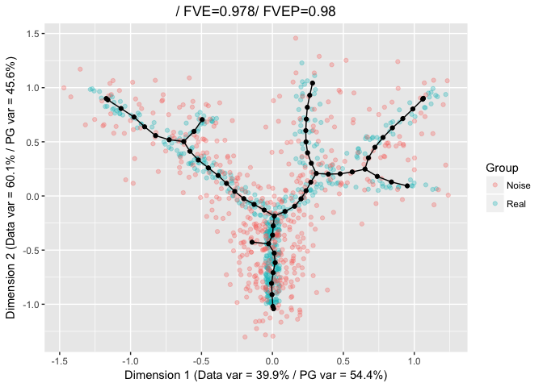

-   [The alpha and beta parameters](#the-alpha-and-beta-parameters)

The alpha and beta parameters
=============================

Under certain circumstances, it may be necessary to tune the form of the
elastic energy to obtain a better results. This may be particualrly true
when the principal graph is introducing an excessive number of branches
when the tree grammar is being used.

To tune the elastic energy, it is necessary to set
`FinalEnergy = "Penalized"` and specify values for the `alpha` and/or
`beta` parameters. These parameters can be used to give more weight to
the components of the energy associted with the lenght of the edges and
the the stars, hence penalizing graphs that are longer or richer in
branching points.

    library(ElPiGraph.R)
    set.seed(42)

    nExp <- 1

    NewPoints <- lapply(1:nExp, function(x){
      tree_data + rnorm(n = length(tree_data), sd = .15)
    })

    NewPoints <- do.call(rbind, NewPoints)

    NoisyTree <- rbind(tree_data, NewPoints)
    NoisyTree_Cat <- c(rep("Real", nrow(tree_data)), rep("Noise", nrow(NewPoints)))

    TreeEPG <- computeElasticPrincipalTree(X = NoisyTree, NumNodes = 50,
                                           drawAccuracyComplexity = FALSE, drawEnergy = FALSE, drawPCAView = FALSE,
                                           n.cores = 1)

    ## [1] "Creating a chain in the 1st PC with 2 nodes"
    ## [1] "Constructing tree 1 of 1 / Subset 1 of 1"
    ## [1] "Performing PCA on the data"
    ## [1] "Using standard PCA"
    ## [1] "3 dimensions are being used"
    ## [1] "100% of the original variance has been retained"
    ## [1] "Computing EPG with 50 nodes on 984 points and 3 dimensions"
    ## [1] "Using a single core"
    ## Nodes = 2 3 4 5 6 7 8 9 10 11 12 13 14 15 16 17 18 19 20 21 22 23 24 25 26 27 28 29 30 31 32 33 34 35 36 37 38 39 40 41 42 43 44 45 46 47 48 49 
    ## BARCODE  ENERGY  NNODES  NEDGES  NRIBS   NSTARS  NRAYS   NRAYS2  MSE MSEP    FVE FVEP    UE  UR  URN URN2    URSD
    ## 2|5||50  0.03004 50  49  32  5   0   0   0.02217 0.02114 0.9616  0.9633  0.007692    0.0001747   0.008737    0.4369  0
    ## 12.019 sec elapsed

    PlotPG(X = NoisyTree, TargetPG = TreeEPG[[1]], GroupsLab = NoisyTree_Cat,
           Do_PCA = FALSE, DimToPlot = 1:2)

    ## [[1]]

    TreeEPG <- computeElasticPrincipalTree(X = NoisyTree, NumNodes = 50,
                                           drawAccuracyComplexity = FALSE, drawEnergy = FALSE, drawPCAView = FALSE,
                                           n.cores = 1,
                                           FinalEnergy = "Penalized", alpha = 0.02, beta = 0)

    ## [1] "Creating a chain in the 1st PC with 2 nodes"
    ## [1] "Constructing tree 1 of 1 / Subset 1 of 1"
    ## [1] "Performing PCA on the data"
    ## [1] "Using standard PCA"
    ## [1] "3 dimensions are being used"
    ## [1] "100% of the original variance has been retained"
    ## [1] "Computing EPG with 50 nodes on 984 points and 3 dimensions"
    ## [1] "Using a single core"
    ## Nodes = 2 3 4 5 6 7 8 9 10 11 12 13 14 15 16 17 18 19 20 21 22 23 24 25 26 27 28 29 30 31 32 33 34 35 36 37 38 39 40 41 42 43 44 45 46 47 48 49 
    ## BARCODE  ENERGY  NNODES  NEDGES  NRIBS   NSTARS  NRAYS   NRAYS2  MSE MSEP    FVE FVEP    UE  UR  URN URN2    URSD
    ## 4||50    0.03375 50  49  40  4   0   0   0.02717 0.0264  0.9529  0.9542  0.005521    0.001059    0.05293 2.646   0
    ## 13.317 sec elapsed

    PlotPG(X = NoisyTree, TargetPG = TreeEPG[[1]], GroupsLab = NoisyTree_Cat,
           Do_PCA = FALSE, DimToPlot = 1:2)

    ## [[1]]

When using elastic energy controlled graph embeddment (`Mode = 2`), it
is necessary to set `MinimizingEnergy = "Penalized"` to allow alpha and
beto to influence the embeddment of the graph as well.

    TreeEPG <- computeElasticPrincipalTree(X = NoisyTree, NumNodes = 50,
                                           drawAccuracyComplexity = FALSE, drawEnergy = FALSE, drawPCAView = FALSE,
                                           n.cores = 1, Mode = 2,
                                           MinimizingEnergy = "Penalized", FinalEnergy = "Penalized",
                                           alpha = 0.01, beta = 0)

    ## [1] "Creating a chain in the 1st PC with 2 nodes"
    ## [1] "Constructing tree 1 of 1 / Subset 1 of 1"
    ## [1] "Performing PCA on the data"
    ## [1] "Using standard PCA"
    ## [1] "3 dimensions are being used"
    ## [1] "100% of the original variance has been retained"
    ## [1] "Computing EPG with 50 nodes on 984 points and 3 dimensions"
    ## [1] "Using a single core"
    ## Nodes = 2 3 4 5 6 7 8 9 10 11 12 13 14 15 16 17 18 19 20 21 22 23 24 25 26 27 28 29 30 31 32 33 34 35 36 37 38 39 40 41 42 43 44 45 46 47 48 49 
    ## BARCODE  ENERGY  NNODES  NEDGES  NRIBS   NSTARS  NRAYS   NRAYS2  MSE MSEP    FVE FVEP    UE  UR  URN URN2    URSD
    ## 5||50    0.03159 50  49  38  5   0   0   0.02478 0.02401 0.957   0.9584  0.006461    0.0003422   0.01711 0.8555  0
    ## 14.09 sec elapsed

    PlotPG(X = NoisyTree, TargetPG = TreeEPG[[1]], GroupsLab = NoisyTree_Cat,
           Do_PCA = FALSE, DimToPlot = 1:2)

    ## [[1]]

