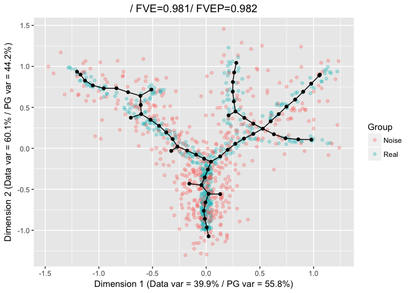

-   [The alpha parameter](#the-alpha-parameter)
-   [Excessinve branching due to
    noise](#excessinve-branching-due-to-noise)

The alpha parameter
===================

Under certain circumstances, it may be necessary to tune the form of the
elastic energy to obtain a better results. This is the case, for
example, when an excessive number of branches is introduced by the tree
grammar.

To tune the elastic energy, it is necessary to set
`FinalEnergy = "Penalized"` and specify values for the `alpha`
parameter. This parameter can be used to give more weight to the
components of the energy associted with the lenght of the edges, hence
penalizing graphs that are longer. Increasing alpha will penalize stars
with a larger number of edges, and will preferentially introduce
3-stars.

Excessinve branching due to noise
=================================

To exemplify the effect of `alpha`, we will increase the level of noise
around the &st and 2nd dimension of the tree example dataset. This will
generate *spurious clusters of points* that are likely to be identified
as branches.

    library(ElPiGraph.R)
    set.seed(42)

    nExp <- 1

    NewPoints <- lapply(1:nExp, function(x){
      tree_data[,1:2] + rnorm(n = length(tree_data[,1:2]), sd = .15)
    })

    NewPoints <- do.call(rbind, NewPoints)

    NoisyTree <- rbind(tree_data[,1:2], NewPoints)
    NoisyTree_Cat <- c(rep("Real", nrow(tree_data)), rep("Noise", nrow(NewPoints)))

    TreeEPG <- computeElasticPrincipalTree(X = NoisyTree, NumNodes = 60,
                                           Lambda = .01, Mu = .01,
                                           drawAccuracyComplexity = FALSE,
                                           drawEnergy = FALSE,
                                           drawPCAView = FALSE,
                                           n.cores = 1)

    ## [1] "Creating a chain in the 1st PC with 2 nodes"
    ## [1] "Constructing tree 1 of 1 / Subset 1 of 1"
    ## [1] "Performing PCA on the data"
    ## [1] "Using standard PCA"
    ## [1] "2 dimensions are being used"
    ## [1] "100% of the original variance has been retained"
    ## [1] "Computing EPG with 60 nodes on 984 points and 2 dimensions"
    ## [1] "Using a single core"
    ## Nodes = 2 3 4 5 6 7 8 9 10 11 12 13 14 15 16 17 18 19 20 21 22 23 24 25 26 27 28 29 30 31 32 33 34 35 36 37 38 39 40 41 42 43 44 45 46 47 48 49 50 51 52 53 54 55 56 57 58 59 
    ## BARCODE  ENERGY  NNODES  NEDGES  NRIBS   NSTARS  NRAYS   NRAYS2  MSE MSEP    FVE FVEP    UE  UR  URN URN2    URSD
    ## 1|7||60  0.0178  60  59  41  7   0   0   0.01075 0.01005 0.981   0.9822  0.006854    0.000189    0.01134 0.6805  0
    ## 19.149 sec elapsed

    PlotPG(X = NoisyTree, TargetPG = TreeEPG[[1]], GroupsLab = NoisyTree_Cat,
           Do_PCA = FALSE)

    ## [[1]]

    TreeEPG <- computeElasticPrincipalTree(X = NoisyTree, NumNodes = 60,
                                           Lambda = .01, Mu = .01,
                                           drawAccuracyComplexity = FALSE,
                                           drawEnergy = FALSE, drawPCAView = FALSE,
                                           n.cores = 1,
                                           FinalEnergy = "Penalized",
                                           alpha = 0.005)

    ## [1] "Creating a chain in the 1st PC with 2 nodes"
    ## [1] "Constructing tree 1 of 1 / Subset 1 of 1"
    ## [1] "Performing PCA on the data"
    ## [1] "Using standard PCA"
    ## [1] "2 dimensions are being used"
    ## [1] "100% of the original variance has been retained"
    ## [1] "Computing EPG with 60 nodes on 984 points and 2 dimensions"
    ## [1] "Using a single core"
    ## Nodes = 2 3 4 5 6 7 8 9 10 11 12 13 14 15 16 17 18 19 20 21 22 23 24 25 26 27 28 29 30 31 32 33 34 35 36 37 38 39 40 41 42 43 44 45 46 47 48 49 50 51 52 53 54 55 56 57 58 59 
    ## BARCODE  ENERGY  NNODES  NEDGES  NRIBS   NSTARS  NRAYS   NRAYS2  MSE MSEP    FVE FVEP    UE  UR  URN URN2    URSD
    ## 5||60    0.01834 60  59  48  5   0   0   0.0122  0.01153 0.9784  0.9796  0.0058  0.00034 0.0204  1.224   0
    ## 20.602 sec elapsed

    PlotPG(X = NoisyTree, TargetPG = TreeEPG[[1]], GroupsLab = NoisyTree_Cat,
           Do_PCA = FALSE)

    ## [[1]]

Note that when using elastic energy controlled graph embeddment
(`Mode = 2`) the standard energy funtion will be used.

    TreeEPG <- computeElasticPrincipalTree(X = NoisyTree, NumNodes = 60,
                                           Lambda = .01, Mu = .01,
                                           drawAccuracyComplexity = FALSE,
                                           drawEnergy = FALSE, drawPCAView = FALSE,
                                           n.cores = 1, Mode = 2,
                                           FinalEnergy = "Penalized",
                                           alpha = 0.005)

    ## [1] "Creating a chain in the 1st PC with 2 nodes"
    ## [1] "Constructing tree 1 of 1 / Subset 1 of 1"
    ## [1] "Performing PCA on the data"
    ## [1] "Using standard PCA"
    ## [1] "2 dimensions are being used"
    ## [1] "100% of the original variance has been retained"
    ## [1] "Computing EPG with 60 nodes on 984 points and 2 dimensions"
    ## [1] "Using a single core"
    ## Nodes = 2 3 4 5 6 7 8 9 10 11 12 13 14 15 16 17 18 19 20 21 22 23 24 25 26 27 28 29 30 31 32 33 34 35 36 37 38 39 40 41 42 43 44 45 46 47 48 49 50 51 52 53 54 55 56 57 58 59 
    ## BARCODE  ENERGY  NNODES  NEDGES  NRIBS   NSTARS  NRAYS   NRAYS2  MSE MSEP    FVE FVEP    UE  UR  URN URN2    URSD
    ## 4||60    0.01834 60  59  50  4   0   0   0.01222 0.0116  0.9784  0.9795  0.005891    0.0002311   0.01387 0.8319  0
    ## 19.886 sec elapsed

    PlotPG(X = NoisyTree, TargetPG = TreeEPG[[1]], GroupsLab = NoisyTree_Cat,
           Do_PCA = FALSE)

    ## [[1]]

