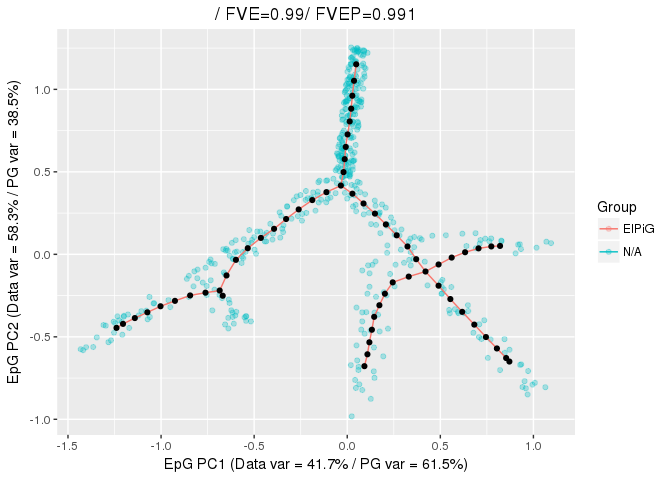
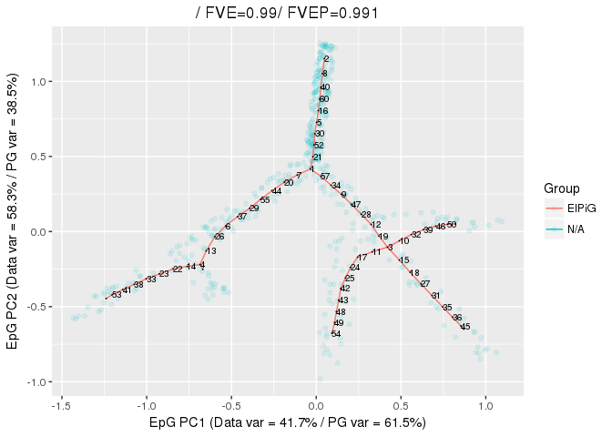
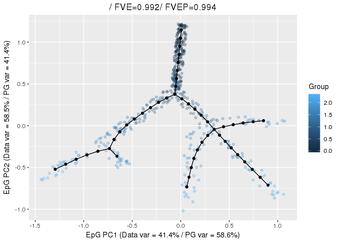
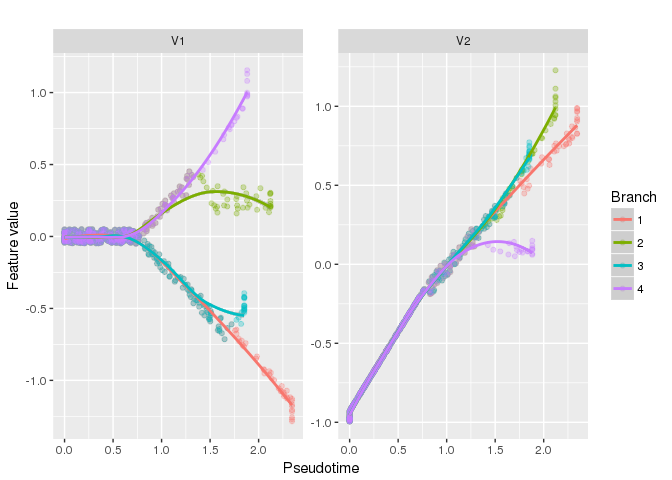

-   [Setup](#setup)
-   [Getting the substructure of
    interest](#getting-the-substructure-of-interest)
-   [Getting the supporting
    structures](#getting-the-supporting-structures)
-   [Computnig pseudotime](#computnig-pseudotime)
-   [Exploring features over
    pseudotime](#exploring-features-over-pseudotime)

The ElPiGraph package contains a number of functions to derive the
pseudotime associated with each point. This is particularly relevant in
biological contexts.

Setup
=====

As a first step, we will construct a tree structure on the sample data

    library(ElPiGraph.R)

    TreeEPG <- computeElasticPrincipalTree(X = tree_data, NumNodes = 50,
                                           drawAccuracyComplexity = FALSE, drawEnergy = FALSE)

    ## [1] "Creating a chain in the 1st PC with 2 nodes"
    ## [1] "Constructing tree 1 of 1 / Subset 1 of 1"
    ## [1] "Performing PCA on the data"
    ## [1] "Using standard PCA"
    ## [1] "3 dimensions are being used"
    ## [1] "100% of the original variance has been retained"
    ## [1] "Computing EPG with 50 nodes on 492 points and 3 dimensions"
    ## [1] "Using a single core"
    ## Nodes = 2 3

    ## Warning in PrimitiveElasticGraphEmbedment(X, input$NodePositions, input
    ## $ElasticMatrix, : Maximum number of iterations (10) has been reached. diff
    ## = 0.0556045436349542

    ## 4

    ## Warning in PrimitiveElasticGraphEmbedment(X, input$NodePositions, input
    ## $ElasticMatrix, : Maximum number of iterations (10) has been reached. diff
    ## = 0.0301832931960279

    ## 5 6 7

    ## Warning in PrimitiveElasticGraphEmbedment(X, input$NodePositions, input
    ## $ElasticMatrix, : Maximum number of iterations (10) has been reached. diff
    ## = 0.0108997004478186

    ## 8

    ## Warning in PrimitiveElasticGraphEmbedment(X, input$NodePositions, input
    ## $ElasticMatrix, : Maximum number of iterations (10) has been reached. diff
    ## = 0.0338837538875411

    ## 9

    ## Warning in PrimitiveElasticGraphEmbedment(X, input$NodePositions, input
    ## $ElasticMatrix, : Maximum number of iterations (10) has been reached. diff
    ## = 0.0186764499907295

    ## Warning in PrimitiveElasticGraphEmbedment(X, input$NodePositions, input
    ## $ElasticMatrix, : Maximum number of iterations (10) has been reached. diff
    ## = 0.054863847452363

    ## 10

    ## Warning in PrimitiveElasticGraphEmbedment(X, input$NodePositions, input
    ## $ElasticMatrix, : Maximum number of iterations (10) has been reached. diff
    ## = 0.0244949370624996

    ## Warning in PrimitiveElasticGraphEmbedment(X, input$NodePositions, input
    ## $ElasticMatrix, : Maximum number of iterations (10) has been reached. diff
    ## = 0.0117614602046908

    ## Warning in PrimitiveElasticGraphEmbedment(X, input$NodePositions, input
    ## $ElasticMatrix, : Maximum number of iterations (10) has been reached. diff
    ## = 0.0358113369806447

    ## Warning in PrimitiveElasticGraphEmbedment(X, input$NodePositions, input
    ## $ElasticMatrix, : Maximum number of iterations (10) has been reached. diff
    ## = 0.0139648044782385

    ## 11 12 13

    ## Warning in PrimitiveElasticGraphEmbedment(X, input$NodePositions, input
    ## $ElasticMatrix, : Maximum number of iterations (10) has been reached. diff
    ## = 0.0183632027691593

    ## 14 15 16 17 18 19 20 21 22 23 24 25 26 27 28 29 30 31 32 33 34 35 36 37 38 39 40 41 42 43 44 45 46 47 48 49 
    ## BARCODE  ENERGY  NNODES  NEDGES  NRIBS   NSTARS  NRAYS   NRAYS2  MSE MSEP    FVE FVEP    UE  UR  URN URN2    URSD
    ## 1|2||50  0.01568 50  49  41  2   0   0   0.004137    0.003432    0.9923  0.9936  0.01114 0.0004032   0.02016 1.008   0
    ## 14.851 sec elapsed
    ## [[1]]

and visualize the node labels:

    PlotPG(X = tree_data, TargetPG = TreeEPG[[1]],
           NodeLabels = 1:nrow(TreeEPG[[1]]$NodePositions),
           LabMult = 3, PointSize = NA, p.alpha = .1)

    ## [[1]]

Getting the substructure of interest
====================================

In this example, we will look at all the path originating in 2 and
extending to all the other leafs of the tree. Hence, we assume that 2 is
the starting points for the pseudotime.

We will begin by computing all of the paths between leaves.

    Tree_Graph <- ConstructGraph(TreeEPG[[1]])
    Tree_e2e <- GetSubGraph(Net = Tree_Graph, Structure = 'end2end')

Since the paths derived are unique, the node 2 could be either at the
beginning or at the end of the path considered. therefore, we select all
the path starting or ending in 2

    Root <- 2
    SelPaths <- Tree_e2e[sapply(Tree_e2e, function(x){any(x[c(1, length(x))] == Root)})]

and reverse the paths ending in 2

    SelPaths <- lapply(SelPaths, function(x){
      if(x[1] == Root){
        return(x)
      } else {
        return(rev(x))
      }
    })

At this point, we can look at `SelPaths` to make sure that the results
are compatible with our expectations

    SelPaths

    ## [[1]]
    ## + 23/50 vertices, named, from 4fb6db9:
    ##  [1] 2  11 16 46 25 28 38 6  1  5  32 17 26 36 13 9  24 19 43 48 40 8  4 
    ## 
    ## [[2]]
    ## + 22/50 vertices, named, from 4fb6db9:
    ##  [1] 2  11 16 46 25 28 38 6  1  10 18 30 22 12 3  42 45 41 33 35 7  15
    ## 
    ## [[3]]
    ## + 19/50 vertices, named, from 4fb6db9:
    ##  [1] 2  11 16 46 25 28 38 6  1  5  32 17 26 36 13 9  24 19 20
    ## 
    ## [[4]]
    ## + 20/50 vertices, named, from 4fb6db9:
    ##  [1] 2  11 16 46 25 28 38 6  1  10 18 30 22 12 3  31 49 37 21 23
    ## 
    ## [[5]]
    ## + 23/50 vertices, named, from 4fb6db9:
    ##  [1] 2  11 16 46 25 28 38 6  1  10 18 30 22 12 3  27 34 39 50 47 44 14 29

Getting the supporting structures
=================================

To optimize the computation, certain structures used to compute the
pseudotime are computed externally. We begin by computing a Partition
structure, which contains information on the projection of points on the
nodes

    PartStruct <- PartitionData(X = tree_data, NodePositions = TreeEPG[[1]]$NodePositions)

Then, we will compute a projection structure, which contains information
relative to the projection of points on the edge of the graph

    ProjStruct <- project_point_onto_graph(X = tree_data,
                                           NodePositions = TreeEPG[[1]]$NodePositions,
                                           Edges = TreeEPG[[1]]$Edges$Edges,
                                           Partition = PartStruct$Partition)

Computnig pseudotime
====================

We are now able to obtain the pseudotime, via the `getPseudotime`
function. We will use `lapply` to compute all of the pseudotime at once.
Moreover, the functions requires nodes to be passed as a vector of
strings, so we will need to use the `names` function to convert the
sequence of vertices.

    AllPt <- lapply(SelPaths, function(x){
      getPseudotime(ProjStruct = ProjStruct, NodeSeq = names(x))
    })

At this point, we can merge the pseudotime projections. This is possible
because points are uniquely projected on the graph and all the paths
selected have a common root

    PointsPT <- apply(sapply(AllPt, "[[", "Pt"), 1, function(x){unique(x[!is.na(x)])})

When can then visualize the pseudotime on the points via the `PlotPG`
function

    PlotPG(X = tree_data, TargetPG = TreeEPG[[1]], GroupsLab = PointsPT)

    ## [[1]]

Exploring features over pseudotime
==================================

Once the pseudotime has been computed, it is possible to explore how the
different features of the data behave over the psedutime. This feature
is particulartly helpful for gene expression data as it allow checking
how gene dynamics contribute to the topoligical features of the data.

It is possible to visualize this information using the
`CompareOnBranches` function

    CompareOnBranches(X = tree_data,
                      Paths = lapply(SelPaths[1:4], function(x){names(x)}),
                      TargetPG = TreeEPG[[1]],
                      Partition = PartStruct$Partition,
                      PrjStr = ProjStruct,
                      Main = "A simple tree example",
                      Features = 2)

    ## `geom_smooth()` using method = 'loess' and formula 'y ~ x'

