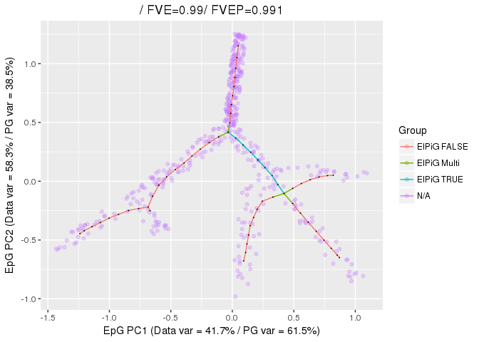
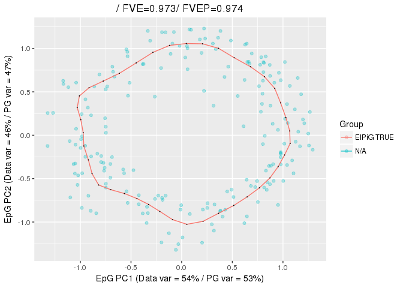
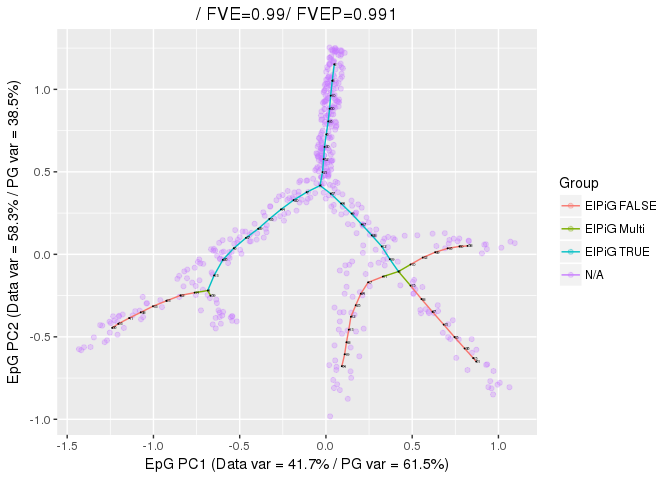
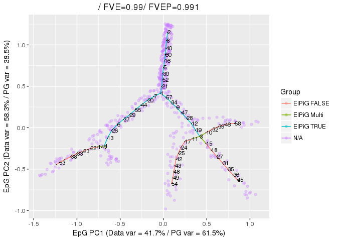
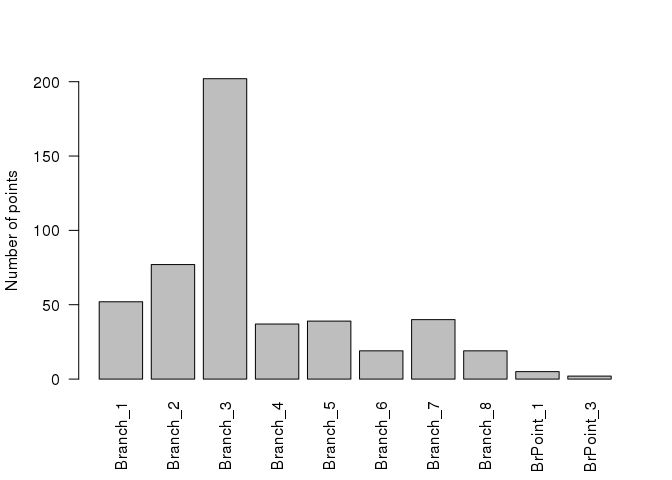
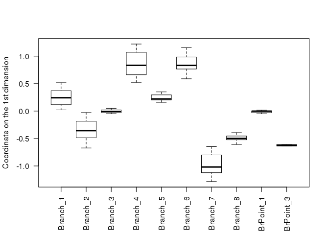
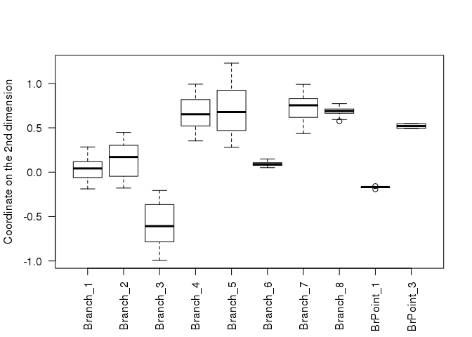
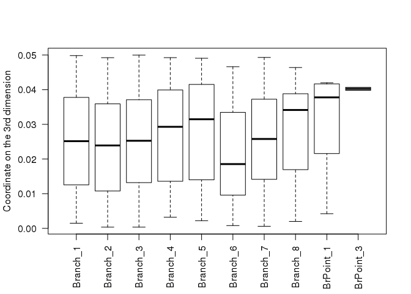

-   [Setup](#setup)
-   [Obtaining notable structures in
    trees](#obtaining-notable-structures-in-trees)
-   [Obtaining notable structures in
    circles](#obtaining-notable-structures-in-circles)
-   [Looking at the nodes composing the
    structures](#looking-at-the-nodes-composing-the-structures)
-   [Looking at the points associted with the
    structures](#looking-at-the-points-associted-with-the-structures)

The ElPiGraph package contains a number of functions that that can be
used to facilitate the analysis of the obtained graph. This tutorial
explains how to extract notable substructures from the obtained graph
and visualize them.

Setup
=====

A a first step in the tutorial we need to generate graphs from data. We
will use tree and circle structures. We begin by constructing the tree
on the example data included in the package.

    library(ElPiGraph.R)
    library(igraph)

    ## 
    ## Attaching package: 'igraph'

    ## The following objects are masked from 'package:stats':
    ## 
    ##     decompose, spectrum

    ## The following object is masked from 'package:base':
    ## 
    ##     union

    library(magrittr)

    TreeEPG <- computeElasticPrincipalTree(X = tree_data, NumNodes = 60, Lambda = .03, Mu = .01,
                                           drawAccuracyComplexity = FALSE, drawEnergy = FALSE)

    ## [1] "Creating a chain in the 1st PC with 2 nodes"
    ## [1] "Constructing tree 1 of 1 / Subset 1 of 1"
    ## [1] "Performing PCA on the data"
    ## [1] "Using standard PCA"
    ## [1] "3 dimensions are being used"
    ## [1] "100% of the original variance has been retained"
    ## [1] "Computing EPG with 60 nodes on 492 points and 3 dimensions"
    ## [1] "Using a single core"
    ## Nodes = 2 3 4 5 6 7 8 9 10 11 12 13 14 15 16 17 18 19 20 21 22 23 24 25 26 27 28 29 30 31 32 33 34 35 36 37 38 39 40 41 42 43 44 45 46 47 48 49 50 51 52 53 54 55 56 57 58 59 
    ## BARCODE  ENERGY  NNODES  NEDGES  NRIBS   NSTARS  NRAYS   NRAYS2  MSE MSEP    FVE FVEP    UE  UR  URN URN2    URSD
    ## 1|2||60  0.01848 60  59  51  2   0   0   0.00548 0.005053    0.9898  0.9906  0.01249 0.0005134   0.03081 1.848   0
    ## 29.213 sec elapsed
    ## [[1]]

    CircleEPG <- computeElasticPrincipalCircle(X = circle_data, NumNodes = 40,
                                           drawAccuracyComplexity = FALSE, drawEnergy = FALSE)

    ## [1] "Using a single core"
    ## [1] "Creating a circle in the plane induced buy the 1st and 2nd PCs with 3 nodes"
    ## [1] "Constructing curve 1 of 1 / Subset 1 of 1"
    ## [1] "Performing PCA on the data"
    ## [1] "Using standard PCA"
    ## [1] "3 dimensions are being used"
    ## [1] "100% of the original variance has been retained"
    ## [1] "Computing EPG with 40 nodes on 200 points and 3 dimensions"
    ## [1] "Using a single core"
    ## Nodes = 3 4 5 6 7 8 9 10 11 12 13 14 15 16 17 18 19 20 21 22 23 24 25 26 27 28 29 30 31 32 33 34 35 36 37 38 39 
    ## BARCODE  ENERGY  NNODES  NEDGES  NRIBS   NSTARS  NRAYS   NRAYS2  MSE MSEP    FVE FVEP    UE  UR  URN URN2    URSD
    ## 0||40    0.04107 40  40  40  0   0   0   0.02892 0.02738 0.9729  0.9744  0.0105  0.00165 0.066   2.64    0
    ## 1.541 sec elapsed
    ## [[1]]

We then generate `igraph` networks from the ElPiGraph structure

    Tree_Graph <- ConstructGraph(PrintGraph = TreeEPG[[1]])
    Circle_Graph <- ConstructGraph(PrintGraph = CircleEPG[[1]])

Obtaining notable structures in trees
=====================================

The first step in the analysis consists in selecting various
substructures present in the tree. This can be done via the
`GetSubGraph` function, by specified the appropriate value for the
`structure` parameter. For trees the most relevant options include
'end2end' (that extracts the paths connecting all of the leaves of the
tree), `branches` (that extracts all the different branches composing
the tree), and `branching`, (that extracts all the branching sub-trees).

    Tree_e2e <- GetSubGraph(Net = Tree_Graph, Structure = 'end2end')

    Tree_Brches <- GetSubGraph(Net = Tree_Graph, Structure = 'branches')

    Tree_BrBrPt <- GetSubGraph(Net = Tree_Graph, Structure = 'branches&bpoints')

    Tree_SubTrees <- GetSubGraph(Net = Tree_Graph, Structure = 'branching')

The extracted structures can be visualized on the data using the
`PlotPG` function, with minimal manipulation:

    PlotPG(X = tree_data, TargetPG = TreeEPG[[1]], PGCol = V(Tree_Graph) %in% Tree_e2e[[1]], PointSize = NA)

    ## [[1]]

As we can see from the plot, the function will highlight the edges
connecting the nodes selected (marked TRUE), the edges connecting the
nodes not selected (marked FALSE), and the edges connecting the the
groups (marked Multi).

Similarly, we have

    PlotPG(X = tree_data, TargetPG = TreeEPG[[1]], PGCol = V(Tree_Graph) %in% Tree_Brches[[1]], PointSize = NA)

    ## [[1]]

and

    PlotPG(X = tree_data, TargetPG = TreeEPG[[1]], PGCol = V(Tree_Graph) %in% Tree_SubTrees[[1]], PointSize = NA)

    ## [[1]]

It is also possible to visualize multiple structures. In this case it is
better to use `GetSubGraph` by setting `KeepEnds` to `FALSE`

    Tree_Brches_NoEnds <- GetSubGraph(Net = Tree_Graph, Structure = 'branches', KeepEnds = FALSE)

    BrID <- sapply(1:length(Tree_Brches_NoEnds), function(i){
      rep(i, length(Tree_Brches_NoEnds[[i]]))}) %>%
      unlist()

    NodesID <- rep(0, vcount(Tree_Graph))
    NodesID[unlist(Tree_Brches_NoEnds)] <- BrID

    PlotPG(X = tree_data, TargetPG = TreeEPG[[1]], PGCol = NodesID, PointSize = NA, p.alpha = .05)

    ## [[1]]

Obtaining notable structures in circles
=======================================

Similarly to tree, `GetSubGraph` can be used to obtain circles by
setting `structure` to `circle`. When looking for circles it is possible
to specify the length of the circle via the `Nodes` parameter, if
unspecified, the function will try to find the largest circle in the
data (this is potentially time consuming for large structures).
Furthermore, by setting `Circular` to `TRUE` we will get a path with
coinciding initial and terminal node.

    Circle_all <- GetSubGraph(Net = Circle_Graph, Structure = 'circle', Circular = TRUE)

    ## [1] "Looking for the largest cycle"
    ## [1] "A cycle of lenght 40 has been found"

Since the graph is a circle, all the edges will be part of any
substructure selected:

    PlotPG(X = circle_data, TargetPG = CircleEPG[[1]], PGCol = V(Tree_Graph) %in% Circle_all[[1]], PointSize = NA)

    ## [[1]]

Looking at the nodes composing the structures
=============================================

To select the structure of interest it is necessary to understand in a
more precise way how they are mapped to graph.

Let us consider the first subs-tree computed:

    Tree_SubTrees[[1]]

    ##  [1]  1  7 21 57 20 52 34 44 30  9 55  5 47 29 16 28 37 60 12  6 40 19 26
    ## [24]  8 13  2  3  4

To look how the nodes maps to the graph, we can label the nodes in the
`PlotPG` function. This can be done using the `NodeLabels` parameter.

    PlotPG(X = tree_data, TargetPG = TreeEPG[[1]], PGCol = V(Tree_Graph) %in% Tree_SubTrees[[1]], PointSize = NA, NodeLabels = 1:nrow(TreeEPG[[1]]$NodePositions))

    ## [[1]]

If the labels are hard so see, is possible to adjust their size via that
`LabMult` parameter.

    PlotPG(X = tree_data, TargetPG = TreeEPG[[1]], PGCol = V(Tree_Graph) %in% Tree_SubTrees[[1]], PointSize = NA, NodeLabels = 1:nrow(TreeEPG[[1]]$NodePositions), LabMult = 3)

    ## [[1]]

A similar procedure can be used to look at one of the path between the
leaves

    Tree_e2e[[1]]

    ## + 26/60 vertices, named, from 12a263f:
    ##  [1] 2  8  40 60 16 5  30 52 21 1  57 34 9  47 28 12 19 3  15 18 27 31 35
    ## [24] 36 45 51

    PlotPG(X = tree_data, TargetPG = TreeEPG[[1]], PGCol = V(Tree_Graph) %in% Tree_e2e[[1]], PointSize = NA, NodeLabels = 1:nrow(TreeEPG[[1]]$NodePositions), LabMult = 3)

    ## [[1]]

Note that `GetSubGraph` returns each structure only once. Therefore, the
path from node 4 to node 2 will not be present in the list.

Looking at the points associted with the structures
===================================================

With the previourly computed information, it is also easy to extract the
points asscoited with each substructure via the association of points to
nodes. We begin by associating the points to the nodes

    PartStruct <- PartitionData(X = tree_data, NodePositions = TreeEPG[[1]]$NodePositions)

And then obtain the points associted with each substrucutre

    PtInBr <- lapply(Tree_Brches, function(x){which(PartStruct$Partition %in% x)})

Again, we can visualize the inforlation with `PlotPG`

    PlotPG(X = tree_data, TargetPG = TreeEPG[[1]], GroupsLab = 1:nrow(tree_data) %in% PtInBr[[1]])

    ## [[1]]

    PlotPG(X = tree_data, TargetPG = TreeEPG[[1]], GroupsLab = 1:nrow(tree_data) %in% PtInBr[[3]])

    ## [[1]]

If we use the 'branches&bpoints' structure options, we obtain a complete
partition of the tree into branches and branching points, that can
looked at in different ways

    PointLabel = rep("", length(PartStruct$Partition))

    for(i in 1:length(Tree_BrBrPt)){
      PointLabel[PartStruct$Partition %in% Tree_BrBrPt[[i]]] <- names(Tree_BrBrPt)[i]
    }

    barplot(table(PointLabel), las = 2, ylab="Number of points")

    PlotPG(X = tree_data, TargetPG = TreeEPG[[1]], GroupsLab = PointLabel)

    ## [[1]]

    boxplot(tree_data[, 1] ~ PointLabel, ylab = "Coordinate on the 1st dimension", las = 2)

    boxplot(tree_data[, 2] ~ PointLabel, ylab = "Coordinate on the 2nd dimension", las = 2)

    boxplot(tree_data[, 3] ~ PointLabel, ylab = "Coordinate on the 3rd dimension", las = 2)

