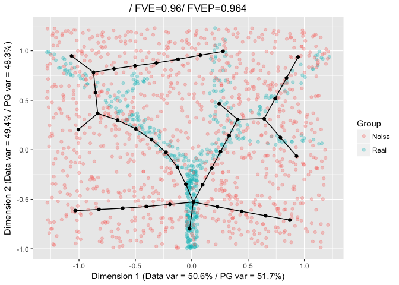
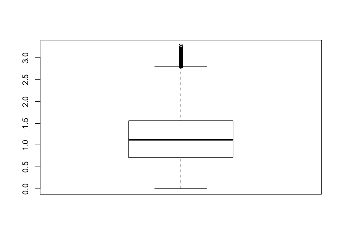
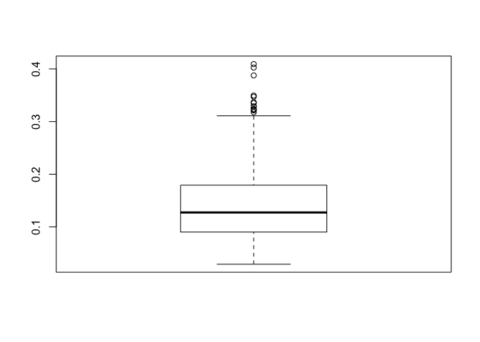
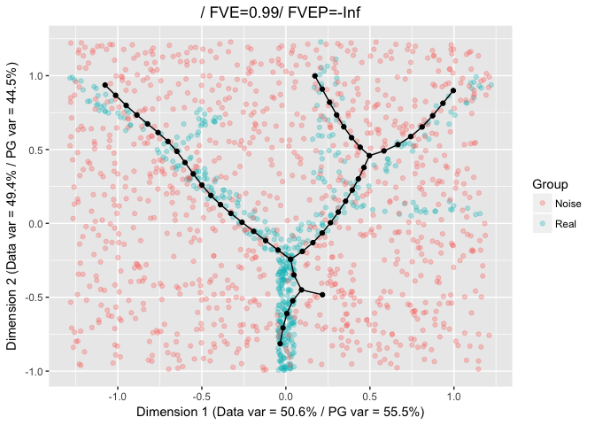
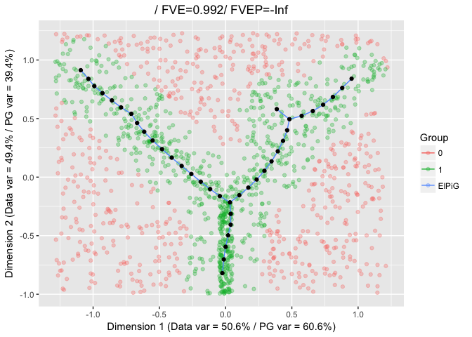

-   [Setup](#setup)
-   [Effect of noisy points](#effect-of-noisy-points)
-   [Density dependent inizialisation and trimming
    radius](#density-dependent-inizialisation-and-trimming-radius)
-   [Density dependent inizialisation and trimming radius and
    bootstrapping](#density-dependent-inizialisation-and-trimming-radius-and-bootstrapping)
-   [Visualizing the effect of the trimming
    radius](#visualizing-the-effect-of-the-trimming-radius)

In real world examples, the data distributions to be approximated can be
*contaminated* by the presence of outliers or points belonging to a
different distribution. To address this aspect, the ElPiGraph.R package
implement two functionalities that can be used to minimize the impact of
these points: density-dependent initialization and trimming radius.

Setup
=====

To show the effect of these features, we will start by generating noisy
datasets from the tree example present in the package, with an increased
intensity of noise. Similar ideas and concepts apply to the construction
of curves as well.

    library(ElPiGraph.R)
    library(igraph)

    ## 
    ## Attaching package: 'igraph'

    ## The following objects are masked from 'package:stats':
    ## 
    ##     decompose, spectrum

    ## The following object is masked from 'package:base':
    ## 
    ##     union

    nPoints <- round(nrow(tree_data)*.5)

    NewPoints <- apply(apply(tree_data, 2, range), 2, function(x){
      runif(n = nPoints, x[1], x[2])
    })

    TD_LowNoise <- rbind(tree_data, NewPoints)
    TD_LowNoise_Cat <- c(rep("Real", nrow(tree_data)), rep("Noise", nrow(NewPoints)))

    nPoints <- nrow(tree_data)*2

    NewPoints <- apply(apply(tree_data, 2, range), 2, function(x){
      runif(n = nPoints, x[1], x[2])
    })

    TD_MedNoise <- rbind(tree_data, NewPoints)
    TD_MedNoise_Cat <- c(rep("Real", nrow(tree_data)), rep("Noise", nrow(NewPoints)))

    nPoints <- nrow(tree_data)*8

    NewPoints <- apply(apply(tree_data, 2, range), 2, function(x){
      runif(n = nPoints, x[1], x[2])
    })

    TD_HighNoise <- rbind(tree_data, NewPoints)
    TD_HighNoise_Cat <- c(rep("Real", nrow(tree_data)), rep("Noise", nrow(NewPoints)))

Effect of noisy points
======================

By default the ElPiGraph algorithm uses all the points and generate the
initial points on the 1st PC of the data. Therefore, noise can affect
significantly the reconstructed tree.

    TreeEPG <- computeElasticPrincipalTree(X = TD_LowNoise, NumNodes = 40,
                                           drawAccuracyComplexity = FALSE, drawEnergy = FALSE, drawPCAView = FALSE, n.cores = 1)

    ## [1] "Creating a chain in the 1st PC with 2 nodes"
    ## [1] "Constructing tree 1 of 1 / Subset 1 of 1"
    ## [1] "Performing PCA on the data"
    ## [1] "Using standard PCA"
    ## [1] "3 dimensions are being used"
    ## [1] "100% of the original variance has been retained"
    ## [1] "Computing EPG with 40 nodes on 738 points and 3 dimensions"
    ## [1] "Using a single core"
    ## Nodes = 2 3 4 5 6 7 8 9 10 11 12 13 14 15 16 17 18 19 20 21 22 23 24 25 26 27 28 29 30 31 32 33 34 35 36 37 38 39 
    ## BARCODE  ENERGY  NNODES  NEDGES  NRIBS   NSTARS  NRAYS   NRAYS2  MSE MSEP    FVE FVEP    UE  UR  URN URN2    URSD
    ## 1|5||40  0.0528  40  39  25  5   0   0   0.02611 0.02415 0.9612  0.9641  0.02624 0.0004483   0.01793 0.7172  0
    ## 5.642 sec elapsed

    PlotPG(X = TD_LowNoise, TargetPG = TreeEPG[[1]], GroupsLab = TD_LowNoise_Cat,
           Do_PCA = FALSE, DimToPlot = 1:2)

    ## [[1]]

    TreeEPG <- computeElasticPrincipalTree(X = TD_MedNoise, NumNodes = 40,
                                           drawAccuracyComplexity = FALSE, drawEnergy = FALSE, drawPCAView = FALSE, n.cores = 1)

    ## [1] "Creating a chain in the 1st PC with 2 nodes"
    ## [1] "Constructing tree 1 of 1 / Subset 1 of 1"
    ## [1] "Performing PCA on the data"
    ## [1] "Using standard PCA"
    ## [1] "3 dimensions are being used"
    ## [1] "100% of the original variance has been retained"
    ## [1] "Computing EPG with 40 nodes on 1476 points and 3 dimensions"
    ## [1] "Using a single core"
    ## Nodes = 2 3 4 5 6 7 8 9 10 11 12 13 14 15 16 17 18 19 20 21 22 23 24 25 26 27 28 29 30 31 32 33 34 35 36 37 38 39 
    ## BARCODE  ENERGY  NNODES  NEDGES  NRIBS   NSTARS  NRAYS   NRAYS2  MSE MSEP    FVE FVEP    UE  UR  URN URN2    URSD
    ## 1|0|4||40    0.06717 40  39  26  4   0   0   0.03248 0.02953 0.9603  0.9639  0.0342  0.0004827   0.01931 0.7723  0
    ## 8.779 sec elapsed

    PlotPG(X = TD_MedNoise, TargetPG = TreeEPG[[1]], GroupsLab = TD_MedNoise_Cat,
           Do_PCA = FALSE, DimToPlot = 1:2)

    ## [[1]]

    TreeEPG <- computeElasticPrincipalTree(X = TD_HighNoise, NumNodes = 40,
                                           drawAccuracyComplexity = FALSE, drawEnergy = FALSE, drawPCAView = FALSE, n.cores = 1)

    ## [1] "Creating a chain in the 1st PC with 2 nodes"
    ## [1] "Constructing tree 1 of 1 / Subset 1 of 1"
    ## [1] "Performing PCA on the data"
    ## [1] "Using standard PCA"
    ## [1] "3 dimensions are being used"
    ## [1] "100% of the original variance has been retained"
    ## [1] "Computing EPG with 40 nodes on 4428 points and 3 dimensions"
    ## [1] "Using a single core"
    ## Nodes = 2 3 4 5 6 7 8 9 10 11 12 13 14 15 16 17 18 19 20 21 22 23 24 25 26 27 28 29 30 31 32 33 34 35 36 37 38 39 
    ## BARCODE  ENERGY  NNODES  NEDGES  NRIBS   NSTARS  NRAYS   NRAYS2  MSE MSEP    FVE FVEP    UE  UR  URN URN2    URSD
    ## 1|1|3||40    0.07619 40  39  25  3   0   0   0.03736 0.03416 0.9578  0.9614  0.03869 0.000144    0.005759    0.2304  0
    ## 16.669 sec elapsed

    PlotPG(X = TD_HighNoise, TargetPG = TreeEPG[[1]], GroupsLab = TD_HighNoise_Cat,
           Do_PCA = FALSE, DimToPlot = 1:2)

    ## [[1]]

Density dependent inizialisation and trimming radius
====================================================

To limit the effect of noise, we can specify a trimming radius (which
informs the algorithm to use only points with a distance lower than this
radius when computing the position of the nodes), and use a density
dependent initialization `ICOver = "Density"`. Note that when using
`ICOver = "Density"`, the parameter `DensityRadius`, which is used to
determine the area of the space with the highest density of points, need
to be specified as well.

When a trimming radius is used, tree construction becomes *local*, hence
it may be necessary to increase the number of points in order to better
cover all areas of the space containing the points under consideration.
Moreover certain feature of the topology may be lost due to the noise
corrupting the data.

`ElpiGraph.R` also contains the function `InferTrimRadius` which can be
used to obtain a distribution of potential trimming radiuses.

    TrimGuess <- InferTrimRadius(X = TD_LowNoise, nPoints = round(nrow(TD_LowNoise)/2))

    ## [1] "Error in segmentation ... skipping"
    ## [1] "Error in segmentation ... skipping"
    ## [1] "Error in segmentation ... skipping"
    ## [1] "Error in segmentation ... skipping"
    ## [1] "Error in segmentation ... skipping"
    ## [1] "Error in segmentation ... skipping"
    ## [1] "Error in segmentation ... skipping"

    TreeEPG <- computeElasticPrincipalTree(X = TD_LowNoise, NumNodes = 50,
                                           drawAccuracyComplexity = FALSE, drawEnergy = FALSE, drawPCAView = FALSE,
                                           n.cores = 1,
                                           TrimmingRadius = quantile(TrimGuess, .9),
                                           ICOver = "Density",
                                           DensityRadius = quantile(TrimGuess, .9))

    ## [1] "Creating a line in the densest part of the graph. DensityRadius needs to be specified!"
    ## [1] "Constructing tree 1 of 1 / Subset 1 of 1"
    ## [1] "Performing PCA on the data"
    ## [1] "Using standard PCA"
    ## [1] "3 dimensions are being used"
    ## [1] "100% of the original variance has been retained"
    ## [1] "Computing EPG with 50 nodes on 738 points and 3 dimensions"
    ## [1] "Using a single core"
    ## Nodes = 2 3 4 5 6 7 8 9 10 11 12 13 14 15 16 17 18 19 20 21 22 23 24 25 26 27 28 29 30 31 32 33 34 35 36 37 38 39 40 41 42 43 44 45 46 47 48 49 
    ## BARCODE  ENERGY  NNODES  NEDGES  NRIBS   NSTARS  NRAYS   NRAYS2  MSE MSEP    FVE FVEP    UE  UR  URN URN2    URSD
    ## 3||50    0.02995 50  49  42  3   0   0   0.02281 Inf 0.9661  -Inf    0.006847    0.000294    0.0147  0.735   0
    ## 9.825 sec elapsed

    PlotPG(X = TD_LowNoise, TargetPG = TreeEPG[[1]], GroupsLab = TD_LowNoise_Cat,
           Do_PCA = FALSE, DimToPlot = 1:2)

    ## [[1]]

    TrimGuess <- InferTrimRadius(X = TD_MedNoise, nPoints = round(nrow(TD_MedNoise)/2))

    ## [1] "Error in segmentation ... skipping"
    ## [1] "Error in segmentation ... skipping"
    ## [1] "Error in segmentation ... skipping"
    ## [1] "Error in segmentation ... skipping"
    ## [1] "Error in segmentation ... skipping"
    ## [1] "Error in segmentation ... skipping"
    ## [1] "Error in segmentation ... skipping"
    ## [1] "Error in segmentation ... skipping"
    ## [1] "Error in segmentation ... skipping"
    ## [1] "Error in segmentation ... skipping"
    ## [1] "Error in segmentation ... skipping"
    ## [1] "Error in segmentation ... skipping"
    ## [1] "Error in segmentation ... skipping"
    ## [1] "Error in segmentation ... skipping"

    TreeEPG <- computeElasticPrincipalTree(X = TD_MedNoise, NumNodes = 50,
                                           drawAccuracyComplexity = FALSE, drawEnergy = FALSE, drawPCAView = FALSE,
                                           n.cores = 1,
                                           TrimmingRadius = quantile(TrimGuess, .9),
                                           ICOver = "Density",
                                           DensityRadius = quantile(TrimGuess, .9))

    ## [1] "Creating a line in the densest part of the graph. DensityRadius needs to be specified!"
    ## [1] "Constructing tree 1 of 1 / Subset 1 of 1"
    ## [1] "Performing PCA on the data"
    ## [1] "Using standard PCA"
    ## [1] "3 dimensions are being used"
    ## [1] "100% of the original variance has been retained"
    ## [1] "Computing EPG with 50 nodes on 1476 points and 3 dimensions"
    ## [1] "Using a single core"
    ## Nodes = 2 3 4 5 6 7 8 9 10 11 12 13 14 15 16 17 18 19 20 21 22 23 24 25 26 27 28 29 30 31 32 33 34 35 36 37 38 39 40 41 42 43 44 45 46 47 48 49 
    ## BARCODE  ENERGY  NNODES  NEDGES  NRIBS   NSTARS  NRAYS   NRAYS2  MSE MSEP    FVE FVEP    UE  UR  URN URN2    URSD
    ## 1||50    0.04251 50  49  46  1   0   0   0.03718 Inf 0.9546  -Inf    0.005222    0.0001084   0.005422    0.2711  0
    ## 11.569 sec elapsed

    PlotPG(X = TD_MedNoise, TargetPG = TreeEPG[[1]], GroupsLab = TD_MedNoise_Cat,
           Do_PCA = FALSE, DimToPlot = 1:2)

    ## [[1]]

    TrimGuess <- InferTrimRadius(X = TD_HighNoise, nPoints = round(nrow(TD_HighNoise)/2))

    ## [1] "Error in segmentation ... skipping"
    ## [1] "Error in segmentation ... skipping"
    ## [1] "Error in segmentation ... skipping"
    ## [1] "Error in segmentation ... skipping"
    ## [1] "Error in segmentation ... skipping"
    ## [1] "Error in segmentation ... skipping"
    ## [1] "Error in segmentation ... skipping"
    ## [1] "Error in segmentation ... skipping"
    ## [1] "Error in segmentation ... skipping"
    ## [1] "Error in segmentation ... skipping"
    ## [1] "Error in segmentation ... skipping"
    ## [1] "Error in segmentation ... skipping"
    ## [1] "Error in segmentation ... skipping"
    ## [1] "Error in segmentation ... skipping"
    ## [1] "Error in segmentation ... skipping"
    ## [1] "Error in segmentation ... skipping"
    ## [1] "Error in segmentation ... skipping"
    ## [1] "Error in segmentation ... skipping"
    ## [1] "Error in segmentation ... skipping"
    ## [1] "Error in segmentation ... skipping"
    ## [1] "Error in segmentation ... skipping"
    ## [1] "Error in segmentation ... skipping"
    ## [1] "Error in segmentation ... skipping"
    ## [1] "Error in segmentation ... skipping"

    TreeEPG <- computeElasticPrincipalTree(X = TD_HighNoise, NumNodes = 50,
                                           drawAccuracyComplexity = FALSE, drawEnergy = FALSE, drawPCAView = FALSE,
                                           n.cores = 1,
                                           TrimmingRadius = quantile(TrimGuess, .9),
                                           ICOver = "Density",
                                           DensityRadius = quantile(TrimGuess, .9))

    ## [1] "Creating a line in the densest part of the graph. DensityRadius needs to be specified!"
    ## [1] "Constructing tree 1 of 1 / Subset 1 of 1"
    ## [1] "Performing PCA on the data"
    ## [1] "Using standard PCA"
    ## [1] "3 dimensions are being used"
    ## [1] "100% of the original variance has been retained"
    ## [1] "Computing EPG with 50 nodes on 4428 points and 3 dimensions"
    ## [1] "Using a single core"
    ## Nodes = 2 3 4 5 6 7 8 9 10 11 12 13 14 15 16 17 18 19 20 21 22 23 24 25 26 27 28 29 30 31 32 33 34 35 36 37 38 39 40 41 42 43 44 45 46 47 48 49 
    ## BARCODE  ENERGY  NNODES  NEDGES  NRIBS   NSTARS  NRAYS   NRAYS2  MSE MSEP    FVE FVEP    UE  UR  URN URN2    URSD
    ## 1||50    0.03962 50  49  46  1   0   0   0.03557 Inf 0.9598  -Inf    0.004011    3.638e-05   0.001819    0.09095 0
    ## 74.289 sec elapsed

    PlotPG(X = TD_HighNoise, TargetPG = TreeEPG[[1]], GroupsLab = TD_HighNoise_Cat,
           Do_PCA = FALSE, DimToPlot = 1:2)

    ## [[1]]

Density dependent inizialisation and trimming radius and bootstrapping
======================================================================

To further address the problem of noise in the data it advisable to use
bootstrapping. To enable bootstrapping it is sufficient to use the
parameter `nReps`, which defines the number of repetitions, and
`ProbPoint`, which defines the probability of selecting a point in each
iteration. Bootstrapping can be also helpfull to mitigate the effect of
outliers in the data, when the trimming radius is unspecified.

Note that when bootstrapped is enabled (i.e. when `nRep` is larger than
1), an average graph is generated by using the nodes of the graph
generated during the single execution of the algorithm. Hence if `nRep`
is equalt to n, the returned lists will contain n+1 ElPiGraph
structures: the n repetitions, and the final average graph.

Visualization of bootstrapped data can be easilty perfomred via the
`PlorPG` function. To this end, it is sufficient to pass the
bootstrapped structures via the `BootPG` parameter. Currently a primary
ElPiGraph structure is required (the `TargetPG` parameter).

It is further possible to control if the bootstrapped and target graphs
should be plotted via the `VizMode` parameter.

    nRep <- 20

    TreeEPG <- computeElasticPrincipalTree(X = tree_data, NumNodes = 40,
                                           drawAccuracyComplexity = FALSE, drawEnergy = FALSE,
                                           drawPCAView = FALSE,
                                           n.cores = 1,
                                           nReps = nRep, ProbPoint = .8,
                                           TrimmingRadius = Inf,
                                           ICOver = "DensityProb", DensityRadius = .3)

    ## [1] "Creating a line in the densest part of the graph. DensityRadius needs to be specified!"
    ## [1] "Constructing tree 1 of 20 / Subset 1 of 1"
    ## [1] "Performing PCA on the data"
    ## [1] "Using standard PCA"
    ## [1] "3 dimensions are being used"
    ## [1] "100% of the original variance has been retained"
    ## [1] "Computing EPG with 40 nodes on 391 points and 3 dimensions"
    ## [1] "Using a single core"
    ## Nodes = 2 3 4 5 6 7 8 9 10 11 12 13 14 15 16 17 18 19 20 21 22 23 24 25 26 27 28 29 30 31 32 33 34 35 36 37 38 39 
    ## BARCODE  ENERGY  NNODES  NEDGES  NRIBS   NSTARS  NRAYS   NRAYS2  MSE MSEP    FVE FVEP    UE  UR  URN URN2    URSD
    ## 1|2||40  0.019   40  39  31  2   0   0   0.005665    0.0047  0.9896  0.9914  0.0129  0.0004332   0.01733 0.6931  0
    ## 3.862 sec elapsed
    ## [1] "Creating a line in the densest part of the graph. DensityRadius needs to be specified!"
    ## [1] "Constructing tree 2 of 20 / Subset 1 of 1"
    ## [1] "Performing PCA on the data"
    ## [1] "Using standard PCA"
    ## [1] "3 dimensions are being used"
    ## [1] "100% of the original variance has been retained"
    ## [1] "Computing EPG with 40 nodes on 397 points and 3 dimensions"
    ## [1] "Using a single core"
    ## Nodes = 2 3 4 5 6 7 8 9 10 11 12 13 14 15 16 17 18 19 20 21 22 23 24 25 26 27 28 29 30 31 32 33 34 35 36 37 38 39 
    ## BARCODE  ENERGY  NNODES  NEDGES  NRIBS   NSTARS  NRAYS   NRAYS2  MSE MSEP    FVE FVEP    UE  UR  URN URN2    URSD
    ## 1|3||40  0.01971 40  39  29  3   0   0   0.005831    0.004723    0.9896  0.9916  0.01367 0.0002137   0.008547    0.3419  0
    ## 33.071 sec elapsed
    ## [1] "Creating a line in the densest part of the graph. DensityRadius needs to be specified!"
    ## [1] "Constructing tree 3 of 20 / Subset 1 of 1"
    ## [1] "Performing PCA on the data"
    ## [1] "Using standard PCA"
    ## [1] "3 dimensions are being used"
    ## [1] "100% of the original variance has been retained"
    ## [1] "Computing EPG with 40 nodes on 400 points and 3 dimensions"
    ## [1] "Using a single core"
    ## Nodes = 2 3 4 5 6 7 8 9 10 11 12 13 14 15 16 17 18 19 20 21 22 23 24 25 26 27 28 29 30 31 32 33 34 35 36 37 38 39 
    ## BARCODE  ENERGY  NNODES  NEDGES  NRIBS   NSTARS  NRAYS   NRAYS2  MSE MSEP    FVE FVEP    UE  UR  URN URN2    URSD
    ## 1|2||40  0.01839 40  39  31  2   0   0   0.005426    0.004579    0.9899  0.9915  0.01261 0.0003487   0.01395 0.558   0
    ## 4.356 sec elapsed
    ## [1] "Creating a line in the densest part of the graph. DensityRadius needs to be specified!"
    ## [1] "Graphical output will be suppressed for the remaining replicas"
    ## [1] "Constructing tree 4 of 20 / Subset 1 of 1"
    ## [1] "Performing PCA on the data"
    ## [1] "Using standard PCA"
    ## [1] "3 dimensions are being used"
    ## [1] "100% of the original variance has been retained"
    ## [1] "Computing EPG with 40 nodes on 400 points and 3 dimensions"
    ## [1] "Using a single core"
    ## Nodes = 2 3 4 5 6 7 8 9 10 11 12 13 14 15 16 17 18 19 20 21 22 23 24 25 26 27 28 29 30 31 32 33 34 35 36 37 38 39 
    ## BARCODE  ENERGY  NNODES  NEDGES  NRIBS   NSTARS  NRAYS   NRAYS2  MSE MSEP    FVE FVEP    UE  UR  URN URN2    URSD
    ## 1|3||40  0.01922 40  39  29  3   0   0   0.005009    0.00391 0.9908  0.9928  0.01401 0.0001995   0.007981    0.3193  0
    ## 3.831 sec elapsed
    ## [1] "Creating a line in the densest part of the graph. DensityRadius needs to be specified!"
    ## [1] "Constructing tree 5 of 20 / Subset 1 of 1"
    ## [1] "Performing PCA on the data"
    ## [1] "Using standard PCA"
    ## [1] "3 dimensions are being used"
    ## [1] "100% of the original variance has been retained"
    ## [1] "Computing EPG with 40 nodes on 378 points and 3 dimensions"
    ## [1] "Using a single core"
    ## Nodes = 2 3 4 5 6 7 8 9 10 11 12 13 14 15 16 17 18 19 20 21 22 23 24 25 26 27 28 29 30 31 32 33 34 35 36 37 38 39 
    ## BARCODE  ENERGY  NNODES  NEDGES  NRIBS   NSTARS  NRAYS   NRAYS2  MSE MSEP    FVE FVEP    UE  UR  URN URN2    URSD
    ## 1|2||40  0.01919 40  39  31  2   0   0   0.005491    0.004481    0.9899  0.9917  0.01302 0.0006812   0.02725 1.09    0
    ## 13.241 sec elapsed
    ## [1] "Creating a line in the densest part of the graph. DensityRadius needs to be specified!"
    ## [1] "Constructing tree 6 of 20 / Subset 1 of 1"
    ## [1] "Performing PCA on the data"
    ## [1] "Using standard PCA"
    ## [1] "3 dimensions are being used"
    ## [1] "100% of the original variance has been retained"
    ## [1] "Computing EPG with 40 nodes on 385 points and 3 dimensions"
    ## [1] "Using a single core"
    ## Nodes = 2 3 4 5 6 7 8 9 10 11 12 13 14 15 16 17 18 19 20 21 22 23 24 25 26 27 28 29 30 31 32 33 34 35 36 37 38 39 
    ## BARCODE  ENERGY  NNODES  NEDGES  NRIBS   NSTARS  NRAYS   NRAYS2  MSE MSEP    FVE FVEP    UE  UR  URN URN2    URSD
    ## 1|2||40  0.01892 40  39  31  2   0   0   0.005379    0.004451    0.9903  0.992   0.01312 0.000425    0.017   0.68    0
    ## 3.647 sec elapsed
    ## [1] "Creating a line in the densest part of the graph. DensityRadius needs to be specified!"
    ## [1] "Constructing tree 7 of 20 / Subset 1 of 1"
    ## [1] "Performing PCA on the data"
    ## [1] "Using standard PCA"
    ## [1] "3 dimensions are being used"
    ## [1] "100% of the original variance has been retained"
    ## [1] "Computing EPG with 40 nodes on 390 points and 3 dimensions"
    ## [1] "Using a single core"
    ## Nodes = 2 3 4 5 6 7 8 9 10 11 12 13 14 15 16 17 18 19 20 21 22 23 24 25 26 27 28 29 30 31 32 33 34 35 36 37 38 39 
    ## BARCODE  ENERGY  NNODES  NEDGES  NRIBS   NSTARS  NRAYS   NRAYS2  MSE MSEP    FVE FVEP    UE  UR  URN URN2    URSD
    ## 1|2||40  0.01858 40  39  31  2   0   0   0.005222    0.004178    0.9902  0.9921  0.01282 0.0005372   0.02149 0.8595  0
    ## 3.809 sec elapsed
    ## [1] "Creating a line in the densest part of the graph. DensityRadius needs to be specified!"
    ## [1] "Constructing tree 8 of 20 / Subset 1 of 1"
    ## [1] "Performing PCA on the data"
    ## [1] "Using standard PCA"
    ## [1] "3 dimensions are being used"
    ## [1] "100% of the original variance has been retained"
    ## [1] "Computing EPG with 40 nodes on 387 points and 3 dimensions"
    ## [1] "Using a single core"
    ## Nodes = 2 3 4 5 6 7 8 9 10 11 12 13 14 15 16 17 18 19 20 21 22 23 24 25 26 27 28 29 30 31 32 33 34 35 36 37 38 39 
    ## BARCODE  ENERGY  NNODES  NEDGES  NRIBS   NSTARS  NRAYS   NRAYS2  MSE MSEP    FVE FVEP    UE  UR  URN URN2    URSD
    ## 1|2||40  0.01945 40  39  31  2   0   0   0.006159    0.00516 0.9885  0.9904  0.01308 0.0002186   0.008743    0.3497  0
    ## 3.725 sec elapsed
    ## [1] "Creating a line in the densest part of the graph. DensityRadius needs to be specified!"
    ## [1] "Constructing tree 9 of 20 / Subset 1 of 1"
    ## [1] "Performing PCA on the data"
    ## [1] "Using standard PCA"
    ## [1] "3 dimensions are being used"
    ## [1] "100% of the original variance has been retained"
    ## [1] "Computing EPG with 40 nodes on 388 points and 3 dimensions"
    ## [1] "Using a single core"
    ## Nodes = 2 3 4 5 6 7 8 9 10 11 12 13 14 15 16 17 18 19 20 21 22 23 24 25 26 27 28 29 30 31 32 33 34 35 36 37 38 39 
    ## BARCODE  ENERGY  NNODES  NEDGES  NRIBS   NSTARS  NRAYS   NRAYS2  MSE MSEP    FVE FVEP    UE  UR  URN URN2    URSD
    ## 1|2||40  0.01928 40  39  31  2   0   0   0.005926    0.004974    0.9889  0.9907  0.01278 0.0005775   0.0231  0.924   0
    ## 3.816 sec elapsed
    ## [1] "Creating a line in the densest part of the graph. DensityRadius needs to be specified!"
    ## [1] "Constructing tree 10 of 20 / Subset 1 of 1"
    ## [1] "Performing PCA on the data"
    ## [1] "Using standard PCA"
    ## [1] "3 dimensions are being used"
    ## [1] "100% of the original variance has been retained"
    ## [1] "Computing EPG with 40 nodes on 392 points and 3 dimensions"
    ## [1] "Using a single core"
    ## Nodes = 2 3 4 5 6 7 8 9 10 11 12 13 14 15 16 17 18 19 20 21 22 23 24 25 26 27 28 29 30 31 32 33 34 35 36 37 38 39 
    ## BARCODE  ENERGY  NNODES  NEDGES  NRIBS   NSTARS  NRAYS   NRAYS2  MSE MSEP    FVE FVEP    UE  UR  URN URN2    URSD
    ## 1|3||40  0.01922 40  39  29  3   0   0   0.005164    0.004209    0.9907  0.9924  0.01382 0.0002384   0.009534    0.3814  0
    ## 3.666 sec elapsed
    ## [1] "Creating a line in the densest part of the graph. DensityRadius needs to be specified!"
    ## [1] "Constructing tree 11 of 20 / Subset 1 of 1"
    ## [1] "Performing PCA on the data"
    ## [1] "Using standard PCA"
    ## [1] "3 dimensions are being used"
    ## [1] "100% of the original variance has been retained"
    ## [1] "Computing EPG with 40 nodes on 388 points and 3 dimensions"
    ## [1] "Using a single core"
    ## Nodes = 2 3 4 5 6 7 8 9 10 11 12 13 14 15 16 17 18 19 20 21 22 23 24 25 26 27 28 29 30 31 32 33 34 35 36 37 38 39 
    ## BARCODE  ENERGY  NNODES  NEDGES  NRIBS   NSTARS  NRAYS   NRAYS2  MSE MSEP    FVE FVEP    UE  UR  URN URN2    URSD
    ## 1|2||40  0.01864 40  39  31  2   0   0   0.005444    0.004463    0.9897  0.9916  0.01295 0.0002518   0.01007 0.4029  0
    ## 3.681 sec elapsed
    ## [1] "Creating a line in the densest part of the graph. DensityRadius needs to be specified!"
    ## [1] "Constructing tree 12 of 20 / Subset 1 of 1"
    ## [1] "Performing PCA on the data"
    ## [1] "Using standard PCA"
    ## [1] "3 dimensions are being used"
    ## [1] "100% of the original variance has been retained"
    ## [1] "Computing EPG with 40 nodes on 389 points and 3 dimensions"
    ## [1] "Using a single core"
    ## Nodes = 2 3 4 5 6 7 8 9 10 11 12 13 14 15 16 17 18 19 20 21 22 23 24 25 26 27 28 29 30 31 32 33 34 35 36 37 38 39 
    ## BARCODE  ENERGY  NNODES  NEDGES  NRIBS   NSTARS  NRAYS   NRAYS2  MSE MSEP    FVE FVEP    UE  UR  URN URN2    URSD
    ## 1|2||40  0.01909 40  39  31  2   0   0   0.005844    0.004856    0.9893  0.9911  0.01296 0.0002872   0.01149 0.4596  0
    ## 3.859 sec elapsed
    ## [1] "Creating a line in the densest part of the graph. DensityRadius needs to be specified!"
    ## [1] "Constructing tree 13 of 20 / Subset 1 of 1"
    ## [1] "Performing PCA on the data"
    ## [1] "Using standard PCA"
    ## [1] "3 dimensions are being used"
    ## [1] "100% of the original variance has been retained"
    ## [1] "Computing EPG with 40 nodes on 372 points and 3 dimensions"
    ## [1] "Using a single core"
    ## Nodes = 2 3 4 5 6 7 8 9 10 11 12 13 14 15 16 17 18 19 20 21 22 23 24 25 26 27 28 29 30 31 32 33 34 35 36 37 38 39 
    ## BARCODE  ENERGY  NNODES  NEDGES  NRIBS   NSTARS  NRAYS   NRAYS2  MSE MSEP    FVE FVEP    UE  UR  URN URN2    URSD
    ## 1|2||40  0.0187  40  39  31  2   0   0   0.005827    0.00492 0.9894  0.991   0.01244 0.0004281   0.01712 0.685   0
    ## 3.816 sec elapsed
    ## [1] "Creating a line in the densest part of the graph. DensityRadius needs to be specified!"
    ## [1] "Constructing tree 14 of 20 / Subset 1 of 1"
    ## [1] "Performing PCA on the data"
    ## [1] "Using standard PCA"
    ## [1] "3 dimensions are being used"
    ## [1] "100% of the original variance has been retained"
    ## [1] "Computing EPG with 40 nodes on 398 points and 3 dimensions"
    ## [1] "Using a single core"
    ## Nodes = 2 3 4 5 6 7 8 9 10 11 12 13 14 15 16 17 18 19 20 21 22 23 24 25 26 27 28 29 30 31 32 33 34 35 36 37 38 39 
    ## BARCODE  ENERGY  NNODES  NEDGES  NRIBS   NSTARS  NRAYS   NRAYS2  MSE MSEP    FVE FVEP    UE  UR  URN URN2    URSD
    ## 1|2||40  0.01921 40  39  31  2   0   0   0.005433    0.004419    0.9899  0.9918  0.01318 0.0006009   0.02404 0.9614  0
    ## 3.909 sec elapsed
    ## [1] "Creating a line in the densest part of the graph. DensityRadius needs to be specified!"
    ## [1] "Constructing tree 15 of 20 / Subset 1 of 1"
    ## [1] "Performing PCA on the data"
    ## [1] "Using standard PCA"
    ## [1] "3 dimensions are being used"
    ## [1] "100% of the original variance has been retained"
    ## [1] "Computing EPG with 40 nodes on 376 points and 3 dimensions"
    ## [1] "Using a single core"
    ## Nodes = 2 3 4 5 6 7 8 9 10 11 12 13 14 15 16 17 18 19 20 21 22 23 24 25 26 27 28 29 30 31 32 33 34 35 36 37 38 39 
    ## BARCODE  ENERGY  NNODES  NEDGES  NRIBS   NSTARS  NRAYS   NRAYS2  MSE MSEP    FVE FVEP    UE  UR  URN URN2    URSD
    ## 1|2||40  0.0192  40  39  31  2   0   0   0.005839    0.004826    0.9893  0.9912  0.01289 0.000469    0.01876 0.7504  0
    ## 4.578 sec elapsed
    ## [1] "Creating a line in the densest part of the graph. DensityRadius needs to be specified!"
    ## [1] "Constructing tree 16 of 20 / Subset 1 of 1"
    ## [1] "Performing PCA on the data"
    ## [1] "Using standard PCA"
    ## [1] "3 dimensions are being used"
    ## [1] "100% of the original variance has been retained"
    ## [1] "Computing EPG with 40 nodes on 392 points and 3 dimensions"
    ## [1] "Using a single core"
    ## Nodes = 2 3 4 5 6 7 8 9 10 11 12 13 14 15 16 17 18 19 20 21 22 23 24 25 26 27 28 29 30 31 32 33 34 35 36 37 38 39 
    ## BARCODE  ENERGY  NNODES  NEDGES  NRIBS   NSTARS  NRAYS   NRAYS2  MSE MSEP    FVE FVEP    UE  UR  URN URN2    URSD
    ## 1|2||40  0.01987 40  39  31  2   0   0   0.006192    0.005192    0.9885  0.9903  0.01297 0.0007123   0.02849 1.14    0
    ## 26.986 sec elapsed
    ## [1] "Creating a line in the densest part of the graph. DensityRadius needs to be specified!"
    ## [1] "Constructing tree 17 of 20 / Subset 1 of 1"
    ## [1] "Performing PCA on the data"
    ## [1] "Using standard PCA"
    ## [1] "3 dimensions are being used"
    ## [1] "100% of the original variance has been retained"
    ## [1] "Computing EPG with 40 nodes on 388 points and 3 dimensions"
    ## [1] "Using a single core"
    ## Nodes = 2 3 4 5 6 7 8 9 10 11 12 13 14 15 16 17 18 19 20 21 22 23 24 25 26 27 28 29 30 31 32 33 34 35 36 37 38 39 
    ## BARCODE  ENERGY  NNODES  NEDGES  NRIBS   NSTARS  NRAYS   NRAYS2  MSE MSEP    FVE FVEP    UE  UR  URN URN2    URSD
    ## 1|2||40  0.01883 40  39  31  2   0   0   0.005684    0.004718    0.9893  0.9911  0.01275 0.0004031   0.01612 0.6449  0
    ## 3.759 sec elapsed
    ## [1] "Creating a line in the densest part of the graph. DensityRadius needs to be specified!"
    ## [1] "Constructing tree 18 of 20 / Subset 1 of 1"
    ## [1] "Performing PCA on the data"
    ## [1] "Using standard PCA"
    ## [1] "3 dimensions are being used"
    ## [1] "100% of the original variance has been retained"
    ## [1] "Computing EPG with 40 nodes on 390 points and 3 dimensions"
    ## [1] "Using a single core"
    ## Nodes = 2 3 4 5 6 7 8 9 10 11 12 13 14 15 16 17 18 19 20 21 22 23 24 25 26 27 28 29 30 31 32 33 34 35 36 37 38 39 
    ## BARCODE  ENERGY  NNODES  NEDGES  NRIBS   NSTARS  NRAYS   NRAYS2  MSE MSEP    FVE FVEP    UE  UR  URN URN2    URSD
    ## 5||40    0.01851 40  39  28  5   0   0   0.005308    0.004438    0.9898  0.9915  0.0129  0.0003106   0.01242 0.497   0
    ## 4.164 sec elapsed
    ## [1] "Creating a line in the densest part of the graph. DensityRadius needs to be specified!"
    ## [1] "Constructing tree 19 of 20 / Subset 1 of 1"
    ## [1] "Performing PCA on the data"
    ## [1] "Using standard PCA"
    ## [1] "3 dimensions are being used"
    ## [1] "100% of the original variance has been retained"
    ## [1] "Computing EPG with 40 nodes on 388 points and 3 dimensions"
    ## [1] "Using a single core"
    ## Nodes = 2 3 4 5 6 7 8 9 10 11 12 13 14 15 16 17 18 19 20 21 22 23 24 25 26 27 28 29 30 31 32 33 34 35 36 37 38 39 
    ## BARCODE  ENERGY  NNODES  NEDGES  NRIBS   NSTARS  NRAYS   NRAYS2  MSE MSEP    FVE FVEP    UE  UR  URN URN2    URSD
    ## 1|3||40  0.0195  40  39  29  3   0   0   0.005616    0.004706    0.9894  0.9911  0.01366 0.0002212   0.008847    0.3539  0
    ## 12.986 sec elapsed
    ## [1] "Creating a line in the densest part of the graph. DensityRadius needs to be specified!"
    ## [1] "Constructing tree 20 of 20 / Subset 1 of 1"
    ## [1] "Performing PCA on the data"
    ## [1] "Using standard PCA"
    ## [1] "3 dimensions are being used"
    ## [1] "100% of the original variance has been retained"
    ## [1] "Computing EPG with 40 nodes on 396 points and 3 dimensions"
    ## [1] "Using a single core"
    ## Nodes = 2 3 4 5 6 7 8 9 10 11 12 13 14 15 16 17 18 19 20 21 22 23 24 25 26 27 28 29 30 31 32 33 34 35 36 37 38 39 
    ## BARCODE  ENERGY  NNODES  NEDGES  NRIBS   NSTARS  NRAYS   NRAYS2  MSE MSEP    FVE FVEP    UE  UR  URN URN2    URSD
    ## 1|2||40  0.01902 40  39  31  2   0   0   0.00579 0.004751    0.9894  0.9913  0.01294 0.0002899   0.0116  0.4639  0
    ## 4.014 sec elapsed
    ## [1] "Constructing average tree"
    ## [1] "Creating a line in the densest part of the graph. DensityRadius needs to be specified!"
    ## [1] "Performing PCA on the data"
    ## [1] "Using standard PCA"
    ## [1] "3 dimensions are being used"
    ## [1] "100% of the original variance has been retained"
    ## [1] "Computing EPG with 40 nodes on 800 points and 3 dimensions"
    ## [1] "Using a single core"
    ## Nodes = 2 3 4 5 6 7 8 9 10 11 12 13 14 15 16 17 18 19 20 21 22 23 24 25 26 27 28 29 30 31 32 33 34 35 36 37 38 39 
    ## BARCODE  ENERGY  NNODES  NEDGES  NRIBS   NSTARS  NRAYS   NRAYS2  MSE MSEP    FVE FVEP    UE  UR  URN URN2    URSD
    ## 1|1||40  0.01315 40  39  33  1   0   0   0.002655    0.002023    0.9949  0.9961  0.01019 0.0003106   0.01242 0.4969  0
    ## 4.091 sec elapsed

    PlotPG(X = tree_data, BootPG = TreeEPG[1:nRep], TargetPG = TreeEPG[[nRep+1]], DimToPlot = 1:2, Do_PCA = FALSE, VizMode = c("Target", "Boot"))

    ## [[1]]

    PlotPG(X = tree_data, BootPG = TreeEPG[1:nRep], TargetPG = TreeEPG[[nRep+1]], DimToPlot = 1:2, Do_PCA = FALSE, VizMode = "Boot")

    ## [[1]]

    PlotPG(X = tree_data, TargetPG = TreeEPG[[nRep+1]], DimToPlot = 1:2, Do_PCA = FALSE)

    ## [[1]]

    TrimGuess <- InferTrimRadius(X = TD_LowNoise, nPoints = round(nrow(TD_LowNoise)/2))

    ## [1] "Error in segmentation ... skipping"
    ## [1] "Error in segmentation ... skipping"
    ## [1] "Error in segmentation ... skipping"
    ## [1] "Error in segmentation ... skipping"
    ## [1] "Error in segmentation ... skipping"

    nRep <- 20

    TreeEPG <- computeElasticPrincipalTree(X = TD_LowNoise, NumNodes = 50,
                                           drawAccuracyComplexity = FALSE, drawEnergy = FALSE,
                                           drawPCAView = FALSE,
                                           n.cores = 1,
                                           nReps = nRep, ProbPoint = .8,
                                           TrimmingRadius = quantile(TrimGuess, .95),
                                           ICOver = "DensityProb",
                                           DensityRadius = quantile(TrimGuess, .95))

    ## [1] "Creating a line in the densest part of the graph. DensityRadius needs to be specified!"
    ## [1] "Constructing tree 1 of 20 / Subset 1 of 1"
    ## [1] "Performing PCA on the data"
    ## [1] "Using standard PCA"
    ## [1] "3 dimensions are being used"
    ## [1] "100% of the original variance has been retained"
    ## [1] "Computing EPG with 50 nodes on 597 points and 3 dimensions"
    ## [1] "Using a single core"
    ## Nodes = 2 3 4 5 6 7 8 9 10 11 12 13 14 15 16 17 18 19 20 21 22 23 24 25 26 27 28 29 30 31 32 33 34 35 36 37 38 39 40 41 42 43 44 45 46 47 48 49 
    ## BARCODE  ENERGY  NNODES  NEDGES  NRIBS   NSTARS  NRAYS   NRAYS2  MSE MSEP    FVE FVEP    UE  UR  URN URN2    URSD
    ## 4||50    0.02981 50  49  40  4   0   0   0.02116 Inf 0.9679  -Inf    0.008506    0.0001436   0.007182    0.3591  0
    ## 9.841 sec elapsed
    ## [1] "Creating a line in the densest part of the graph. DensityRadius needs to be specified!"
    ## [1] "Constructing tree 2 of 20 / Subset 1 of 1"
    ## [1] "Performing PCA on the data"
    ## [1] "Using standard PCA"
    ## [1] "3 dimensions are being used"
    ## [1] "100% of the original variance has been retained"
    ## [1] "Computing EPG with 50 nodes on 588 points and 3 dimensions"
    ## [1] "Using a single core"
    ## Nodes = 2 3 4 5 6 7 8 9 10 11 12 13 14 15 16 17 18 19 20 21 22 23 24 25 26 27 28 29 30 31 32 33 34 35 36 37 38 39 40 41 42 43 44 45 46 47 48 49 
    ## BARCODE  ENERGY  NNODES  NEDGES  NRIBS   NSTARS  NRAYS   NRAYS2  MSE MSEP    FVE FVEP    UE  UR  URN URN2    URSD
    ## 4||50    0.02934 50  49  40  4   0   0   0.02104 Inf 0.9688  -Inf    0.008124    0.0001792   0.008958    0.4479  0
    ## 8.832 sec elapsed
    ## [1] "Creating a line in the densest part of the graph. DensityRadius needs to be specified!"
    ## [1] "Constructing tree 3 of 20 / Subset 1 of 1"
    ## [1] "Performing PCA on the data"
    ## [1] "Using standard PCA"
    ## [1] "3 dimensions are being used"
    ## [1] "100% of the original variance has been retained"
    ## [1] "Computing EPG with 50 nodes on 599 points and 3 dimensions"
    ## [1] "Using a single core"
    ## Nodes = 2 3 4 5 6 7 8 9 10 11 12 13 14 15 16 17 18 19 20 21 22 23 24 25 26 27 28 29 30 31 32 33 34 35 36 37 38 39 40 41 42 43 44 45 46 47 48 49 
    ## BARCODE  ENERGY  NNODES  NEDGES  NRIBS   NSTARS  NRAYS   NRAYS2  MSE MSEP    FVE FVEP    UE  UR  URN URN2    URSD
    ## 4||50    0.02993 50  49  40  4   0   0   0.02248 Inf 0.9662  -Inf    0.007255    0.0001935   0.009673    0.4837  0
    ## 8.443 sec elapsed
    ## [1] "Creating a line in the densest part of the graph. DensityRadius needs to be specified!"
    ## [1] "Graphical output will be suppressed for the remaining replicas"
    ## [1] "Constructing tree 4 of 20 / Subset 1 of 1"
    ## [1] "Performing PCA on the data"
    ## [1] "Using standard PCA"
    ## [1] "3 dimensions are being used"
    ## [1] "100% of the original variance has been retained"
    ## [1] "Computing EPG with 50 nodes on 591 points and 3 dimensions"
    ## [1] "Using a single core"
    ## Nodes = 2 3 4 5 6 7 8 9 10 11 12 13 14 15 16 17 18 19 20 21 22 23 24 25 26 27 28 29 30 31 32 33 34 35 36 37 38 39 40 41 42 43 44 45 46 47 48 49 
    ## BARCODE  ENERGY  NNODES  NEDGES  NRIBS   NSTARS  NRAYS   NRAYS2  MSE MSEP    FVE FVEP    UE  UR  URN URN2    URSD
    ## 3||50    0.03102 50  49  42  3   0   0   0.02433 Inf 0.9633  -Inf    0.006474    0.0002231   0.01115 0.5577  0
    ## 10.195 sec elapsed
    ## [1] "Creating a line in the densest part of the graph. DensityRadius needs to be specified!"
    ## [1] "Constructing tree 5 of 20 / Subset 1 of 1"
    ## [1] "Performing PCA on the data"
    ## [1] "Using standard PCA"
    ## [1] "3 dimensions are being used"
    ## [1] "100% of the original variance has been retained"
    ## [1] "Computing EPG with 50 nodes on 584 points and 3 dimensions"
    ## [1] "Using a single core"
    ## Nodes = 2 3 4 5 6 7 8 9 10 11 12 13 14 15 16 17 18 19 20 21 22 23 24 25 26 27 28 29 30 31 32 33 34 35 36 37 38 39 40 41 42 43 44 45 46 47 48 49 
    ## BARCODE  ENERGY  NNODES  NEDGES  NRIBS   NSTARS  NRAYS   NRAYS2  MSE MSEP    FVE FVEP    UE  UR  URN URN2    URSD
    ## 3||50    0.03135 50  49  42  3   0   0   0.02322 Inf 0.9653  -Inf    0.007825    0.0003064   0.01532 0.766   0
    ## 8.562 sec elapsed
    ## [1] "Creating a line in the densest part of the graph. DensityRadius needs to be specified!"
    ## [1] "Constructing tree 6 of 20 / Subset 1 of 1"
    ## [1] "Performing PCA on the data"
    ## [1] "Using standard PCA"
    ## [1] "3 dimensions are being used"
    ## [1] "100% of the original variance has been retained"
    ## [1] "Computing EPG with 50 nodes on 568 points and 3 dimensions"
    ## [1] "Using a single core"
    ## Nodes = 2 3 4 5 6 7 8 9 10 11 12 13 14 15 16 17 18 19 20 21 22 23 24 25 26 27 28 29 30 31 32 33 34 35 36 37 38 39 40 41 42 43 44 45 46 47 48 49 
    ## BARCODE  ENERGY  NNODES  NEDGES  NRIBS   NSTARS  NRAYS   NRAYS2  MSE MSEP    FVE FVEP    UE  UR  URN URN2    URSD
    ## 3||50    0.03115 50  49  42  3   0   0   0.02293 Inf 0.9664  -Inf    0.007983    0.00024 0.012   0.6 0
    ## 8.84 sec elapsed
    ## [1] "Creating a line in the densest part of the graph. DensityRadius needs to be specified!"
    ## [1] "Constructing tree 7 of 20 / Subset 1 of 1"
    ## [1] "Performing PCA on the data"
    ## [1] "Using standard PCA"
    ## [1] "3 dimensions are being used"
    ## [1] "100% of the original variance has been retained"
    ## [1] "Computing EPG with 50 nodes on 608 points and 3 dimensions"
    ## [1] "Using a single core"
    ## Nodes = 2 3 4 5 6 7 8 9 10 11 12 13 14 15 16 17 18 19 20 21 22 23 24 25 26 27 28 29 30 31 32 33 34 35 36 37 38 39 40 41 42 43 44 45 46 47 48 49 
    ## BARCODE  ENERGY  NNODES  NEDGES  NRIBS   NSTARS  NRAYS   NRAYS2  MSE MSEP    FVE FVEP    UE  UR  URN URN2    URSD
    ## 3||50    0.03175 50  49  42  3   0   0   0.02457 Inf 0.9638  -Inf    0.006983    0.0001978   0.009889    0.4944  0
    ## 8.487 sec elapsed
    ## [1] "Creating a line in the densest part of the graph. DensityRadius needs to be specified!"
    ## [1] "Constructing tree 8 of 20 / Subset 1 of 1"
    ## [1] "Performing PCA on the data"
    ## [1] "Using standard PCA"
    ## [1] "3 dimensions are being used"
    ## [1] "100% of the original variance has been retained"
    ## [1] "Computing EPG with 50 nodes on 582 points and 3 dimensions"
    ## [1] "Using a single core"
    ## Nodes = 2 3 4 5 6 7 8 9 10 11 12 13 14 15 16 17 18 19 20 21 22 23 24 25 26 27 28 29 30 31 32 33 34 35 36 37 38 39 40 41 42 43 44 45 46 47 48 49 
    ## BARCODE  ENERGY  NNODES  NEDGES  NRIBS   NSTARS  NRAYS   NRAYS2  MSE MSEP    FVE FVEP    UE  UR  URN URN2    URSD
    ## 4||50    0.03119 50  49  40  4   0   0   0.0233  Inf 0.9656  -Inf    0.00779 0.0001055   0.005277    0.2638  0
    ## 8.352 sec elapsed
    ## [1] "Creating a line in the densest part of the graph. DensityRadius needs to be specified!"
    ## [1] "Constructing tree 9 of 20 / Subset 1 of 1"
    ## [1] "Performing PCA on the data"
    ## [1] "Using standard PCA"
    ## [1] "3 dimensions are being used"
    ## [1] "100% of the original variance has been retained"
    ## [1] "Computing EPG with 50 nodes on 592 points and 3 dimensions"
    ## [1] "Using a single core"
    ## Nodes = 2 3 4 5 6 7 8 9 10 11 12 13 14 15 16 17 18 19 20 21 22 23 24 25 26 27 28 29 30 31 32 33 34 35 36 37 38 39 40 41 42 43 44 45 46 47 48 49 
    ## BARCODE  ENERGY  NNODES  NEDGES  NRIBS   NSTARS  NRAYS   NRAYS2  MSE MSEP    FVE FVEP    UE  UR  URN URN2    URSD
    ## 3||50    0.03146 50  49  42  3   0   0   0.02349 Inf 0.9649  -Inf    0.0078  0.0001648   0.008238    0.4119  0
    ## 9.967 sec elapsed
    ## [1] "Creating a line in the densest part of the graph. DensityRadius needs to be specified!"
    ## [1] "Constructing tree 10 of 20 / Subset 1 of 1"
    ## [1] "Performing PCA on the data"
    ## [1] "Using standard PCA"
    ## [1] "3 dimensions are being used"
    ## [1] "100% of the original variance has been retained"
    ## [1] "Computing EPG with 50 nodes on 590 points and 3 dimensions"
    ## [1] "Using a single core"
    ## Nodes = 2 3 4 5 6 7 8 9 10 11 12 13 14 15 16 17 18 19 20 21 22 23 24 25 26 27 28 29 30 31 32 33 34 35 36 37 38 39 40 41 42 43 44 45 46 47 48 49 
    ## BARCODE  ENERGY  NNODES  NEDGES  NRIBS   NSTARS  NRAYS   NRAYS2  MSE MSEP    FVE FVEP    UE  UR  URN URN2    URSD
    ## 4||50    0.03118 50  49  40  4   0   0   0.02445 Inf 0.963   -Inf    0.006533    0.0001873   0.009363    0.4682  0
    ## 11.432 sec elapsed
    ## [1] "Creating a line in the densest part of the graph. DensityRadius needs to be specified!"
    ## [1] "Constructing tree 11 of 20 / Subset 1 of 1"
    ## [1] "Performing PCA on the data"
    ## [1] "Using standard PCA"
    ## [1] "3 dimensions are being used"
    ## [1] "100% of the original variance has been retained"
    ## [1] "Computing EPG with 50 nodes on 576 points and 3 dimensions"
    ## [1] "Using a single core"
    ## Nodes = 2 3 4 5 6 7 8 9 10 11 12 13 14 15 16 17 18 19 20 21 22 23 24 25 26 27 28 29 30 31 32 33 34 35 36 37 38 39 40 41 42 43 44 45 46 47 48 49 
    ## BARCODE  ENERGY  NNODES  NEDGES  NRIBS   NSTARS  NRAYS   NRAYS2  MSE MSEP    FVE FVEP    UE  UR  URN URN2    URSD
    ## 3||50    0.03245 50  49  42  3   0   0   0.02652 Inf 0.9604  -Inf    0.005682    0.000251    0.01255 0.6276  0
    ## 9.83 sec elapsed
    ## [1] "Creating a line in the densest part of the graph. DensityRadius needs to be specified!"
    ## [1] "Constructing tree 12 of 20 / Subset 1 of 1"
    ## [1] "Performing PCA on the data"
    ## [1] "Using standard PCA"
    ## [1] "3 dimensions are being used"
    ## [1] "100% of the original variance has been retained"
    ## [1] "Computing EPG with 50 nodes on 590 points and 3 dimensions"
    ## [1] "Using a single core"
    ## Nodes = 2 3 4 5 6 7 8 9 10 11 12 13 14 15 16 17 18 19 20 21 22 23 24 25 26 27 28 29 30 31 32 33 34 35 36 37 38 39 40 41 42 43 44 45 46 47 48 49 
    ## BARCODE  ENERGY  NNODES  NEDGES  NRIBS   NSTARS  NRAYS   NRAYS2  MSE MSEP    FVE FVEP    UE  UR  URN URN2    URSD
    ## 3||50    0.0313  50  49  42  3   0   0   0.02308 Inf 0.9663  -Inf    0.007996    0.0002183   0.01092 0.5459  0
    ## 10.61 sec elapsed
    ## [1] "Creating a line in the densest part of the graph. DensityRadius needs to be specified!"
    ## [1] "Constructing tree 13 of 20 / Subset 1 of 1"
    ## [1] "Performing PCA on the data"
    ## [1] "Using standard PCA"
    ## [1] "3 dimensions are being used"
    ## [1] "100% of the original variance has been retained"
    ## [1] "Computing EPG with 50 nodes on 603 points and 3 dimensions"
    ## [1] "Using a single core"
    ## Nodes = 2 3 4 5 6 7 8 9 10 11 12 13 14 15 16 17 18 19 20 21 22 23 24 25 26 27 28 29 30 31 32 33 34 35 36 37 38 39 40 41 42 43 44 45 46 47 48 49 
    ## BARCODE  ENERGY  NNODES  NEDGES  NRIBS   NSTARS  NRAYS   NRAYS2  MSE MSEP    FVE FVEP    UE  UR  URN URN2    URSD
    ## 4||50    0.03162 50  49  40  4   0   0   0.02509 Inf 0.9623  -Inf    0.00639 0.0001475   0.007377    0.3689  0
    ## 12.118 sec elapsed
    ## [1] "Creating a line in the densest part of the graph. DensityRadius needs to be specified!"
    ## [1] "Constructing tree 14 of 20 / Subset 1 of 1"
    ## [1] "Performing PCA on the data"
    ## [1] "Using standard PCA"
    ## [1] "3 dimensions are being used"
    ## [1] "100% of the original variance has been retained"
    ## [1] "Computing EPG with 50 nodes on 611 points and 3 dimensions"
    ## [1] "Using a single core"
    ## Nodes = 2 3 4 5 6 7 8 9 10 11 12 13 14 15 16 17 18 19 20 21 22 23 24 25 26 27 28 29 30 31 32 33 34 35 36 37 38 39 40 41 42 43 44 45 46 47 48 49 
    ## BARCODE  ENERGY  NNODES  NEDGES  NRIBS   NSTARS  NRAYS   NRAYS2  MSE MSEP    FVE FVEP    UE  UR  URN URN2    URSD
    ## 3||50    0.03104 50  49  42  3   0   0   0.02402 Inf 0.9646  -Inf    0.006795    0.000221    0.01105 0.5524  0
    ## 9.965 sec elapsed
    ## [1] "Creating a line in the densest part of the graph. DensityRadius needs to be specified!"
    ## [1] "Constructing tree 15 of 20 / Subset 1 of 1"
    ## [1] "Performing PCA on the data"
    ## [1] "Using standard PCA"
    ## [1] "3 dimensions are being used"
    ## [1] "100% of the original variance has been retained"
    ## [1] "Computing EPG with 50 nodes on 587 points and 3 dimensions"
    ## [1] "Using a single core"
    ## Nodes = 2 3 4 5 6 7 8 9 10 11 12 13 14 15 16 17 18 19 20 21 22 23 24 25 26 27 28 29 30 31 32 33 34 35 36 37 38 39 40 41 42 43 44 45 46 47 48 49 
    ## BARCODE  ENERGY  NNODES  NEDGES  NRIBS   NSTARS  NRAYS   NRAYS2  MSE MSEP    FVE FVEP    UE  UR  URN URN2    URSD
    ## 3||50    0.03054 50  49  42  3   0   0   0.02246 Inf 0.9666  -Inf    0.007906    0.0001763   0.008815    0.4408  0
    ## 11.358 sec elapsed
    ## [1] "Creating a line in the densest part of the graph. DensityRadius needs to be specified!"
    ## [1] "Constructing tree 16 of 20 / Subset 1 of 1"
    ## [1] "Performing PCA on the data"
    ## [1] "Using standard PCA"
    ## [1] "3 dimensions are being used"
    ## [1] "100% of the original variance has been retained"
    ## [1] "Computing EPG with 50 nodes on 578 points and 3 dimensions"
    ## [1] "Using a single core"
    ## Nodes = 2 3 4 5 6 7 8 9 10 11 12 13 14 15 16 17 18 19 20 21 22 23 24 25 26 27 28 29 30 31 32 33 34 35 36 37 38 39 40 41 42 43 44 45 46 47 48 49 
    ## BARCODE  ENERGY  NNODES  NEDGES  NRIBS   NSTARS  NRAYS   NRAYS2  MSE MSEP    FVE FVEP    UE  UR  URN URN2    URSD
    ## 4||50    0.03078 50  49  40  4   0   0   0.02297 Inf 0.9656  -Inf    0.007658    0.0001537   0.007683    0.3842  0
    ## 11.188 sec elapsed
    ## [1] "Creating a line in the densest part of the graph. DensityRadius needs to be specified!"
    ## [1] "Constructing tree 17 of 20 / Subset 1 of 1"
    ## [1] "Performing PCA on the data"
    ## [1] "Using standard PCA"
    ## [1] "3 dimensions are being used"
    ## [1] "100% of the original variance has been retained"
    ## [1] "Computing EPG with 50 nodes on 590 points and 3 dimensions"
    ## [1] "Using a single core"
    ## Nodes = 2 3 4 5 6 7 8 9 10 11 12 13 14 15 16 17 18 19 20 21 22 23 24 25 26 27 28 29 30 31 32 33 34 35 36 37 38 39 40 41 42 43 44 45 46 47 48 49 
    ## BARCODE  ENERGY  NNODES  NEDGES  NRIBS   NSTARS  NRAYS   NRAYS2  MSE MSEP    FVE FVEP    UE  UR  URN URN2    URSD
    ## 4||50    0.03013 50  49  40  4   0   0   0.02161 Inf 0.9682  -Inf    0.008251    0.0002637   0.01318 0.6592  0
    ## 9.58 sec elapsed
    ## [1] "Creating a line in the densest part of the graph. DensityRadius needs to be specified!"
    ## [1] "Constructing tree 18 of 20 / Subset 1 of 1"
    ## [1] "Performing PCA on the data"
    ## [1] "Using standard PCA"
    ## [1] "3 dimensions are being used"
    ## [1] "100% of the original variance has been retained"
    ## [1] "Computing EPG with 50 nodes on 592 points and 3 dimensions"
    ## [1] "Using a single core"
    ## Nodes = 2 3 4 5 6 7 8 9 10 11 12 13 14 15 16 17 18 19 20 21 22 23 24 25 26 27 28 29 30 31 32 33 34 35 36 37 38 39 40 41 42 43 44 45 46 47 48 49 
    ## BARCODE  ENERGY  NNODES  NEDGES  NRIBS   NSTARS  NRAYS   NRAYS2  MSE MSEP    FVE FVEP    UE  UR  URN URN2    URSD
    ## 4||50    0.0319  50  49  40  4   0   0   0.02393 Inf 0.9649  -Inf    0.007799    0.0001695   0.008476    0.4238  0
    ## 8.435 sec elapsed
    ## [1] "Creating a line in the densest part of the graph. DensityRadius needs to be specified!"
    ## [1] "Constructing tree 19 of 20 / Subset 1 of 1"
    ## [1] "Performing PCA on the data"
    ## [1] "Using standard PCA"
    ## [1] "3 dimensions are being used"
    ## [1] "100% of the original variance has been retained"
    ## [1] "Computing EPG with 50 nodes on 594 points and 3 dimensions"
    ## [1] "Using a single core"
    ## Nodes = 2 3 4 5 6 7 8 9 10 11 12 13 14 15 16 17 18 19 20 21 22 23 24 25 26 27 28 29 30 31 32 33 34 35 36 37 38 39 40 41 42 43 44 45 46 47 48 49 
    ## BARCODE  ENERGY  NNODES  NEDGES  NRIBS   NSTARS  NRAYS   NRAYS2  MSE MSEP    FVE FVEP    UE  UR  URN URN2    URSD
    ## 3||50    0.03165 50  49  42  3   0   0   0.02411 Inf 0.9643  -Inf    0.007185    0.0003579   0.0179  0.8948  0
    ## 8.688 sec elapsed
    ## [1] "Creating a line in the densest part of the graph. DensityRadius needs to be specified!"
    ## [1] "Constructing tree 20 of 20 / Subset 1 of 1"
    ## [1] "Performing PCA on the data"
    ## [1] "Using standard PCA"
    ## [1] "3 dimensions are being used"
    ## [1] "100% of the original variance has been retained"
    ## [1] "Computing EPG with 50 nodes on 599 points and 3 dimensions"
    ## [1] "Using a single core"
    ## Nodes = 2 3 4 5 6 7 8 9 10 11 12 13 14 15 16 17 18 19 20 21 22 23 24 25 26 27 28 29 30 31 32 33 34 35 36 37 38 39 40 41 42 43 44 45 46 47 48 49 
    ## BARCODE  ENERGY  NNODES  NEDGES  NRIBS   NSTARS  NRAYS   NRAYS2  MSE MSEP    FVE FVEP    UE  UR  URN URN2    URSD
    ## 4||50    0.03073 50  49  40  4   0   0   0.02208 Inf 0.9673  -Inf    0.008481    0.0001692   0.008462    0.4231  0
    ## 9.368 sec elapsed
    ## [1] "Constructing average tree"
    ## [1] "Creating a line in the densest part of the graph. DensityRadius needs to be specified!"
    ## [1] "Performing PCA on the data"
    ## [1] "Using standard PCA"
    ## [1] "3 dimensions are being used"
    ## [1] "100% of the original variance has been retained"
    ## [1] "Computing EPG with 50 nodes on 1000 points and 3 dimensions"
    ## [1] "Using a single core"
    ## Nodes = 2 3 4 5 6 7 8 9 10 11 12 13 14 15 16 17 18 19 20 21 22 23 24 25 26 27 28 29 30 31 32 33 34 35 36 37 38 39 40 41 42 43 44 45 46 47 48 49 
    ## BARCODE  ENERGY  NNODES  NEDGES  NRIBS   NSTARS  NRAYS   NRAYS2  MSE MSEP    FVE FVEP    UE  UR  URN URN2    URSD
    ## 3||50    0.01011 50  49  42  3   0   0   0.003198    Inf 0.9922  -Inf    0.006831    7.941e-05   0.00397 0.1985  0
    ## 9.518 sec elapsed

    PlotPG(X = TD_LowNoise, BootPG = TreeEPG[1:nRep], TargetPG = TreeEPG[[nRep+1]], GroupsLab = TD_LowNoise_Cat, DimToPlot = 1:2, Do_PCA = FALSE, VizMode = "Boot")

    ## [[1]]

    PlotPG(X = TD_LowNoise, TargetPG = TreeEPG[[nRep+1]], GroupsLab = TD_LowNoise_Cat, Do_PCA = FALSE, DimToPlot = 1:2)

    ## [[1]]

    TrimGuess <- InferTrimRadius(X = TD_MedNoise, nPoints = round(nrow(TD_MedNoise)/4))

    ## [1] "Error in segmentation ... skipping"
    ## [1] "Error in segmentation ... skipping"
    ## [1] "Error in segmentation ... skipping"
    ## [1] "Error in segmentation ... skipping"
    ## [1] "Error in segmentation ... skipping"
    ## [1] "Error in segmentation ... skipping"
    ## [1] "Error in segmentation ... skipping"
    ## [1] "Error in segmentation ... skipping"
    ## [1] "Error in segmentation ... skipping"

    nRep <- 20

    TreeEPG <- computeElasticPrincipalTree(X = TD_MedNoise, NumNodes = 50,
                                           drawAccuracyComplexity = FALSE, drawEnergy = FALSE,
                                           drawPCAView = FALSE,
                                           n.cores = 1,
                                           nReps = nRep, ProbPoint = .8,
                                           TrimmingRadius = quantile(TrimGuess, .95),
                                           ICOver = "DensityProb", DensityRadius = .28)

    ## [1] "Creating a line in the densest part of the graph. DensityRadius needs to be specified!"
    ## [1] "Constructing tree 1 of 20 / Subset 1 of 1"
    ## [1] "Performing PCA on the data"
    ## [1] "Using standard PCA"
    ## [1] "3 dimensions are being used"
    ## [1] "100% of the original variance has been retained"
    ## [1] "Computing EPG with 50 nodes on 1181 points and 3 dimensions"
    ## [1] "Using a single core"
    ## Nodes = 2 3 4 5 6 7 8 9 10 11 12 13 14 15 16 17 18 19 20 21 22 23 24 25 26 27 28 29 30 31 32 33 34 35 36 37 38 39 40 41 42 43 44 45 46 47 48 49 
    ## BARCODE  ENERGY  NNODES  NEDGES  NRIBS   NSTARS  NRAYS   NRAYS2  MSE MSEP    FVE FVEP    UE  UR  URN URN2    URSD
    ## 3||50    0.04963 50  49  42  3   0   0   0.03872 Inf 0.9532  -Inf    0.01059 0.0003264   0.01632 0.816   0
    ## 10.149 sec elapsed
    ## [1] "Creating a line in the densest part of the graph. DensityRadius needs to be specified!"
    ## [1] "Constructing tree 2 of 20 / Subset 1 of 1"
    ## [1] "Performing PCA on the data"
    ## [1] "Using standard PCA"
    ## [1] "3 dimensions are being used"
    ## [1] "100% of the original variance has been retained"
    ## [1] "Computing EPG with 50 nodes on 1185 points and 3 dimensions"
    ## [1] "Using a single core"
    ## Nodes = 2 3 4 5 6 7 8 9 10 11 12 13 14 15 16 17 18 19 20 21 22 23 24 25 26 27 28 29 30 31 32 33 34 35 36 37 38 39 40 41 42 43 44 45 46 47 48 49 
    ## BARCODE  ENERGY  NNODES  NEDGES  NRIBS   NSTARS  NRAYS   NRAYS2  MSE MSEP    FVE FVEP    UE  UR  URN URN2    URSD
    ## 3||50    0.05059 50  49  42  3   0   0   0.03813 Inf 0.9536  -Inf    0.01199 0.000467    0.02335 1.168   0
    ## 10.204 sec elapsed
    ## [1] "Creating a line in the densest part of the graph. DensityRadius needs to be specified!"
    ## [1] "Constructing tree 3 of 20 / Subset 1 of 1"
    ## [1] "Performing PCA on the data"
    ## [1] "Using standard PCA"
    ## [1] "3 dimensions are being used"
    ## [1] "100% of the original variance has been retained"
    ## [1] "Computing EPG with 50 nodes on 1195 points and 3 dimensions"
    ## [1] "Using a single core"
    ## Nodes = 2 3 4 5 6 7 8 9 10 11 12 13 14 15 16 17 18 19 20 21 22 23 24 25 26 27 28 29 30 31 32 33 34 35 36 37 38 39 40 41 42 43 44 45 46 47 48 49 
    ## BARCODE  ENERGY  NNODES  NEDGES  NRIBS   NSTARS  NRAYS   NRAYS2  MSE MSEP    FVE FVEP    UE  UR  URN URN2    URSD
    ## 3||50    0.04995 50  49  42  3   0   0   0.03933 Inf 0.9523  -Inf    0.01036 0.0002483   0.01242 0.6209  0
    ## 11.241 sec elapsed
    ## [1] "Creating a line in the densest part of the graph. DensityRadius needs to be specified!"
    ## [1] "Graphical output will be suppressed for the remaining replicas"
    ## [1] "Constructing tree 4 of 20 / Subset 1 of 1"
    ## [1] "Performing PCA on the data"
    ## [1] "Using standard PCA"
    ## [1] "3 dimensions are being used"
    ## [1] "100% of the original variance has been retained"
    ## [1] "Computing EPG with 50 nodes on 1185 points and 3 dimensions"
    ## [1] "Using a single core"
    ## Nodes = 2 3 4 5 6 7 8 9 10 11 12 13 14 15 16 17 18 19 20 21 22 23 24 25 26 27 28 29 30 31 32 33 34 35 36 37 38 39 40 41 42 43 44 45 46 47 48 49 
    ## BARCODE  ENERGY  NNODES  NEDGES  NRIBS   NSTARS  NRAYS   NRAYS2  MSE MSEP    FVE FVEP    UE  UR  URN URN2    URSD
    ## 2||50    0.05045 50  49  44  2   0   0   0.04089 Inf 0.9498  -Inf    0.009383    0.0001847   0.009234    0.4617  0
    ## 10.004 sec elapsed
    ## [1] "Creating a line in the densest part of the graph. DensityRadius needs to be specified!"
    ## [1] "Constructing tree 5 of 20 / Subset 1 of 1"
    ## [1] "Performing PCA on the data"
    ## [1] "Using standard PCA"
    ## [1] "3 dimensions are being used"
    ## [1] "100% of the original variance has been retained"
    ## [1] "Computing EPG with 50 nodes on 1178 points and 3 dimensions"
    ## [1] "Using a single core"
    ## Nodes = 2 3 4 5 6 7 8 9 10 11 12 13 14 15 16 17 18 19 20 21 22 23 24 25 26 27 28 29 30 31 32 33 34 35 36 37 38 39 40 41 42 43 44 45 46 47 48 49 
    ## BARCODE  ENERGY  NNODES  NEDGES  NRIBS   NSTARS  NRAYS   NRAYS2  MSE MSEP    FVE FVEP    UE  UR  URN URN2    URSD
    ## 4||50    0.05051 50  49  40  4   0   0   0.0388  Inf 0.9526  -Inf    0.01142 0.0003024   0.01512 0.756   0
    ## 9.777 sec elapsed
    ## [1] "Creating a line in the densest part of the graph. DensityRadius needs to be specified!"
    ## [1] "Constructing tree 6 of 20 / Subset 1 of 1"
    ## [1] "Performing PCA on the data"
    ## [1] "Using standard PCA"
    ## [1] "3 dimensions are being used"
    ## [1] "100% of the original variance has been retained"
    ## [1] "Computing EPG with 50 nodes on 1198 points and 3 dimensions"
    ## [1] "Using a single core"
    ## Nodes = 2 3 4 5 6 7 8 9 10 11 12 13 14 15 16 17 18 19 20 21 22 23 24 25 26 27 28 29 30 31 32 33 34 35 36 37 38 39 40 41 42 43 44 45 46 47 48 49 
    ## BARCODE  ENERGY  NNODES  NEDGES  NRIBS   NSTARS  NRAYS   NRAYS2  MSE MSEP    FVE FVEP    UE  UR  URN URN2    URSD
    ## 3||50    0.05059 50  49  42  3   0   0   0.04196 Inf 0.9486  -Inf    0.008536    9.263e-05   0.004632    0.2316  0
    ## 10.269 sec elapsed
    ## [1] "Creating a line in the densest part of the graph. DensityRadius needs to be specified!"
    ## [1] "Constructing tree 7 of 20 / Subset 1 of 1"
    ## [1] "Performing PCA on the data"
    ## [1] "Using standard PCA"
    ## [1] "3 dimensions are being used"
    ## [1] "100% of the original variance has been retained"
    ## [1] "Computing EPG with 50 nodes on 1183 points and 3 dimensions"
    ## [1] "Using a single core"
    ## Nodes = 2 3 4 5 6 7 8 9 10 11 12 13 14 15 16 17 18 19 20 21 22 23 24 25 26 27 28 29 30 31 32 33 34 35 36 37 38 39 40 41 42 43 44 45 46 47 48 49 
    ## BARCODE  ENERGY  NNODES  NEDGES  NRIBS   NSTARS  NRAYS   NRAYS2  MSE MSEP    FVE FVEP    UE  UR  URN URN2    URSD
    ## 4||50    0.05118 50  49  40  4   0   0   0.03998 Inf 0.9517  -Inf    0.01099 0.0002112   0.01056 0.528   0
    ## 10.095 sec elapsed
    ## [1] "Creating a line in the densest part of the graph. DensityRadius needs to be specified!"
    ## [1] "Constructing tree 8 of 20 / Subset 1 of 1"
    ## [1] "Performing PCA on the data"
    ## [1] "Using standard PCA"
    ## [1] "3 dimensions are being used"
    ## [1] "100% of the original variance has been retained"
    ## [1] "Computing EPG with 50 nodes on 1208 points and 3 dimensions"
    ## [1] "Using a single core"
    ## Nodes = 2 3 4 5 6 7 8 9 10 11 12 13 14 15 16 17 18 19 20 21 22 23 24 25 26 27 28 29 30 31 32 33 34 35 36 37 38 39 40 41 42 43 44 45 46 47 48 49 
    ## BARCODE  ENERGY  NNODES  NEDGES  NRIBS   NSTARS  NRAYS   NRAYS2  MSE MSEP    FVE FVEP    UE  UR  URN URN2    URSD
    ## 4||50    0.05009 50  49  40  4   0   0   0.03789 Inf 0.9533  -Inf    0.01185 0.0003547   0.01773 0.8867  0
    ## 10.348 sec elapsed
    ## [1] "Creating a line in the densest part of the graph. DensityRadius needs to be specified!"
    ## [1] "Constructing tree 9 of 20 / Subset 1 of 1"
    ## [1] "Performing PCA on the data"
    ## [1] "Using standard PCA"
    ## [1] "3 dimensions are being used"
    ## [1] "100% of the original variance has been retained"
    ## [1] "Computing EPG with 50 nodes on 1162 points and 3 dimensions"
    ## [1] "Using a single core"
    ## Nodes = 2 3 4 5 6 7 8 9 10 11 12 13 14 15 16 17 18 19 20 21 22 23 24 25 26 27 28 29 30 31 32 33 34 35 36 37 38 39 40 41 42 43 44 45 46 47 48 49 
    ## BARCODE  ENERGY  NNODES  NEDGES  NRIBS   NSTARS  NRAYS   NRAYS2  MSE MSEP    FVE FVEP    UE  UR  URN URN2    URSD
    ## 3||50    0.04963 50  49  42  3   0   0   0.03798 Inf 0.954   -Inf    0.01139 0.0002676   0.01338 0.669   0
    ## 11.1 sec elapsed
    ## [1] "Creating a line in the densest part of the graph. DensityRadius needs to be specified!"
    ## [1] "Constructing tree 10 of 20 / Subset 1 of 1"
    ## [1] "Performing PCA on the data"
    ## [1] "Using standard PCA"
    ## [1] "3 dimensions are being used"
    ## [1] "100% of the original variance has been retained"
    ## [1] "Computing EPG with 50 nodes on 1204 points and 3 dimensions"
    ## [1] "Using a single core"
    ## Nodes = 2 3 4 5 6 7 8 9 10 11 12 13 14 15 16 17 18 19 20 21 22 23 24 25 26 27 28 29 30 31 32 33 34 35 36 37 38 39 40 41 42 43 44 45 46 47 48 49 
    ## BARCODE  ENERGY  NNODES  NEDGES  NRIBS   NSTARS  NRAYS   NRAYS2  MSE MSEP    FVE FVEP    UE  UR  URN URN2    URSD
    ## 2||50    0.05086 50  49  44  2   0   0   0.04164 Inf 0.9501  -Inf    0.009016    0.0002016   0.01008 0.5041  0
    ## 10.935 sec elapsed
    ## [1] "Creating a line in the densest part of the graph. DensityRadius needs to be specified!"
    ## [1] "Constructing tree 11 of 20 / Subset 1 of 1"
    ## [1] "Performing PCA on the data"
    ## [1] "Using standard PCA"
    ## [1] "3 dimensions are being used"
    ## [1] "100% of the original variance has been retained"
    ## [1] "Computing EPG with 50 nodes on 1204 points and 3 dimensions"
    ## [1] "Using a single core"
    ## Nodes = 2 3 4 5 6 7 8 9 10 11 12 13 14 15 16 17 18 19 20 21 22 23 24 25 26 27 28 29 30 31 32 33 34 35 36 37 38 39 40 41 42 43 44 45 46 47 48 49 
    ## BARCODE  ENERGY  NNODES  NEDGES  NRIBS   NSTARS  NRAYS   NRAYS2  MSE MSEP    FVE FVEP    UE  UR  URN URN2    URSD
    ## 3||50    0.04985 50  49  42  3   0   0   0.03973 Inf 0.9507  -Inf    0.00994 0.0001799   0.008996    0.4498  0
    ## 12.639 sec elapsed
    ## [1] "Creating a line in the densest part of the graph. DensityRadius needs to be specified!"
    ## [1] "Constructing tree 12 of 20 / Subset 1 of 1"
    ## [1] "Performing PCA on the data"
    ## [1] "Using standard PCA"
    ## [1] "3 dimensions are being used"
    ## [1] "100% of the original variance has been retained"
    ## [1] "Computing EPG with 50 nodes on 1156 points and 3 dimensions"
    ## [1] "Using a single core"
    ## Nodes = 2 3 4 5 6 7 8 9 10 11 12 13 14 15 16 17 18 19 20 21 22 23 24 25 26 27 28 29 30 31 32 33 34 35 36 37 38 39 40 41 42 43 44 45 46 47 48 49 
    ## BARCODE  ENERGY  NNODES  NEDGES  NRIBS   NSTARS  NRAYS   NRAYS2  MSE MSEP    FVE FVEP    UE  UR  URN URN2    URSD
    ## 3||50    0.05036 50  49  42  3   0   0   0.03883 Inf 0.953   -Inf    0.01132 0.0002049   0.01025 0.5123  0
    ## 12.118 sec elapsed
    ## [1] "Creating a line in the densest part of the graph. DensityRadius needs to be specified!"
    ## [1] "Constructing tree 13 of 20 / Subset 1 of 1"
    ## [1] "Performing PCA on the data"
    ## [1] "Using standard PCA"
    ## [1] "3 dimensions are being used"
    ## [1] "100% of the original variance has been retained"
    ## [1] "Computing EPG with 50 nodes on 1191 points and 3 dimensions"
    ## [1] "Using a single core"
    ## Nodes = 2 3 4 5 6 7 8 9 10 11 12 13 14 15 16 17 18 19 20 21 22 23 24 25 26 27 28 29 30 31 32 33 34 35 36 37 38 39 40 41 42 43 44 45 46 47 48 49 
    ## BARCODE  ENERGY  NNODES  NEDGES  NRIBS   NSTARS  NRAYS   NRAYS2  MSE MSEP    FVE FVEP    UE  UR  URN URN2    URSD
    ## 3||50    0.05069 50  49  42  3   0   0   0.03992 Inf 0.9517  -Inf    0.01055 0.0002188   0.01094 0.547   0
    ## 10.969 sec elapsed
    ## [1] "Creating a line in the densest part of the graph. DensityRadius needs to be specified!"
    ## [1] "Constructing tree 14 of 20 / Subset 1 of 1"
    ## [1] "Performing PCA on the data"
    ## [1] "Using standard PCA"
    ## [1] "3 dimensions are being used"
    ## [1] "100% of the original variance has been retained"
    ## [1] "Computing EPG with 50 nodes on 1173 points and 3 dimensions"
    ## [1] "Using a single core"
    ## Nodes = 2 3 4 5 6 7 8 9 10 11 12 13 14 15 16 17 18 19 20 21 22 23 24 25 26 27 28 29 30 31 32 33 34 35 36 37 38 39 40 41 42 43 44 45 46 47 48 49 
    ## BARCODE  ENERGY  NNODES  NEDGES  NRIBS   NSTARS  NRAYS   NRAYS2  MSE MSEP    FVE FVEP    UE  UR  URN URN2    URSD
    ## 4||50    0.0499  50  49  40  4   0   0   0.03978 Inf 0.9513  -Inf    0.009747    0.0003725   0.01862 0.9312  0
    ## 11.463 sec elapsed
    ## [1] "Creating a line in the densest part of the graph. DensityRadius needs to be specified!"
    ## [1] "Constructing tree 15 of 20 / Subset 1 of 1"
    ## [1] "Performing PCA on the data"
    ## [1] "Using standard PCA"
    ## [1] "3 dimensions are being used"
    ## [1] "100% of the original variance has been retained"
    ## [1] "Computing EPG with 50 nodes on 1188 points and 3 dimensions"
    ## [1] "Using a single core"
    ## Nodes = 2 3 4 5 6 7 8 9 10 11 12 13 14 15 16 17 18 19 20 21 22 23 24 25 26 27 28 29 30 31 32 33 34 35 36 37 38 39 40 41 42 43 44 45 46 47 48 49 
    ## BARCODE  ENERGY  NNODES  NEDGES  NRIBS   NSTARS  NRAYS   NRAYS2  MSE MSEP    FVE FVEP    UE  UR  URN URN2    URSD
    ## 2||50    0.05087 50  49  44  2   0   0   0.04227 Inf 0.9488  -Inf    0.008323    0.0002738   0.01369 0.6846  0
    ## 10.995 sec elapsed
    ## [1] "Creating a line in the densest part of the graph. DensityRadius needs to be specified!"
    ## [1] "Constructing tree 16 of 20 / Subset 1 of 1"
    ## [1] "Performing PCA on the data"
    ## [1] "Using standard PCA"
    ## [1] "3 dimensions are being used"
    ## [1] "100% of the original variance has been retained"
    ## [1] "Computing EPG with 50 nodes on 1208 points and 3 dimensions"
    ## [1] "Using a single core"
    ## Nodes = 2 3 4 5 6 7 8 9 10 11 12 13 14 15 16 17 18 19 20 21 22 23 24 25 26 27 28 29 30 31 32 33 34 35 36 37 38 39 40 41 42 43 44 45 46 47 48 49 
    ## BARCODE  ENERGY  NNODES  NEDGES  NRIBS   NSTARS  NRAYS   NRAYS2  MSE MSEP    FVE FVEP    UE  UR  URN URN2    URSD
    ## 3||50    0.05001 50  49  42  3   0   0   0.03966 Inf 0.9518  -Inf    0.01013 0.0002231   0.01116 0.5579  0
    ## 10.177 sec elapsed
    ## [1] "Creating a line in the densest part of the graph. DensityRadius needs to be specified!"
    ## [1] "Constructing tree 17 of 20 / Subset 1 of 1"
    ## [1] "Performing PCA on the data"
    ## [1] "Using standard PCA"
    ## [1] "3 dimensions are being used"
    ## [1] "100% of the original variance has been retained"
    ## [1] "Computing EPG with 50 nodes on 1177 points and 3 dimensions"
    ## [1] "Using a single core"
    ## Nodes = 2 3 4 5 6 7 8 9 10 11 12 13 14 15 16 17 18 19 20 21 22 23 24 25 26 27 28 29 30 31 32 33 34 35 36 37 38 39 40 41 42 43 44 45 46 47 48 49 
    ## BARCODE  ENERGY  NNODES  NEDGES  NRIBS   NSTARS  NRAYS   NRAYS2  MSE MSEP    FVE FVEP    UE  UR  URN URN2    URSD
    ## 4||50    0.04928 50  49  40  4   0   0   0.03565 Inf 0.9562  -Inf    0.0133  0.0003273   0.01637 0.8183  0
    ## 10.065 sec elapsed
    ## [1] "Creating a line in the densest part of the graph. DensityRadius needs to be specified!"
    ## [1] "Constructing tree 18 of 20 / Subset 1 of 1"
    ## [1] "Performing PCA on the data"
    ## [1] "Using standard PCA"
    ## [1] "3 dimensions are being used"
    ## [1] "100% of the original variance has been retained"
    ## [1] "Computing EPG with 50 nodes on 1196 points and 3 dimensions"
    ## [1] "Using a single core"
    ## Nodes = 2 3 4 5 6 7 8 9 10 11 12 13 14 15 16 17 18 19 20 21 22 23 24 25 26 27 28 29 30 31 32 33 34 35 36 37 38 39 40 41 42 43 44 45 46 47 48 49 
    ## BARCODE  ENERGY  NNODES  NEDGES  NRIBS   NSTARS  NRAYS   NRAYS2  MSE MSEP    FVE FVEP    UE  UR  URN URN2    URSD
    ## 4||50    0.05147 50  49  40  4   0   0   0.04146 Inf 0.9501  -Inf    0.009644    0.0003705   0.01852 0.9262  0
    ## 10.092 sec elapsed
    ## [1] "Creating a line in the densest part of the graph. DensityRadius needs to be specified!"
    ## [1] "Constructing tree 19 of 20 / Subset 1 of 1"
    ## [1] "Performing PCA on the data"
    ## [1] "Using standard PCA"
    ## [1] "3 dimensions are being used"
    ## [1] "100% of the original variance has been retained"
    ## [1] "Computing EPG with 50 nodes on 1184 points and 3 dimensions"
    ## [1] "Using a single core"
    ## Nodes = 2 3 4 5 6 7 8 9 10 11 12 13 14 15 16 17 18 19 20 21 22 23 24 25 26 27 28 29 30 31 32 33 34 35 36 37 38 39 40 41 42 43 44 45 46 47 48 49 
    ## BARCODE  ENERGY  NNODES  NEDGES  NRIBS   NSTARS  NRAYS   NRAYS2  MSE MSEP    FVE FVEP    UE  UR  URN URN2    URSD
    ## 3||50    0.04904 50  49  42  3   0   0   0.03871 Inf 0.9524  -Inf    0.009958    0.000376    0.0188  0.94    0
    ## 10.273 sec elapsed
    ## [1] "Creating a line in the densest part of the graph. DensityRadius needs to be specified!"
    ## [1] "Constructing tree 20 of 20 / Subset 1 of 1"
    ## [1] "Performing PCA on the data"
    ## [1] "Using standard PCA"
    ## [1] "3 dimensions are being used"
    ## [1] "100% of the original variance has been retained"
    ## [1] "Computing EPG with 50 nodes on 1190 points and 3 dimensions"
    ## [1] "Using a single core"
    ## Nodes = 2 3 4 5 6 7 8 9 10 11 12 13 14 15 16 17 18 19 20 21 22 23 24 25 26 27 28 29 30 31 32 33 34 35 36 37 38 39 40 41 42 43 44 45 46 47 48 49 
    ## BARCODE  ENERGY  NNODES  NEDGES  NRIBS   NSTARS  NRAYS   NRAYS2  MSE MSEP    FVE FVEP    UE  UR  URN URN2    URSD
    ## 2||50    0.05118 50  49  44  2   0   0   0.04314 Inf 0.9473  -Inf    0.00786 0.0001765   0.008827    0.4413  0
    ## 10.523 sec elapsed
    ## [1] "Constructing average tree"
    ## [1] "Creating a line in the densest part of the graph. DensityRadius needs to be specified!"
    ## [1] "Performing PCA on the data"
    ## [1] "Using standard PCA"
    ## [1] "3 dimensions are being used"
    ## [1] "100% of the original variance has been retained"
    ## [1] "Computing EPG with 50 nodes on 1000 points and 3 dimensions"
    ## [1] "Using a single core"
    ## Nodes = 2 3 4 5 6 7 8 9 10 11 12 13 14 15 16 17 18 19 20 21 22 23 24 25 26 27 28 29 30 31 32 33 34 35 36 37 38 39 40 41 42 43 44 45 46 47 48 49 
    ## BARCODE  ENERGY  NNODES  NEDGES  NRIBS   NSTARS  NRAYS   NRAYS2  MSE MSEP    FVE FVEP    UE  UR  URN URN2    URSD
    ## 3||50    0.01416 50  49  42  3   0   0   0.00551 Inf 0.9902  -Inf    0.008466    0.0001866   0.00933 0.4665  0
    ## 11.723 sec elapsed

    PlotPG(X = TD_MedNoise, BootPG = TreeEPG[1:nRep], TargetPG = TreeEPG[[nRep+1]], GroupsLab = TD_MedNoise_Cat, DimToPlot = 1:2, Do_PCA = FALSE, VizMode = "Boot")

    ## [[1]]

    PlotPG(X = TD_MedNoise, TargetPG = TreeEPG[[nRep+1]], GroupsLab = TD_MedNoise_Cat, Do_PCA = FALSE, DimToPlot = 1:2)

    ## [[1]]

    nRep <- 20

    TreeEPG <- computeElasticPrincipalTree(X = TD_HighNoise, NumNodes = 50,
                                           drawAccuracyComplexity = FALSE, drawEnergy = FALSE,
                                           drawPCAView = FALSE,
                                           n.cores = 1,
                                           nReps = nRep, ProbPoint = .8,
                                           TrimmingRadius = .2,
                                           ICOver = "DensityProb", DensityRadius = .2)

    ## [1] "Creating a line in the densest part of the graph. DensityRadius needs to be specified!"
    ## [1] "Constructing tree 1 of 20 / Subset 1 of 1"
    ## [1] "Performing PCA on the data"
    ## [1] "Using standard PCA"
    ## [1] "3 dimensions are being used"
    ## [1] "100% of the original variance has been retained"
    ## [1] "Computing EPG with 50 nodes on 3548 points and 3 dimensions"
    ## [1] "Using a single core"
    ## Nodes = 2 3 4 5 6 7 8 9 10 11 12 13 14 15 16 17 18 19 20 21 22 23 24 25 26 27 28 29 30 31 32 33 34 35 36 37 38 39 40 41 42 43 44 45 46 47 48 49 
    ## BARCODE  ENERGY  NNODES  NEDGES  NRIBS   NSTARS  NRAYS   NRAYS2  MSE MSEP    FVE FVEP    UE  UR  URN URN2    URSD
    ## 1||50    0.03473 50  49  46  1   0   0   0.03176 Inf 0.9641  -Inf    0.002939    3.866e-05   0.001933    0.09665 0
    ## 17.989 sec elapsed
    ## [1] "Creating a line in the densest part of the graph. DensityRadius needs to be specified!"
    ## [1] "Constructing tree 2 of 20 / Subset 1 of 1"
    ## [1] "Performing PCA on the data"
    ## [1] "Using standard PCA"
    ## [1] "3 dimensions are being used"
    ## [1] "100% of the original variance has been retained"
    ## [1] "Computing EPG with 50 nodes on 3521 points and 3 dimensions"
    ## [1] "Using a single core"
    ## Nodes = 2 3 4 5 6 7 8 9 10 11 12 13 14 15 16 17 18 19 20 21 22 23 24 25 26 27 28 29 30 31 32 33 34 35 36 37 38 39 40 41 42 43 44 45 46 47 48 49 
    ## BARCODE  ENERGY  NNODES  NEDGES  NRIBS   NSTARS  NRAYS   NRAYS2  MSE MSEP    FVE FVEP    UE  UR  URN URN2    URSD
    ## 1||50    0.03464 50  49  46  1   0   0   0.0322  Inf 0.9636  -Inf    0.002393    5.02e-05    0.00251 0.1255  0
    ## 15.594 sec elapsed
    ## [1] "Creating a line in the densest part of the graph. DensityRadius needs to be specified!"
    ## [1] "Constructing tree 3 of 20 / Subset 1 of 1"
    ## [1] "Performing PCA on the data"
    ## [1] "Using standard PCA"
    ## [1] "3 dimensions are being used"
    ## [1] "100% of the original variance has been retained"
    ## [1] "Computing EPG with 50 nodes on 3504 points and 3 dimensions"
    ## [1] "Using a single core"
    ## Nodes = 2 3 4 5 6 7 8 9 10 11 12 13 14 15 16 17 18 19 20 21 22 23 24 25 26 27 28 29 30 31 32 33 34 35 36 37 38 39 40 41 42 43 44 45 46 47 48 49 
    ## BARCODE  ENERGY  NNODES  NEDGES  NRIBS   NSTARS  NRAYS   NRAYS2  MSE MSEP    FVE FVEP    UE  UR  URN URN2    URSD
    ## 2||50    0.03781 50  49  44  2   0   0   0.03546 Inf 0.9603  -Inf    0.002229    0.0001186   0.005932    0.2966  0
    ## 13.613 sec elapsed
    ## [1] "Creating a line in the densest part of the graph. DensityRadius needs to be specified!"
    ## [1] "Graphical output will be suppressed for the remaining replicas"
    ## [1] "Constructing tree 4 of 20 / Subset 1 of 1"
    ## [1] "Performing PCA on the data"
    ## [1] "Using standard PCA"
    ## [1] "3 dimensions are being used"
    ## [1] "100% of the original variance has been retained"
    ## [1] "Computing EPG with 50 nodes on 3522 points and 3 dimensions"
    ## [1] "Using a single core"
    ## Nodes = 2 3 4 5 6 7 8 9 10 11 12 13 14 15 16 17 18 19 20 21 22 23 24 25 26 27 28 29 30 31 32 33 34 35 36 37 38 39 40 41 42 43 44 45 46 47 48 49 
    ## BARCODE  ENERGY  NNODES  NEDGES  NRIBS   NSTARS  NRAYS   NRAYS2  MSE MSEP    FVE FVEP    UE  UR  URN URN2    URSD
    ## 1||50    0.0348  50  49  46  1   0   0   0.03195 Inf 0.9637  -Inf    0.002811    3.957e-05   0.001978    0.09891 0
    ## 14.324 sec elapsed
    ## [1] "Creating a line in the densest part of the graph. DensityRadius needs to be specified!"
    ## [1] "Constructing tree 5 of 20 / Subset 1 of 1"
    ## [1] "Performing PCA on the data"
    ## [1] "Using standard PCA"
    ## [1] "3 dimensions are being used"
    ## [1] "100% of the original variance has been retained"
    ## [1] "Computing EPG with 50 nodes on 3530 points and 3 dimensions"
    ## [1] "Using a single core"
    ## Nodes = 2 3 4 5 6 7 8 9 10 11 12 13 14 15 16 17 18 19 20 21 22 23 24 25 26 27 28 29 30 31 32 33 34 35 36 37 38 39 40 41 42 43 44 45 46 47 48 49 
    ## BARCODE  ENERGY  NNODES  NEDGES  NRIBS   NSTARS  NRAYS   NRAYS2  MSE MSEP    FVE FVEP    UE  UR  URN URN2    URSD
    ## 2||50    0.03671 50  49  44  2   0   0   0.03328 Inf 0.9623  -Inf    0.003303    0.0001309   0.006544    0.3272  0
    ## 14.454 sec elapsed
    ## [1] "Creating a line in the densest part of the graph. DensityRadius needs to be specified!"
    ## [1] "Constructing tree 6 of 20 / Subset 1 of 1"
    ## [1] "Performing PCA on the data"
    ## [1] "Using standard PCA"
    ## [1] "3 dimensions are being used"
    ## [1] "100% of the original variance has been retained"
    ## [1] "Computing EPG with 50 nodes on 3540 points and 3 dimensions"
    ## [1] "Using a single core"
    ## Nodes = 2 3 4 5 6 7 8 9 10 11 12 13 14 15 16 17 18 19 20 21 22 23 24 25 26 27 28 29 30 31 32 33 34 35 36 37 38 39 40 41 42 43 44 45 46 47 48 49 
    ## BARCODE  ENERGY  NNODES  NEDGES  NRIBS   NSTARS  NRAYS   NRAYS2  MSE MSEP    FVE FVEP    UE  UR  URN URN2    URSD
    ## 0||50    0.03457 50  49  48  0   0   0   0.03171 Inf 0.9641  -Inf    0.002716    0.0001497   0.007487    0.3744  0
    ## 16.812 sec elapsed
    ## [1] "Creating a line in the densest part of the graph. DensityRadius needs to be specified!"
    ## [1] "Constructing tree 7 of 20 / Subset 1 of 1"
    ## [1] "Performing PCA on the data"
    ## [1] "Using standard PCA"
    ## [1] "3 dimensions are being used"
    ## [1] "100% of the original variance has been retained"
    ## [1] "Computing EPG with 50 nodes on 3595 points and 3 dimensions"
    ## [1] "Using a single core"
    ## Nodes = 2 3 4 5 6 7 8 9 10 11 12 13 14 15 16 17 18 19 20 21 22 23 24 25 26 27 28 29 30 31 32 33 34 35 36 37 38 39 40 41 42 43 44 45 46 47 48 49 
    ## BARCODE  ENERGY  NNODES  NEDGES  NRIBS   NSTARS  NRAYS   NRAYS2  MSE MSEP    FVE FVEP    UE  UR  URN URN2    URSD
    ## 1||50    0.035   50  49  46  1   0   0   0.0316  Inf 0.9639  -Inf    0.003251    0.0001525   0.007625    0.3812  0
    ## 19.787 sec elapsed
    ## [1] "Creating a line in the densest part of the graph. DensityRadius needs to be specified!"
    ## [1] "Constructing tree 8 of 20 / Subset 1 of 1"
    ## [1] "Performing PCA on the data"
    ## [1] "Using standard PCA"
    ## [1] "3 dimensions are being used"
    ## [1] "100% of the original variance has been retained"
    ## [1] "Computing EPG with 50 nodes on 3569 points and 3 dimensions"
    ## [1] "Using a single core"
    ## Nodes = 2 3 4 5 6 7 8 9 10 11 12 13 14 15 16 17 18 19 20 21 22 23 24 25 26 27 28 29 30 31 32 33 34 35 36 37 38 39 40 41 42 43 44 45 46 47 48 49 
    ## BARCODE  ENERGY  NNODES  NEDGES  NRIBS   NSTARS  NRAYS   NRAYS2  MSE MSEP    FVE FVEP    UE  UR  URN URN2    URSD
    ## 1||50    0.03469 50  49  46  1   0   0   0.03158 Inf 0.9646  -Inf    0.003048    6.198e-05   0.003099    0.1549  0
    ## 16.534 sec elapsed
    ## [1] "Creating a line in the densest part of the graph. DensityRadius needs to be specified!"
    ## [1] "Constructing tree 9 of 20 / Subset 1 of 1"
    ## [1] "Performing PCA on the data"
    ## [1] "Using standard PCA"
    ## [1] "3 dimensions are being used"
    ## [1] "100% of the original variance has been retained"
    ## [1] "Computing EPG with 50 nodes on 3549 points and 3 dimensions"
    ## [1] "Using a single core"
    ## Nodes = 2 3 4 5 6 7 8 9 10 11 12 13 14 15 16 17 18 19 20 21 22 23 24 25 26 27 28 29 30 31 32 33 34 35 36 37 38 39 40 41 42 43 44 45 46 47 48 49 
    ## BARCODE  ENERGY  NNODES  NEDGES  NRIBS   NSTARS  NRAYS   NRAYS2  MSE MSEP    FVE FVEP    UE  UR  URN URN2    URSD
    ## 2||50    0.03533 50  49  44  2   0   0   0.03148 Inf 0.9643  -Inf    0.003846    0   0   0   0
    ## 10.573 sec elapsed
    ## [1] "Creating a line in the densest part of the graph. DensityRadius needs to be specified!"
    ## [1] "Constructing tree 10 of 20 / Subset 1 of 1"
    ## [1] "Performing PCA on the data"
    ## [1] "Using standard PCA"
    ## [1] "3 dimensions are being used"
    ## [1] "100% of the original variance has been retained"
    ## [1] "Computing EPG with 50 nodes on 3539 points and 3 dimensions"
    ## [1] "Using a single core"
    ## Nodes = 2 3 4 5 6 7 8 9 10 11 12 13 14 15 16 17 18 19 20 21 22 23 24 25 26 27 28 29 30 31 32 33 34 35 36 37 38 39 40 41 42 43 44 45 46 47 48 49 
    ## BARCODE  ENERGY  NNODES  NEDGES  NRIBS   NSTARS  NRAYS   NRAYS2  MSE MSEP    FVE FVEP    UE  UR  URN URN2    URSD
    ## 0||50    0.03467 50  49  48  0   0   0   0.03231 Inf 0.9637  -Inf    0.002308    4.719e-05   0.002359    0.118   0
    ## 15.762 sec elapsed
    ## [1] "Creating a line in the densest part of the graph. DensityRadius needs to be specified!"
    ## [1] "Constructing tree 11 of 20 / Subset 1 of 1"
    ## [1] "Performing PCA on the data"
    ## [1] "Using standard PCA"
    ## [1] "3 dimensions are being used"
    ## [1] "100% of the original variance has been retained"
    ## [1] "Computing EPG with 50 nodes on 3539 points and 3 dimensions"
    ## [1] "Using a single core"
    ## Nodes = 2 3 4 5 6 7 8 9 10 11 12 13 14 15 16 17 18 19 20 21 22 23 24 25 26 27 28 29 30 31 32 33 34 35 36 37 38 39 40 41 42 43 44 45 46 47 48 49 
    ## BARCODE  ENERGY  NNODES  NEDGES  NRIBS   NSTARS  NRAYS   NRAYS2  MSE MSEP    FVE FVEP    UE  UR  URN URN2    URSD
    ## 1||50    0.03476 50  49  46  1   0   0   0.03203 Inf 0.9638  -Inf    0.002699    3.578e-05   0.001789    0.08944 0
    ## 14.931 sec elapsed
    ## [1] "Creating a line in the densest part of the graph. DensityRadius needs to be specified!"
    ## [1] "Constructing tree 12 of 20 / Subset 1 of 1"
    ## [1] "Performing PCA on the data"
    ## [1] "Using standard PCA"
    ## [1] "3 dimensions are being used"
    ## [1] "100% of the original variance has been retained"
    ## [1] "Computing EPG with 50 nodes on 3554 points and 3 dimensions"
    ## [1] "Using a single core"
    ## Nodes = 2 3 4 5 6 7 8 9 10 11 12 13 14 15 16 17 18 19 20 21 22 23 24 25 26 27 28 29 30 31 32 33 34 35 36 37 38 39 40 41 42 43 44 45 46 47 48 49 
    ## BARCODE  ENERGY  NNODES  NEDGES  NRIBS   NSTARS  NRAYS   NRAYS2  MSE MSEP    FVE FVEP    UE  UR  URN URN2    URSD
    ## 0||50    0.03446 50  49  48  0   0   0   0.03205 Inf 0.9638  -Inf    0.002345    6.905e-05   0.003452    0.1726  0
    ## 15.586 sec elapsed
    ## [1] "Creating a line in the densest part of the graph. DensityRadius needs to be specified!"
    ## [1] "Constructing tree 13 of 20 / Subset 1 of 1"
    ## [1] "Performing PCA on the data"
    ## [1] "Using standard PCA"
    ## [1] "3 dimensions are being used"
    ## [1] "100% of the original variance has been retained"
    ## [1] "Computing EPG with 50 nodes on 3553 points and 3 dimensions"
    ## [1] "Using a single core"
    ## Nodes = 2 3 4 5 6 7 8 9 10 11 12 13 14 15 16 17 18 19 20 21 22 23 24 25 26 27 28 29 30 31 32 33 34 35 36 37 38 39 40 41 42 43 44 45 46 47 48 49 
    ## BARCODE  ENERGY  NNODES  NEDGES  NRIBS   NSTARS  NRAYS   NRAYS2  MSE MSEP    FVE FVEP    UE  UR  URN URN2    URSD
    ## 1||50    0.03546 50  49  46  1   0   0   0.03177 Inf 0.964   -Inf    0.003513    0.0001853   0.009264    0.4632  0
    ## 15.085 sec elapsed
    ## [1] "Creating a line in the densest part of the graph. DensityRadius needs to be specified!"
    ## [1] "Constructing tree 14 of 20 / Subset 1 of 1"
    ## [1] "Performing PCA on the data"
    ## [1] "Using standard PCA"
    ## [1] "3 dimensions are being used"
    ## [1] "100% of the original variance has been retained"
    ## [1] "Computing EPG with 50 nodes on 3511 points and 3 dimensions"
    ## [1] "Using a single core"
    ## Nodes = 2 3 4 5 6 7 8 9 10 11 12 13 14 15 16 17 18 19 20 21 22 23 24 25 26 27 28 29 30 31 32 33 34 35 36 37 38 39 40 41 42 43 44 45 46 47 48 49 
    ## BARCODE  ENERGY  NNODES  NEDGES  NRIBS   NSTARS  NRAYS   NRAYS2  MSE MSEP    FVE FVEP    UE  UR  URN URN2    URSD
    ## 1||50    0.03507 50  49  46  1   0   0   0.03091 Inf 0.9651  -Inf    0.004079    7.367e-05   0.003683    0.1842  0
    ## 15.016 sec elapsed
    ## [1] "Creating a line in the densest part of the graph. DensityRadius needs to be specified!"
    ## [1] "Constructing tree 15 of 20 / Subset 1 of 1"
    ## [1] "Performing PCA on the data"
    ## [1] "Using standard PCA"
    ## [1] "3 dimensions are being used"
    ## [1] "100% of the original variance has been retained"
    ## [1] "Computing EPG with 50 nodes on 3519 points and 3 dimensions"
    ## [1] "Using a single core"
    ## Nodes = 2 3 4 5 6 7 8 9 10 11 12 13 14 15 16 17 18 19 20 21 22 23 24 25 26 27 28 29 30 31 32 33 34 35 36 37 38 39 40 41 42 43 44 45 46 47 48 49 
    ## BARCODE  ENERGY  NNODES  NEDGES  NRIBS   NSTARS  NRAYS   NRAYS2  MSE MSEP    FVE FVEP    UE  UR  URN URN2    URSD
    ## 2||50    0.03758 50  49  44  2   0   0   0.03525 Inf 0.9601  -Inf    0.002235    9.636e-05   0.004818    0.2409  0
    ## 13.185 sec elapsed
    ## [1] "Creating a line in the densest part of the graph. DensityRadius needs to be specified!"
    ## [1] "Constructing tree 16 of 20 / Subset 1 of 1"
    ## [1] "Performing PCA on the data"
    ## [1] "Using standard PCA"
    ## [1] "3 dimensions are being used"
    ## [1] "100% of the original variance has been retained"
    ## [1] "Computing EPG with 50 nodes on 3530 points and 3 dimensions"
    ## [1] "Using a single core"
    ## Nodes = 2 3 4 5 6 7 8 9 10 11 12 13 14 15 16 17 18 19 20 21 22 23 24 25 26 27 28 29 30 31 32 33 34 35 36 37 38 39 40 41 42 43 44 45 46 47 48 49 
    ## BARCODE  ENERGY  NNODES  NEDGES  NRIBS   NSTARS  NRAYS   NRAYS2  MSE MSEP    FVE FVEP    UE  UR  URN URN2    URSD
    ## 1||50    0.03506 50  49  46  1   0   0   0.03111 Inf 0.965   -Inf    0.003957    0   0   0   0
    ## 14.064 sec elapsed
    ## [1] "Creating a line in the densest part of the graph. DensityRadius needs to be specified!"
    ## [1] "Constructing tree 17 of 20 / Subset 1 of 1"
    ## [1] "Performing PCA on the data"
    ## [1] "Using standard PCA"
    ## [1] "3 dimensions are being used"
    ## [1] "100% of the original variance has been retained"
    ## [1] "Computing EPG with 50 nodes on 3590 points and 3 dimensions"
    ## [1] "Using a single core"
    ## Nodes = 2 3 4 5 6 7 8 9 10 11 12 13 14 15 16 17 18 19 20 21 22 23 24 25 26 27 28 29 30 31 32 33 34 35 36 37 38 39 40 41 42 43 44 45 46 47 48 49 
    ## BARCODE  ENERGY  NNODES  NEDGES  NRIBS   NSTARS  NRAYS   NRAYS2  MSE MSEP    FVE FVEP    UE  UR  URN URN2    URSD
    ## 0||50    0.03459 50  49  48  0   0   0   0.03229 Inf 0.9635  -Inf    0.002257    3.694e-05   0.001847    0.09235 0
    ## 16.192 sec elapsed
    ## [1] "Creating a line in the densest part of the graph. DensityRadius needs to be specified!"
    ## [1] "Constructing tree 18 of 20 / Subset 1 of 1"
    ## [1] "Performing PCA on the data"
    ## [1] "Using standard PCA"
    ## [1] "3 dimensions are being used"
    ## [1] "100% of the original variance has been retained"
    ## [1] "Computing EPG with 50 nodes on 3567 points and 3 dimensions"
    ## [1] "Using a single core"
    ## Nodes = 2 3 4 5 6 7 8 9 10 11 12 13 14 15 16 17 18 19 20 21 22 23 24 25 26 27 28 29 30 31 32 33 34 35 36 37 38 39 40 41 42 43 44 45 46 47 48 49 
    ## BARCODE  ENERGY  NNODES  NEDGES  NRIBS   NSTARS  NRAYS   NRAYS2  MSE MSEP    FVE FVEP    UE  UR  URN URN2    URSD
    ## 1||50    0.03459 50  49  46  1   0   0   0.03118 Inf 0.9648  -Inf    0.003386    1.737e-05   0.0008683   0.04342 0
    ## 15.607 sec elapsed
    ## [1] "Creating a line in the densest part of the graph. DensityRadius needs to be specified!"
    ## [1] "Constructing tree 19 of 20 / Subset 1 of 1"
    ## [1] "Performing PCA on the data"
    ## [1] "Using standard PCA"
    ## [1] "3 dimensions are being used"
    ## [1] "100% of the original variance has been retained"
    ## [1] "Computing EPG with 50 nodes on 3570 points and 3 dimensions"
    ## [1] "Using a single core"
    ## Nodes = 2 3 4 5 6 7 8 9 10 11 12 13 14 15 16 17 18 19 20 21 22 23 24 25 26 27 28 29 30 31 32 33 34 35 36 37 38 39 40 41 42 43 44 45 46 47 48 49 
    ## BARCODE  ENERGY  NNODES  NEDGES  NRIBS   NSTARS  NRAYS   NRAYS2  MSE MSEP    FVE FVEP    UE  UR  URN URN2    URSD
    ## 2||50    0.0378  50  49  44  2   0   0   0.03568 Inf 0.9597  -Inf    0.002121    0   0   0   0
    ## 10.102 sec elapsed
    ## [1] "Creating a line in the densest part of the graph. DensityRadius needs to be specified!"
    ## [1] "Constructing tree 20 of 20 / Subset 1 of 1"
    ## [1] "Performing PCA on the data"
    ## [1] "Using standard PCA"
    ## [1] "3 dimensions are being used"
    ## [1] "100% of the original variance has been retained"
    ## [1] "Computing EPG with 50 nodes on 3488 points and 3 dimensions"
    ## [1] "Using a single core"
    ## Nodes = 2 3 4 5 6 7 8 9 10 11 12 13 14 15 16 17 18 19 20 21 22 23 24 25 26 27 28 29 30 31 32 33 34 35 36 37 38 39 40 41 42 43 44 45 46 47 48 49 
    ## BARCODE  ENERGY  NNODES  NEDGES  NRIBS   NSTARS  NRAYS   NRAYS2  MSE MSEP    FVE FVEP    UE  UR  URN URN2    URSD
    ## 1||50    0.03489 50  49  46  1   0   0   0.03134 Inf 0.9647  -Inf    0.00355 4.794e-07   2.397e-05   0.001199    0
    ## 12.998 sec elapsed
    ## [1] "Constructing average tree"
    ## [1] "Creating a line in the densest part of the graph. DensityRadius needs to be specified!"
    ## [1] "Performing PCA on the data"
    ## [1] "Using standard PCA"
    ## [1] "3 dimensions are being used"
    ## [1] "100% of the original variance has been retained"
    ## [1] "Computing EPG with 50 nodes on 1000 points and 3 dimensions"
    ## [1] "Using a single core"
    ## Nodes = 2 3 4 5 6 7 8 9 10 11 12 13 14 15 16 17 18 19 20 21 22 23 24 25 26 27 28 29 30 31 32 33 34 35 36 37 38 39 40 41 42 43 44 45 46 47 48 49 
    ## BARCODE  ENERGY  NNODES  NEDGES  NRIBS   NSTARS  NRAYS   NRAYS2  MSE MSEP    FVE FVEP    UE  UR  URN URN2    URSD
    ## 1||50    0.01493 50  49  46  1   0   0   0.01168 Inf 0.9772  -Inf    0.003215    3.452e-05   0.001726    0.0863  0
    ## 9.368 sec elapsed

    PlotPG(X = TD_HighNoise, BootPG = TreeEPG[1:nRep], TargetPG = TreeEPG[[nRep+1]], GroupsLab = TD_HighNoise_Cat, DimToPlot = 1:2, Do_PCA = FALSE, VizMode = "Boot")

    ## [[1]]

    PlotPG(X = TD_HighNoise, TargetPG = TreeEPG[[nRep+1]], GroupsLab = TD_HighNoise_Cat, Do_PCA = FALSE, DimToPlot = 1:2)

    ## [[1]]

Visualizing the effect of the trimming radius
=============================================

ElPiGrph.R also provides functions to derive (and visualize) which
points are within the a distance from the the nodes of the graph. An
obvious application of this functionality is to explore which points are
being captured by ElPiGraph when a trimming radius is being used.

The central function to perfom this analysis is `FindAssocited`. The
function takes 3 parameters: a dataset (`X`), a list of ElPiGraph
stuctures (`BootPG`), and an optional parameter describing the distance
to be used (`TrimmingRadius`). If the `TrimmingRadius` parameter is not
specified, the distance is equal to the trimming radius used for the
construction of the graphs.

This function returns a vector that describe, for each point, the number
of graphs of the list with nodes within the specified distance.

    nRep <- 10

    TreeEPG <- computeElasticPrincipalTree(X = TD_MedNoise, NumNodes = 40,
                                           drawAccuracyComplexity = FALSE, drawEnergy = FALSE,
                                           drawPCAView = FALSE,
                                           n.cores = 1,
                                           nReps = nRep, ProbPoint = .8,
                                           TrimmingRadius = .28,
                                           ICOver = "DensityProb", DensityRadius = .28)

    ## [1] "Creating a line in the densest part of the graph. DensityRadius needs to be specified!"
    ## [1] "Constructing tree 1 of 10 / Subset 1 of 1"
    ## [1] "Performing PCA on the data"
    ## [1] "Using standard PCA"
    ## [1] "3 dimensions are being used"
    ## [1] "100% of the original variance has been retained"
    ## [1] "Computing EPG with 40 nodes on 1201 points and 3 dimensions"
    ## [1] "Using a single core"
    ## Nodes = 2 3 4 5 6 7 8 9 10 11 12 13 14 15 16 17 18 19 20 21 22 23 24 25 26 27 28 29 30 31 32 33 34 35 36 37 38 39 
    ## BARCODE  ENERGY  NNODES  NEDGES  NRIBS   NSTARS  NRAYS   NRAYS2  MSE MSEP    FVE FVEP    UE  UR  URN URN2    URSD
    ## 1||40    0.05033 40  39  36  1   0   0   0.04258 Inf 0.9481  -Inf    0.007657    8.586e-05   0.003434    0.1374  0
    ## 5.255 sec elapsed
    ## [1] "Creating a line in the densest part of the graph. DensityRadius needs to be specified!"
    ## [1] "Constructing tree 2 of 10 / Subset 1 of 1"
    ## [1] "Performing PCA on the data"
    ## [1] "Using standard PCA"
    ## [1] "3 dimensions are being used"
    ## [1] "100% of the original variance has been retained"
    ## [1] "Computing EPG with 40 nodes on 1180 points and 3 dimensions"
    ## [1] "Using a single core"
    ## Nodes = 2 3 4 5 6 7 8 9 10 11 12 13 14 15 16 17 18 19 20 21 22 23 24 25 26 27 28 29 30 31 32 33 34 35 36 37 38 39 
    ## BARCODE  ENERGY  NNODES  NEDGES  NRIBS   NSTARS  NRAYS   NRAYS2  MSE MSEP    FVE FVEP    UE  UR  URN URN2    URSD
    ## 3||40    0.05101 40  39  32  3   0   0   0.04212 Inf 0.949   -Inf    0.008773    0.00012 0.0048  0.192   0
    ## 5.221 sec elapsed
    ## [1] "Creating a line in the densest part of the graph. DensityRadius needs to be specified!"
    ## [1] "Constructing tree 3 of 10 / Subset 1 of 1"
    ## [1] "Performing PCA on the data"
    ## [1] "Using standard PCA"
    ## [1] "3 dimensions are being used"
    ## [1] "100% of the original variance has been retained"
    ## [1] "Computing EPG with 40 nodes on 1199 points and 3 dimensions"
    ## [1] "Using a single core"
    ## Nodes = 2 3 4 5 6 7 8 9 10 11 12 13 14 15 16 17 18 19 20 21 22 23 24 25 26 27 28 29 30 31 32 33 34 35 36 37 38 39 
    ## BARCODE  ENERGY  NNODES  NEDGES  NRIBS   NSTARS  NRAYS   NRAYS2  MSE MSEP    FVE FVEP    UE  UR  URN URN2    URSD
    ## 2||40    0.05004 40  39  34  2   0   0   0.04129 Inf 0.95    -Inf    0.008528    0.0002215   0.008861    0.3544  0
    ## 6.008 sec elapsed
    ## [1] "Creating a line in the densest part of the graph. DensityRadius needs to be specified!"
    ## [1] "Graphical output will be suppressed for the remaining replicas"
    ## [1] "Constructing tree 4 of 10 / Subset 1 of 1"
    ## [1] "Performing PCA on the data"
    ## [1] "Using standard PCA"
    ## [1] "3 dimensions are being used"
    ## [1] "100% of the original variance has been retained"
    ## [1] "Computing EPG with 40 nodes on 1169 points and 3 dimensions"
    ## [1] "Using a single core"
    ## Nodes = 2 3 4 5 6 7 8 9 10 11 12 13 14 15 16 17 18 19 20 21 22 23 24 25 26 27 28 29 30 31 32 33 34 35 36 37 38 39 
    ## BARCODE  ENERGY  NNODES  NEDGES  NRIBS   NSTARS  NRAYS   NRAYS2  MSE MSEP    FVE FVEP    UE  UR  URN URN2    URSD
    ## 3||40    0.05032 40  39  32  3   0   0   0.03855 Inf 0.9526  -Inf    0.01176 0   0   0   0
    ## 3.22 sec elapsed
    ## [1] "Creating a line in the densest part of the graph. DensityRadius needs to be specified!"
    ## [1] "Constructing tree 5 of 10 / Subset 1 of 1"
    ## [1] "Performing PCA on the data"
    ## [1] "Using standard PCA"
    ## [1] "3 dimensions are being used"
    ## [1] "100% of the original variance has been retained"
    ## [1] "Computing EPG with 40 nodes on 1191 points and 3 dimensions"
    ## [1] "Using a single core"
    ## Nodes = 2 3 4 5 6 7 8 9 10 11 12 13 14 15 16 17 18 19 20 21 22 23 24 25 26 27 28 29 30 31 32 33 34 35 36 37 38 39 
    ## BARCODE  ENERGY  NNODES  NEDGES  NRIBS   NSTARS  NRAYS   NRAYS2  MSE MSEP    FVE FVEP    UE  UR  URN URN2    URSD
    ## 1||40    0.05079 40  39  36  1   0   0   0.04421 Inf 0.9459  -Inf    0.006475    0.0001044   0.004178    0.1671  0
    ## 5.365 sec elapsed
    ## [1] "Creating a line in the densest part of the graph. DensityRadius needs to be specified!"
    ## [1] "Constructing tree 6 of 10 / Subset 1 of 1"
    ## [1] "Performing PCA on the data"
    ## [1] "Using standard PCA"
    ## [1] "3 dimensions are being used"
    ## [1] "100% of the original variance has been retained"
    ## [1] "Computing EPG with 40 nodes on 1198 points and 3 dimensions"
    ## [1] "Using a single core"
    ## Nodes = 2 3 4 5 6 7 8 9 10 11 12 13 14 15 16 17 18 19 20 21 22 23 24 25 26 27 28 29 30 31 32 33 34 35 36 37 38 39 
    ## BARCODE  ENERGY  NNODES  NEDGES  NRIBS   NSTARS  NRAYS   NRAYS2  MSE MSEP    FVE FVEP    UE  UR  URN URN2    URSD
    ## 1||40    0.04999 40  39  36  1   0   0   0.04354 Inf 0.946   -Inf    0.006343    0.0001099   0.004397    0.1759  0
    ## 9.068 sec elapsed
    ## [1] "Creating a line in the densest part of the graph. DensityRadius needs to be specified!"
    ## [1] "Constructing tree 7 of 10 / Subset 1 of 1"
    ## [1] "Performing PCA on the data"
    ## [1] "Using standard PCA"
    ## [1] "3 dimensions are being used"
    ## [1] "100% of the original variance has been retained"
    ## [1] "Computing EPG with 40 nodes on 1184 points and 3 dimensions"
    ## [1] "Using a single core"
    ## Nodes = 2 3 4 5 6 7 8 9 10 11 12 13 14 15 16 17 18 19 20 21 22 23 24 25 26 27 28 29 30 31 32 33 34 35 36 37 38 39 
    ## BARCODE  ENERGY  NNODES  NEDGES  NRIBS   NSTARS  NRAYS   NRAYS2  MSE MSEP    FVE FVEP    UE  UR  URN URN2    URSD
    ## 1||40    0.05075 40  39  36  1   0   0   0.04331 Inf 0.947   -Inf    0.00731 0.0001299   0.005197    0.2079  0
    ## 12.374 sec elapsed
    ## [1] "Creating a line in the densest part of the graph. DensityRadius needs to be specified!"
    ## [1] "Constructing tree 8 of 10 / Subset 1 of 1"
    ## [1] "Performing PCA on the data"
    ## [1] "Using standard PCA"
    ## [1] "3 dimensions are being used"
    ## [1] "100% of the original variance has been retained"
    ## [1] "Computing EPG with 40 nodes on 1176 points and 3 dimensions"
    ## [1] "Using a single core"
    ## Nodes = 2 3 4 5 6 7 8 9 10 11 12 13 14 15 16 17 18 19 20 21 22 23 24 25 26 27 28 29 30 31 32 33 34 35 36 37 38 39 
    ## BARCODE  ENERGY  NNODES  NEDGES  NRIBS   NSTARS  NRAYS   NRAYS2  MSE MSEP    FVE FVEP    UE  UR  URN URN2    URSD
    ## 1||40    0.05049 40  39  36  1   0   0   0.04235 Inf 0.9487  -Inf    0.008056    8.501e-05   0.0034  0.136   0
    ## 9.041 sec elapsed
    ## [1] "Creating a line in the densest part of the graph. DensityRadius needs to be specified!"
    ## [1] "Constructing tree 9 of 10 / Subset 1 of 1"
    ## [1] "Performing PCA on the data"
    ## [1] "Using standard PCA"
    ## [1] "3 dimensions are being used"
    ## [1] "100% of the original variance has been retained"
    ## [1] "Computing EPG with 40 nodes on 1172 points and 3 dimensions"
    ## [1] "Using a single core"
    ## Nodes = 2 3 4 5 6 7 8 9 10 11 12 13 14 15 16 17 18 19 20 21 22 23 24 25 26 27 28 29 30 31 32 33 34 35 36 37 38 39 
    ## BARCODE  ENERGY  NNODES  NEDGES  NRIBS   NSTARS  NRAYS   NRAYS2  MSE MSEP    FVE FVEP    UE  UR  URN URN2    URSD
    ## 2||40    0.04988 40  39  34  2   0   0   0.04115 Inf 0.95    -Inf    0.008564    0.0001661   0.006642    0.2657  0
    ## 8.289 sec elapsed
    ## [1] "Creating a line in the densest part of the graph. DensityRadius needs to be specified!"
    ## [1] "Constructing tree 10 of 10 / Subset 1 of 1"
    ## [1] "Performing PCA on the data"
    ## [1] "Using standard PCA"
    ## [1] "3 dimensions are being used"
    ## [1] "100% of the original variance has been retained"
    ## [1] "Computing EPG with 40 nodes on 1159 points and 3 dimensions"
    ## [1] "Using a single core"
    ## Nodes = 2 3 4 5 6 7 8 9 10 11 12 13 14 15 16 17 18 19 20 21 22 23 24 25 26 27 28 29 30 31 32 33 34 35 36 37 38 39 
    ## BARCODE  ENERGY  NNODES  NEDGES  NRIBS   NSTARS  NRAYS   NRAYS2  MSE MSEP    FVE FVEP    UE  UR  URN URN2    URSD
    ## 2||40    0.05046 40  39  34  2   0   0   0.0423  Inf 0.9486  -Inf    0.008082    7.554e-05   0.003022    0.1209  0
    ## 6.787 sec elapsed
    ## [1] "Constructing average tree"
    ## [1] "Creating a line in the densest part of the graph. DensityRadius needs to be specified!"
    ## [1] "Performing PCA on the data"
    ## [1] "Using standard PCA"
    ## [1] "3 dimensions are being used"
    ## [1] "100% of the original variance has been retained"
    ## [1] "Computing EPG with 40 nodes on 400 points and 3 dimensions"
    ## [1] "Using a single core"
    ## Nodes = 2 3 4 5 6 7 8 9 10 11 12 13 14 15 16 17 18 19 20 21 22 23 24 25 26 27 28 29 30 31 32 33 34 35 36 37 38 39 
    ## BARCODE  ENERGY  NNODES  NEDGES  NRIBS   NSTARS  NRAYS   NRAYS2  MSE MSEP    FVE FVEP    UE  UR  URN URN2    URSD
    ## 2||40    0.01187 40  39  34  2   0   0   0.00429 Inf 0.9917  -Inf    0.007446    0.0001338   0.005352    0.2141  0
    ## 3.806 sec elapsed

    BootAssociation_Multi <- FindAssocited(X = TD_MedNoise, BootPG = TreeEPG[1:nRep])

    PlotPG(X = TD_MedNoise, TargetPG = TreeEPG[[nRep+1]], BootPG = TreeEPG[1:nRep],
           GroupsLab = BootAssociation_Multi, DimToPlot = 1:2, Do_PCA = FALSE, VizMode = "Boot")

    ## [[1]]

    TB <- table(BootAssociation_Multi, TD_MedNoise_Cat)
    pheatmap::pheatmap(t(TB)/colSums(TB), cluster_cols = FALSE)

    BootAssociation_Single <- FindAssocited(X = TD_MedNoise, BootPG = TreeEPG[nRep+1])

    PlotPG(X = TD_MedNoise, TargetPG = TreeEPG[[nRep+1]],
           GroupsLab = factor(BootAssociation_Single), DimToPlot = 1:2, Do_PCA = FALSE, VizMode = "Target")

    ## [[1]]

    TB <- table(BootAssociation_Single, TD_MedNoise_Cat)
    pheatmap::pheatmap(t(TB)/colSums(TB), cluster_cols = FALSE)

