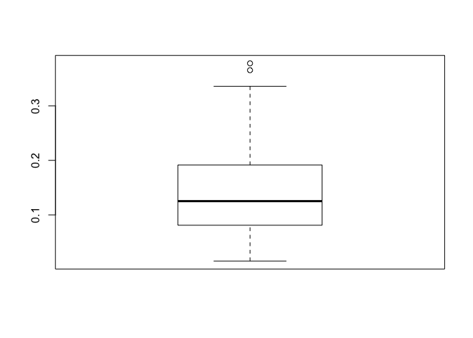
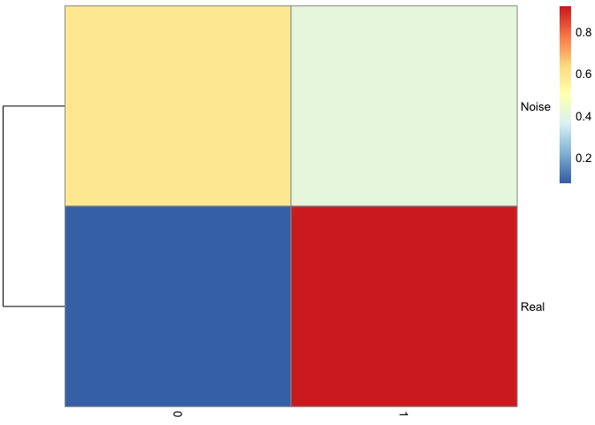

-   [Setup](#setup)
-   [Effect of noisy points](#effect-of-noisy-points)
-   [Density dependent inizialisation and trimming
    radius](#density-dependent-inizialisation-and-trimming-radius)
-   [Density dependent inizialisation and trimming radius and
    bootstrapping](#density-dependent-inizialisation-and-trimming-radius-and-bootstrapping)
-   [Visualizing the effect of the trimming
    radius](#visualizing-the-effect-of-the-trimming-radius)

In real word examples, the data distributions to be approximated can be
*contaminated* by the presence of outliers or points belonging to a
different distribution. To address this aspect, the ElPiGraph.R package
implement two functionalities that can be used to minimize the impact of
these points: density-dependent initialization and trimming radius.

Setup
=====

To show the effect of these features, we will start by generating noisy
datasets from the tree example present in the package, with an increased
intensity of noise. Similar ideas and concepts apply to the construction
of curves as well.

    library(ElPiGraph.R)
    library(igraph)

    ## 
    ## Attaching package: 'igraph'

    ## The following objects are masked from 'package:stats':
    ## 
    ##     decompose, spectrum

    ## The following object is masked from 'package:base':
    ## 
    ##     union

    nPoints <- round(nrow(tree_data)*.5)

    NewPoints <- apply(apply(tree_data, 2, range), 2, function(x){
      runif(n = nPoints, x[1], x[2])
    })

    TD_LowNoise <- rbind(tree_data, NewPoints)
    TD_LowNoise_Cat <- c(rep("Real", nrow(tree_data)), rep("Noise", nrow(NewPoints)))

    nPoints <- nrow(tree_data)*2

    NewPoints <- apply(apply(tree_data, 2, range), 2, function(x){
      runif(n = nPoints, x[1], x[2])
    })

    TD_MedNoise <- rbind(tree_data, NewPoints)
    TD_MedNoise_Cat <- c(rep("Real", nrow(tree_data)), rep("Noise", nrow(NewPoints)))

    nPoints <- nrow(tree_data)*8

    NewPoints <- apply(apply(tree_data, 2, range), 2, function(x){
      runif(n = nPoints, x[1], x[2])
    })

    TD_HighNoise <- rbind(tree_data, NewPoints)
    TD_HighNoise_Cat <- c(rep("Real", nrow(tree_data)), rep("Noise", nrow(NewPoints)))

Effect of noisy points
======================

By default the ElPiGraph algorithm uses all the points and generate the
initial points on the 1st PC of the data. Therefore, noise can affect
significantly the reconstructed tree.

    TreeEPG <- computeElasticPrincipalTree(X = TD_LowNoise, NumNodes = 50,
                                           drawAccuracyComplexity = FALSE, drawEnergy = FALSE, drawPCAView = FALSE, n.cores = 4)

    ## [1] "Creating a sock cluster with 4 nodes"
    ## [1] "Creating a chain in the 1st PC with 2 nodes"
    ## [1] "Constructing tree 1 of 1 / Subset 1 of 1"
    ## [1] "Performing PCA on the data"
    ## [1] "Using standard PCA"
    ## [1] "3 dimensions are being used"
    ## [1] "100% of the original variance has been retained"
    ## [1] "Using a user supplied cluster. Updating the value of X"
    ## [1] "Computing EPG with 50 nodes on 738 points and 3 dimensions"
    ## [1] "Using a user supplied cluster. It must contains the data points in a matrix X"
    ## [1] "Exporting the additional variables to the cluster"
    ## Nodes = 2 3 4 5 6 7 8 9 10 11 12 13 14 15 16 17 18 19 20 21 22 23 24 25 26 27 28 29 30 31 32 33 34 35 36 37 38 39 40 41 42 43 44 45 46 47 48 49 
    ## BARCODE  ENERGY  NNODES  NEDGES  NRIBS   NSTARS  NRAYS   NRAYS2  MSE MSEP    FVE FVEP    UE  UR  URN URN2    URSD
    ## 1|6||50  0.04206 50  49  33  6   0   0   0.0181  0.01664 0.9733  0.9755  0.02376 0.0002021   0.01011 0.5053  0
    ## 10.745 sec elapsed

    PlotPG(X = TD_LowNoise, TargetPG = TreeEPG[[1]], GroupsLab = TD_LowNoise_Cat, DimToPlot = 1:2)

    ## [[1]]

    TreeEPG <- computeElasticPrincipalTree(X = TD_MedNoise, NumNodes = 50,
                                           drawAccuracyComplexity = FALSE, drawEnergy = FALSE, drawPCAView = FALSE, n.cores = 4)

    ## [1] "Creating a sock cluster with 4 nodes"
    ## [1] "Creating a chain in the 1st PC with 2 nodes"
    ## [1] "Constructing tree 1 of 1 / Subset 1 of 1"
    ## [1] "Performing PCA on the data"
    ## [1] "Using standard PCA"
    ## [1] "3 dimensions are being used"
    ## [1] "100% of the original variance has been retained"
    ## [1] "Using a user supplied cluster. Updating the value of X"
    ## [1] "Computing EPG with 50 nodes on 1476 points and 3 dimensions"
    ## [1] "Using a user supplied cluster. It must contains the data points in a matrix X"
    ## [1] "Exporting the additional variables to the cluster"
    ## Nodes = 2 3 4 5 6 7 8 9 10 11 12 13 14 15 16 17 18 19 20 21 22 23 24 25 26 27 28 29 30 31 32 33 34 35 36 37 38 39 40 41 42 43 44 45 46 47 48 49 
    ## BARCODE  ENERGY  NNODES  NEDGES  NRIBS   NSTARS  NRAYS   NRAYS2  MSE MSEP    FVE FVEP    UE  UR  URN URN2    URSD
    ## 1|1|2||50    0.06107 50  49  37  2   0   0   0.03025 0.02824 0.9628  0.9653  0.03    0.0008172   0.04086 2.043   0
    ## 21.276 sec elapsed

    PlotPG(X = TD_MedNoise, TargetPG = TreeEPG[[1]], GroupsLab = TD_MedNoise_Cat, DimToPlot = 1:2)

    ## [[1]]

    TreeEPG <- computeElasticPrincipalTree(X = TD_HighNoise, NumNodes = 50,
                                           drawAccuracyComplexity = FALSE, drawEnergy = FALSE, drawPCAView = FALSE, n.cores = 4)

    ## [1] "Creating a sock cluster with 4 nodes"
    ## [1] "Creating a chain in the 1st PC with 2 nodes"
    ## [1] "Constructing tree 1 of 1 / Subset 1 of 1"
    ## [1] "Performing PCA on the data"
    ## [1] "Using standard PCA"
    ## [1] "3 dimensions are being used"
    ## [1] "100% of the original variance has been retained"
    ## [1] "Using a user supplied cluster. Updating the value of X"
    ## [1] "Computing EPG with 50 nodes on 4428 points and 3 dimensions"
    ## [1] "Using a user supplied cluster. It must contains the data points in a matrix X"
    ## [1] "Exporting the additional variables to the cluster"
    ## Nodes = 2 3 4 5 6 7 8 9 10 11 12 13 14 15 16 17 18 19 20 21 22 23 24 25 26 27 28 29 30 31 32 33 34 35 36 37 38 39 40 41 42 43 44 45 46 47 48 49 
    ## BARCODE  ENERGY  NNODES  NEDGES  NRIBS   NSTARS  NRAYS   NRAYS2  MSE MSEP    FVE FVEP    UE  UR  URN URN2    URSD
    ## 1|0|4||50    0.06652 50  49  36  4   0   0   0.03175 0.02928 0.9641  0.9668  0.03452 0.0002594   0.01297 0.6486  0
    ## 27.754 sec elapsed

    PlotPG(X = TD_HighNoise, TargetPG = TreeEPG[[1]], GroupsLab = TD_HighNoise_Cat, DimToPlot = 1:2)

    ## [[1]]

Density dependent inizialisation and trimming radius
====================================================

To limit the effect of noise, we can specify a trimming radius (which
informs the algorithm to use only points with a distance lower than this
radius when computing the position of the nodes), and use a density
dependent initialization `ICOver = "Density"`. Note that when using
`ICOver = "Density"`, the parameter `DensityRadius`, which is used to
determine the area of the space with the highest density of points, need
to be specified as well.

When a trimming radius is used, tree construction becomes *local*, hence
it may be necessary to increase the number of points in order to better
cover all areas of the space containing the points under consideration.
Moreover certain feature of the topology may be lost due to corruption
due by the noise.

    TreeEPG <- computeElasticPrincipalTree(X = TD_LowNoise, NumNodes = 50,
                                           drawAccuracyComplexity = FALSE, drawEnergy = FALSE, drawPCAView = FALSE,
                                           n.cores = 4,
                                           TrimmingRadius = .15,
                                           ICOver = "Density", DensityRadius = .15)

    ## [1] "Creating a sock cluster with 4 nodes"
    ## [1] "Creating a line in the densest part of the graph. DensityRadius needs to be specified!"
    ## [1] "Constructing tree 1 of 1 / Subset 1 of 1"
    ## [1] "Performing PCA on the data"
    ## [1] "Using standard PCA"
    ## [1] "3 dimensions are being used"
    ## [1] "100% of the original variance has been retained"
    ## [1] "Using a user supplied cluster. Updating the value of X"
    ## [1] "Computing EPG with 50 nodes on 738 points and 3 dimensions"
    ## [1] "Using a user supplied cluster. It must contains the data points in a matrix X"
    ## [1] "Exporting the additional variables to the cluster"
    ## Nodes = 2 3 4 5 6 7 8 9 10 11 12 13 14 15 16 17 18 19 20 21 22 23 24 25 26 27 28 29 30 31 32 33 34 35 36 37 38 39 40 41 42 43 44 45 46 47 48 49 
    ## BARCODE  ENERGY  NNODES  NEDGES  NRIBS   NSTARS  NRAYS   NRAYS2  MSE MSEP    FVE FVEP    UE  UR  URN URN2    URSD
    ## 2|2||50  0.1083  50  49  38  2   0   0   0.1014  Inf 0.8505  -Inf    0.006938    4.041e-05   0.00202 0.101   0
    ## 19.262 sec elapsed

    PlotPG(X = TD_LowNoise, TargetPG = TreeEPG[[1]], GroupsLab = TD_LowNoise_Cat, DimToPlot = 1:2)

    ## [[1]]

    TreeEPG <- computeElasticPrincipalTree(X = TD_MedNoise, NumNodes = 50,
                                           drawAccuracyComplexity = FALSE, drawEnergy = FALSE, drawPCAView = FALSE,
                                           n.cores = 4,
                                           TrimmingRadius = .15,
                                           ICOver = "Density", DensityRadius = .15)

    ## [1] "Creating a sock cluster with 4 nodes"
    ## [1] "Creating a line in the densest part of the graph. DensityRadius needs to be specified!"
    ## [1] "Constructing tree 1 of 1 / Subset 1 of 1"
    ## [1] "Performing PCA on the data"
    ## [1] "Using standard PCA"
    ## [1] "3 dimensions are being used"
    ## [1] "100% of the original variance has been retained"
    ## [1] "Using a user supplied cluster. Updating the value of X"
    ## [1] "Computing EPG with 50 nodes on 1476 points and 3 dimensions"
    ## [1] "Using a user supplied cluster. It must contains the data points in a matrix X"
    ## [1] "Exporting the additional variables to the cluster"
    ## Nodes = 2 3 4 5 6 7 8 9 10 11 12 13 14 15 16 17 18 19 20 21 22 23 24 25 26 27 28 29 30 31 32 33 34 35 36 37 38 39 40 41 42 43 44 45 46 47 48 49 
    ## BARCODE  ENERGY  NNODES  NEDGES  NRIBS   NSTARS  NRAYS   NRAYS2  MSE MSEP    FVE FVEP    UE  UR  URN URN2    URSD
    ## 5||50    0.1866  50  49  38  5   0   0   0.1806  Inf 0.7779  -Inf    0.005991    1.278e-05   0.0006388   0.03194 0
    ## 19.99 sec elapsed

    PlotPG(X = TD_MedNoise, TargetPG = TreeEPG[[1]], GroupsLab = TD_MedNoise_Cat, DimToPlot = 1:2)

    ## [[1]]

    TreeEPG <- computeElasticPrincipalTree(X = TD_HighNoise, NumNodes = 50,
                                           drawAccuracyComplexity = FALSE, drawEnergy = FALSE, drawPCAView = FALSE,
                                           n.cores = 4,
                                           TrimmingRadius = .15,
                                           ICOver = "Density", DensityRadius = .15)

    ## [1] "Creating a sock cluster with 4 nodes"
    ## [1] "Creating a line in the densest part of the graph. DensityRadius needs to be specified!"
    ## [1] "Constructing tree 1 of 1 / Subset 1 of 1"
    ## [1] "Performing PCA on the data"
    ## [1] "Using standard PCA"
    ## [1] "3 dimensions are being used"
    ## [1] "100% of the original variance has been retained"
    ## [1] "Using a user supplied cluster. Updating the value of X"
    ## [1] "Computing EPG with 50 nodes on 4428 points and 3 dimensions"
    ## [1] "Using a user supplied cluster. It must contains the data points in a matrix X"
    ## [1] "Exporting the additional variables to the cluster"
    ## Nodes = 2 3 4 5 6 7 8 9 10 11 12 13 14 15 16 17 18 19 20 21 22 23 24 25 26 27 28 29 30 31 32 33 34 35 36 37 38 39 40 41 42 43 44 45 46 47 48 49 
    ## BARCODE  ENERGY  NNODES  NEDGES  NRIBS   NSTARS  NRAYS   NRAYS2  MSE MSEP    FVE FVEP    UE  UR  URN URN2    URSD
    ## 3||50    0.2356  50  49  42  3   0   0   0.2318  Inf 0.7376  -Inf    0.003861    1.033e-05   0.0005163   0.02581 0
    ## 25.924 sec elapsed

    PlotPG(X = TD_HighNoise, TargetPG = TreeEPG[[1]], GroupsLab = TD_HighNoise_Cat, DimToPlot = 1:2)

    ## [[1]]

Density dependent inizialisation and trimming radius and bootstrapping
======================================================================

To further address the problem of noise in the data it advisable to use
bootstrapping. To enable bootstrapping it is sufficient to use the
parameter `nReps`, which defines the number of repetitions, and
`ProbPoint`, which defines the probability of selecting a point in each
iteration. Bootstrapping can be also helpfull to mitigate the effect of
outliers in the data, when the trimming radius is unspecified.

Note that when bootstrapped is enabled (i.e. when `nRep` is larger than
1), an average graph is generated by using the nodes of the graph
generated during the single execution of the algorithm. Hence if `nRep`
is equalt to n, the returned lists will contain n+1 ElPiGraph
structures: the n repetitions, and the final average graph.

Visualization of bootstrapped data can be easilty perfomred via the
`PlorPG` function. To this end, it is sufficient to pass the
bootstrapped structures via the `BootPG` parameter. Currently a primary
ElPiGraph structure is required (the `TargetPG` parameter).

It is further possible to control if the bootstrapped and target graphs
shoudl be plotted via the `VizMode` parameter.

    nRep <- 20

    TreeEPG <- computeElasticPrincipalTree(X = tree_data, NumNodes = 50,
                                           drawAccuracyComplexity = FALSE, drawEnergy = FALSE,
                                           drawPCAView = FALSE,
                                           n.cores = 4,
                                           nReps = nRep, ProbPoint = .6,
                                           TrimmingRadius = Inf,
                                           ICOver = "DensityProb", DensityRadius = .3)

    ## [1] "Creating a sock cluster with 4 nodes"
    ## [1] "Creating a line in the densest part of the graph. DensityRadius needs to be specified!"
    ## [1] "Constructing tree 1 of 20 / Subset 1 of 1"
    ## [1] "Performing PCA on the data"
    ## [1] "Using standard PCA"
    ## [1] "3 dimensions are being used"
    ## [1] "100% of the original variance has been retained"
    ## [1] "Using a user supplied cluster. Updating the value of X"
    ## [1] "Computing EPG with 50 nodes on 289 points and 3 dimensions"
    ## [1] "Using a user supplied cluster. It must contains the data points in a matrix X"
    ## [1] "Exporting the additional variables to the cluster"
    ## Nodes = 2 3 4 5 6 7 8 9 10 11 12 13 14 15 16 17 18 19 20 21 22 23 24 25 26 27 28 29 30 31 32 33 34 35 36 37 38 39 40 41 42 43 44 45 46 47 48 49 
    ## BARCODE  ENERGY  NNODES  NEDGES  NRIBS   NSTARS  NRAYS   NRAYS2  MSE MSEP    FVE FVEP    UE  UR  URN URN2    URSD
    ## 1|3||50  0.01568 50  49  39  3   0   0   0.004365    0.003698    0.9914  0.9927  0.01112 0.0001946   0.009732    0.4866  0
    ## 17.819 sec elapsed
    ## [1] "Creating a line in the densest part of the graph. DensityRadius needs to be specified!"
    ## [1] "Constructing tree 2 of 20 / Subset 1 of 1"
    ## [1] "Performing PCA on the data"
    ## [1] "Using standard PCA"
    ## [1] "3 dimensions are being used"
    ## [1] "100% of the original variance has been retained"
    ## [1] "Using a user supplied cluster. Updating the value of X"
    ## [1] "Computing EPG with 50 nodes on 304 points and 3 dimensions"
    ## [1] "Using a user supplied cluster. It must contains the data points in a matrix X"
    ## [1] "Exporting the additional variables to the cluster"
    ## Nodes = 2 3 4 5 6 7 8 9 10 11 12 13 14 15 16 17 18 19 20 21 22 23 24 25 26 27 28 29 30 31 32 33 34 35 36 37 38 39 40 41 42 43 44 45 46 47 48 49 
    ## BARCODE  ENERGY  NNODES  NEDGES  NRIBS   NSTARS  NRAYS   NRAYS2  MSE MSEP    FVE FVEP    UE  UR  URN URN2    URSD
    ## 4||50    0.0152  50  49  40  4   0   0   0.005217    0.004598    0.9904  0.9915  0.009694    0.0002897   0.01448 0.7241  0
    ## 15.462 sec elapsed
    ## [1] "Creating a line in the densest part of the graph. DensityRadius needs to be specified!"
    ## [1] "Constructing tree 3 of 20 / Subset 1 of 1"
    ## [1] "Performing PCA on the data"
    ## [1] "Using standard PCA"
    ## [1] "3 dimensions are being used"
    ## [1] "100% of the original variance has been retained"
    ## [1] "Using a user supplied cluster. Updating the value of X"
    ## [1] "Computing EPG with 50 nodes on 303 points and 3 dimensions"
    ## [1] "Using a user supplied cluster. It must contains the data points in a matrix X"
    ## [1] "Exporting the additional variables to the cluster"
    ## Nodes = 2 3 4 5 6 7 8 9 10 11 12 13 14 15 16 17 18 19 20 21 22 23 24 25 26 27 28 29 30 31 32 33 34 35 36 37 38 39 40 41 42 43 44 45 46 47 48 49 
    ## BARCODE  ENERGY  NNODES  NEDGES  NRIBS   NSTARS  NRAYS   NRAYS2  MSE MSEP    FVE FVEP    UE  UR  URN URN2    URSD
    ## 1|3||50  0.01548 50  49  39  3   0   0   0.003986    0.00327 0.9929  0.9941  0.01126 0.0002345   0.01173 0.5863  0
    ## 15.753 sec elapsed
    ## [1] "Creating a line in the densest part of the graph. DensityRadius needs to be specified!"
    ## [1] "Graphical output will be suppressed for the remaining replicas"
    ## [1] "Constructing tree 4 of 20 / Subset 1 of 1"
    ## [1] "Performing PCA on the data"
    ## [1] "Using standard PCA"
    ## [1] "3 dimensions are being used"
    ## [1] "100% of the original variance has been retained"
    ## [1] "Using a user supplied cluster. Updating the value of X"
    ## [1] "Computing EPG with 50 nodes on 311 points and 3 dimensions"
    ## [1] "Using a user supplied cluster. It must contains the data points in a matrix X"
    ## [1] "Exporting the additional variables to the cluster"
    ## Nodes = 2 3 4 5 6 7 8 9 10 11 12 13 14 15 16 17 18 19 20 21 22 23 24 25 26 27 28 29 30 31 32 33 34 35 36 37 38 39 40 41 42 43 44 45 46 47 48 49 
    ## BARCODE  ENERGY  NNODES  NEDGES  NRIBS   NSTARS  NRAYS   NRAYS2  MSE MSEP    FVE FVEP    UE  UR  URN URN2    URSD
    ## 4||50    0.0156  50  49  40  4   0   0   0.004695    0.004016    0.9912  0.9925  0.01047 0.0004427   0.02213 1.107   0
    ## 15.631 sec elapsed
    ## [1] "Creating a line in the densest part of the graph. DensityRadius needs to be specified!"
    ## [1] "Constructing tree 5 of 20 / Subset 1 of 1"
    ## [1] "Performing PCA on the data"
    ## [1] "Using standard PCA"
    ## [1] "3 dimensions are being used"
    ## [1] "100% of the original variance has been retained"
    ## [1] "Using a user supplied cluster. Updating the value of X"
    ## [1] "Computing EPG with 50 nodes on 310 points and 3 dimensions"
    ## [1] "Using a user supplied cluster. It must contains the data points in a matrix X"
    ## [1] "Exporting the additional variables to the cluster"
    ## Nodes = 2 3 4 5 6 7 8 9 10 11 12 13 14 15 16 17 18 19 20 21 22 23 24 25 26 27 28 29 30 31 32 33 34 35 36 37 38 39 40 41 42 43 44 45 46 47 48 49 
    ## BARCODE  ENERGY  NNODES  NEDGES  NRIBS   NSTARS  NRAYS   NRAYS2  MSE MSEP    FVE FVEP    UE  UR  URN URN2    URSD
    ## 1|3||50  0.01601 50  49  39  3   0   0   0.004196    0.003461    0.9919  0.9933  0.01151 0.0003072   0.01536 0.7681  0
    ## 16.302 sec elapsed
    ## [1] "Creating a line in the densest part of the graph. DensityRadius needs to be specified!"
    ## [1] "Constructing tree 6 of 20 / Subset 1 of 1"
    ## [1] "Performing PCA on the data"
    ## [1] "Using standard PCA"
    ## [1] "3 dimensions are being used"
    ## [1] "100% of the original variance has been retained"
    ## [1] "Using a user supplied cluster. Updating the value of X"
    ## [1] "Computing EPG with 50 nodes on 297 points and 3 dimensions"
    ## [1] "Using a user supplied cluster. It must contains the data points in a matrix X"
    ## [1] "Exporting the additional variables to the cluster"
    ## Nodes = 2 3 4 5 6 7 8 9 10 11 12 13 14 15 16 17 18 19 20 21 22 23 24 25 26 27 28 29 30 31 32 33 34 35 36 37 38 39 40 41 42 43 44 45 46 47 48 49 
    ## BARCODE  ENERGY  NNODES  NEDGES  NRIBS   NSTARS  NRAYS   NRAYS2  MSE MSEP    FVE FVEP    UE  UR  URN URN2    URSD
    ## 5||50    0.01553 50  49  38  5   0   0   0.004086    0.003405    0.9924  0.9936  0.01127 0.0001741   0.008704    0.4352  0
    ## 16.023 sec elapsed
    ## [1] "Creating a line in the densest part of the graph. DensityRadius needs to be specified!"
    ## [1] "Constructing tree 7 of 20 / Subset 1 of 1"
    ## [1] "Performing PCA on the data"
    ## [1] "Using standard PCA"
    ## [1] "3 dimensions are being used"
    ## [1] "100% of the original variance has been retained"
    ## [1] "Using a user supplied cluster. Updating the value of X"
    ## [1] "Computing EPG with 50 nodes on 303 points and 3 dimensions"
    ## [1] "Using a user supplied cluster. It must contains the data points in a matrix X"
    ## [1] "Exporting the additional variables to the cluster"
    ## Nodes = 2 3 4 5 6 7 8 9 10 11 12 13 14 15 16 17 18 19 20 21 22 23 24 25 26 27 28 29 30 31 32 33 34 35 36 37 38 39 40 41 42 43 44 45 46 47 48 49 
    ## BARCODE  ENERGY  NNODES  NEDGES  NRIBS   NSTARS  NRAYS   NRAYS2  MSE MSEP    FVE FVEP    UE  UR  URN URN2    URSD
    ## 1|3||50  0.01568 50  49  39  3   0   0   0.004048    0.003434    0.9921  0.9933  0.01139 0.0002358   0.01179 0.5896  0
    ## 17.218 sec elapsed
    ## [1] "Creating a line in the densest part of the graph. DensityRadius needs to be specified!"
    ## [1] "Constructing tree 8 of 20 / Subset 1 of 1"
    ## [1] "Performing PCA on the data"
    ## [1] "Using standard PCA"
    ## [1] "3 dimensions are being used"
    ## [1] "100% of the original variance has been retained"
    ## [1] "Using a user supplied cluster. Updating the value of X"
    ## [1] "Computing EPG with 50 nodes on 311 points and 3 dimensions"
    ## [1] "Using a user supplied cluster. It must contains the data points in a matrix X"
    ## [1] "Exporting the additional variables to the cluster"
    ## Nodes = 2 3 4 5 6 7 8 9 10 11 12 13 14 15 16 17 18 19 20 21 22 23 24 25 26 27 28 29 30 31 32 33 34 35 36 37 38 39 40 41 42 43 44 45 46 47 48 49 
    ## BARCODE  ENERGY  NNODES  NEDGES  NRIBS   NSTARS  NRAYS   NRAYS2  MSE MSEP    FVE FVEP    UE  UR  URN URN2    URSD
    ## 4||50    0.01568 50  49  40  4   0   0   0.004873    0.004255    0.991   0.9921  0.01044 0.0003654   0.01827 0.9135  0
    ## 17.279 sec elapsed
    ## [1] "Creating a line in the densest part of the graph. DensityRadius needs to be specified!"
    ## [1] "Constructing tree 9 of 20 / Subset 1 of 1"
    ## [1] "Performing PCA on the data"
    ## [1] "Using standard PCA"
    ## [1] "3 dimensions are being used"
    ## [1] "100% of the original variance has been retained"
    ## [1] "Using a user supplied cluster. Updating the value of X"
    ## [1] "Computing EPG with 50 nodes on 304 points and 3 dimensions"
    ## [1] "Using a user supplied cluster. It must contains the data points in a matrix X"
    ## [1] "Exporting the additional variables to the cluster"
    ## Nodes = 2 3 4 5 6 7 8 9 10 11 12 13 14 15 16 17 18 19 20 21 22 23 24 25 26 27 28 29 30 31 32 33 34 35 36 37 38 39 40 41 42 43 44 45 46 47 48 49 
    ## BARCODE  ENERGY  NNODES  NEDGES  NRIBS   NSTARS  NRAYS   NRAYS2  MSE MSEP    FVE FVEP    UE  UR  URN URN2    URSD
    ## 1|3||50  0.01548 50  49  39  3   0   0   0.003744    0.003002    0.9928  0.9942  0.01158 0.0001522   0.00761 0.3805  0
    ## 16.136 sec elapsed
    ## [1] "Creating a line in the densest part of the graph. DensityRadius needs to be specified!"
    ## [1] "Constructing tree 10 of 20 / Subset 1 of 1"
    ## [1] "Performing PCA on the data"
    ## [1] "Using standard PCA"
    ## [1] "3 dimensions are being used"
    ## [1] "100% of the original variance has been retained"
    ## [1] "Using a user supplied cluster. Updating the value of X"
    ## [1] "Computing EPG with 50 nodes on 302 points and 3 dimensions"
    ## [1] "Using a user supplied cluster. It must contains the data points in a matrix X"
    ## [1] "Exporting the additional variables to the cluster"
    ## Nodes = 2 3 4 5 6 7 8 9 10 11 12 13 14 15 16 17 18 19 20 21 22 23 24 25 26 27 28 29 30 31 32 33 34 35 36 37 38 39 40 41 42 43 44 45 46 47 48 49 
    ## BARCODE  ENERGY  NNODES  NEDGES  NRIBS   NSTARS  NRAYS   NRAYS2  MSE MSEP    FVE FVEP    UE  UR  URN URN2    URSD
    ## 4||50    0.01574 50  49  40  4   0   0   0.004865    0.004278    0.9906  0.9917  0.01049 0.0003845   0.01922 0.9612  0
    ## 16.97 sec elapsed
    ## [1] "Creating a line in the densest part of the graph. DensityRadius needs to be specified!"
    ## [1] "Constructing tree 11 of 20 / Subset 1 of 1"
    ## [1] "Performing PCA on the data"
    ## [1] "Using standard PCA"
    ## [1] "3 dimensions are being used"
    ## [1] "100% of the original variance has been retained"
    ## [1] "Using a user supplied cluster. Updating the value of X"
    ## [1] "Computing EPG with 50 nodes on 294 points and 3 dimensions"
    ## [1] "Using a user supplied cluster. It must contains the data points in a matrix X"
    ## [1] "Exporting the additional variables to the cluster"
    ## Nodes = 2 3 4 5 6 7 8 9 10 11 12 13 14 15 16 17 18 19 20 21 22 23 24 25 26 27 28 29 30 31 32 33 34 35 36 37 38 39 40 41 42 43 44 45 46 47 48 49 
    ## BARCODE  ENERGY  NNODES  NEDGES  NRIBS   NSTARS  NRAYS   NRAYS2  MSE MSEP    FVE FVEP    UE  UR  URN URN2    URSD
    ## 1|3||50  0.01507 50  49  39  3   0   0   0.003945    0.003284    0.9925  0.9937  0.01095 0.000172    0.008599    0.4299  0
    ## 17.493 sec elapsed
    ## [1] "Creating a line in the densest part of the graph. DensityRadius needs to be specified!"
    ## [1] "Constructing tree 12 of 20 / Subset 1 of 1"
    ## [1] "Performing PCA on the data"
    ## [1] "Using standard PCA"
    ## [1] "3 dimensions are being used"
    ## [1] "100% of the original variance has been retained"
    ## [1] "Using a user supplied cluster. Updating the value of X"
    ## [1] "Computing EPG with 50 nodes on 287 points and 3 dimensions"
    ## [1] "Using a user supplied cluster. It must contains the data points in a matrix X"
    ## [1] "Exporting the additional variables to the cluster"
    ## Nodes = 2 3 4 5 6 7 8 9 10 11 12 13 14 15 16 17 18 19 20 21 22 23 24 25 26 27 28 29 30 31 32 33 34 35 36 37 38 39 40 41 42 43 44 45 46 47 48 49 
    ## BARCODE  ENERGY  NNODES  NEDGES  NRIBS   NSTARS  NRAYS   NRAYS2  MSE MSEP    FVE FVEP    UE  UR  URN URN2    URSD
    ## 1|3||50  0.01501 50  49  39  3   0   0   0.003767    0.003061    0.9931  0.9944  0.01108 0.0001619   0.008094    0.4047  0
    ## 17.169 sec elapsed
    ## [1] "Creating a line in the densest part of the graph. DensityRadius needs to be specified!"
    ## [1] "Constructing tree 13 of 20 / Subset 1 of 1"
    ## [1] "Performing PCA on the data"
    ## [1] "Using standard PCA"
    ## [1] "3 dimensions are being used"
    ## [1] "100% of the original variance has been retained"
    ## [1] "Using a user supplied cluster. Updating the value of X"
    ## [1] "Computing EPG with 50 nodes on 284 points and 3 dimensions"
    ## [1] "Using a user supplied cluster. It must contains the data points in a matrix X"
    ## [1] "Exporting the additional variables to the cluster"
    ## Nodes = 2 3 4 5 6 7 8 9 10 11 12 13 14 15 16 17 18 19 20 21 22 23 24 25 26 27 28 29 30 31 32 33 34 35 36 37 38 39 40 41 42 43 44 45 46 47 48 49 
    ## BARCODE  ENERGY  NNODES  NEDGES  NRIBS   NSTARS  NRAYS   NRAYS2  MSE MSEP    FVE FVEP    UE  UR  URN URN2    URSD
    ## 1|2||50  0.01596 50  49  41  2   0   0   0.004413    0.003643    0.9922  0.9935  0.01106 0.0004874   0.02437 1.218   0
    ## 16.885 sec elapsed
    ## [1] "Creating a line in the densest part of the graph. DensityRadius needs to be specified!"
    ## [1] "Constructing tree 14 of 20 / Subset 1 of 1"
    ## [1] "Performing PCA on the data"
    ## [1] "Using standard PCA"
    ## [1] "3 dimensions are being used"
    ## [1] "100% of the original variance has been retained"
    ## [1] "Using a user supplied cluster. Updating the value of X"
    ## [1] "Computing EPG with 50 nodes on 297 points and 3 dimensions"
    ## [1] "Using a user supplied cluster. It must contains the data points in a matrix X"
    ## [1] "Exporting the additional variables to the cluster"
    ## Nodes = 2 3 4 5 6 7 8 9 10 11 12 13 14 15 16 17 18 19 20 21 22 23 24 25 26 27 28 29 30 31 32 33 34 35 36 37 38 39 40 41 42 43 44 45 46 47 48 49 
    ## BARCODE  ENERGY  NNODES  NEDGES  NRIBS   NSTARS  NRAYS   NRAYS2  MSE MSEP    FVE FVEP    UE  UR  URN URN2    URSD
    ## 1|3||50  0.01551 50  49  39  3   0   0   0.00389 0.003223    0.9927  0.9939  0.01138 0.0002368   0.01184 0.5921  0
    ## 18.507 sec elapsed
    ## [1] "Creating a line in the densest part of the graph. DensityRadius needs to be specified!"
    ## [1] "Constructing tree 15 of 20 / Subset 1 of 1"
    ## [1] "Performing PCA on the data"
    ## [1] "Using standard PCA"
    ## [1] "3 dimensions are being used"
    ## [1] "100% of the original variance has been retained"
    ## [1] "Using a user supplied cluster. Updating the value of X"
    ## [1] "Computing EPG with 50 nodes on 290 points and 3 dimensions"
    ## [1] "Using a user supplied cluster. It must contains the data points in a matrix X"
    ## [1] "Exporting the additional variables to the cluster"
    ## Nodes = 2 3 4 5 6 7 8 9 10 11 12 13 14 15 16 17 18 19 20 21 22 23 24 25 26 27 28 29 30 31 32 33 34 35 36 37 38 39 40 41 42 43 44 45 46 47 48 49 
    ## BARCODE  ENERGY  NNODES  NEDGES  NRIBS   NSTARS  NRAYS   NRAYS2  MSE MSEP    FVE FVEP    UE  UR  URN URN2    URSD
    ## 1|3||50  0.01611 50  49  39  3   0   0   0.004209    0.003498    0.9928  0.9941  0.01163 0.0002684   0.01342 0.671   0
    ## 17.866 sec elapsed
    ## [1] "Creating a line in the densest part of the graph. DensityRadius needs to be specified!"
    ## [1] "Constructing tree 16 of 20 / Subset 1 of 1"
    ## [1] "Performing PCA on the data"
    ## [1] "Using standard PCA"
    ## [1] "3 dimensions are being used"
    ## [1] "100% of the original variance has been retained"
    ## [1] "Using a user supplied cluster. Updating the value of X"
    ## [1] "Computing EPG with 50 nodes on 296 points and 3 dimensions"
    ## [1] "Using a user supplied cluster. It must contains the data points in a matrix X"
    ## [1] "Exporting the additional variables to the cluster"
    ## Nodes = 2 3 4 5 6 7 8 9 10 11 12 13 14 15 16 17 18 19 20 21 22 23 24 25 26 27 28 29 30 31 32 33 34 35 36 37 38 39 40 41 42 43 44 45 46 47 48 49 
    ## BARCODE  ENERGY  NNODES  NEDGES  NRIBS   NSTARS  NRAYS   NRAYS2  MSE MSEP    FVE FVEP    UE  UR  URN URN2    URSD
    ## 1|3||50  0.01533 50  49  39  3   0   0   0.00402 0.003318    0.9924  0.9937  0.01115 0.0001626   0.00813 0.4065  0
    ## 17.701 sec elapsed
    ## [1] "Creating a line in the densest part of the graph. DensityRadius needs to be specified!"
    ## [1] "Constructing tree 17 of 20 / Subset 1 of 1"
    ## [1] "Performing PCA on the data"
    ## [1] "Using standard PCA"
    ## [1] "3 dimensions are being used"
    ## [1] "100% of the original variance has been retained"
    ## [1] "Using a user supplied cluster. Updating the value of X"
    ## [1] "Computing EPG with 50 nodes on 301 points and 3 dimensions"
    ## [1] "Using a user supplied cluster. It must contains the data points in a matrix X"
    ## [1] "Exporting the additional variables to the cluster"
    ## Nodes = 2 3 4 5 6 7 8 9 10 11 12 13 14 15 16 17 18 19 20 21 22 23 24 25 26 27 28 29 30 31 32 33 34 35 36 37 38 39 40 41 42 43 44 45 46 47 48 49 
    ## BARCODE  ENERGY  NNODES  NEDGES  NRIBS   NSTARS  NRAYS   NRAYS2  MSE MSEP    FVE FVEP    UE  UR  URN URN2    URSD
    ## 1|2||50  0.01611 50  49  41  2   0   0   0.004111    0.003406    0.9927  0.9939  0.01154 0.0004503   0.02252 1.126   0
    ## 17.522 sec elapsed
    ## [1] "Creating a line in the densest part of the graph. DensityRadius needs to be specified!"
    ## [1] "Constructing tree 18 of 20 / Subset 1 of 1"
    ## [1] "Performing PCA on the data"
    ## [1] "Using standard PCA"
    ## [1] "3 dimensions are being used"
    ## [1] "100% of the original variance has been retained"
    ## [1] "Using a user supplied cluster. Updating the value of X"
    ## [1] "Computing EPG with 50 nodes on 292 points and 3 dimensions"
    ## [1] "Using a user supplied cluster. It must contains the data points in a matrix X"
    ## [1] "Exporting the additional variables to the cluster"
    ## Nodes = 2 3 4 5 6 7 8 9 10 11 12 13 14 15 16 17 18 19 20 21 22 23 24 25 26 27 28 29 30 31 32 33 34 35 36 37 38 39 40 41 42 43 44 45 46 47 48 49 
    ## BARCODE  ENERGY  NNODES  NEDGES  NRIBS   NSTARS  NRAYS   NRAYS2  MSE MSEP    FVE FVEP    UE  UR  URN URN2    URSD
    ## 4||50    0.01578 50  49  40  4   0   0   0.004791    0.004205    0.991   0.9921  0.01049 0.0004967   0.02484 1.242   0
    ## 18.454 sec elapsed
    ## [1] "Creating a line in the densest part of the graph. DensityRadius needs to be specified!"
    ## [1] "Constructing tree 19 of 20 / Subset 1 of 1"
    ## [1] "Performing PCA on the data"
    ## [1] "Using standard PCA"
    ## [1] "3 dimensions are being used"
    ## [1] "100% of the original variance has been retained"
    ## [1] "Using a user supplied cluster. Updating the value of X"
    ## [1] "Computing EPG with 50 nodes on 280 points and 3 dimensions"
    ## [1] "Using a user supplied cluster. It must contains the data points in a matrix X"
    ## [1] "Exporting the additional variables to the cluster"
    ## Nodes = 2 3 4 5 6 7 8 9 10 11 12 13 14 15 16 17 18 19 20 21 22 23 24 25 26 27 28 29 30 31 32 33 34 35 36 37 38 39 40 41 42 43 44 45 46 47 48 49 
    ## BARCODE  ENERGY  NNODES  NEDGES  NRIBS   NSTARS  NRAYS   NRAYS2  MSE MSEP    FVE FVEP    UE  UR  URN URN2    URSD
    ## 4||50    0.01572 50  49  40  4   0   0   0.005394    0.004824    0.9902  0.9913  0.01003 0.0002963   0.01481 0.7406  0
    ## 18.335 sec elapsed
    ## [1] "Creating a line in the densest part of the graph. DensityRadius needs to be specified!"
    ## [1] "Constructing tree 20 of 20 / Subset 1 of 1"
    ## [1] "Performing PCA on the data"
    ## [1] "Using standard PCA"
    ## [1] "3 dimensions are being used"
    ## [1] "100% of the original variance has been retained"
    ## [1] "Using a user supplied cluster. Updating the value of X"
    ## [1] "Computing EPG with 50 nodes on 307 points and 3 dimensions"
    ## [1] "Using a user supplied cluster. It must contains the data points in a matrix X"
    ## [1] "Exporting the additional variables to the cluster"
    ## Nodes = 2 3 4 5 6 7 8 9 10 11 12 13 14 15 16 17 18 19 20 21 22 23 24 25 26 27 28 29 30 31 32 33 34 35 36 37 38 39 40 41 42 43 44 45 46 47 48 49 
    ## BARCODE  ENERGY  NNODES  NEDGES  NRIBS   NSTARS  NRAYS   NRAYS2  MSE MSEP    FVE FVEP    UE  UR  URN URN2    URSD
    ## 1|3||50  0.01583 50  49  39  3   0   0   0.003797    0.003066    0.9929  0.9943  0.01184 0.0001837   0.009186    0.4593  0
    ## 19.18 sec elapsed
    ## [1] "Constructing average tree"
    ## [1] "Creating a line in the densest part of the graph. DensityRadius needs to be specified!"
    ## [1] "Performing PCA on the data"
    ## [1] "Using standard PCA"
    ## [1] "3 dimensions are being used"
    ## [1] "100% of the original variance has been retained"
    ## [1] "Computing EPG with 50 nodes on 1000 points and 3 dimensions"
    ## [1] "Using a single core"
    ## Nodes = 2 3 4 5 6 7 8 9 10 11 12 13 14 15 16 17 18 19 20 21 22 23 24 25 26 27 28 29 30 31 32 33 34 35 36 37 38 39 40 41 42 43 44 45 46 47 48 49 
    ## BARCODE  ENERGY  NNODES  NEDGES  NRIBS   NSTARS  NRAYS   NRAYS2  MSE MSEP    FVE FVEP    UE  UR  URN URN2    URSD
    ## 1|3||50  0.01128 50  49  39  3   0   0   0.00196 0.001438    0.9962  0.9972  0.009249    6.944e-05   0.003472    0.1736  0
    ## 10.045 sec elapsed

    PlotPG(X = tree_data, BootPG = TreeEPG[1:nRep], TargetPG = TreeEPG[[nRep+1]], DimToPlot = 1:2, VizMode = c("Target", "Boot"))

    ## [[1]]

    PlotPG(X = tree_data, BootPG = TreeEPG[1:nRep], TargetPG = TreeEPG[[nRep+1]], DimToPlot = 1:2, VizMode = "Boot")

    ## [[1]]

    PlotPG(X = tree_data, TargetPG = TreeEPG[[nRep+1]], DimToPlot = 1:2)

    ## [[1]]

    nRep <- 20

    TreeEPG <- computeElasticPrincipalTree(X = TD_LowNoise, NumNodes = 50,
                                           drawAccuracyComplexity = FALSE, drawEnergy = FALSE,
                                           drawPCAView = FALSE,
                                           n.cores = 4,
                                           nReps = nRep, ProbPoint = .6,
                                           TrimmingRadius = .15,
                                           ICOver = "DensityProb", DensityRadius = .15)

    ## [1] "Creating a sock cluster with 4 nodes"
    ## [1] "Creating a line in the densest part of the graph. DensityRadius needs to be specified!"
    ## [1] "Constructing tree 1 of 20 / Subset 1 of 1"
    ## [1] "Performing PCA on the data"
    ## [1] "Using standard PCA"
    ## [1] "3 dimensions are being used"
    ## [1] "100% of the original variance has been retained"
    ## [1] "Using a user supplied cluster. Updating the value of X"
    ## [1] "Computing EPG with 50 nodes on 457 points and 3 dimensions"
    ## [1] "Using a user supplied cluster. It must contains the data points in a matrix X"
    ## [1] "Exporting the additional variables to the cluster"
    ## Nodes = 2 3 4 5 6 7 8 9 10 11 12 13 14 15 16 17 18 19 20 21 22 23 24 25 26 27 28 29 30 31 32 33 34 35 36 37 38 39 40 41 42 43 44 45 46 47 48 49 
    ## BARCODE  ENERGY  NNODES  NEDGES  NRIBS   NSTARS  NRAYS   NRAYS2  MSE MSEP    FVE FVEP    UE  UR  URN URN2    URSD
    ## 2|4||50  0.1038  50  49  34  4   0   0   0.09514 Inf 0.863   -Inf    0.008605    9.001e-05   0.004501    0.225   0
    ## 17.783 sec elapsed
    ## [1] "Creating a line in the densest part of the graph. DensityRadius needs to be specified!"
    ## [1] "Constructing tree 2 of 20 / Subset 1 of 1"
    ## [1] "Performing PCA on the data"
    ## [1] "Using standard PCA"
    ## [1] "3 dimensions are being used"
    ## [1] "100% of the original variance has been retained"
    ## [1] "Using a user supplied cluster. Updating the value of X"
    ## [1] "Computing EPG with 50 nodes on 429 points and 3 dimensions"
    ## [1] "Using a user supplied cluster. It must contains the data points in a matrix X"
    ## [1] "Exporting the additional variables to the cluster"
    ## Nodes = 2 3 4 5 6 7 8 9 10 11 12 13 14 15 16 17 18 19 20 21 22 23 24 25 26 27 28 29 30 31 32 33 34 35 36 37 38 39 40 41 42 43 44 45 46 47 48 49 
    ## BARCODE  ENERGY  NNODES  NEDGES  NRIBS   NSTARS  NRAYS   NRAYS2  MSE MSEP    FVE FVEP    UE  UR  URN URN2    URSD
    ## 3|2||50  0.1031  50  49  35  2   0   0   0.09378 Inf 0.8571  -Inf    0.009316    3.605e-05   0.001803    0.09013 0
    ## 16.795 sec elapsed
    ## [1] "Creating a line in the densest part of the graph. DensityRadius needs to be specified!"
    ## [1] "Constructing tree 3 of 20 / Subset 1 of 1"
    ## [1] "Performing PCA on the data"
    ## [1] "Using standard PCA"
    ## [1] "3 dimensions are being used"
    ## [1] "100% of the original variance has been retained"
    ## [1] "Using a user supplied cluster. Updating the value of X"
    ## [1] "Computing EPG with 50 nodes on 432 points and 3 dimensions"
    ## [1] "Using a user supplied cluster. It must contains the data points in a matrix X"
    ## [1] "Exporting the additional variables to the cluster"
    ## Nodes = 2 3 4 5 6 7 8 9 10 11 12 13 14 15 16 17 18 19 20 21 22 23 24 25 26 27 28 29 30 31 32 33 34 35 36 37 38 39 40 41 42 43 44 45 46 47 48 49 
    ## BARCODE  ENERGY  NNODES  NEDGES  NRIBS   NSTARS  NRAYS   NRAYS2  MSE MSEP    FVE FVEP    UE  UR  URN URN2    URSD
    ## 3||50    0.1083  50  49  42  3   0   0   0.1004  Inf 0.8486  -Inf    0.007906    6.38e-05    0.00319 0.1595  0
    ## 16.827 sec elapsed
    ## [1] "Creating a line in the densest part of the graph. DensityRadius needs to be specified!"
    ## [1] "Graphical output will be suppressed for the remaining replicas"
    ## [1] "Constructing tree 4 of 20 / Subset 1 of 1"
    ## [1] "Performing PCA on the data"
    ## [1] "Using standard PCA"
    ## [1] "3 dimensions are being used"
    ## [1] "100% of the original variance has been retained"
    ## [1] "Using a user supplied cluster. Updating the value of X"
    ## [1] "Computing EPG with 50 nodes on 446 points and 3 dimensions"
    ## [1] "Using a user supplied cluster. It must contains the data points in a matrix X"
    ## [1] "Exporting the additional variables to the cluster"
    ## Nodes = 2 3 4 5 6 7 8 9 10 11 12 13 14 15 16 17 18 19 20 21 22 23 24 25 26 27 28 29 30 31 32 33 34 35 36 37 38 39 40 41 42 43 44 45 46 47 48 49 
    ## BARCODE  ENERGY  NNODES  NEDGES  NRIBS   NSTARS  NRAYS   NRAYS2  MSE MSEP    FVE FVEP    UE  UR  URN URN2    URSD
    ## 4||50    0.1113  50  49  40  4   0   0   0.106   Inf 0.835   -Inf    0.005155    6.068e-05   0.003034    0.1517  0
    ## 17.752 sec elapsed
    ## [1] "Creating a line in the densest part of the graph. DensityRadius needs to be specified!"
    ## [1] "Constructing tree 5 of 20 / Subset 1 of 1"
    ## [1] "Performing PCA on the data"
    ## [1] "Using standard PCA"
    ## [1] "3 dimensions are being used"
    ## [1] "100% of the original variance has been retained"
    ## [1] "Using a user supplied cluster. Updating the value of X"
    ## [1] "Computing EPG with 50 nodes on 421 points and 3 dimensions"
    ## [1] "Using a user supplied cluster. It must contains the data points in a matrix X"
    ## [1] "Exporting the additional variables to the cluster"
    ## Nodes = 2 3 4 5 6 7 8 9 10 11 12 13 14 15 16 17 18 19 20 21 22 23 24 25 26 27 28 29 30 31 32 33 34 35 36 37 38 39 40 41 42 43 44 45 46 47 48 49 
    ## BARCODE  ENERGY  NNODES  NEDGES  NRIBS   NSTARS  NRAYS   NRAYS2  MSE MSEP    FVE FVEP    UE  UR  URN URN2    URSD
    ## 1|2||50  0.08463 50  49  41  2   0   0   0.07499 Inf 0.8903  -Inf    0.009576    6.512e-05   0.003256    0.1628  0
    ## 16.989 sec elapsed
    ## [1] "Creating a line in the densest part of the graph. DensityRadius needs to be specified!"
    ## [1] "Constructing tree 6 of 20 / Subset 1 of 1"
    ## [1] "Performing PCA on the data"
    ## [1] "Using standard PCA"
    ## [1] "3 dimensions are being used"
    ## [1] "100% of the original variance has been retained"
    ## [1] "Using a user supplied cluster. Updating the value of X"
    ## [1] "Computing EPG with 50 nodes on 454 points and 3 dimensions"
    ## [1] "Using a user supplied cluster. It must contains the data points in a matrix X"
    ## [1] "Exporting the additional variables to the cluster"
    ## Nodes = 2 3 4 5 6 7 8 9 10 11 12 13 14 15 16 17 18 19 20 21 22 23 24 25 26 27 28 29 30 31 32 33 34 35 36 37 38 39 40 41 42 43 44 45 46 47 48 49 
    ## BARCODE  ENERGY  NNODES  NEDGES  NRIBS   NSTARS  NRAYS   NRAYS2  MSE MSEP    FVE FVEP    UE  UR  URN URN2    URSD
    ## 1|5||50  0.09829 50  49  35  5   0   0   0.09065 Inf 0.8642  -Inf    0.007568    7.502e-05   0.003751    0.1875  0
    ## 16.984 sec elapsed
    ## [1] "Creating a line in the densest part of the graph. DensityRadius needs to be specified!"
    ## [1] "Constructing tree 7 of 20 / Subset 1 of 1"
    ## [1] "Performing PCA on the data"
    ## [1] "Using standard PCA"
    ## [1] "3 dimensions are being used"
    ## [1] "100% of the original variance has been retained"
    ## [1] "Using a user supplied cluster. Updating the value of X"
    ## [1] "Computing EPG with 50 nodes on 452 points and 3 dimensions"
    ## [1] "Using a user supplied cluster. It must contains the data points in a matrix X"
    ## [1] "Exporting the additional variables to the cluster"
    ## Nodes = 2 3 4 5 6 7 8 9 10 11 12 13 14 15 16 17 18 19 20 21 22 23 24 25 26 27 28 29 30 31 32 33 34 35 36 37 38 39 40 41 42 43 44 45 46 47 48 49 
    ## BARCODE  ENERGY  NNODES  NEDGES  NRIBS   NSTARS  NRAYS   NRAYS2  MSE MSEP    FVE FVEP    UE  UR  URN URN2    URSD
    ## 3||50    0.08545 50  49  42  3   0   0   0.07564 Inf 0.8897  -Inf    0.009586    0.0002154   0.01077 0.5385  0
    ## 16.457 sec elapsed
    ## [1] "Creating a line in the densest part of the graph. DensityRadius needs to be specified!"
    ## [1] "Constructing tree 8 of 20 / Subset 1 of 1"
    ## [1] "Performing PCA on the data"
    ## [1] "Using standard PCA"
    ## [1] "3 dimensions are being used"
    ## [1] "100% of the original variance has been retained"
    ## [1] "Using a user supplied cluster. Updating the value of X"
    ## [1] "Computing EPG with 50 nodes on 471 points and 3 dimensions"
    ## [1] "Using a user supplied cluster. It must contains the data points in a matrix X"
    ## [1] "Exporting the additional variables to the cluster"
    ## Nodes = 2 3 4 5 6 7 8 9 10 11 12 13 14 15 16 17 18 19 20 21 22 23 24 25 26 27 28 29 30 31 32 33 34 35 36 37 38 39 40 41 42 43 44 45 46 47 48 49 
    ## BARCODE  ENERGY  NNODES  NEDGES  NRIBS   NSTARS  NRAYS   NRAYS2  MSE MSEP    FVE FVEP    UE  UR  URN URN2    URSD
    ## 1|3||50  0.09751 50  49  39  3   0   0   0.08871 Inf 0.8686  -Inf    0.008774    3.271e-05   0.001636    0.08178 0
    ## 17.771 sec elapsed
    ## [1] "Creating a line in the densest part of the graph. DensityRadius needs to be specified!"
    ## [1] "Constructing tree 9 of 20 / Subset 1 of 1"
    ## [1] "Performing PCA on the data"
    ## [1] "Using standard PCA"
    ## [1] "3 dimensions are being used"
    ## [1] "100% of the original variance has been retained"
    ## [1] "Using a user supplied cluster. Updating the value of X"
    ## [1] "Computing EPG with 50 nodes on 435 points and 3 dimensions"
    ## [1] "Using a user supplied cluster. It must contains the data points in a matrix X"
    ## [1] "Exporting the additional variables to the cluster"
    ## Nodes = 2 3 4 5 6 7 8 9 10 11 12 13 14 15 16 17 18 19 20 21 22 23 24 25 26 27 28 29 30 31 32 33 34 35 36 37 38 39 40 41 42 43 44 45 46 47 48 49 
    ## BARCODE  ENERGY  NNODES  NEDGES  NRIBS   NSTARS  NRAYS   NRAYS2  MSE MSEP    FVE FVEP    UE  UR  URN URN2    URSD
    ## 2||50    0.1538  50  49  44  2   0   0   0.1498  Inf 0.7807  -Inf    0.003915    6.585e-05   0.003293    0.1646  0
    ## 19.109 sec elapsed
    ## [1] "Creating a line in the densest part of the graph. DensityRadius needs to be specified!"
    ## [1] "Constructing tree 10 of 20 / Subset 1 of 1"
    ## [1] "Performing PCA on the data"
    ## [1] "Using standard PCA"
    ## [1] "3 dimensions are being used"
    ## [1] "100% of the original variance has been retained"
    ## [1] "Using a user supplied cluster. Updating the value of X"
    ## [1] "Computing EPG with 50 nodes on 463 points and 3 dimensions"
    ## [1] "Using a user supplied cluster. It must contains the data points in a matrix X"
    ## [1] "Exporting the additional variables to the cluster"
    ## Nodes = 2 3 4 5 6 7 8 9 10 11 12 13 14 15 16 17 18 19 20 21 22 23 24 25 26 27 28 29 30 31 32 33 34 35 36 37 38 39 40 41 42 43 44 45 46 47 48 49 
    ## BARCODE  ENERGY  NNODES  NEDGES  NRIBS   NSTARS  NRAYS   NRAYS2  MSE MSEP    FVE FVEP    UE  UR  URN URN2    URSD
    ## 5||50    0.1002  50  49  38  5   0   0   0.09264 Inf 0.8651  -Inf    0.007453    9.497e-05   0.004748    0.2374  0
    ## 16.775 sec elapsed
    ## [1] "Creating a line in the densest part of the graph. DensityRadius needs to be specified!"
    ## [1] "Constructing tree 11 of 20 / Subset 1 of 1"
    ## [1] "Performing PCA on the data"
    ## [1] "Using standard PCA"
    ## [1] "3 dimensions are being used"
    ## [1] "100% of the original variance has been retained"
    ## [1] "Using a user supplied cluster. Updating the value of X"
    ## [1] "Computing EPG with 50 nodes on 446 points and 3 dimensions"
    ## [1] "Using a user supplied cluster. It must contains the data points in a matrix X"
    ## [1] "Exporting the additional variables to the cluster"
    ## Nodes = 2 3 4 5 6 7 8 9 10 11 12 13 14 15 16 17 18 19 20 21 22 23 24 25 26 27 28 29 30 31 32 33 34 35 36 37 38 39 40 41 42 43 44 45 46 47 48 49 
    ## BARCODE  ENERGY  NNODES  NEDGES  NRIBS   NSTARS  NRAYS   NRAYS2  MSE MSEP    FVE FVEP    UE  UR  URN URN2    URSD
    ## 5||50    0.1218  50  49  38  5   0   0   0.1151  Inf 0.8341  -Inf    0.006642    7.762e-05   0.003881    0.1941  0
    ## 19.368 sec elapsed
    ## [1] "Creating a line in the densest part of the graph. DensityRadius needs to be specified!"
    ## [1] "Constructing tree 12 of 20 / Subset 1 of 1"
    ## [1] "Performing PCA on the data"
    ## [1] "Using standard PCA"
    ## [1] "3 dimensions are being used"
    ## [1] "100% of the original variance has been retained"
    ## [1] "Using a user supplied cluster. Updating the value of X"
    ## [1] "Computing EPG with 50 nodes on 422 points and 3 dimensions"
    ## [1] "Using a user supplied cluster. It must contains the data points in a matrix X"
    ## [1] "Exporting the additional variables to the cluster"
    ## Nodes = 2 3 4 5 6 7 8 9 10 11 12 13 14 15 16 17 18 19 20 21 22 23 24 25 26 27 28 29 30 31 32 33 34 35 36 37 38 39 40 41 42 43 44 45 46 47 48 49 
    ## BARCODE  ENERGY  NNODES  NEDGES  NRIBS   NSTARS  NRAYS   NRAYS2  MSE MSEP    FVE FVEP    UE  UR  URN URN2    URSD
    ## 5||50    0.09536 50  49  38  5   0   0   0.08767 Inf 0.8711  -Inf    0.007626    6.675e-05   0.003338    0.1669  0
    ## 24.307 sec elapsed
    ## [1] "Creating a line in the densest part of the graph. DensityRadius needs to be specified!"
    ## [1] "Constructing tree 13 of 20 / Subset 1 of 1"
    ## [1] "Performing PCA on the data"
    ## [1] "Using standard PCA"
    ## [1] "3 dimensions are being used"
    ## [1] "100% of the original variance has been retained"
    ## [1] "Using a user supplied cluster. Updating the value of X"
    ## [1] "Computing EPG with 50 nodes on 446 points and 3 dimensions"
    ## [1] "Using a user supplied cluster. It must contains the data points in a matrix X"
    ## [1] "Exporting the additional variables to the cluster"
    ## Nodes = 2 3 4 5 6 7 8 9 10 11 12 13 14 15 16 17 18 19 20 21 22 23 24 25 26 27 28 29 30 31 32 33 34 35 36 37 38 39 40 41 42 43 44 45 46 47 48 49 
    ## BARCODE  ENERGY  NNODES  NEDGES  NRIBS   NSTARS  NRAYS   NRAYS2  MSE MSEP    FVE FVEP    UE  UR  URN URN2    URSD
    ## 3||50    0.1032  50  49  42  3   0   0   0.09585 Inf 0.8577  -Inf    0.007179    0.0001431   0.007154    0.3577  0
    ## 18.96 sec elapsed
    ## [1] "Creating a line in the densest part of the graph. DensityRadius needs to be specified!"
    ## [1] "Constructing tree 14 of 20 / Subset 1 of 1"
    ## [1] "Performing PCA on the data"
    ## [1] "Using standard PCA"
    ## [1] "3 dimensions are being used"
    ## [1] "100% of the original variance has been retained"
    ## [1] "Using a user supplied cluster. Updating the value of X"
    ## [1] "Computing EPG with 50 nodes on 409 points and 3 dimensions"
    ## [1] "Using a user supplied cluster. It must contains the data points in a matrix X"
    ## [1] "Exporting the additional variables to the cluster"
    ## Nodes = 2 3 4 5 6 7 8 9 10 11 12 13 14 15 16 17 18 19 20 21 22 23 24 25 26 27 28 29 30 31 32 33 34 35 36 37 38 39 40 41 42 43 44 45 46 47 48 49 
    ## BARCODE  ENERGY  NNODES  NEDGES  NRIBS   NSTARS  NRAYS   NRAYS2  MSE MSEP    FVE FVEP    UE  UR  URN URN2    URSD
    ## 1|4||50  0.09371 50  49  37  4   0   0   0.08584 Inf 0.87    -Inf    0.007843    2.996e-05   0.001498    0.0749  0
    ## 16.88 sec elapsed
    ## [1] "Creating a line in the densest part of the graph. DensityRadius needs to be specified!"
    ## [1] "Constructing tree 15 of 20 / Subset 1 of 1"
    ## [1] "Performing PCA on the data"
    ## [1] "Using standard PCA"
    ## [1] "3 dimensions are being used"
    ## [1] "100% of the original variance has been retained"
    ## [1] "Using a user supplied cluster. Updating the value of X"
    ## [1] "Computing EPG with 50 nodes on 441 points and 3 dimensions"
    ## [1] "Using a user supplied cluster. It must contains the data points in a matrix X"
    ## [1] "Exporting the additional variables to the cluster"
    ## Nodes = 2 3 4 5 6 7 8 9 10 11 12 13 14 15 16 17 18 19 20 21 22 23 24 25 26 27 28 29 30 31 32 33 34 35 36 37 38 39 40 41 42 43 44 45 46 47 48 49 
    ## BARCODE  ENERGY  NNODES  NEDGES  NRIBS   NSTARS  NRAYS   NRAYS2  MSE MSEP    FVE FVEP    UE  UR  URN URN2    URSD
    ## 6||50    0.09551 50  49  36  6   0   0   0.08857 Inf 0.8662  -Inf    0.0069  4.068e-05   0.002034    0.1017  0
    ## 20.051 sec elapsed
    ## [1] "Creating a line in the densest part of the graph. DensityRadius needs to be specified!"
    ## [1] "Constructing tree 16 of 20 / Subset 1 of 1"
    ## [1] "Performing PCA on the data"
    ## [1] "Using standard PCA"
    ## [1] "3 dimensions are being used"
    ## [1] "100% of the original variance has been retained"
    ## [1] "Using a user supplied cluster. Updating the value of X"
    ## [1] "Computing EPG with 50 nodes on 463 points and 3 dimensions"
    ## [1] "Using a user supplied cluster. It must contains the data points in a matrix X"
    ## [1] "Exporting the additional variables to the cluster"
    ## Nodes = 2 3 4 5 6 7 8 9 10 11 12 13 14 15 16 17 18 19 20 21 22 23 24 25 26 27 28 29 30 31 32 33 34 35 36 37 38 39 40 41 42 43 44 45 46 47 48 49 
    ## BARCODE  ENERGY  NNODES  NEDGES  NRIBS   NSTARS  NRAYS   NRAYS2  MSE MSEP    FVE FVEP    UE  UR  URN URN2    URSD
    ## 1|5||50  0.09558 50  49  35  5   0   0   0.08645 Inf 0.8753  -Inf    0.009108    2.264e-05   0.001132    0.05659 0
    ## 23.834 sec elapsed
    ## [1] "Creating a line in the densest part of the graph. DensityRadius needs to be specified!"
    ## [1] "Constructing tree 17 of 20 / Subset 1 of 1"
    ## [1] "Performing PCA on the data"
    ## [1] "Using standard PCA"
    ## [1] "3 dimensions are being used"
    ## [1] "100% of the original variance has been retained"
    ## [1] "Using a user supplied cluster. Updating the value of X"
    ## [1] "Computing EPG with 50 nodes on 426 points and 3 dimensions"
    ## [1] "Using a user supplied cluster. It must contains the data points in a matrix X"
    ## [1] "Exporting the additional variables to the cluster"
    ## Nodes = 2 3 4 5 6 7 8 9 10 11 12 13 14 15 16 17 18 19 20 21 22 23 24 25 26 27 28 29 30 31 32 33 34 35 36 37 38 39 40 41 42 43 44 45 46 47 48 49 
    ## BARCODE  ENERGY  NNODES  NEDGES  NRIBS   NSTARS  NRAYS   NRAYS2  MSE MSEP    FVE FVEP    UE  UR  URN URN2    URSD
    ## 7||50    0.1117  50  49  34  7   0   0   0.1056  Inf 0.8406  -Inf    0.006033    7.463e-05   0.003731    0.1866  0
    ## 19.941 sec elapsed
    ## [1] "Creating a line in the densest part of the graph. DensityRadius needs to be specified!"
    ## [1] "Constructing tree 18 of 20 / Subset 1 of 1"
    ## [1] "Performing PCA on the data"
    ## [1] "Using standard PCA"
    ## [1] "3 dimensions are being used"
    ## [1] "100% of the original variance has been retained"
    ## [1] "Using a user supplied cluster. Updating the value of X"
    ## [1] "Computing EPG with 50 nodes on 445 points and 3 dimensions"
    ## [1] "Using a user supplied cluster. It must contains the data points in a matrix X"
    ## [1] "Exporting the additional variables to the cluster"
    ## Nodes = 2 3 4 5 6 7 8 9 10 11 12 13 14 15 16 17 18 19 20 21 22 23 24 25 26 27 28 29 30 31 32 33 34 35 36 37 38 39 40 41 42 43 44 45 46 47 48 49 
    ## BARCODE  ENERGY  NNODES  NEDGES  NRIBS   NSTARS  NRAYS   NRAYS2  MSE MSEP    FVE FVEP    UE  UR  URN URN2    URSD
    ## 5||50    0.07874 50  49  38  5   0   0   0.06839 Inf 0.897   -Inf    0.01026 9.098e-05   0.004549    0.2275  0
    ## 22.043 sec elapsed
    ## [1] "Creating a line in the densest part of the graph. DensityRadius needs to be specified!"
    ## [1] "Constructing tree 19 of 20 / Subset 1 of 1"
    ## [1] "Performing PCA on the data"
    ## [1] "Using standard PCA"
    ## [1] "3 dimensions are being used"
    ## [1] "100% of the original variance has been retained"
    ## [1] "Using a user supplied cluster. Updating the value of X"
    ## [1] "Computing EPG with 50 nodes on 432 points and 3 dimensions"
    ## [1] "Using a user supplied cluster. It must contains the data points in a matrix X"
    ## [1] "Exporting the additional variables to the cluster"
    ## Nodes = 2 3 4 5 6 7 8 9 10 11 12 13 14 15 16 17 18 19 20 21 22 23 24 25 26 27 28 29 30 31 32 33 34 35 36 37 38 39 40 41 42 43 44 45 46 47 48 49 
    ## BARCODE  ENERGY  NNODES  NEDGES  NRIBS   NSTARS  NRAYS   NRAYS2  MSE MSEP    FVE FVEP    UE  UR  URN URN2    URSD
    ## 5||50    0.09308 50  49  38  5   0   0   0.08396 Inf 0.8774  -Inf    0.0091  2.72e-05    0.00136 0.06799 0
    ## 22.413 sec elapsed
    ## [1] "Creating a line in the densest part of the graph. DensityRadius needs to be specified!"
    ## [1] "Constructing tree 20 of 20 / Subset 1 of 1"
    ## [1] "Performing PCA on the data"
    ## [1] "Using standard PCA"
    ## [1] "3 dimensions are being used"
    ## [1] "100% of the original variance has been retained"
    ## [1] "Using a user supplied cluster. Updating the value of X"
    ## [1] "Computing EPG with 50 nodes on 441 points and 3 dimensions"
    ## [1] "Using a user supplied cluster. It must contains the data points in a matrix X"
    ## [1] "Exporting the additional variables to the cluster"
    ## Nodes = 2 3 4 5 6 7 8 9 10 11 12 13 14 15 16 17 18 19 20 21 22 23 24 25 26 27 28 29 30 31 32 33 34 35 36 37 38 39 40 41 42 43 44 45 46 47 48 49 
    ## BARCODE  ENERGY  NNODES  NEDGES  NRIBS   NSTARS  NRAYS   NRAYS2  MSE MSEP    FVE FVEP    UE  UR  URN URN2    URSD
    ## 1|4||50  0.09662 50  49  37  4   0   0   0.08685 Inf 0.8753  -Inf    0.009703    6.588e-05   0.003294    0.1647  0
    ## 18.745 sec elapsed
    ## [1] "Constructing average tree"
    ## [1] "Creating a line in the densest part of the graph. DensityRadius needs to be specified!"
    ## [1] "Performing PCA on the data"
    ## [1] "Using standard PCA"
    ## [1] "3 dimensions are being used"
    ## [1] "100% of the original variance has been retained"
    ## [1] "Computing EPG with 50 nodes on 1000 points and 3 dimensions"
    ## [1] "Using a single core"
    ## Nodes = 2 3 4 5 6 7 8 9 10 11 12 13 14 15 16 17 18 19 20 21 22 23 24 25 26 27 28 29 30 31 32 33 34 35 36 37 38 39 40 41 42 43 44 45 46 47 48 49 
    ## BARCODE  ENERGY  NNODES  NEDGES  NRIBS   NSTARS  NRAYS   NRAYS2  MSE MSEP    FVE FVEP    UE  UR  URN URN2    URSD
    ## 3||50    0.01255 50  49  42  3   0   0   0.006548    Inf 0.9844  -Inf    0.00584 0.0001577   0.007884    0.3942  0
    ## 9.612 sec elapsed

    PlotPG(X = TD_LowNoise, BootPG = TreeEPG[1:nRep], TargetPG = TreeEPG[[nRep+1]], GroupsLab = TD_LowNoise_Cat, DimToPlot = 1:2, VizMode = "Boot")

    ## [[1]]

    PlotPG(X = TD_LowNoise, TargetPG = TreeEPG[[nRep+1]], GroupsLab = TD_LowNoise_Cat, DimToPlot = 1:2)

    ## [[1]]

    nRep <- 20

    TreeEPG <- computeElasticPrincipalTree(X = TD_MedNoise, NumNodes = 60,
                                           drawAccuracyComplexity = FALSE, drawEnergy = FALSE,
                                           drawPCAView = FALSE,
                                           n.cores = 4,
                                           nReps = nRep, ProbPoint = .6,
                                           TrimmingRadius = .15,
                                           ICOver = "DensityProb", DensityRadius = .15)

    ## [1] "Creating a sock cluster with 4 nodes"
    ## [1] "Creating a line in the densest part of the graph. DensityRadius needs to be specified!"
    ## [1] "Constructing tree 1 of 20 / Subset 1 of 1"
    ## [1] "Performing PCA on the data"
    ## [1] "Using standard PCA"
    ## [1] "3 dimensions are being used"
    ## [1] "100% of the original variance has been retained"
    ## [1] "Using a user supplied cluster. Updating the value of X"
    ## [1] "Computing EPG with 60 nodes on 892 points and 3 dimensions"
    ## [1] "Using a user supplied cluster. It must contains the data points in a matrix X"
    ## [1] "Exporting the additional variables to the cluster"
    ## Nodes = 2 3 4 5 6 7 8 9 10 11 12 13 14 15 16 17 18 19 20 21 22 23 24 25 26 27 28 29 30 31 32 33 34 35 36 37 38 39 40 41 42 43 44 45 46 47 48 49 50 51 52 53 54 55 56 57 58 59 
    ## BARCODE  ENERGY  NNODES  NEDGES  NRIBS   NSTARS  NRAYS   NRAYS2  MSE MSEP    FVE FVEP    UE  UR  URN URN2    URSD
    ## 6||60    0.1795  60  59  46  6   0   0   0.1728  Inf 0.7863  -Inf    0.006623    6.163e-05   0.003698    0.2219  0
    ## 28.01 sec elapsed
    ## [1] "Creating a line in the densest part of the graph. DensityRadius needs to be specified!"
    ## [1] "Constructing tree 2 of 20 / Subset 1 of 1"
    ## [1] "Performing PCA on the data"
    ## [1] "Using standard PCA"
    ## [1] "3 dimensions are being used"
    ## [1] "100% of the original variance has been retained"
    ## [1] "Using a user supplied cluster. Updating the value of X"
    ## [1] "Computing EPG with 60 nodes on 880 points and 3 dimensions"
    ## [1] "Using a user supplied cluster. It must contains the data points in a matrix X"
    ## [1] "Exporting the additional variables to the cluster"
    ## Nodes = 2 3 4 5 6 7 8 9 10 11 12 13 14 15 16 17 18 19 20 21 22 23 24 25 26 27 28 29 30 31 32 33 34 35 36 37 38 39 40 41 42 43 44 45 46 47 48 49 50 51 52 53 54 55 56 57 58 59 
    ## BARCODE  ENERGY  NNODES  NEDGES  NRIBS   NSTARS  NRAYS   NRAYS2  MSE MSEP    FVE FVEP    UE  UR  URN URN2    URSD
    ## 4||60    0.1928  60  59  50  4   0   0   0.1888  Inf 0.7637  -Inf    0.003974    1.608e-05   0.0009648   0.05789 0
    ## 25.181 sec elapsed
    ## [1] "Creating a line in the densest part of the graph. DensityRadius needs to be specified!"
    ## [1] "Constructing tree 3 of 20 / Subset 1 of 1"
    ## [1] "Performing PCA on the data"
    ## [1] "Using standard PCA"
    ## [1] "3 dimensions are being used"
    ## [1] "100% of the original variance has been retained"
    ## [1] "Using a user supplied cluster. Updating the value of X"
    ## [1] "Computing EPG with 60 nodes on 879 points and 3 dimensions"
    ## [1] "Using a user supplied cluster. It must contains the data points in a matrix X"
    ## [1] "Exporting the additional variables to the cluster"
    ## Nodes = 2 3 4 5 6 7 8 9 10 11 12 13 14 15 16 17 18 19 20 21 22 23 24 25 26 27 28 29 30 31 32 33 34 35 36 37 38 39 40 41 42 43 44 45 46 47 48 49 50 51 52 53 54 55 56 57 58 59 
    ## BARCODE  ENERGY  NNODES  NEDGES  NRIBS   NSTARS  NRAYS   NRAYS2  MSE MSEP    FVE FVEP    UE  UR  URN URN2    URSD
    ## 2|5||60  0.1869  60  59  42  5   0   0   0.1812  Inf 0.7781  -Inf    0.005689    1.334e-05   0.0008004   0.04802 0
    ## 26.543 sec elapsed
    ## [1] "Creating a line in the densest part of the graph. DensityRadius needs to be specified!"
    ## [1] "Graphical output will be suppressed for the remaining replicas"
    ## [1] "Constructing tree 4 of 20 / Subset 1 of 1"
    ## [1] "Performing PCA on the data"
    ## [1] "Using standard PCA"
    ## [1] "3 dimensions are being used"
    ## [1] "100% of the original variance has been retained"
    ## [1] "Using a user supplied cluster. Updating the value of X"
    ## [1] "Computing EPG with 60 nodes on 912 points and 3 dimensions"
    ## [1] "Using a user supplied cluster. It must contains the data points in a matrix X"
    ## [1] "Exporting the additional variables to the cluster"
    ## Nodes = 2 3 4 5 6 7 8 9 10 11 12 13 14 15 16 17 18 19 20 21 22 23 24 25 26 27 28 29 30 31 32 33 34 35 36 37 38 39 40 41 42 43 44 45 46 47 48 49 50 51 52 53 54 55 56 57 58 59 
    ## BARCODE  ENERGY  NNODES  NEDGES  NRIBS   NSTARS  NRAYS   NRAYS2  MSE MSEP    FVE FVEP    UE  UR  URN URN2    URSD
    ## 2||60    1.597   60  59  54  2   0   0   1.597   Inf -0.965  -Inf    8.415e-05   2.331e-06   0.0001399   0.008393    0
    ## 26.07 sec elapsed
    ## [1] "Creating a line in the densest part of the graph. DensityRadius needs to be specified!"
    ## [1] "Constructing tree 5 of 20 / Subset 1 of 1"
    ## [1] "Performing PCA on the data"
    ## [1] "Using standard PCA"
    ## [1] "3 dimensions are being used"
    ## [1] "100% of the original variance has been retained"
    ## [1] "Using a user supplied cluster. Updating the value of X"
    ## [1] "Computing EPG with 60 nodes on 871 points and 3 dimensions"
    ## [1] "Using a user supplied cluster. It must contains the data points in a matrix X"
    ## [1] "Exporting the additional variables to the cluster"
    ## Nodes = 2 3 4 5 6 7 8 9 10 11 12 13 14 15 16 17 18 19 20 21 22 23 24 25 26 27 28 29 30 31 32 33 34 35 36 37 38 39 40 41 42 43 44 45 46 47 48 49 50 51 52 53 54 55 56 57 58 59 
    ## BARCODE  ENERGY  NNODES  NEDGES  NRIBS   NSTARS  NRAYS   NRAYS2  MSE MSEP    FVE FVEP    UE  UR  URN URN2    URSD
    ## 1||60    1.23    60  59  56  1   0   0   1.229   Inf -0.5294 -Inf    0.0002971   1.455e-05   0.0008732   0.05239 0
    ## 25.729 sec elapsed
    ## [1] "Creating a line in the densest part of the graph. DensityRadius needs to be specified!"
    ## [1] "Constructing tree 6 of 20 / Subset 1 of 1"
    ## [1] "Performing PCA on the data"
    ## [1] "Using standard PCA"
    ## [1] "3 dimensions are being used"
    ## [1] "100% of the original variance has been retained"
    ## [1] "Using a user supplied cluster. Updating the value of X"
    ## [1] "Computing EPG with 60 nodes on 857 points and 3 dimensions"
    ## [1] "Using a user supplied cluster. It must contains the data points in a matrix X"
    ## [1] "Exporting the additional variables to the cluster"
    ## Nodes = 2 3 4 5 6 7 8 9 10 11 12 13 14 15 16 17 18 19 20 21 22 23 24 25 26 27 28 29 30 31 32 33 34 35 36 37 38 39 40 41 42 43 44 45 46 47 48 49 50 51 52 53 54 55 56 57 58 59 
    ## BARCODE  ENERGY  NNODES  NEDGES  NRIBS   NSTARS  NRAYS   NRAYS2  MSE MSEP    FVE FVEP    UE  UR  URN URN2    URSD
    ## 8||60    0.2052  60  59  42  8   0   0   0.2 Inf 0.7555  -Inf    0.00525 2.14e-05    0.001284    0.07703 0
    ## 29.835 sec elapsed
    ## [1] "Creating a line in the densest part of the graph. DensityRadius needs to be specified!"
    ## [1] "Constructing tree 7 of 20 / Subset 1 of 1"
    ## [1] "Performing PCA on the data"
    ## [1] "Using standard PCA"
    ## [1] "3 dimensions are being used"
    ## [1] "100% of the original variance has been retained"
    ## [1] "Using a user supplied cluster. Updating the value of X"
    ## [1] "Computing EPG with 60 nodes on 866 points and 3 dimensions"
    ## [1] "Using a user supplied cluster. It must contains the data points in a matrix X"
    ## [1] "Exporting the additional variables to the cluster"
    ## Nodes = 2 3 4 5 6 7 8 9 10 11 12 13 14 15 16 17 18 19 20 21 22 23 24 25 26 27 28 29 30 31 32 33 34 35 36 37 38 39 40 41 42 43 44 45 46 47 48 49 50 51 52 53 54 55 56 57 58 59 
    ## BARCODE  ENERGY  NNODES  NEDGES  NRIBS   NSTARS  NRAYS   NRAYS2  MSE MSEP    FVE FVEP    UE  UR  URN URN2    URSD
    ## 4||60    0.1699  60  59  50  4   0   0   0.1635  Inf 0.8037  -Inf    0.006371    1.918e-05   0.001151    0.06905 0
    ## 30.374 sec elapsed
    ## [1] "Creating a line in the densest part of the graph. DensityRadius needs to be specified!"
    ## [1] "Constructing tree 8 of 20 / Subset 1 of 1"
    ## [1] "Performing PCA on the data"
    ## [1] "Using standard PCA"
    ## [1] "3 dimensions are being used"
    ## [1] "100% of the original variance has been retained"
    ## [1] "Using a user supplied cluster. Updating the value of X"
    ## [1] "Computing EPG with 60 nodes on 876 points and 3 dimensions"
    ## [1] "Using a user supplied cluster. It must contains the data points in a matrix X"
    ## [1] "Exporting the additional variables to the cluster"
    ## Nodes = 2 3 4 5 6 7 8 9 10 11 12 13 14 15 16 17 18 19 20 21 22 23 24 25 26 27 28 29 30 31 32 33 34 35 36 37 38 39 40 41 42 43 44 45 46 47 48 49 50 51 52 53 54 55 56 57 58 59 
    ## BARCODE  ENERGY  NNODES  NEDGES  NRIBS   NSTARS  NRAYS   NRAYS2  MSE MSEP    FVE FVEP    UE  UR  URN URN2    URSD
    ## 2||60    0.1857  60  59  54  2   0   0   0.1799  Inf 0.781   -Inf    0.005725    0.0001134   0.006803    0.4082  0
    ## 31.556 sec elapsed
    ## [1] "Creating a line in the densest part of the graph. DensityRadius needs to be specified!"
    ## [1] "Constructing tree 9 of 20 / Subset 1 of 1"
    ## [1] "Performing PCA on the data"
    ## [1] "Using standard PCA"
    ## [1] "3 dimensions are being used"
    ## [1] "100% of the original variance has been retained"
    ## [1] "Using a user supplied cluster. Updating the value of X"
    ## [1] "Computing EPG with 60 nodes on 885 points and 3 dimensions"
    ## [1] "Using a user supplied cluster. It must contains the data points in a matrix X"
    ## [1] "Exporting the additional variables to the cluster"
    ## Nodes = 2 3 4 5 6 7 8 9 10 11 12 13 14 15 16 17 18 19 20 21 22 23 24 25 26 27 28 29 30 31 32 33 34 35 36 37 38 39 40 41 42 43 44 45 46 47 48 49 50 51 52 53 54 55 56 57 58 59 
    ## BARCODE  ENERGY  NNODES  NEDGES  NRIBS   NSTARS  NRAYS   NRAYS2  MSE MSEP    FVE FVEP    UE  UR  URN URN2    URSD
    ## 6||60    0.1439  60  59  46  6   0   0   0.1355  Inf 0.8347  -Inf    0.008384    5.259e-05   0.003155    0.1893  0
    ## 31.159 sec elapsed
    ## [1] "Creating a line in the densest part of the graph. DensityRadius needs to be specified!"
    ## [1] "Constructing tree 10 of 20 / Subset 1 of 1"
    ## [1] "Performing PCA on the data"
    ## [1] "Using standard PCA"
    ## [1] "3 dimensions are being used"
    ## [1] "100% of the original variance has been retained"
    ## [1] "Using a user supplied cluster. Updating the value of X"
    ## [1] "Computing EPG with 60 nodes on 898 points and 3 dimensions"
    ## [1] "Using a user supplied cluster. It must contains the data points in a matrix X"
    ## [1] "Exporting the additional variables to the cluster"
    ## Nodes = 2 3 4 5 6 7 8 9 10 11 12 13 14 15 16 17 18 19 20 21 22 23 24 25 26 27 28 29 30 31 32 33 34 35 36 37 38 39 40 41 42 43 44 45 46 47 48 49 50 51 52 53 54 55 56 57 58 59 
    ## BARCODE  ENERGY  NNODES  NEDGES  NRIBS   NSTARS  NRAYS   NRAYS2  MSE MSEP    FVE FVEP    UE  UR  URN URN2    URSD
    ## 5||60    0.1751  60  59  48  5   0   0   0.1694  Inf 0.7922  -Inf    0.005734    1.517e-05   0.0009102   0.05461 0
    ## 29.426 sec elapsed
    ## [1] "Creating a line in the densest part of the graph. DensityRadius needs to be specified!"
    ## [1] "Constructing tree 11 of 20 / Subset 1 of 1"
    ## [1] "Performing PCA on the data"
    ## [1] "Using standard PCA"
    ## [1] "3 dimensions are being used"
    ## [1] "100% of the original variance has been retained"
    ## [1] "Using a user supplied cluster. Updating the value of X"
    ## [1] "Computing EPG with 60 nodes on 864 points and 3 dimensions"
    ## [1] "Using a user supplied cluster. It must contains the data points in a matrix X"
    ## [1] "Exporting the additional variables to the cluster"
    ## Nodes = 2 3 4 5 6 7 8 9 10 11 12 13 14 15 16 17 18 19 20 21 22 23 24 25 26 27 28 29 30 31 32 33 34 35 36 37 38 39 40 41 42 43 44 45 46 47 48 49 50 51 52 53 54 55 56 57 58 59 
    ## BARCODE  ENERGY  NNODES  NEDGES  NRIBS   NSTARS  NRAYS   NRAYS2  MSE MSEP    FVE FVEP    UE  UR  URN URN2    URSD
    ## 5||60    0.1681  60  59  48  5   0   0   0.1615  Inf 0.7993  -Inf    0.006569    2.169e-05   0.001301    0.07808 0
    ## 26.846 sec elapsed
    ## [1] "Creating a line in the densest part of the graph. DensityRadius needs to be specified!"
    ## [1] "Constructing tree 12 of 20 / Subset 1 of 1"
    ## [1] "Performing PCA on the data"
    ## [1] "Using standard PCA"
    ## [1] "3 dimensions are being used"
    ## [1] "100% of the original variance has been retained"
    ## [1] "Using a user supplied cluster. Updating the value of X"
    ## [1] "Computing EPG with 60 nodes on 880 points and 3 dimensions"
    ## [1] "Using a user supplied cluster. It must contains the data points in a matrix X"
    ## [1] "Exporting the additional variables to the cluster"
    ## Nodes = 2 3 4 5 6 7 8 9 10 11 12 13 14 15 16 17 18 19 20 21 22 23 24 25 26 27 28 29 30 31 32 33 34 35 36 37 38 39 40 41 42 43 44 45 46 47 48 49 50 51 52 53 54 55 56 57 58 59 
    ## BARCODE  ENERGY  NNODES  NEDGES  NRIBS   NSTARS  NRAYS   NRAYS2  MSE MSEP    FVE FVEP    UE  UR  URN URN2    URSD
    ## 5||60    0.1797  60  59  48  5   0   0   0.1747  Inf 0.7855  -Inf    0.004932    2.975e-05   0.001785    0.1071  0
    ## 26.833 sec elapsed
    ## [1] "Creating a line in the densest part of the graph. DensityRadius needs to be specified!"
    ## [1] "Constructing tree 13 of 20 / Subset 1 of 1"
    ## [1] "Performing PCA on the data"
    ## [1] "Using standard PCA"
    ## [1] "3 dimensions are being used"
    ## [1] "100% of the original variance has been retained"
    ## [1] "Using a user supplied cluster. Updating the value of X"
    ## [1] "Computing EPG with 60 nodes on 898 points and 3 dimensions"
    ## [1] "Using a user supplied cluster. It must contains the data points in a matrix X"
    ## [1] "Exporting the additional variables to the cluster"
    ## Nodes = 2 3 4 5 6 7 8 9 10 11 12 13 14 15 16 17 18 19 20 21 22 23 24 25 26 27 28 29 30 31 32 33 34 35 36 37 38 39 40 41 42 43 44 45 46 47 48 49 50 51 52 53 54 55 56 57 58 59 
    ## BARCODE  ENERGY  NNODES  NEDGES  NRIBS   NSTARS  NRAYS   NRAYS2  MSE MSEP    FVE FVEP    UE  UR  URN URN2    URSD
    ## 6||60    0.1833  60  59  46  6   0   0   0.1784  Inf 0.7824  -Inf    0.004937    2.706e-05   0.001624    0.09743 0
    ## 27.724 sec elapsed
    ## [1] "Creating a line in the densest part of the graph. DensityRadius needs to be specified!"
    ## [1] "Constructing tree 14 of 20 / Subset 1 of 1"
    ## [1] "Performing PCA on the data"
    ## [1] "Using standard PCA"
    ## [1] "3 dimensions are being used"
    ## [1] "100% of the original variance has been retained"
    ## [1] "Using a user supplied cluster. Updating the value of X"
    ## [1] "Computing EPG with 60 nodes on 859 points and 3 dimensions"
    ## [1] "Using a user supplied cluster. It must contains the data points in a matrix X"
    ## [1] "Exporting the additional variables to the cluster"
    ## Nodes = 2 3 4 5 6 7 8 9 10 11 12 13 14 15 16 17 18 19 20 21 22 23 24 25 26 27 28 29 30 31 32 33 34 35 36 37 38 39 40 41 42 43 44 45 46 47 48 49 50 51 52 53 54 55 56 57 58 59 
    ## BARCODE  ENERGY  NNODES  NEDGES  NRIBS   NSTARS  NRAYS   NRAYS2  MSE MSEP    FVE FVEP    UE  UR  URN URN2    URSD
    ## 4||60    0.1588  60  59  50  4   0   0   0.1517  Inf 0.8151  -Inf    0.007062    3.366e-05   0.002019    0.1212  0
    ## 29.005 sec elapsed
    ## [1] "Creating a line in the densest part of the graph. DensityRadius needs to be specified!"
    ## [1] "Constructing tree 15 of 20 / Subset 1 of 1"
    ## [1] "Performing PCA on the data"
    ## [1] "Using standard PCA"
    ## [1] "3 dimensions are being used"
    ## [1] "100% of the original variance has been retained"
    ## [1] "Using a user supplied cluster. Updating the value of X"
    ## [1] "Computing EPG with 60 nodes on 890 points and 3 dimensions"
    ## [1] "Using a user supplied cluster. It must contains the data points in a matrix X"
    ## [1] "Exporting the additional variables to the cluster"
    ## Nodes = 2 3 4 5 6 7 8 9 10 11 12 13 14 15 16 17 18 19 20 21 22 23 24 25 26 27 28 29 30 31 32 33 34 35 36 37 38 39 40 41 42 43 44 45 46 47 48 49 50 51 52 53 54 55 56 57 58 59 
    ## BARCODE  ENERGY  NNODES  NEDGES  NRIBS   NSTARS  NRAYS   NRAYS2  MSE MSEP    FVE FVEP    UE  UR  URN URN2    URSD
    ## 2||60    0.151   60  59  54  2   0   0   0.1448  Inf 0.8227  -Inf    0.006125    8.1e-05 0.00486 0.2916  0
    ## 28.555 sec elapsed
    ## [1] "Creating a line in the densest part of the graph. DensityRadius needs to be specified!"
    ## [1] "Constructing tree 16 of 20 / Subset 1 of 1"
    ## [1] "Performing PCA on the data"
    ## [1] "Using standard PCA"
    ## [1] "3 dimensions are being used"
    ## [1] "100% of the original variance has been retained"
    ## [1] "Using a user supplied cluster. Updating the value of X"
    ## [1] "Computing EPG with 60 nodes on 879 points and 3 dimensions"
    ## [1] "Using a user supplied cluster. It must contains the data points in a matrix X"
    ## [1] "Exporting the additional variables to the cluster"
    ## Nodes = 2 3 4 5 6 7 8 9 10 11 12 13 14 15 16 17 18 19 20 21 22 23 24 25 26 27 28 29 30 31 32 33 34 35 36 37 38 39 40 41 42 43 44 45 46 47 48 49 50 51 52 53 54 55 56 57 58 59 
    ## BARCODE  ENERGY  NNODES  NEDGES  NRIBS   NSTARS  NRAYS   NRAYS2  MSE MSEP    FVE FVEP    UE  UR  URN URN2    URSD
    ## 6||60    0.1877  60  59  46  6   0   0   0.1829  Inf 0.7729  -Inf    0.004753    3.722e-05   0.002233    0.134   0
    ## 29.034 sec elapsed
    ## [1] "Creating a line in the densest part of the graph. DensityRadius needs to be specified!"
    ## [1] "Constructing tree 17 of 20 / Subset 1 of 1"
    ## [1] "Performing PCA on the data"
    ## [1] "Using standard PCA"
    ## [1] "3 dimensions are being used"
    ## [1] "100% of the original variance has been retained"
    ## [1] "Using a user supplied cluster. Updating the value of X"
    ## [1] "Computing EPG with 60 nodes on 883 points and 3 dimensions"
    ## [1] "Using a user supplied cluster. It must contains the data points in a matrix X"
    ## [1] "Exporting the additional variables to the cluster"
    ## Nodes = 2 3 4 5 6 7 8 9 10 11 12 13 14 15 16 17 18 19 20 21 22 23 24 25 26 27 28 29 30 31 32 33 34 35 36 37 38 39 40 41 42 43 44 45 46 47 48 49 50 51 52 53 54 55 56 57 58 59 
    ## BARCODE  ENERGY  NNODES  NEDGES  NRIBS   NSTARS  NRAYS   NRAYS2  MSE MSEP    FVE FVEP    UE  UR  URN URN2    URSD
    ## 1|2||60  0.1719  60  59  51  2   0   0   0.1654  Inf 0.7967  -Inf    0.006465    7.391e-05   0.004435    0.2661  0
    ## 29.84 sec elapsed
    ## [1] "Creating a line in the densest part of the graph. DensityRadius needs to be specified!"
    ## [1] "Constructing tree 18 of 20 / Subset 1 of 1"
    ## [1] "Performing PCA on the data"
    ## [1] "Using standard PCA"
    ## [1] "3 dimensions are being used"
    ## [1] "100% of the original variance has been retained"
    ## [1] "Using a user supplied cluster. Updating the value of X"
    ## [1] "Computing EPG with 60 nodes on 887 points and 3 dimensions"
    ## [1] "Using a user supplied cluster. It must contains the data points in a matrix X"
    ## [1] "Exporting the additional variables to the cluster"
    ## Nodes = 2 3 4 5 6 7 8 9 10 11 12 13 14 15 16 17 18 19 20 21 22 23 24 25 26 27 28 29 30 31 32 33 34 35 36 37 38 39 40 41 42 43 44 45 46 47 48 49 50 51 52 53 54 55 56 57 58 59 
    ## BARCODE  ENERGY  NNODES  NEDGES  NRIBS   NSTARS  NRAYS   NRAYS2  MSE MSEP    FVE FVEP    UE  UR  URN URN2    URSD
    ## 5||60    0.1432  60  59  48  5   0   0   0.1364  Inf 0.832   -Inf    0.006786    2.572e-05   0.001543    0.0926  0
    ## 32.525 sec elapsed
    ## [1] "Creating a line in the densest part of the graph. DensityRadius needs to be specified!"
    ## [1] "Constructing tree 19 of 20 / Subset 1 of 1"
    ## [1] "Performing PCA on the data"
    ## [1] "Using standard PCA"
    ## [1] "3 dimensions are being used"
    ## [1] "100% of the original variance has been retained"
    ## [1] "Using a user supplied cluster. Updating the value of X"
    ## [1] "Computing EPG with 60 nodes on 912 points and 3 dimensions"
    ## [1] "Using a user supplied cluster. It must contains the data points in a matrix X"
    ## [1] "Exporting the additional variables to the cluster"
    ## Nodes = 2 3 4 5 6 7 8 9 10 11 12 13 14 15 16 17 18 19 20 21 22 23 24 25 26 27 28 29 30 31 32 33 34 35 36 37 38 39 40 41 42 43 44 45 46 47 48 49 50 51 52 53 54 55 56 57 58 59 
    ## BARCODE  ENERGY  NNODES  NEDGES  NRIBS   NSTARS  NRAYS   NRAYS2  MSE MSEP    FVE FVEP    UE  UR  URN URN2    URSD
    ## 1||60    1.848   60  59  56  1   0   0   1.848   Inf -1.319  -Inf    9.39e-06    5.172e-09   3.103e-07   1.862e-05   0
    ## 31.078 sec elapsed
    ## [1] "Creating a line in the densest part of the graph. DensityRadius needs to be specified!"
    ## [1] "Constructing tree 20 of 20 / Subset 1 of 1"
    ## [1] "Performing PCA on the data"
    ## [1] "Using standard PCA"
    ## [1] "3 dimensions are being used"
    ## [1] "100% of the original variance has been retained"
    ## [1] "Using a user supplied cluster. Updating the value of X"
    ## [1] "Computing EPG with 60 nodes on 859 points and 3 dimensions"
    ## [1] "Using a user supplied cluster. It must contains the data points in a matrix X"
    ## [1] "Exporting the additional variables to the cluster"
    ## Nodes = 2 3 4 5 6 7 8 9 10 11 12 13 14 15 16 17 18 19 20 21 22 23 24 25 26 27 28 29 30 31 32 33 34 35 36 37 38 39 40 41 42 43 44 45 46 47 48 49 50 51 52 53 54 55 56 57 58 59 
    ## BARCODE  ENERGY  NNODES  NEDGES  NRIBS   NSTARS  NRAYS   NRAYS2  MSE MSEP    FVE FVEP    UE  UR  URN URN2    URSD
    ## 1|2||60  0.1599  60  59  51  2   0   0   0.1533  Inf 0.8087  -Inf    0.006506    3.631e-05   0.002178    0.1307  0
    ## 34.145 sec elapsed
    ## [1] "Constructing average tree"
    ## [1] "Creating a line in the densest part of the graph. DensityRadius needs to be specified!"
    ## [1] "Performing PCA on the data"
    ## [1] "Using standard PCA"
    ## [1] "3 dimensions are being used"
    ## [1] "100% of the original variance has been retained"
    ## [1] "Computing EPG with 60 nodes on 1200 points and 3 dimensions"
    ## [1] "Using a single core"
    ## Nodes = 2 3 4 5 6 7 8 9 10 11 12 13 14 15 16 17 18 19 20 21 22 23 24 25 26 27 28 29 30 31 32 33 34 35 36 37 38 39 40 41 42 43 44 45 46 47 48 49 50 51 52 53 54 55 56 57 58 59 
    ## BARCODE  ENERGY  NNODES  NEDGES  NRIBS   NSTARS  NRAYS   NRAYS2  MSE MSEP    FVE FVEP    UE  UR  URN URN2    URSD
    ## 4||60    0.03185 60  59  50  4   0   0   0.02567 Inf 0.9466  -Inf    0.006095    7.949e-05   0.004769    0.2862  0
    ## 22.317 sec elapsed

    PlotPG(X = TD_MedNoise, BootPG = TreeEPG[1:nRep], TargetPG = TreeEPG[[nRep+1]], GroupsLab = TD_MedNoise_Cat, DimToPlot = 1:2, VizMode = "Boot")

    ## [[1]]

    PlotPG(X = TD_MedNoise, TargetPG = TreeEPG[[nRep+1]], GroupsLab = TD_MedNoise_Cat, DimToPlot = 1:2)

    ## [[1]]

    nRep <- 20

    TreeEPG <- computeElasticPrincipalTree(X = TD_HighNoise, NumNodes = 50,
                                           drawAccuracyComplexity = FALSE, drawEnergy = FALSE,
                                           drawPCAView = FALSE,
                                           n.cores = 4,
                                           nReps = nRep, ProbPoint = .6,
                                           TrimmingRadius = .15,
                                           ICOver = "DensityProb", DensityRadius = .15)

    ## [1] "Creating a sock cluster with 4 nodes"
    ## [1] "Creating a line in the densest part of the graph. DensityRadius needs to be specified!"
    ## [1] "Constructing tree 1 of 20 / Subset 1 of 1"
    ## [1] "Performing PCA on the data"
    ## [1] "Using standard PCA"
    ## [1] "3 dimensions are being used"
    ## [1] "100% of the original variance has been retained"
    ## [1] "Using a user supplied cluster. Updating the value of X"
    ## [1] "Computing EPG with 50 nodes on 2647 points and 3 dimensions"
    ## [1] "Using a user supplied cluster. It must contains the data points in a matrix X"
    ## [1] "Exporting the additional variables to the cluster"
    ## Nodes = 2 3 4 5 6 7 8 9 10 11 12 13 14 15 16 17 18 19 20 21 22 23 24 25 26 27 28 29 30 31 32 33 34 35 36 37 38 39 40 41 42 43 44 45 46 47 48 49 
    ## BARCODE  ENERGY  NNODES  NEDGES  NRIBS   NSTARS  NRAYS   NRAYS2  MSE MSEP    FVE FVEP    UE  UR  URN URN2    URSD
    ## 2||50    0.3898  50  49  44  2   0   0   0.3882  Inf 0.5652  -Inf    0.001511    2.387e-05   0.001194    0.05968 0
    ## 23.937 sec elapsed
    ## [1] "Creating a line in the densest part of the graph. DensityRadius needs to be specified!"
    ## [1] "Constructing tree 2 of 20 / Subset 1 of 1"
    ## [1] "Performing PCA on the data"
    ## [1] "Using standard PCA"
    ## [1] "3 dimensions are being used"
    ## [1] "100% of the original variance has been retained"
    ## [1] "Using a user supplied cluster. Updating the value of X"
    ## [1] "Computing EPG with 50 nodes on 2695 points and 3 dimensions"
    ## [1] "Using a user supplied cluster. It must contains the data points in a matrix X"
    ## [1] "Exporting the additional variables to the cluster"
    ## Nodes = 2 3 4 5 6 7 8 9 10 11 12 13 14 15 16 17 18 19 20 21 22 23 24 25 26 27 28 29 30 31 32 33 34 35 36 37 38 39 40 41 42 43 44 45 46 47 48 49 
    ## BARCODE  ENERGY  NNODES  NEDGES  NRIBS   NSTARS  NRAYS   NRAYS2  MSE MSEP    FVE FVEP    UE  UR  URN URN2    URSD
    ## 3||50    0.2335  50  49  42  3   0   0   0.2293  Inf 0.739   -Inf    0.004218    9.861e-07   4.93e-05    0.002465    0
    ## 27.79 sec elapsed
    ## [1] "Creating a line in the densest part of the graph. DensityRadius needs to be specified!"
    ## [1] "Constructing tree 3 of 20 / Subset 1 of 1"
    ## [1] "Performing PCA on the data"
    ## [1] "Using standard PCA"
    ## [1] "3 dimensions are being used"
    ## [1] "100% of the original variance has been retained"
    ## [1] "Using a user supplied cluster. Updating the value of X"
    ## [1] "Computing EPG with 50 nodes on 2642 points and 3 dimensions"
    ## [1] "Using a user supplied cluster. It must contains the data points in a matrix X"
    ## [1] "Exporting the additional variables to the cluster"
    ## Nodes = 2 3 4 5 6 7 8 9 10 11 12 13 14 15 16 17 18 19 20 21 22 23 24 25 26 27 28 29 30 31 32 33 34 35 36 37 38 39 40 41 42 43 44 45 46 47 48 49 
    ## BARCODE  ENERGY  NNODES  NEDGES  NRIBS   NSTARS  NRAYS   NRAYS2  MSE MSEP    FVE FVEP    UE  UR  URN URN2    URSD
    ## 4||50    0.2434  50  49  40  4   0   0   0.2395  Inf 0.7321  -Inf    0.003857    3.604e-06   0.0001802   0.009011    0
    ## 19.722 sec elapsed
    ## [1] "Creating a line in the densest part of the graph. DensityRadius needs to be specified!"
    ## [1] "Graphical output will be suppressed for the remaining replicas"
    ## [1] "Constructing tree 4 of 20 / Subset 1 of 1"
    ## [1] "Performing PCA on the data"
    ## [1] "Using standard PCA"
    ## [1] "3 dimensions are being used"
    ## [1] "100% of the original variance has been retained"
    ## [1] "Using a user supplied cluster. Updating the value of X"
    ## [1] "Computing EPG with 50 nodes on 2635 points and 3 dimensions"
    ## [1] "Using a user supplied cluster. It must contains the data points in a matrix X"
    ## [1] "Exporting the additional variables to the cluster"
    ## Nodes = 2 3 4 5 6 7 8 9 10 11 12 13 14 15 16 17 18 19 20 21 22 23 24 25 26 27 28 29 30 31 32 33 34 35 36 37 38 39 40 41 42 43 44 45 46 47 48 49 
    ## BARCODE  ENERGY  NNODES  NEDGES  NRIBS   NSTARS  NRAYS   NRAYS2  MSE MSEP    FVE FVEP    UE  UR  URN URN2    URSD
    ## 3||50    0.2289  50  49  42  3   0   0   0.224   Inf 0.7477  -Inf    0.004863    1.774e-05   0.0008872   0.04436 0
    ## 19.561 sec elapsed
    ## [1] "Creating a line in the densest part of the graph. DensityRadius needs to be specified!"
    ## [1] "Constructing tree 5 of 20 / Subset 1 of 1"
    ## [1] "Performing PCA on the data"
    ## [1] "Using standard PCA"
    ## [1] "3 dimensions are being used"
    ## [1] "100% of the original variance has been retained"
    ## [1] "Using a user supplied cluster. Updating the value of X"
    ## [1] "Computing EPG with 50 nodes on 2628 points and 3 dimensions"
    ## [1] "Using a user supplied cluster. It must contains the data points in a matrix X"
    ## [1] "Exporting the additional variables to the cluster"
    ## Nodes = 2 3 4 5 6 7 8 9 10 11 12 13 14 15 16 17 18 19 20 21 22 23 24 25 26 27 28 29 30 31 32 33 34 35 36 37 38 39 40 41 42 43 44 45 46 47 48 49 
    ## BARCODE  ENERGY  NNODES  NEDGES  NRIBS   NSTARS  NRAYS   NRAYS2  MSE MSEP    FVE FVEP    UE  UR  URN URN2    URSD
    ## 3||50    0.2049  50  49  42  3   0   0   0.2003  Inf 0.7717  -Inf    0.0046  2.124e-05   0.001062    0.0531  0
    ## 19.48 sec elapsed
    ## [1] "Creating a line in the densest part of the graph. DensityRadius needs to be specified!"
    ## [1] "Constructing tree 6 of 20 / Subset 1 of 1"
    ## [1] "Performing PCA on the data"
    ## [1] "Using standard PCA"
    ## [1] "3 dimensions are being used"
    ## [1] "100% of the original variance has been retained"
    ## [1] "Using a user supplied cluster. Updating the value of X"
    ## [1] "Computing EPG with 50 nodes on 2640 points and 3 dimensions"
    ## [1] "Using a user supplied cluster. It must contains the data points in a matrix X"
    ## [1] "Exporting the additional variables to the cluster"
    ## Nodes = 2 3 4 5 6 7 8 9 10 11 12 13 14 15 16 17 18 19 20 21 22 23 24 25 26 27 28 29 30 31 32 33 34 35 36 37 38 39 40 41 42 43 44 45 46 47 48 49 
    ## BARCODE  ENERGY  NNODES  NEDGES  NRIBS   NSTARS  NRAYS   NRAYS2  MSE MSEP    FVE FVEP    UE  UR  URN URN2    URSD
    ## 1|1||50  0.2211  50  49  43  1   0   0   0.2168  Inf 0.7547  -Inf    0.004269    6.775e-06   0.0003388   0.01694 0
    ## 21.071 sec elapsed
    ## [1] "Creating a line in the densest part of the graph. DensityRadius needs to be specified!"
    ## [1] "Constructing tree 7 of 20 / Subset 1 of 1"
    ## [1] "Performing PCA on the data"
    ## [1] "Using standard PCA"
    ## [1] "3 dimensions are being used"
    ## [1] "100% of the original variance has been retained"
    ## [1] "Using a user supplied cluster. Updating the value of X"
    ## [1] "Computing EPG with 50 nodes on 2684 points and 3 dimensions"
    ## [1] "Using a user supplied cluster. It must contains the data points in a matrix X"
    ## [1] "Exporting the additional variables to the cluster"
    ## Nodes = 2 3 4 5 6 7 8 9 10 11 12 13 14 15 16 17 18 19 20 21 22 23 24 25 26 27 28 29 30 31 32 33 34 35 36 37 38 39 40 41 42 43 44 45 46 47 48 49 
    ## BARCODE  ENERGY  NNODES  NEDGES  NRIBS   NSTARS  NRAYS   NRAYS2  MSE MSEP    FVE FVEP    UE  UR  URN URN2    URSD
    ## 3||50    0.2693  50  49  42  3   0   0   0.2668  Inf 0.7005  -Inf    0.002502    3.727e-06   0.0001863   0.009317    0
    ## 18.735 sec elapsed
    ## [1] "Creating a line in the densest part of the graph. DensityRadius needs to be specified!"
    ## [1] "Constructing tree 8 of 20 / Subset 1 of 1"
    ## [1] "Performing PCA on the data"
    ## [1] "Using standard PCA"
    ## [1] "3 dimensions are being used"
    ## [1] "100% of the original variance has been retained"
    ## [1] "Using a user supplied cluster. Updating the value of X"
    ## [1] "Computing EPG with 50 nodes on 2671 points and 3 dimensions"
    ## [1] "Using a user supplied cluster. It must contains the data points in a matrix X"
    ## [1] "Exporting the additional variables to the cluster"
    ## Nodes = 2 3 4 5 6 7 8 9 10 11 12 13 14 15 16 17 18 19 20 21 22 23 24 25 26 27 28 29 30 31 32 33 34 35 36 37 38 39 40 41 42 43 44 45 46 47 48 49 
    ## BARCODE  ENERGY  NNODES  NEDGES  NRIBS   NSTARS  NRAYS   NRAYS2  MSE MSEP    FVE FVEP    UE  UR  URN URN2    URSD
    ## 3||50    0.3254  50  49  42  3   0   0   0.322   Inf 0.6366  -Inf    0.003404    1.136e-05   0.0005678   0.02839 0
    ## 19.117 sec elapsed
    ## [1] "Creating a line in the densest part of the graph. DensityRadius needs to be specified!"
    ## [1] "Constructing tree 9 of 20 / Subset 1 of 1"
    ## [1] "Performing PCA on the data"
    ## [1] "Using standard PCA"
    ## [1] "3 dimensions are being used"
    ## [1] "100% of the original variance has been retained"
    ## [1] "Using a user supplied cluster. Updating the value of X"
    ## [1] "Computing EPG with 50 nodes on 2635 points and 3 dimensions"
    ## [1] "Using a user supplied cluster. It must contains the data points in a matrix X"
    ## [1] "Exporting the additional variables to the cluster"
    ## Nodes = 2 3 4 5 6 7 8 9 10 11 12 13 14 15 16 17 18 19 20 21 22 23 24 25 26 27 28 29 30 31 32 33 34 35 36 37 38 39 40 41 42 43 44 45 46 47 48 49 
    ## BARCODE  ENERGY  NNODES  NEDGES  NRIBS   NSTARS  NRAYS   NRAYS2  MSE MSEP    FVE FVEP    UE  UR  URN URN2    URSD
    ## 2||50    0.387   50  49  44  2   0   0   0.3846  Inf 0.557   -Inf    0.002365    8.859e-06   0.0004429   0.02215 0
    ## 20.605 sec elapsed
    ## [1] "Creating a line in the densest part of the graph. DensityRadius needs to be specified!"
    ## [1] "Constructing tree 10 of 20 / Subset 1 of 1"
    ## [1] "Performing PCA on the data"
    ## [1] "Using standard PCA"
    ## [1] "3 dimensions are being used"
    ## [1] "100% of the original variance has been retained"
    ## [1] "Using a user supplied cluster. Updating the value of X"
    ## [1] "Computing EPG with 50 nodes on 2701 points and 3 dimensions"
    ## [1] "Using a user supplied cluster. It must contains the data points in a matrix X"
    ## [1] "Exporting the additional variables to the cluster"
    ## Nodes = 2 3 4 5 6 7 8 9 10 11 12 13 14 15 16 17 18 19 20 21 22 23 24 25 26 27 28 29 30 31 32 33 34 35 36 37 38 39 40 41 42 43 44 45 46 47 48 49 
    ## BARCODE  ENERGY  NNODES  NEDGES  NRIBS   NSTARS  NRAYS   NRAYS2  MSE MSEP    FVE FVEP    UE  UR  URN URN2    URSD
    ## 4||50    0.3135  50  49  40  4   0   0   0.311   Inf 0.6484  -Inf    0.002535    9.665e-07   4.832e-05   0.002416    0
    ## 23.506 sec elapsed
    ## [1] "Creating a line in the densest part of the graph. DensityRadius needs to be specified!"
    ## [1] "Constructing tree 11 of 20 / Subset 1 of 1"
    ## [1] "Performing PCA on the data"
    ## [1] "Using standard PCA"
    ## [1] "3 dimensions are being used"
    ## [1] "100% of the original variance has been retained"
    ## [1] "Using a user supplied cluster. Updating the value of X"
    ## [1] "Computing EPG with 50 nodes on 2661 points and 3 dimensions"
    ## [1] "Using a user supplied cluster. It must contains the data points in a matrix X"
    ## [1] "Exporting the additional variables to the cluster"
    ## Nodes = 2 3 4 5 6 7 8 9 10 11 12 13 14 15 16 17 18 19 20 21 22 23 24 25 26 27 28 29 30 31 32 33 34 35 36 37 38 39 40 41 42 43 44 45 46 47 48 49 
    ## BARCODE  ENERGY  NNODES  NEDGES  NRIBS   NSTARS  NRAYS   NRAYS2  MSE MSEP    FVE FVEP    UE  UR  URN URN2    URSD
    ## 4||50    0.2653  50  49  40  4   0   0   0.2619  Inf 0.7045  -Inf    0.003466    6.952e-06   0.0003476   0.01738 0
    ## 33.606 sec elapsed
    ## [1] "Creating a line in the densest part of the graph. DensityRadius needs to be specified!"
    ## [1] "Constructing tree 12 of 20 / Subset 1 of 1"
    ## [1] "Performing PCA on the data"
    ## [1] "Using standard PCA"
    ## [1] "3 dimensions are being used"
    ## [1] "100% of the original variance has been retained"
    ## [1] "Using a user supplied cluster. Updating the value of X"
    ## [1] "Computing EPG with 50 nodes on 2686 points and 3 dimensions"
    ## [1] "Using a user supplied cluster. It must contains the data points in a matrix X"
    ## [1] "Exporting the additional variables to the cluster"
    ## Nodes = 2 3 4 5 6 7 8 9 10 11 12 13 14 15 16 17 18 19 20 21 22 23 24 25 26 27 28 29 30 31 32 33 34 35 36 37 38 39 40 41 42 43 44 45 46 47 48 49 
    ## BARCODE  ENERGY  NNODES  NEDGES  NRIBS   NSTARS  NRAYS   NRAYS2  MSE MSEP    FVE FVEP    UE  UR  URN URN2    URSD
    ## 2||50    0.2396  50  49  44  2   0   0   0.2359  Inf 0.7329  -Inf    0.003743    2.797e-05   0.001399    0.06993 0
    ## 33.306 sec elapsed
    ## [1] "Creating a line in the densest part of the graph. DensityRadius needs to be specified!"
    ## [1] "Constructing tree 13 of 20 / Subset 1 of 1"
    ## [1] "Performing PCA on the data"
    ## [1] "Using standard PCA"
    ## [1] "3 dimensions are being used"
    ## [1] "100% of the original variance has been retained"
    ## [1] "Using a user supplied cluster. Updating the value of X"
    ## [1] "Computing EPG with 50 nodes on 2639 points and 3 dimensions"
    ## [1] "Using a user supplied cluster. It must contains the data points in a matrix X"
    ## [1] "Exporting the additional variables to the cluster"
    ## Nodes = 2 3 4 5 6 7 8 9 10 11 12 13 14 15 16 17 18 19 20 21 22 23 24 25 26 27 28 29 30 31 32 33 34 35 36 37 38 39 40 41 42 43 44 45 46 47 48 49 
    ## BARCODE  ENERGY  NNODES  NEDGES  NRIBS   NSTARS  NRAYS   NRAYS2  MSE MSEP    FVE FVEP    UE  UR  URN URN2    URSD
    ## 5||50    0.2575  50  49  38  5   0   0   0.2534  Inf 0.7114  -Inf    0.004083    9.98e-06    0.000499    0.02495 0
    ## 44.514 sec elapsed
    ## [1] "Creating a line in the densest part of the graph. DensityRadius needs to be specified!"
    ## [1] "Constructing tree 14 of 20 / Subset 1 of 1"
    ## [1] "Performing PCA on the data"
    ## [1] "Using standard PCA"
    ## [1] "3 dimensions are being used"
    ## [1] "100% of the original variance has been retained"
    ## [1] "Using a user supplied cluster. Updating the value of X"
    ## [1] "Computing EPG with 50 nodes on 2639 points and 3 dimensions"
    ## [1] "Using a user supplied cluster. It must contains the data points in a matrix X"
    ## [1] "Exporting the additional variables to the cluster"
    ## Nodes = 2 3 4 5 6 7 8 9 10 11 12 13 14 15 16 17 18 19 20 21 22 23 24 25 26 27 28 29 30 31 32 33 34 35 36 37 38 39 40 41 42 43 44 45 46 47 48 49 
    ## BARCODE  ENERGY  NNODES  NEDGES  NRIBS   NSTARS  NRAYS   NRAYS2  MSE MSEP    FVE FVEP    UE  UR  URN URN2    URSD
    ## 4||50    0.3196  50  49  40  4   0   0   0.3165  Inf 0.6424  -Inf    0.00316 1.712e-05   0.0008559   0.0428  0
    ## 37.271 sec elapsed
    ## [1] "Creating a line in the densest part of the graph. DensityRadius needs to be specified!"
    ## [1] "Constructing tree 15 of 20 / Subset 1 of 1"
    ## [1] "Performing PCA on the data"
    ## [1] "Using standard PCA"
    ## [1] "3 dimensions are being used"
    ## [1] "100% of the original variance has been retained"
    ## [1] "Using a user supplied cluster. Updating the value of X"
    ## [1] "Computing EPG with 50 nodes on 2622 points and 3 dimensions"
    ## [1] "Using a user supplied cluster. It must contains the data points in a matrix X"
    ## [1] "Exporting the additional variables to the cluster"
    ## Nodes = 2 3 4 5 6 7 8 9 10 11 12 13 14 15 16 17 18 19 20 21 22 23 24 25 26 27 28 29 30 31 32 33 34 35 36 37 38 39 40 41 42 43 44 45 46 47 48 49 
    ## BARCODE  ENERGY  NNODES  NEDGES  NRIBS   NSTARS  NRAYS   NRAYS2  MSE MSEP    FVE FVEP    UE  UR  URN URN2    URSD
    ## 3||50    0.24    50  49  42  3   0   0   0.2359  Inf 0.7361  -Inf    0.004104    8.081e-06   0.000404    0.0202  0
    ## 39.381 sec elapsed
    ## [1] "Creating a line in the densest part of the graph. DensityRadius needs to be specified!"
    ## [1] "Constructing tree 16 of 20 / Subset 1 of 1"
    ## [1] "Performing PCA on the data"
    ## [1] "Using standard PCA"
    ## [1] "3 dimensions are being used"
    ## [1] "100% of the original variance has been retained"
    ## [1] "Using a user supplied cluster. Updating the value of X"
    ## [1] "Computing EPG with 50 nodes on 2641 points and 3 dimensions"
    ## [1] "Using a user supplied cluster. It must contains the data points in a matrix X"
    ## [1] "Exporting the additional variables to the cluster"
    ## Nodes = 2 3 4 5 6 7 8 9 10 11 12 13 14 15 16 17 18 19 20 21 22 23 24 25 26 27 28 29 30 31 32 33 34 35 36 37 38 39 40 41 42 43 44 45 46 47 48 49 
    ## BARCODE  ENERGY  NNODES  NEDGES  NRIBS   NSTARS  NRAYS   NRAYS2  MSE MSEP    FVE FVEP    UE  UR  URN URN2    URSD
    ## 4||50    0.2361  50  49  40  4   0   0   0.2317  Inf 0.7376  -Inf    0.004335    1.715e-05   0.0008574   0.04287 0
    ## 33.738 sec elapsed
    ## [1] "Creating a line in the densest part of the graph. DensityRadius needs to be specified!"
    ## [1] "Constructing tree 17 of 20 / Subset 1 of 1"
    ## [1] "Performing PCA on the data"
    ## [1] "Using standard PCA"
    ## [1] "3 dimensions are being used"
    ## [1] "100% of the original variance has been retained"
    ## [1] "Using a user supplied cluster. Updating the value of X"
    ## [1] "Computing EPG with 50 nodes on 2668 points and 3 dimensions"
    ## [1] "Using a user supplied cluster. It must contains the data points in a matrix X"
    ## [1] "Exporting the additional variables to the cluster"
    ## Nodes = 2 3 4 5 6 7 8 9 10 11 12 13 14 15 16 17 18 19 20 21 22 23 24 25 26 27 28 29 30 31 32 33 34 35 36 37 38 39 40 41 42 43 44 45 46 47 48 49 
    ## BARCODE  ENERGY  NNODES  NEDGES  NRIBS   NSTARS  NRAYS   NRAYS2  MSE MSEP    FVE FVEP    UE  UR  URN URN2    URSD
    ## 2||50    0.2227  50  49  44  2   0   0   0.219   Inf 0.7516  -Inf    0.003621    1.021e-05   0.0005106   0.02553 0
    ## 32.972 sec elapsed
    ## [1] "Creating a line in the densest part of the graph. DensityRadius needs to be specified!"
    ## [1] "Constructing tree 18 of 20 / Subset 1 of 1"
    ## [1] "Performing PCA on the data"
    ## [1] "Using standard PCA"
    ## [1] "3 dimensions are being used"
    ## [1] "100% of the original variance has been retained"
    ## [1] "Using a user supplied cluster. Updating the value of X"
    ## [1] "Computing EPG with 50 nodes on 2628 points and 3 dimensions"
    ## [1] "Using a user supplied cluster. It must contains the data points in a matrix X"
    ## [1] "Exporting the additional variables to the cluster"
    ## Nodes = 2 3 4 5 6 7 8 9 10 11 12 13 14 15 16 17 18 19 20 21 22 23 24 25 26 27 28 29 30 31 32 33 34 35 36 37 38 39 40 41 42 43 44 45 46 47 48 49 
    ## BARCODE  ENERGY  NNODES  NEDGES  NRIBS   NSTARS  NRAYS   NRAYS2  MSE MSEP    FVE FVEP    UE  UR  URN URN2    URSD
    ## 4||50    0.4839  50  49  40  4   0   0   0.4825  Inf 0.4605  -Inf    0.00134 1.013e-05   0.0005063   0.02532 0
    ## 35.043 sec elapsed
    ## [1] "Creating a line in the densest part of the graph. DensityRadius needs to be specified!"
    ## [1] "Constructing tree 19 of 20 / Subset 1 of 1"
    ## [1] "Performing PCA on the data"
    ## [1] "Using standard PCA"
    ## [1] "3 dimensions are being used"
    ## [1] "100% of the original variance has been retained"
    ## [1] "Using a user supplied cluster. Updating the value of X"
    ## [1] "Computing EPG with 50 nodes on 2666 points and 3 dimensions"
    ## [1] "Using a user supplied cluster. It must contains the data points in a matrix X"
    ## [1] "Exporting the additional variables to the cluster"
    ## Nodes = 2 3 4 5 6 7 8 9 10 11 12 13 14 15 16 17 18 19 20 21 22 23 24 25 26 27 28 29 30 31 32 33 34 35 36 37 38 39 40 41 42 43 44 45 46 47 48 49 
    ## BARCODE  ENERGY  NNODES  NEDGES  NRIBS   NSTARS  NRAYS   NRAYS2  MSE MSEP    FVE FVEP    UE  UR  URN URN2    URSD
    ## 4||50    0.2427  50  49  40  4   0   0   0.2389  Inf 0.7305  -Inf    0.003751    4.197e-06   0.0002099   0.01049 0
    ## 36.793 sec elapsed
    ## [1] "Creating a line in the densest part of the graph. DensityRadius needs to be specified!"
    ## [1] "Constructing tree 20 of 20 / Subset 1 of 1"
    ## [1] "Performing PCA on the data"
    ## [1] "Using standard PCA"
    ## [1] "3 dimensions are being used"
    ## [1] "100% of the original variance has been retained"
    ## [1] "Using a user supplied cluster. Updating the value of X"
    ## [1] "Computing EPG with 50 nodes on 2646 points and 3 dimensions"
    ## [1] "Using a user supplied cluster. It must contains the data points in a matrix X"
    ## [1] "Exporting the additional variables to the cluster"
    ## Nodes = 2 3 4 5 6 7 8 9 10 11 12 13 14 15 16 17 18 19 20 21 22 23 24 25 26 27 28 29 30 31 32 33 34 35 36 37 38 39 40 41 42 43 44 45 46 47 48 49 
    ## BARCODE  ENERGY  NNODES  NEDGES  NRIBS   NSTARS  NRAYS   NRAYS2  MSE MSEP    FVE FVEP    UE  UR  URN URN2    URSD
    ## 3||50    0.2354  50  49  42  3   0   0   0.2314  Inf 0.7369  -Inf    0.003974    2.718e-05   0.001359    0.06796 0
    ## 32.952 sec elapsed
    ## [1] "Constructing average tree"
    ## [1] "Creating a line in the densest part of the graph. DensityRadius needs to be specified!"
    ## [1] "Performing PCA on the data"
    ## [1] "Using standard PCA"
    ## [1] "3 dimensions are being used"
    ## [1] "100% of the original variance has been retained"
    ## [1] "Computing EPG with 50 nodes on 1000 points and 3 dimensions"
    ## [1] "Using a single core"
    ## Nodes = 2 3 4 5 6 7 8 9 10 11 12 13 14 15 16 17 18 19 20 21 22 23 24 25 26 27 28 29 30 31 32 33 34 35 36 37 38 39 40 41 42 43 44 45 46 47 48 49 
    ## BARCODE  ENERGY  NNODES  NEDGES  NRIBS   NSTARS  NRAYS   NRAYS2  MSE MSEP    FVE FVEP    UE  UR  URN URN2    URSD
    ## 5||50    0.01963 50  49  38  5   0   0   0.01291 Inf 0.9532  -Inf    0.006594    0.0001259   0.006296    0.3148  0
    ## 15.456 sec elapsed

    PlotPG(X = TD_HighNoise, BootPG = TreeEPG[1:nRep], TargetPG = TreeEPG[[nRep+1]], GroupsLab = TD_HighNoise_Cat, DimToPlot = 1:2, VizMode = "Boot")

    ## [[1]]

    PlotPG(X = TD_HighNoise, TargetPG = TreeEPG[[nRep+1]], GroupsLab = TD_HighNoise_Cat, DimToPlot = 1:2)

    ## [[1]]

Visualizing the effect of the trimming radius
=============================================

ElPiGrph.R also provides functions to derive (and visualize) which
points are within the a distance from the the nodes of the graph. An
obvious application of this functionality is to explore which points are
being captured by ElPiGraph when a trimming radius is being used.

The central function to perfom this analysis is `FindAssocited`. The
function takes 3 parameters: a dataset (`X`), a list of ElPiGraph
stuctures (`BootPG`), and an optional parameter describing the distance
to be used (`TrimmingRadius`). If the `TrimmingRadius` parameter is not
specified, the distance is equal to the trimming radius used for the
construction of the graphs.

This function returns a vector that describe, for each point, the number
of graphs of the list with nodes within the specified distance.

    nRep <- 10

    TreeEPG <- computeElasticPrincipalTree(X = TD_MedNoise, NumNodes = 50,
                                           drawAccuracyComplexity = FALSE, drawEnergy = FALSE,
                                           drawPCAView = FALSE,
                                           n.cores = 4,
                                           nReps = nRep, ProbPoint = .6,
                                           TrimmingRadius = .155,
                                           ICOver = "DensityProb", DensityRadius = .155)

    ## [1] "Creating a sock cluster with 4 nodes"
    ## [1] "Creating a line in the densest part of the graph. DensityRadius needs to be specified!"
    ## [1] "Constructing tree 1 of 10 / Subset 1 of 1"
    ## [1] "Performing PCA on the data"
    ## [1] "Using standard PCA"
    ## [1] "3 dimensions are being used"
    ## [1] "100% of the original variance has been retained"
    ## [1] "Using a user supplied cluster. Updating the value of X"
    ## [1] "Computing EPG with 50 nodes on 918 points and 3 dimensions"
    ## [1] "Using a user supplied cluster. It must contains the data points in a matrix X"
    ## [1] "Exporting the additional variables to the cluster"
    ## Nodes = 2 3 4 5 6 7 8 9 10 11 12 13 14 15 16 17 18 19 20 21 22 23 24 25 26 27 28 29 30 31 32 33 34 35 36 37 38 39 40 41 42 43 44 45 46 47 48 49 
    ## BARCODE  ENERGY  NNODES  NEDGES  NRIBS   NSTARS  NRAYS   NRAYS2  MSE MSEP    FVE FVEP    UE  UR  URN URN2    URSD
    ## 6||50    0.1775  50  49  36  6   0   0   0.1713  Inf 0.7883  -Inf    0.006147    4.605e-05   0.002303    0.1151  0
    ## 27.985 sec elapsed
    ## [1] "Creating a line in the densest part of the graph. DensityRadius needs to be specified!"
    ## [1] "Constructing tree 2 of 10 / Subset 1 of 1"
    ## [1] "Performing PCA on the data"
    ## [1] "Using standard PCA"
    ## [1] "3 dimensions are being used"
    ## [1] "100% of the original variance has been retained"
    ## [1] "Using a user supplied cluster. Updating the value of X"
    ## [1] "Computing EPG with 50 nodes on 834 points and 3 dimensions"
    ## [1] "Using a user supplied cluster. It must contains the data points in a matrix X"
    ## [1] "Exporting the additional variables to the cluster"
    ## Nodes = 2 3 4 5 6 7 8 9 10 11 12 13 14 15 16 17 18 19 20 21 22 23 24 25 26 27 28 29 30 31 32 33 34 35 36 37 38 39 40 41 42 43 44 45 46 47 48 49 
    ## BARCODE  ENERGY  NNODES  NEDGES  NRIBS   NSTARS  NRAYS   NRAYS2  MSE MSEP    FVE FVEP    UE  UR  URN URN2    URSD
    ## 5||50    0.1578  50  49  38  5   0   0   0.1517  Inf 0.8114  -Inf    0.006026    1.476e-05   0.0007382   0.03691 0
    ## 26.065 sec elapsed
    ## [1] "Creating a line in the densest part of the graph. DensityRadius needs to be specified!"
    ## [1] "Constructing tree 3 of 10 / Subset 1 of 1"
    ## [1] "Performing PCA on the data"
    ## [1] "Using standard PCA"
    ## [1] "3 dimensions are being used"
    ## [1] "100% of the original variance has been retained"
    ## [1] "Using a user supplied cluster. Updating the value of X"
    ## [1] "Computing EPG with 50 nodes on 884 points and 3 dimensions"
    ## [1] "Using a user supplied cluster. It must contains the data points in a matrix X"
    ## [1] "Exporting the additional variables to the cluster"
    ## Nodes = 2 3 4 5 6 7 8 9 10 11 12 13 14 15 16 17 18 19 20 21 22 23 24 25 26 27 28 29 30 31 32 33 34 35 36 37 38 39 40 41 42 43 44 45 46 47 48 49 
    ## BARCODE  ENERGY  NNODES  NEDGES  NRIBS   NSTARS  NRAYS   NRAYS2  MSE MSEP    FVE FVEP    UE  UR  URN URN2    URSD
    ## 4||50    0.2305  50  49  40  4   0   0   0.2269  Inf 0.7149  -Inf    0.003488    5.997e-05   0.002999    0.1499  0
    ## 26.587 sec elapsed
    ## [1] "Creating a line in the densest part of the graph. DensityRadius needs to be specified!"
    ## [1] "Graphical output will be suppressed for the remaining replicas"
    ## [1] "Constructing tree 4 of 10 / Subset 1 of 1"
    ## [1] "Performing PCA on the data"
    ## [1] "Using standard PCA"
    ## [1] "3 dimensions are being used"
    ## [1] "100% of the original variance has been retained"
    ## [1] "Using a user supplied cluster. Updating the value of X"
    ## [1] "Computing EPG with 50 nodes on 884 points and 3 dimensions"
    ## [1] "Using a user supplied cluster. It must contains the data points in a matrix X"
    ## [1] "Exporting the additional variables to the cluster"
    ## Nodes = 2 3 4 5 6 7 8 9 10 11 12 13 14 15 16 17 18 19 20 21 22 23 24 25 26 27 28 29 30 31 32 33 34 35 36 37 38 39 40 41 42 43 44 45 46 47 48 49 
    ## BARCODE  ENERGY  NNODES  NEDGES  NRIBS   NSTARS  NRAYS   NRAYS2  MSE MSEP    FVE FVEP    UE  UR  URN URN2    URSD
    ## 1|1||50  0.1701  50  49  43  1   0   0   0.1631  Inf 0.7991  -Inf    0.006989    2.592e-05   0.001296    0.06481 0
    ## 26.781 sec elapsed
    ## [1] "Creating a line in the densest part of the graph. DensityRadius needs to be specified!"
    ## [1] "Constructing tree 5 of 10 / Subset 1 of 1"
    ## [1] "Performing PCA on the data"
    ## [1] "Using standard PCA"
    ## [1] "3 dimensions are being used"
    ## [1] "100% of the original variance has been retained"
    ## [1] "Using a user supplied cluster. Updating the value of X"
    ## [1] "Computing EPG with 50 nodes on 879 points and 3 dimensions"
    ## [1] "Using a user supplied cluster. It must contains the data points in a matrix X"
    ## [1] "Exporting the additional variables to the cluster"
    ## Nodes = 2 3 4 5 6 7 8 9 10 11 12 13 14 15 16 17 18 19 20 21 22 23 24 25 26 27 28 29 30 31 32 33 34 35 36 37 38 39 40 41 42 43 44 45 46 47 48 49 
    ## BARCODE  ENERGY  NNODES  NEDGES  NRIBS   NSTARS  NRAYS   NRAYS2  MSE MSEP    FVE FVEP    UE  UR  URN URN2    URSD
    ## 2||50    0.2837  50  49  44  2   0   0   0.2806  Inf 0.6568  -Inf    0.003029    8.401e-05   0.004201    0.21    0
    ## 25.593 sec elapsed
    ## [1] "Creating a line in the densest part of the graph. DensityRadius needs to be specified!"
    ## [1] "Constructing tree 6 of 10 / Subset 1 of 1"
    ## [1] "Performing PCA on the data"
    ## [1] "Using standard PCA"
    ## [1] "3 dimensions are being used"
    ## [1] "100% of the original variance has been retained"
    ## [1] "Using a user supplied cluster. Updating the value of X"
    ## [1] "Computing EPG with 50 nodes on 915 points and 3 dimensions"
    ## [1] "Using a user supplied cluster. It must contains the data points in a matrix X"
    ## [1] "Exporting the additional variables to the cluster"
    ## Nodes = 2 3 4 5 6 7 8 9 10 11 12 13 14 15 16 17 18 19 20 21 22 23 24 25 26 27 28 29 30 31 32 33 34 35 36 37 38 39 40 41 42 43 44 45 46 47 48 49 
    ## BARCODE  ENERGY  NNODES  NEDGES  NRIBS   NSTARS  NRAYS   NRAYS2  MSE MSEP    FVE FVEP    UE  UR  URN URN2    URSD
    ## 4||50    0.1954  50  49  40  4   0   0   0.1896  Inf 0.7691  -Inf    0.005738    2.956e-05   0.001478    0.0739  0
    ## 26.396 sec elapsed
    ## [1] "Creating a line in the densest part of the graph. DensityRadius needs to be specified!"
    ## [1] "Constructing tree 7 of 10 / Subset 1 of 1"
    ## [1] "Performing PCA on the data"
    ## [1] "Using standard PCA"
    ## [1] "3 dimensions are being used"
    ## [1] "100% of the original variance has been retained"
    ## [1] "Using a user supplied cluster. Updating the value of X"
    ## [1] "Computing EPG with 50 nodes on 886 points and 3 dimensions"
    ## [1] "Using a user supplied cluster. It must contains the data points in a matrix X"
    ## [1] "Exporting the additional variables to the cluster"
    ## Nodes = 2 3 4 5 6 7 8 9 10 11 12 13 14 15 16 17 18 19 20 21 22 23 24 25 26 27 28 29 30 31 32 33 34 35 36 37 38 39 40 41 42 43 44 45 46 47 48 49 
    ## BARCODE  ENERGY  NNODES  NEDGES  NRIBS   NSTARS  NRAYS   NRAYS2  MSE MSEP    FVE FVEP    UE  UR  URN URN2    URSD
    ## 3||50    0.4876  50  49  42  3   0   0   0.4852  Inf 0.4041  -Inf    0.002352    8.584e-05   0.004292    0.2146  0
    ## 26.006 sec elapsed
    ## [1] "Creating a line in the densest part of the graph. DensityRadius needs to be specified!"
    ## [1] "Constructing tree 8 of 10 / Subset 1 of 1"
    ## [1] "Performing PCA on the data"
    ## [1] "Using standard PCA"
    ## [1] "3 dimensions are being used"
    ## [1] "100% of the original variance has been retained"
    ## [1] "Using a user supplied cluster. Updating the value of X"
    ## [1] "Computing EPG with 50 nodes on 884 points and 3 dimensions"
    ## [1] "Using a user supplied cluster. It must contains the data points in a matrix X"
    ## [1] "Exporting the additional variables to the cluster"
    ## Nodes = 2 3 4 5 6 7 8 9 10 11 12 13 14 15 16 17 18 19 20 21 22 23 24 25 26 27 28 29 30 31 32 33 34 35 36 37 38 39 40 41 42 43 44 45 46 47 48 49 
    ## BARCODE  ENERGY  NNODES  NEDGES  NRIBS   NSTARS  NRAYS   NRAYS2  MSE MSEP    FVE FVEP    UE  UR  URN URN2    URSD
    ## 2||50    0.185   50  49  44  2   0   0   0.1781  Inf 0.7878  -Inf    0.006822    3.6e-05 0.0018  0.08999 0
    ## 27.504 sec elapsed
    ## [1] "Creating a line in the densest part of the graph. DensityRadius needs to be specified!"
    ## [1] "Constructing tree 9 of 10 / Subset 1 of 1"
    ## [1] "Performing PCA on the data"
    ## [1] "Using standard PCA"
    ## [1] "3 dimensions are being used"
    ## [1] "100% of the original variance has been retained"
    ## [1] "Using a user supplied cluster. Updating the value of X"
    ## [1] "Computing EPG with 50 nodes on 911 points and 3 dimensions"
    ## [1] "Using a user supplied cluster. It must contains the data points in a matrix X"
    ## [1] "Exporting the additional variables to the cluster"
    ## Nodes = 2 3 4 5 6 7 8 9 10 11 12 13 14 15 16 17 18 19 20 21 22 23 24 25 26 27 28 29 30 31 32 33 34 35 36 37 38 39 40 41 42 43 44 45 46 47 48 49 
    ## BARCODE  ENERGY  NNODES  NEDGES  NRIBS   NSTARS  NRAYS   NRAYS2  MSE MSEP    FVE FVEP    UE  UR  URN URN2    URSD
    ## 3||50    1.238   50  49  42  3   0   0   1.238   Inf -0.5552 -Inf    0.0003009   7.249e-06   0.0003624   0.01812 0
    ## 26.614 sec elapsed
    ## [1] "Creating a line in the densest part of the graph. DensityRadius needs to be specified!"
    ## [1] "Constructing tree 10 of 10 / Subset 1 of 1"
    ## [1] "Performing PCA on the data"
    ## [1] "Using standard PCA"
    ## [1] "3 dimensions are being used"
    ## [1] "100% of the original variance has been retained"
    ## [1] "Using a user supplied cluster. Updating the value of X"
    ## [1] "Computing EPG with 50 nodes on 859 points and 3 dimensions"
    ## [1] "Using a user supplied cluster. It must contains the data points in a matrix X"
    ## [1] "Exporting the additional variables to the cluster"
    ## Nodes = 2 3 4 5 6 7 8 9 10 11 12 13 14 15 16 17 18 19 20 21 22 23 24 25 26 27 28 29 30 31 32 33 34 35 36 37 38 39 40 41 42 43 44 45 46 47 48 49 
    ## BARCODE  ENERGY  NNODES  NEDGES  NRIBS   NSTARS  NRAYS   NRAYS2  MSE MSEP    FVE FVEP    UE  UR  URN URN2    URSD
    ## 3||50    0.1601  50  49  42  3   0   0   0.1528  Inf 0.8112  -Inf    0.007258    4.912e-05   0.002456    0.1228  0
    ## 20.188 sec elapsed
    ## [1] "Constructing average tree"
    ## [1] "Creating a line in the densest part of the graph. DensityRadius needs to be specified!"
    ## [1] "Performing PCA on the data"
    ## [1] "Using standard PCA"
    ## [1] "3 dimensions are being used"
    ## [1] "100% of the original variance has been retained"
    ## [1] "Computing EPG with 50 nodes on 500 points and 3 dimensions"
    ## [1] "Using a single core"
    ## Nodes = 2 3 4 5 6 7 8 9 10 11 12 13 14 15 16 17 18 19 20 21 22 23 24 25 26 27 28 29 30 31 32 33 34 35 36 37 38 39 40 41 42 43 44 45 46 47 48 49 
    ## BARCODE  ENERGY  NNODES  NEDGES  NRIBS   NSTARS  NRAYS   NRAYS2  MSE MSEP    FVE FVEP    UE  UR  URN URN2    URSD
    ## 1|4||50  0.05199 50  49  37  4   0   0   0.04303 Inf 0.8952  -Inf    0.008427    0.0005315   0.02658 1.329   0
    ## 8.458 sec elapsed

    BootAssociation_Multi <- FindAssocited(X = TD_MedNoise, BootPG = TreeEPG[1:nRep])

    PlotPG(X = TD_MedNoise, TargetPG = TreeEPG[[nRep+1]], BootPG = TreeEPG[1:nRep],
           GroupsLab = BootAssociation_Multi, DimToPlot = 1:2, VizMode = "Boot")

    ## [[1]]

    TB <- table(BootAssociation_Multi, TD_MedNoise_Cat)
    pheatmap::pheatmap(t(TB)/colSums(TB), cluster_cols = FALSE)

    BootAssociation_Single <- FindAssocited(X = TD_MedNoise, BootPG = TreeEPG[nRep+1])

    PlotPG(X = TD_MedNoise, TargetPG = TreeEPG[[nRep+1]],
           GroupsLab = factor(BootAssociation_Single), DimToPlot = 1:2, VizMode = "Target")

    ## [[1]]

    TB <- table(BootAssociation_Single, TD_MedNoise_Cat)
    pheatmap::pheatmap(t(TB)/colSums(TB), cluster_cols = FALSE)

